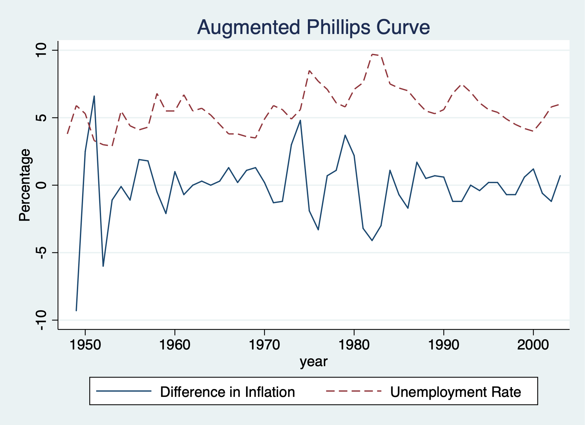

%Econ 645: Week 10 
%Time Series Part 1
%Samuel Rowe adapted from Wooldridge

<h2>Wooldridge</h2>
Set Working Directory

{{1}}

Topics:
<ul>
<li>Static Model</li>
<li>Finite Distributed Lag Model</li>
<li>Time Trends</li>
<li>Seasonality</li>
<li>AR(1) Model</li>
</ul>
<ul>

<h2>Static Models</h2>

<h3>Static Philips Curve</h3>

{{2}}

<h5>Lesson: Problematic analysis with a static model between inflation and 
unemployment</h5>

*Set the Time Series

{{3}}

{{4}}

Our result do not suggest a trade off between inflation and unemployment, and
potentially suggest a positive relationship. This is likely a misspecified 
model and does not best describe the short-run trade-off between inflation
and unemployment. We'll look at an augmented Phillips curve that better 
describes the relationship.

Let's graph our time series

{{5}}

<h3>Inflation and Deficits on Interest Rates</h3>
<h5>Lesson: some static models explain time-series better than the prior model </h5>

{{6}}

Looking inflation and deficits on interest rates. i3 is the 3-month T-bill rate,
and inf is the annual inflation rate from CPI, and def is the federal budget
deficit as a percentage of GDP.

Set the Time Series

{{7}}

{{8}}

This static model better explain interest rates based on basic macroeconomics.
Both contemporaneous variables explain current interest rates.

<h3>Puerto Rican Employment and Minimum Wage</h3>

{{9}}

We'll look at the association between employment and minimum wage in Puerto Rico.
ln(prepop) is the natural log of the employment to population ratio in PR, 
ln(mincov) is the importance of minimum wage relative to average wages or
mincov=average minimum wage/average wages)*average coverage rate or people 
actually covered by the minimum wage law

Set Time Series

{{10}}

{{11}}

Our results show that there is a tradeoff between the employment ratio and 
the importance of minimum wage. A one percent increase in importance of 
minimum wage the employment-population ratio declines 1.54 percent.

<h3>Antidumping Filings and Chemical Imports</h3>
The barium industry in the U.S. complained to the International Trade Commission
that China was dumping (or selling imports at lower prices to undercut domestic producers).
First, are imports unusually high before the complaint? Second, do imports
change after the dumping complaint?

{{12}}

Set Time Series Monthly

{{13}}

Our model is the natural log of volume of imports of barium chloride as the dependent variable.
affile6 is an indicator for 6 months after filing the complaint, while befile6 is and indicator
for 6 month prior to the filing. The variable afdec6 denotes 6 months after the a positive
decision. 
Other variables are gas - another demand variable and rtwex - strength of the dollar against
other currencies

{{14}}

We see that imports are not higher 6 months before a complaint, and imports
are not lower 6 months after a complaint. However, imports are lower 6 months
after a positive decision in a complaint by the ITC. The impact is fairly large
and imports of barium chloride fall about 43.2% after a positive decision.

Also notice that rtwex is positive, and we would expect that a stronger dollar
increase demand for imports, which is about uni-elastic.

{{15}}

<h2>Finite Distributed Lags Models</h2>
Lesson: using lags in the explanatory variables
Personal Exemption on Fertility Rates

{{16}}

Our interest the general fertility rate, which is the number of children born
to every 1,000 women of childbearing age. PE is the average real dollar value
of the personal tax exemption and two binary variables for World War II and 
the introduction of the birth control pill in 1963.
Set Time Series

{{17}}

{{18}}

World War II reduced the fertility rate by 24.24 births per 1,000 women of
child bearing age, while the introduction of the birth control pill reduced
the number of birth by 31.59 births per 1,000 women of childbearing age.
The personal tax exemption. A one dollar increase in the average real value of
the personal tax exemption increases 0.083 births per 1,000 women of child
bearing age or a 12 dollar increase in the average real personal
tax exemption increases 1 child per 1,000 women of child bearing ago

Next lets add lags in the average real value of the personal tax exemption.

{{19}}

Our personal exemption variables are no longer statistically significiant, but
let's test the joint significance. We might have multicollinearity that bias
our standard errors for our PE variables.

{{20}}

Our PE variables are jointly significant, but our lags are jointly insignificiant
so we'll use our static model.

For the estimated LRP: .073-.0058+0.034~.101, but we lack a standard error.
We'll need to estimate the standard error.
Let $$ \theta_0=\delta_0+\delta_1+\delta_2 $$ denote the LRP and write $$ \delta_0 $$
in terms of $$ \theta_0 \, , \delta_1 \, and \, \delta_2 \, where \, \delta_0 = \theta_0 - \delta_1 - \delta_2 $$ 
Next substitute for $$ \delta_0 $$ 
$$ gfr_t = \alpha_0 + \delta_0 pe_t + \delta_1 pe_{t-1} + \delta_2 pe_{t-2} + ... $$
to get 
$$ gfr_t = \alpha_0 + (\theta_0 - \delta_1 - \delta_2)pe_t + \delta_1 pe_{t-1} + \delta_2 pe_{t-2} + ... $$
$$ gfr_t = \alpha_0 + \theta_0 pe_t + \delta_1 (pe_{t-1} - pe_t) + \delta_2 (pe_{t-2} - pe_t) + $$

$$ We can estimate \, \hat{\theta}_{0} \, and its standard error $$.
We can regress gfr_t onto pe_t, (pe_(t-1) - pe_t), and (pe_t-2 - pe_t), ww2, and pill

{{21}}

    

{{22}}

    
Our theta-hat is about .101 and significant, so our LRP has an effect on general fertility rates.

<h2>Linear Trends</h2>
<h3>Housing Investment and Housing Prices</h3>
<h4>Lesson: Importance of time trends</h4>

{{23}}

We look at annual housing investement and a housing price index from 1947 to 1988.

Set Time Series

{{24}}

Our model is the natural log of invpc or real per capita housing investment ($1,000)
and price be the housing price index where 1982 = 1 (or 100). We'll assume 
constant elasticity with our log-log model. 

{{25}}

Our output shows that a 1 percent increase in the pricing index increases
the investment per capita by 1.24 percent (or elastic response).
<b>Note:</b> both investment and price have upward trends that we need to account for.

{{26}}

After accounting for the upward linear trend for both investment per capita and
the housing price index, an increase in price is coefficient is now negative, but
it is not statistically significant. We probably have serial correlation which
will bias our standard errors.

{{27}}

<h3>Personal Exemption on Fertility Rates</h3>
<h5>Lesson: Importance of non-linear time trends</h5>

{{28}}

We'll look at fertility again, but we'll account for a quadratic time trend.
First, we'll estimate a linear time trend, and then we'll try a quadratic time trend.

Set Time Series

{{29}}

Linear Trend

{{30}}

Quadratic Trend
Fertility is declining but at a decreasing negatively rate (eventually a positive t^2 takes over t)

{{31}}

The fertility rate exhibits upward and downward trends between 1913 and 1984.
Interestingly, pe remains fairly robust after adding time trends. The linear
time trend shows that general fertility rates are falling by 1.15 childs per 1,000
women of childbearing age for each additional year. However, the quadratic shows
that the trend is negative but decreasing rate and will eventually become positive.

<h3>Puerto Rican Employment</h3>
The last linear trend is for employment-population ratio and the importance of minimum wage 
coverage. We'll add a time trend along with mincov and usgnp.

{{32}}

Set the Time Series

{{33}}

Add linear trend

{{34}}

The employment-population ratio does not have much of a downward or upward trend, 
but usgnp does. Тhe linear trend of usgnp is about 3% per year, so an estimate
of 1.06 in our model mean that when usgnp increases by 1% above its long-term 
trend, employment-population ratio increases by about 1.06%

<h3>Seasonality</h3>
We'll add monthly variables to account for the fact that imports are not
seasonlly adjusted. 

{{35}}

Set Time Series Monthly

{{36}}

{{37}}

We compare all months to January as the base period, but let's test their
joint significance.

{{38}}

We find that they are jointly insignificant and seasonality does not seem
to be an issue with barium chloride imports.

<h2>Weakly Dependent and Stationary Time Series AR(1) Models</h2>
<h3>Efficient Market Hypothesis</h3>

We'll test the a version of the efficient market hypothesis (EMH) by looking
at weekly stock return from 1976 to 1989.

{{39}}

*Set Time Series

{{40}}

Our dependent variable is the weekly percentage return on the New York Stock Exchange.
A strict form of the EMH states that information observable to the market prior to 
week t should not help to predict the return during week t.
$$ E(y_t|y_{t-1},y_{t-2},...)=E(y_t) $$

We will test EMH by specifying an AR(1) model and our hypothesis states that
beta for y_(t-1) will be equal to 0. We'll assume that stock returns are 
serially uncorrelated, so we can safetly assume that they are weakly dependent

{{41}}

Or

{{42}}

We cannot reject the null hypothesis under our model, but we do have some
evidence of positive serial correlation.

<h3>Expected Augmented Phillips Curve</h3>
We'll revisit the Phillips curve

{{43}}

Set Time Series

{{44}}

A linear version of the expections augmented Phillips curve can be written as
$$ inf_t - inf^e_t=\beta_1(unemp_t-\mu_0) + e_t $$

Where mu_0 is the natural rate of unemployment and inf^e is the expected rate 
of inflation formed in year t-1. 
The difference between actual unemployment and the natural rate is called 
cyclical unemployment, while the difference between inflation and expected 
inflation is called unanticipated inflation
Our e_t is called our supply shock.
If there is a trade-off between inflation and unemployment our beta-hat_1
will be negative.

An assumption is made about inflationary expectations and unders adaptive expectations,
the expected value of current inflation depends on recently observed inflation.
The expected inflation will be assumed to be equal to last years inflation
$$ inf_t - inf_{t-1}=\beta_0 + \beta_1 unemp_t + e_t $$
$$ \Delta inf_t =\beta_0 + \beta_1 unemp_t + e_t $$

Where
$$ \Delta inf_t=inf_t - inf_{t-1} $$
$$ \beta_0 = -\beta_1 \mu_0 $$
Since beta_1 is expected to be negative and beta_0 is expected to be positive.

Therefore, under adaptive expectations, the augmented Phillips curve relates the
change in inflation to the level of unemployment and a supply shock e_t.
We'll assume assumptions TSC.1-TSC.5 hold.

First Difference in the dependent variable or adaptive expectations of inflation

{{45}}

or

{{46}}

The trade-off between unanticipated inflation and cyclical unemployment is
seen in beta-hat_1. A 1-point increase in unemployment decreases unanticipated
inflation by about .54 points.

We can estimate the natural rate of unemployment by dividing beta-hat_0 by
negative of beta-hat-1

$$ \mu_{0} = \hat{\beta}_{0} / - \hat{\beta}_{1} $$

{{47}}

{{48}}

{{49}}

