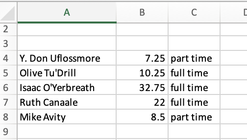
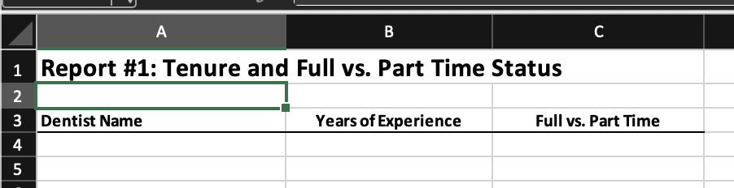
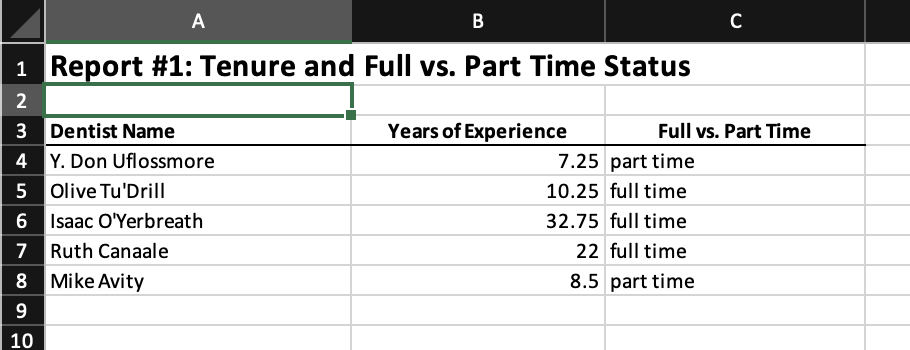
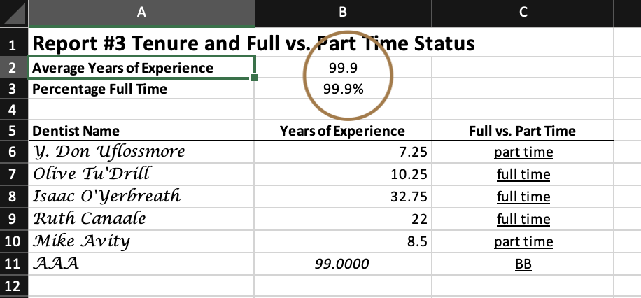
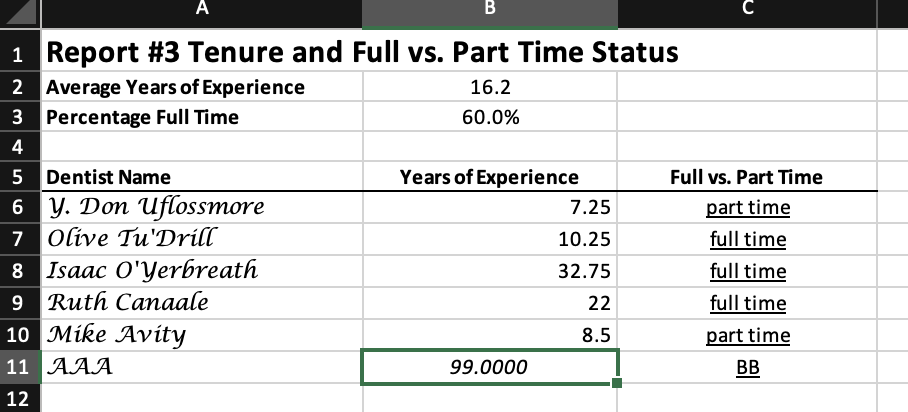

# Saving and Exporting Data
*Mitchell Chapter 3*

## Saving Stata files

It can be helpful to convert a csv, excel, or other type of file to a Stata dta file.  It is also good to consider older types of Stata files Older versions of Stata help with sharing data.  (One of my issues with Stata is that newer data files are not compatible with older versions of Stata).

Let's import a comma-delimited file.
```{stata ssf1, eval=FALSE}
import delimited using "jul25pub.csv", clear
```

We can use the save and saveold commands to convert this comma-delimited file into a Stata dta file. Don't forget to replace or else you will run into an error when trying to replicate the code.

The *save* command will save data into a Stata version *N* dta file. (Stata 14 for me)
```{stata ssf2, eval=FALSE}
save jul25pub, replace
```

If you need to collaborate with someone with an older version of stata, then use *saveold* command. For example, if I want to someone with Stata 12 to use my file, I can use *saveold* and specify version 12 in the options.
```{stata ssf3, eval=FALSE}
saveold jul25pub_v12, version(12) replace
```

We can subset as well using the *keep* or *drop* commands.
```{stata ssf4, eval=FALSE}
keep if gestfip==24
save jan25pub, replace
saveold jan25pub_v12, version(12) replace
```

There is a compress command, but harddrive are large enough today that it 
should not be a problem.

## Exporting Excel Files

Let's say we want to collaborate with someone that doesn't have Stata or 
wants to make graphs in Excel. We can export to excel either ".xls" or 
".xlsx" from Stata with the export excel command

Let's use our main file again
```{stata eef1, eval=FALSE}
use dentlab, clear
```

We can use the export excel command
Don't forget to use replace option and set the firstrow as variable names
```{stata eef2, eval=FALSE}
export excel using "dentlab.xlsx", replace firstrow(variables)
```

Using the command above, if there are value labels, then labels are exported into the binary 0/1 for parttime and recommend.
We can use the nolabel option.
```{stata eef3, eval=FALSE}
export excel using "dentlab.xlsx", replace firstrow(variables) nolabel
```

But what we want a "labeled" and an "unlabeled" sheet in the same excel file?
The line of code above will replace the file we saved originally. What we can use is the sheet option and create a excel sheet called "Labeled".
```{stata eef4, eval=FALSE}
	export excel using "dentlab.xlsx", sheet("Labeled") firstrow(variables) replace
```

Now, let's add another excel sheet called "Unlabeled". This will create a new sheet or replace an existing sheet called "Unlabeled". However, it won't replace the entire excel file. We use the replace option in the sheet subcommand option.
```{stata eef5, eval=FALSE}
export excel using "dentlab.xlsx", sheet("Unlabeled", replace) firstrow(variables) nolabel
```

## Exporting SAS, SPSS, and dBase files

My recommendation is to export csv files instead of SAS and SPSS files. CSV files can be universally read.

Use the *export sasxport8* command to export a SAS XPORT Version 8 file. 
```{stata ess1, eval=FALSE}
export sasxport8 jan25pub.v8xpt
```

Use the *export dbase* command to export a dbase file.
```{stata ess2, eval=FALSE}
export dbase jan25pub.dbf
```

Use the *export spss* command to export a SPSS file.
```{stata ess3, eval=FALSE}
export spss jan25pub.sav
```

## Exporting comma and tab delimited files

Our main focus will be exporting CSV files.
I recommend when collaborating with others, especially if they are using 
different software like SAS, R, Python, etc. to use csv. They are universally
read, which makes collaboration easier. You may lose labels (or values), but
If everyone is not using Stata, then export csv (or excel) is a good idea.
The default is comma-delimited.

Our simpliest export is:
```{stata ecc1, eval=FALSE}
use dentlab
list
export delimited using "dentists_comma.csv", replace
```

This will export the labels instead of the values. If you want to export the values instead of the labels, use the nolabels option.
```{stata ecc2, eval=FALSE}
export delimited using "dentists_comma.csv", nolabel replace	
type "dentists_comma.csv"
```

You also have the option of putting quotes around strings, which can be a good idea if you strings have "," in them. Otherwise, the csv will think the "," is a place to delimit and your dataset will be incorrectly exported.
The option is simply *quote*.
```{stata ecc3, eval=FALSE}
export delimited using "dentists_comma.csv", nolabel quote replace
```

If for some reason you do not want to export the variables names, you can use
the novarnames option. 
```{stata ecc4, eval=FALSE}
export delimited using "dentists_comma.csv", nolabel quote novarnames replace
type "dentists_comma.csv"
```

Sometimes we may need to format our data for exporting. Note that the years for Mike Avity we just replace exported as 8.9300003. To fix this, we can use the format command to set the total width to 5 and the decimal places to 2 with %5.2f
```{stata ecc5}
quietly cd "/Users/Sam/Desktop/Econ 645/Data/Mitchell"
use dentlab
replace years = 8.93 if name == "Mike Avity"
export delimited using "dentists_comma.csv", nolabel quote replace
type "dentists_comma.csv"
```
Use the option fmtdata in later versions of Stata
```{stata ecc5_1, eval=FALSE}
format years %5.2f
export delimited using "dentists_comma.csv", nolabel quote replace fmtdata
type "dentists_comma.csv"
```

For more options see:
```{stata ecc7, eval=FALSE}
help export delimited
```

## Exporting space-separated files

Don't do this. Use comma-delimited files. If you are really interested in this, please review pages 65-66

## Creating Excel Reports

I liked this addition to the exporting data section. A lot of time, senior leadership may need a report, and with *export excel* (or *putexcel*) we can generate automated reports. The key here is automation, where the pipeline from raw data to reports is done completely through a .do file. 

A lot of times it is a pain to get the data analysis to your write-ups, and *export excel* and *putexcel* are great tools to make it easy. We'll cover estout 
to get regression outputs into Word or LaTex a bit later. *I have used 
putexcel in the past, but we'll cover two ways to fill out Excel reports

We are going to create a Full-time Part-time Report in Excel.
```{stata exl1}
quietly cd "/Users/Sam/Desktop/Econ 645/Data/Mitchell"
use "dentlab.dta", clear
keep name years fulltime
export excel using "dentrpt1.xlsx", cell(A4) replace
```


Notice this is just exporting our data into an excel file without a shell, but we do place our data starting on line A4 and we do not export variable names.

We'll use the shell report called "dentrpt1-skeleton.xlsx", and we'll fill it out using Stata. This is just an example, but it can be easily applicable in many office settings. It is preferable to fill out the report this way, since if there is a mistake, then it is is easy to fix without generating a new report from scratch.


First we'll use the copy command to copy the Report Shell over our newly created file called "dentrpt1.xlsx".
```{stata exl2, eval=FALSE}
copy "dentrpt1-skeleton.xlsx" "dentrpt1.xlsx", replace
```

Now we will use the "modify" option to modify our report shell to fill out
the report with data.
```{stata exl3, eval=FALSE}
export excel "dentrpt1.xlsx", sheet("dentists", modify) cell(A4)
```


Notice that there are two sheets in the report shell: "dentists" and "Sheet2". We modified the sheet called "dentists" and pasted our data in this sheet starting at cell A4.

We can format our formats, too. We have our report shell in "dentrpt2-skeleton.xlsx". We will do is similar to the first report, but we will add the keepcellfmt option.
```{stata exl4, eval=FALSE}
copy "dentrpt2-skeleton.xlsx" "dentrpt2.xlsx", replace
export excel "dentrpt2.xlsx", sheet("dentists", modify) cell(A4) keepcellfmt
```

Note: this keepcellfmt is unavailable in Stata 14, but you should have it in your newer version.

We'll do something similar, but we will include averages for years and full-time vs part time.
```{stata exl5, eval=FALSE}
copy "dentrpt3-skeleton.xlsx" "dentrpt3.xlsx", replace
export excel "dentrpt3.xlsx", sheet("dentists", modify) cell(A6) 
```


You have two options for the percentages: 1) add average formula in Excel or 2) use put excel. It is easy to add formulas in excel, but what if the number of observation changes over time? Then, you would need to modify the Excel sheet. Using put excel you can update the averages without messing with formulas in excel.

It is poor practice to run the summarize command and manually entering it into your report. Use local macros and do it dynamically!

We will set our dentists report to be modified by Stata, and then run the summarize command and take the average stored after the command and put it into excel.
```{stata exl6, eval=FALSE}
putexcel set "dentrpt3.xlsx", sheet("dentists") modify
```
After setting the sheet to be modified, we can write expression, returned results, formulas, graphs, scalars, matrices, etc.

Let's look at what the summarize command stores after being run. 
```{stata exl7, eval=FALSE}
summarize years
return list
```

```{stata exl8, echo=FALSE}
quietly quietly cd "/Users/Sam/Desktop/Econ 645/Data/Mitchell"
quietly use dentlab
summarize years
return list
```

There are several scalars that are stored, such as number of observations r(N), mean r(mean), standard deviation r(sd), etc.
If we use the detail option, we'll see more scalars.

We can retreive those scalars with local macros, such as `r(mean)'.
```{exl9, eval=FALSE}
summarize years
putexcel B2 = `r(mean)'
summarize fulltime
putexcel B3 = `r(mean)'
putexcel save //Not in older version
```


More on Putexcel
https://blog.stata.com/2017/01/10/creating-excel-tables-with-putexcel-part-1-introduction-and-formatting/
