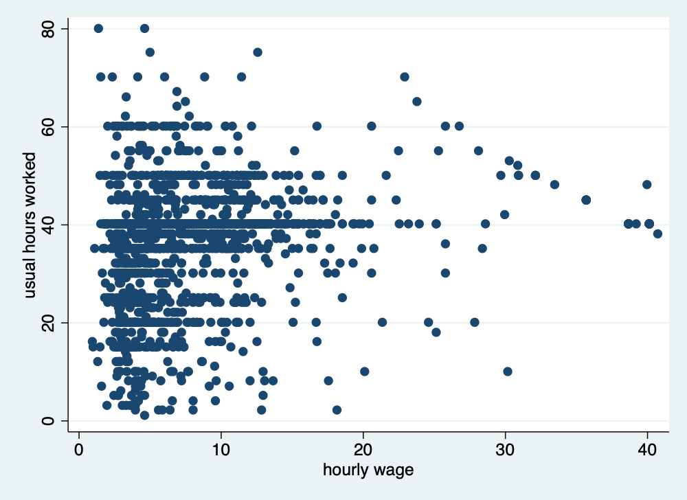

# Cleaning and Checking Data

*Mitchell Chapter 4*

Good note from Mitchell at the beginning: Garbage In; Garbage Out.

Before doing analysis, you really need to check your data to look for data quality issues.

## Checking individual variables

We start off with looking from problems in individual variables. Mitchell uses Working Women's Survey (WWS) dataset, but we'll use Current Population Survey (CPS) data, as well.
```{stata civ0, eval=FALSE}
use wws, clear
```

The *describe* command is a useful command to see an overview of your data
with variables labels, storage type, and value lables (if any)
```{stata civ1}
quietly cd "/Users/Sam/Desktop/Data/CPS/"
use smalljul25pub
describe
```

You will noticed that we lack value labels and variable labels. Luckily we have a data dictionary on Census's website. Let's label the variables and use the *describe* command again.
```{stata civ2, eval=FALSE}
label variable gestfips "State"
label variable gediv "Census Region"
label variable pternwa "Weekly earnings"
label variable peio1cow "Class of worker in Main Job"
label variable peio1cow "Class of worker in Second Job"
label variable pemlr "Labor Force Status"
describe
```
```{stata civ3, echo=FALSE}
quietly cd "/Users/Sam/Desktop/Data/CPS/"
quietly use smalljul25pub
label variable gestfips "State"
label variable gediv "Census Region"
label variable pternwa "Weekly earnings"
label variable peio1cow "Class of worker in Main Job"
label variable peio1cow "Class of worker in Second Job"
label variable pemlr "Labor Force Status"
describe
```

## One way tabulation

The *tabulation* or *tab* command is very useful to inspect categorical variables.

The tabulation or tab command is very useful to inspect categorical variables.
Let's look at collgrad, which is a binary for college graduate status in wws data, and let's look at race data, which is a categorical variable. Let's include the missing option to make sure no observations are missing data
```{stata owt1}
quietly cd "/Users/Sam/Desktop/Econ 645/Data/Mitchell"
use wws, clear
tabulate collgrad, missing
tabulate race, missing
```
Race should only be coded between 1 and 3, so we have one miscoded observation.
Let's find the observation's idcode
```{stata owt2, eval=FALSE}
list idcode race if race==4
```
```{stata owt3, echo=FALSE}
quietly cd "/Users/Sam/Desktop/Econ 645/Data/Mitchell"
use wws, clear
list idcode race if race==4
```

## Summarize

The *summarize* or *sum* command is very useful to inspect continuous variables. Let's look at the amount of unemployment insurance in unempins.  The values range between 0 and 300 dollars for unemployed insurance received last week.
```{stata sum0}
quietly cd "/Users/Sam/Desktop/Econ 645/Data/Mitchell"
use wws, clear
summarize unempins
```

Let's look at weekly earnings in CPS.
```{stata sum1}
quietly cd "/Users/Sam/Desktop/Data/CPS/"
use smalljul25pub.dta, replace
gen earnings=pternwa/100
summarize earnings if prerelg==1
```

The data range between $0 and $6,930.64 in weekly earnings last week with a mean of 1,408.95 dollars and a standard deviation of 1,251,25 dollars. The max seems
a bit high. Let's add the detail option to get more information.
```{stata sum2, eval=FALSE}
summarize earnings if prerelg==1, detail
```
```{stata sum2_1, echo=FALSE}
quietly cd "/Users/Sam/Desktop/Data/CPS/"
quietly use smalljul25pub.dta, replace
quietly gen earnings=pternwa/100
summarize earnings if prerelg==1, detail
```

We can see that the mean is $1,408.95, while the median is $1,060.00. The mean appears to be skewed rightward, where the skewness is 2.7 and the kurtosis is 11.9. The 95th percentile is 3,460.00 while the 99th percentile is $6,930.64. 

Let's look at wage data in the wws data set
```{stata sum3}
quietly cd "/Users/Sam/Desktop/Econ 645/Data/Mitchell"
use wws, clear
summarize wage, detail
```
For our wws data, our mean of 288.29 dollars/hour appears to be highly skewed rightward and heavily influenced by outliers. Our median hourly wage is 6.7 dollars per hour and our 99th percentile hourly wage is 38.7 dollars per hour, but our mean is 288.29 dollar/hour. Our skewness is 35, which means our wage data are highly skewed. Our Kurtosis shows that the max outliers are heavily skewing the results. A normal distributed variable should have a kurtosis of 3, and our kurtosis is 1297. When we see the 2 largets observations, they are 250,000 and 380,000 dollars/hour. 

This means we have found potential data measurement issues. Let's look at the outliers

```{stata sum4}
quietly cd "/Users/Sam/Desktop/Econ 645/Data/Mitchell"
quietly use wws, clear
list idcode wage if wage > 1000
```

Let's look at ages, which should range frm 21 to 50 years old. We can use both
the *summarize* and *tabulate* commands. *Tabulate* can be very useful with 
continuous variables if the range is not too large.
```{stata sum5}
quietly cd "/Users/Sam/Desktop/Econ 645/Data/Mitchell"
quietly use wws, clear
summarize age
tabulate age
```
Let's look at the outliers
```{stata sum6}
quietly cd "/Users/Sam/Desktop/Econ 645/Data/Mitchell"
quietly use wws, clear
list idcode age if age > 50
```

We have again found potential data measurement problems. The data is supposed to range from 21 to 50, but there are two observations with 54 and 83. It is possible that they were incorrectly entered, and they are supposed to be 45 and 38, respectively.

## Crosstabulation - categorical by categorical variables

The two-way tabulation through the *tabulate* command is a very useful way to look for data quality problems or to double check binaries created. Let's look at variables metro, which is a binary for whether or not the observation lives in a metropolitian areas, and ccity, which is whether or not the observation lives in the center of the city.

```{stata sum7}
quietly cd "/Users/Sam/Desktop/Econ 645/Data/Mitchell"
quietly use wws, clear
tabulate metro ccity, missing
```

An alternative is to count the number of observations that shouldn't be there. So we'll count the number of observations not in a metro area but in a city center. I personally don't use it, but it has it's uses.
```{stata sum8}
quietly cd "/Users/Sam/Desktop/Econ 645/Data/Mitchell"
quietly use wws, clear
count if metro==0 & ccity==1
```

Let's look at married and nevermarriaged. There should be no individuals that appear in both married and nevermarried. 

```{stata sum9}
quietly cd "/Users/Sam/Desktop/Econ 645/Data/Mitchell"
quietly use wws, clear
tabulate married nevermarried, missing
```

There may be observation that have been married, but not currently married. There should be no observations that are both married and never married.
```{stata sum10}
quietly cd "/Users/Sam/Desktop/Econ 645/Data/Mitchell"
quietly use wws, clear
count if married == 1 & nevermarried == 1
list idcode married nevermarried if married == 1 & nevermarried == 1
```

We have found another potential data measurement issue. There are 2 observations that are married and never married.

Let's look at college graduates and years of school completed. We can use *tabulate* or the *table* commands. I personally prefer *tabulate*, since we can look for missing.

```{stata sum11}
quietly cd "/Users/Sam/Desktop/Econ 645/Data/Mitchell"
quietly use wws, clear
tabulate yrschool collgrad, missing

```
We can use the *table* command
```{stata sum1_1, eval=FALSE}
table yrschool collgrad
```
```{stata sum1_2, echo=FALSE}
quietly cd "/Users/Sam/Desktop/Econ 645/Data/Mitchell"
quietly use wws, clear
table yrschool collgrad
```
Now let's find the ID with potential problems
```{stata sum1_3, eval=FALSE}
list idcode if yrschool < 16 & collgrad == 1
```
```{stata sum1_4, echo=FALSE}
quietly cd "/Users/Sam/Desktop/Econ 645/Data/Mitchell"
quietly use wws, clear
list idcode if yrschool < 16 & collgrad == 1
```

There is at least one potential measurement problem. There is an observation with 8 years of schooling completed listed as a college graduate. We also see that there are 2 observations with 13 years and 7 with 14 years. These may be two-year college graduates, and these observations may not be problematic.

## Checking categorical by continuous variables

It is also helpful to look at continuous variables by different categories. Let's look at the binary variable for union, if the observation is a union member or not by uniondues.
```{stata sum12}
quietly cd "/Users/Sam/Desktop/Econ 645/Data/Mitchell"
quietly use wws, clear
summarize uniondues, detail
```

The median union dues is 0 dollars, which makes sense. The meand is 5.6 dollars, while the maximum value is 29 dollars. 

Let's use the *bysort* command, which will sort our data by the categorical variable specified.
```{stata sum13}
quietly cd "/Users/Sam/Desktop/Econ 645/Data/Mitchell"
quietly use wws, clear
bysort union: summarize uniondues
```
The mean for not in a union is less than 1 dollar with 1,413 observations
The mean for union is about 15 dollars with 461 observations
The mean for missing is about 15 dollars with 368 observations

```{stata sum14}
quietly cd "/Users/Sam/Desktop/Econ 645/Data/Mitchell"
quietly use wws, clear
tabulate uniondues if union==0, missing
```
We see about 4 observations have union dues. We may or may not need to recode them to 0. It is possible that someone may be not be a union members, but still have to pay an agency fee. Let's assume that they are not in 14(b) state..

The recode command can to create a new variable if a person pay union dues. Now let's compare union members to those who pay union dues

```{stata sum15}
quietly cd "/Users/Sam/Desktop/Econ 645/Data/Mitchell"
quietly use wws, clear
recode uniondues (0=0) (1/max=1), generate(paysdues)
tabulate union paysdues, missing
```

Let's list the non-union members paying union dues. 
Note: we use the abb(#) option to abbreviate the observation to 20 characters
```{stata sum16, eval=FALSE}
list idcode union uniondues if union==0 & (uniondues > 0) & !missing(uniondues), abb(20)
```
```{stata sum17, echo=FALSE}
quietly cd "/Users/Sam/Desktop/Econ 645/Data/Mitchell"
quietly use wws, clear
list idcode union uniondues if union==0 & (uniondues > 0) & !missing(uniondues), abb(20)
```

Let's look at another great command for observing categorical and continuous
variables together: *tabstat*

We could use *tab* with a sum option
```{stata sum18}
quietly cd "/Users/Sam/Desktop/Econ 645/Data/Mitchell"
quietly use wws, clear
tab married, sum(marriedyrs)
```

Or, we can use *tabstat* which gives us more options
```{stata sum19}
quietly cd "/Users/Sam/Desktop/Econ 645/Data/Mitchell"
quietly use wws, clear
tabstat marriedyrs, by(married) statistics(n mean sd min max p25 p50 p75) missing
```
No observation that said they were never married reported years of marriage

Let's look at current years of experience and everworked binary
```{stata sum20}
quietly cd "/Users/Sam/Desktop/Econ 645/Data/Mitchell"
quietly use wws, clear
tabstat currexp, by(everworked) statistics(n mean sd min max) missing
```

Let's total years of experience, which is currexp plus prevexp
```{stata sum21}
quietly cd "/Users/Sam/Desktop/Econ 645/Data/Mitchell"
quietly use wws, clear
generate totexp=currexp+prevexp
tabstat totexp, by(everworked) statistics(n mean sd min max) missing
```
Everyone with at least one year experience has experience working

**Note:**
Three ways to 
  1. bysort x_cat: summarize x_con
  2. tab x_cat, sum(x_con)
  3. tabstat x_con, by(x_cat) statistics(...)

## Checking continuous by continuous variables

We will compare two continuous variables to continuous variables Let's look at unemployment insuranced received last week if the hours were greater than 30 and hours are not missing.
```{stata cc1}
quietly cd "/Users/Sam/Desktop/Econ 645/Data/Mitchell"
quietly use wws, clear
summarize unempins if hours > 30 & !missing(hours)
```

The mean is around 1.3 and our range is between our expected 0 and 287
```{stata cc2}
quietly cd "/Users/Sam/Desktop/Econ 645/Data/Mitchell"
quietly use wws, clear
count if (hours>30) & !missing(hours) & (unempins>0) & !missing(unempins)
```

Let's look at the hours count
```{stata cc3}
quietly cd "/Users/Sam/Desktop/Econ 645/Data/Mitchell"
quietly use wws, clear
tabulate hours if (hours>30) & !missing(hours) & (unempins>0) & !missing(unempins)
```

It seems that 19 observations worked more than 30 hours and received unemployment insurance. This could be potential data issues, or it is possible that the person got unemployment insurance before working again. It depends on the data collection and data generation process.

Let's look at age and and years married to find any unusual observations
```{stata cc3_1}
quietly cd "/Users/Sam/Desktop/Econ 645/Data/Mitchell"
quietly use wws, clear
generate agewhenmarried = age - marriedyrs
summarize agewhenmarried 
tabulate agewhenmarried
```

There was one person who was 73. However, the dataset is for women 21 to 50, so this observation may have been accidentally entered incorrectly. The correct value may be 37.

Let's look for anyone under 18. Some states allow under 18 marriages, but
it still is suspicious. 
```{stata cc4, eval=FALSE}
tabulate agewhenmarried if agewhenmarried < 18
```
```{stata cc5, echo=FALSE}
quietly cd "/Users/Sam/Desktop/Econ 645/Data/Mitchell"
quietly use wws, clear
quietly generate agewhenmarried = age - marriedyrs
tabulate agewhenmarried if agewhenmarried < 18
```
Let's use the same strategy for years of experience deducted from age to find the first age working.
```{stata cc6}
quietly cd "/Users/Sam/Desktop/Econ 645/Data/Mitchell"
quietly use wws, clear
generate agewhenstartwork = age - (prevexp + currexp)
tabulate agewhenstartwork if agewhenstartwork < 16
```

Some states allow work at the age of 15, but anything below looks suspicious and would need to be investigated for potential data issues.

We can also look for the number of age of children. We should expect that
the age of the third child is never older than the second child
```{stata cc7}
quietly cd "/Users/Sam/Desktop/Econ 645/Data/Mitchell"
quietly use wws, clear
table kidage2 kidage3 if numkids==3
count if (kidage3 > kidage2) & (numkids==3) & !missing(kidage3)
count if (kidage2 > kidage1) & (numkids>=2) & !missing(kidage2)
```
Now let's check the age of the observation when the first child was born
```{stata cc8}
quietly cd "/Users/Sam/Desktop/Econ 645/Data/Mitchell"
quietly use wws, clear
quietly generate agewhenfirstkid = age - kidage1
tabulate agewhenfirstkid if agewhenfirstkid < 18
```
There are some suspicious observations after this tabulation. This would require investigation into data quality issues.

Scatter plots can be helpful as well
```{stata cc9, eval=FALSE}
twoway scatter hours wage if hours > 0 & wage >0 & wage < 1000
graph export "/Users/Sam/Desktop/Econ 645/Stata/hour_wage.png", width(500) replace
```


## Fixing and correcting errors in data
Let go ahead and fix some of these errors that we have found. A word of caution is that you may need to talk to the data stewards about the best ways to correct the data. You don't want to attempt to fix the measurement error and introduce additional problems. Institutional knowledge of the data is very helpful before correcting errors.

Let's fix when race was equal to 4 when there are only 3 categories. Let's add a note for future users, which is good practice for replication.
```{stata fix1}
quietly cd "/Users/Sam/Desktop/Econ 645/Data/Mitchell"
quietly use wws, clear
list idcode race if race==4
replace race=1 if idcode == 543
note race: race changed to 1 (from 4) for idcode 543
tabulate race
```
Let's fix college gradudate when there were only 8 years of education.
```{stata fix2}
quietly cd "/Users/Sam/Desktop/Econ 645/Data/Mitchell"
quietly use wws, clear
list idcode collgrad if yrschool < 12 & collgrad == 1
replace collgrad = 0 if idcode == 107

note collgrad: collgrad changed to 0 (from 1) for idcode 107
tab yrschool collgrad
```

Let's fix age which where the digits were switched, and we will make a note of it.
```{stata fix3}
quietly cd "/Users/Sam/Desktop/Econ 645/Data/Mitchell"
quietly use wws, clear
list idcode age if age > 50
replace age = 38 if idcode == 51
replace age = 45 if idcode == 80
note age: the value of 83 was corrected to 38 for idcode 51
note age: the value of 54 was corrected to 45 for idcode 80
tab age
```
Let's look at our notes with the *note* command.
```{stata fix4, eval=FALSE}
note
```
```{stata fix5, echo=FALSE}
quietly { 
  cd "/Users/Sam/Desktop/Econ 645/Data/Mitchell"
  use wws, clear

  note race: race changed to 1 (from 4) for idcode 543
  note collgrad: collgrad changed to 0 (from 1) for idcode 107
  note age: the value of 83 was corrected to 38 for idcode 51
  note age: the value of 54 was corrected to 45 for idcode 80
}
note
```
## Identifying duplicates

The duplicates command can be helpful, but it will only find duplicates that are exactly the same **unless you specify which variables with duplicates list vars**. 
We'll cover this a bit later.

We need to be careful with duplicate observations. When working with panel data we will want multiple observations of the same cross-sectional unit, but there should be multiple observations for different time units and not the same time unit.

We can start with our *duplicates* list command to find rows that are completely the same. This command will show all the duplicates. **Note:** for duplicate records to be found, all data needs to be the same. 
```{stata dup1}
quietly cd "/Users/Sam/Desktop/Econ 645/Data/Mitchell"
quietly use "dentists_dups.dta", clear
duplicates list
```

We'll have a more condensed version with duplicates examples. It will give an
example of the duplicate records for each group of duplicate records.
```{stata dup2, eval=FALSE}
duplicates examples 
```
```{stata dup3, echo=FALSE}
quietly cd "/Users/Sam/Desktop/Econ 645/Data/Mitchell"
quietly use "dentists_dups.dta", clear
duplicates examples 
```

We can find the a consice list of duplicate records with duplicates report.
```{stata dup4, eval=FALSE}
duplicates report
```
```{stata dup5, echo=FALSE}
quietly cd "/Users/Sam/Desktop/Econ 645/Data/Mitchell"
quietly use "dentists_dups.dta", clear
duplicates report
```
The duplicates tag command can return the number of duplicates for each group of duplicates (note the separator option puts a line in the table after # rows.
```{stata dup6, eval=FALSE}
duplicates tag, generate(dup)
list, separator(2)
```
```{stata dup7, echo=FALSE}
quietly cd "/Users/Sam/Desktop/Econ 645/Data/Mitchell"
quietly use "dentists_dups.dta", clear
duplicates tag, generate(dup)
list, separator(2)
```

Let's sort our data for better legibility, and then we will add lines in our output table whenever there is a new group.
```{stata dup8}
quietly cd "/Users/Sam/Desktop/Econ 645/Data/Mitchell"
quietly use "dentists_dups.dta", clear
sort name years
list, sepby(name years)
```
**Notice!** There are two observations for Mary Smith, but one has 3 years of experience and the other one has 27 years, so it does not appear as a duplicate.

If there were too many variables, which could use our data browser.
```{stata dup9, eval=FALSE}
browse if dup > 0
```

We will want to drop our duplicates, but not the first observation. The duplicates drop command will drop the duplicate records but still keep one observation of the duplicate group.
```{stata dup10, eval=FALSE}
duplicates drop
```

Let's use a new dataset that is a bit more practical

	use "wws.dta", replace

Let's check for duplicate idcodes with the *isid command*. If there is a duplicate idcode, the command will return an error.
```{stata dup11}
quietly cd "/Users/Sam/Desktop/Econ 645/Data/Mitchell"
use "wws.dta", replace
isid idcode
```
Or just use duplicates list for the variable of interest
```{stata dup12}
quietly cd "/Users/Sam/Desktop/Econ 645/Data/Mitchell"
quietly use "wws.dta", replace
duplicates list idcode
```

There are no duplicate idcodes, so we should expect that duplicates list will not return any duplicates, since every single values needs to be the same for there to be a dupicate record.


Let's use a dataset that does have duplicates. Let's check for duplicate idcodes.
```{stata dup12_1}
quietly cd "/Users/Sam/Desktop/Econ 645/Data/Mitchell"
use "wws_dups.dta", clear
isid idcode
```
Or 
```{stata dup13}
quietly cd "/Users/Sam/Desktop/Econ 645/Data/Mitchell"
use "wws_dups.dta", clear
duplicates list idcode, sepby(idcode)
```
I prefer *duplicates list var1*, since an error will break the do file.

Let's generate our dup variable for identifying the number of duplicates per 
group of duplicates.
```{stata dup14, eval=FALSE}
duplicates tag idcode, generate(iddup)
```

Let's generate a different duplicate variable to find complete duplicate 
records. Notice that we do not specify a variable after tag.
```{stata dup15, eval=FALSE}
duplicates tag, generate(alldup)
```

Let's list the data
```{stata dup16, eval=FALSE}
list idcode age race yrschool occupation wage if iddup==1 & alldup==0
```
```{stata dup17, echo=FALSE}
quietly cd "/Users/Sam/Desktop/Econ 645/Data/Mitchell"
use "wws_dups.dta", clear
duplicates tag idcode, generate(iddup)
duplicates tag, generate(alldup)
list idcode age race yrschool occupation wage if iddup==1 & alldup==0
```

It seems that idcode 3905 is a different person with a possible incorrect idcode. Let's fix that.
```{stata dup18, eval=FALSE}
replace idcode=5160 if idcode==3905 & age==41
list idcode age race yrschool occupation wage if iddup==1 & alldup==0
```
```{stata dup19, echo=FALSE}
quietly cd "/Users/Sam/Desktop/Econ 645/Data/Mitchell"
quietly use "wws_dups.dta", clear
quietly duplicates tag idcode, generate(iddup)
quietly duplicates tag, generate(alldup)
replace idcode=5160 if idcode==3905 & age==41
list idcode age race yrschool occupation wage if iddup==1 & alldup==0
```

Let's look observation that are complete duplicates.
```{stata dup20, eval=FALSE}
duplicates report
list idcode age race yrschool occupation wage if iddup==1 & alldup==1
```
```{stata dup21, echo=FALSE}
quietly cd "/Users/Sam/Desktop/Econ 645/Data/Mitchell"
quietly use "wws_dups.dta", clear
quietly duplicates tag idcode, generate(iddup)
quietly duplicates tag, generate(alldup)
quietly replace idcode=5160 if idcode==3905 & age==41
duplicates report
list idcode age race yrschool occupation wage if iddup==1 & alldup==1
```
We need to keep 1 observation of the duplicates. Use the *duplicates drop* command.
```{stata dup21_1, eval=FALSE}
duplicates drop
duplicates report
```
```{stata dup22, echo=FALSE}
quietly cd "/Users/Sam/Desktop/Econ 645/Data/Mitchell"
quietly use "wws_dups.dta", clear
quietly duplicates tag idcode, generate(iddup)
quietly duplicates tag, generate(alldup)
quietly replace idcode=5160 if idcode==3905 & age==41
duplicates drop
duplicates report

```
## Practice

Let's work the Census CPS. 

Pull the Census CPS.
  - You can download the file and import it, or
  - You can use Stata to pull the file.
```{stata prac, eval=FALSE}
import delimited using "https://www2.census.gov/programs-surveys/cps/datasets/2025/basic/jul25pub.csv", clear
```

Let's save a copy of the csv file in Stata

Let's grab the data dictionary. Hint search: "Census CPS 2025 data dictionary"

Let's check our data.
  - What variable contains our laborforce status?
  - What variable contains our weekly earnings?
  - Does everyone employed have weekly earnings? Hint: Try *summarize*
  - What flag with our weekly earning that provides information about available data?
  - Try *tabstat* with the flag and weekly earnings. What do you find?
  - Try *tabstat* with statistics(n mean sd p25 p50 p75)
  - What are our identifier variable(s)? How many did you find?
  - Are there any duplicate records?
