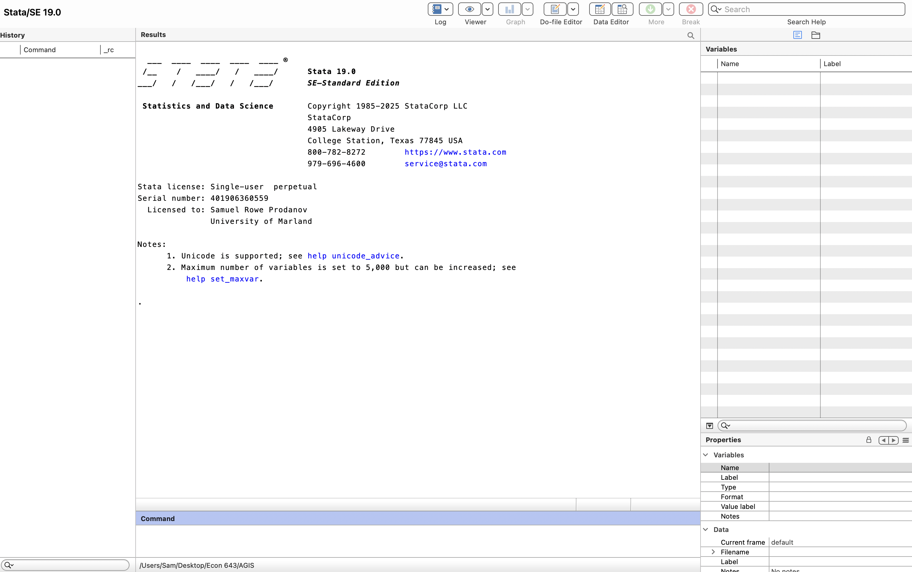
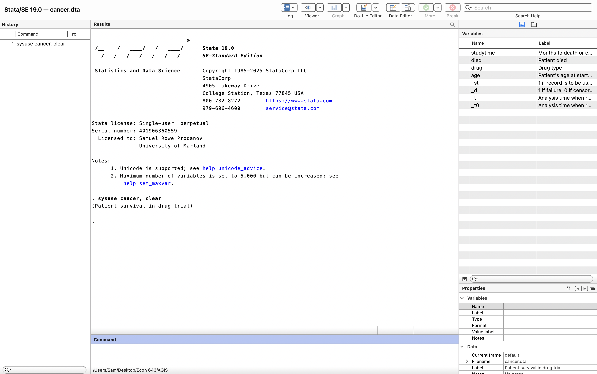
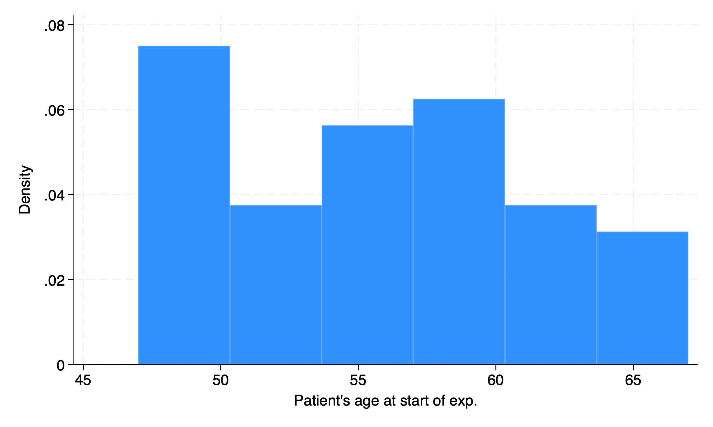
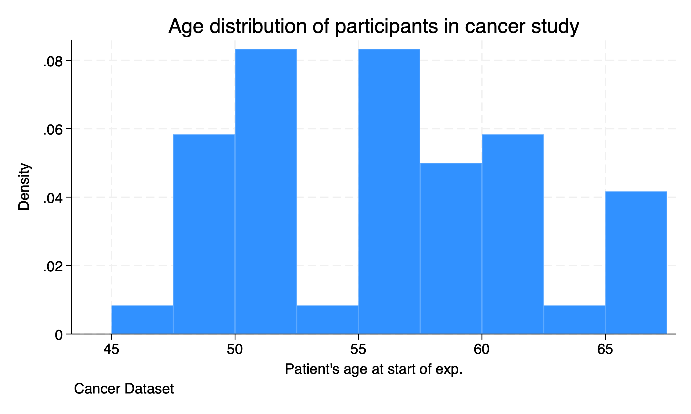

# Getting Started

## Introduction to Stata

Stata is a type of **statistical software package** that can be utilized for data management, data analysis, and statistics. It is similar to other types of statistical software packages compared to R, SAS, or SPSS. It can create reports, regressions, and graphics that can be incorporated into our deliverables.

I have used all of these statistical software packages. While I am a big fan of R, especially with its flexibility, I find that Stata is great for econometric analysis. In my experience Stata stands out in a few ways.

  1. Stata is more powerful and flexible than SPSS (IMO)
  2. Stata's syntax and processing is more streamlined/efficient than SAS (IMO)
  3. Stata is easier to use than R (IMO)

## Get Supporting Material

Before we get started with the Introduction to Stata. I want to make sure everyone is able to download the data. 

```{stata gs1,eval=FALSE}
cd "/Users/Sam/Desktop/Econ 643/AGIS/"
net from https://www.stata-press.com/data/agis6r/
net get agis6r
```

After we run these commands, we can check to see if the files installed on our local folder

```{stata gs2,eval=FALSE}
ls
```
```{stata gs21,echo=FALSE}
quietly cd "/Users/Sam/Desktop/Econ 643/AGIS/"
ls
```

We will be utilizing these data and do files throughout the course. 

Also, I will be working with Stata 19, but it is okay if you are working with Stata 17 or Stata 18. 

## Stata Screen

For those who have never used Stata before. Let's navigate the screen.



The **output** or **results** window is the middle of the screen and provides the largest section in Stata. 

Below the **output** window is the **command line** window. Here you can enter ad hoc commands. I personally find these very helpful with data exploration using the *tabulate* or *sum* commands.

On the left-most side is the **command history** window. This will show prior commands that you have run through the **command line**. This is helpful if you need to copy something over to a **do file** or run a prior command.

In the upper right, we have the **variable** window. This window provides information about the variables in your dataset. Once you select a variable in the **variable** window, information about the variable appears in the lower-right window or **variable property** window. 

Stata's Toolbar provides helpful quick clicks for Stata's Tools


The most important button is going to be the **Do-File Editor** button. This is where you do the majority of your work in Stata. The table with the magnifying glass is another important button for a quick click to the **Browser** window. 

## Our First Dataset 

**Please note that we will be working through the Do-File editor. We will not be using the point-and-click method**

Let's go ahead and use a dataset in memory. We will use the command *sysuse* with the option clear. 

```{stata gs4, eval=FALSE}
sysuse cancer, clear
```



Now we have loaded a dataset into Stata, we can see that our windows have changed. Our results window says 

. sysuse cancer, clear
(Patient survival in drug trial)

Our **Command History** window shows are last command. Our variables in the memory are shown in the **Variable** window.

## Run commands

### describe 

Next let's run some commands to do some small analyses. Let's look at the data with the *describe* command.

```{stata gs5, eval=FALSE}
describe
```

```{stata gs51, echo=FALSE}
quietly sysuse cancer, clear
describe
```

The *describe* command gives us an overview of the dataset. It provides the variable name, storage type, display format, value label, and variable label. We can see that all of our data are numeric and have variable labels to describe the variable, but only two variables have labels for the values.

### summarize 

Next, we can run basic descriptive statistics for all of our variables with the *summarize* or *sum* command.

```{stata gs6, eval=FALSE}
summarize
```

```{stata gs61, echo=FALSE}
quietly sysuse cancer, clear
summarize
```

Our basic descriptive statistics show that the average age is 55.9 years old with a standard deviation of 5.7. Our maximum age is 67 and the minimum age is 47.

### histogram

Next we can graph the distribution of our *age* variable. AGIS shows how to create a histogram with the point and click, but we are going straight to syntax. No point in delaying the inevitable. 

```{stata gs7, eval=FALSE}
histogram age
```

```{stata gs71, echo=FALSE}
quietly sysuse cancer, clear
histogram age
```



We can format the histogram with options. We can edit the bins and the width of the histogram with the *bin()* option or *width()* options. Options are established after the **,** in a command. We will also start at age 45 with the *start* option and increment by 2.5 with *width(2.5*. We can also edit the title with the *title()* option and cite the source of the data with the *caption()* option.

```{stata gs8, eval=FALSE}
histogram age, title("Age distribution of participants in cancer study") caption("Cancer Dataset") width(2.5) start(45)
```

```{stata gs81, echo=FALSE}
quietly sysuse cancer, clear
histogram age
```



We can see the number of bins has increased and the width of the bins is 2.5 years. We have also added a title and a source of the data.

## Help and Search

Before we get started, I wanted to talk about two helpful commands. 

```{stata gs3, eval=FALSE}
help tabulate
search tabulate
```

The *help* command displays help information about the specified command or topic, while the *search* command search Stata documentation and other resources. These can be utilized to gather additional information about commands or topics.