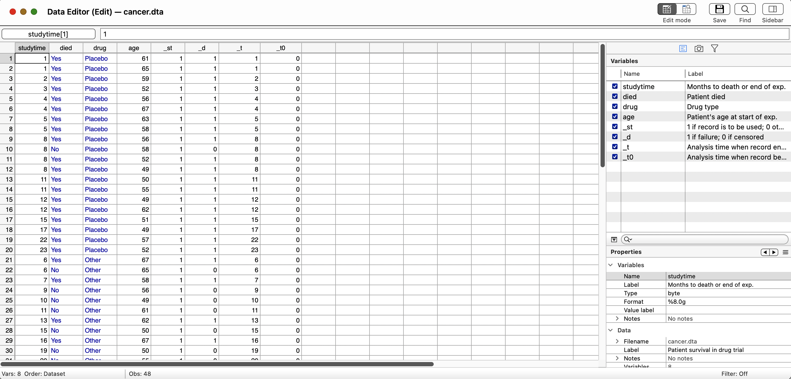

# Entering Data

Before we begin this section, I recommend not working directly in Stata's data editor. This is a personal preference, and you are more than welcome to work directly in the data editor. I generally recommend working in a spreadsheet software and importing the data into Stata. However, we will cover some basics.

If you need to edit data, I recommand using the *replace* command which we will cover later. 

**Please note that if you need to edit data, do not do an ad-hoc edits. Import raw data and use syntax to be transparent!**

## ETL

We will use using an "ETL" philosophy. This acronym stands for "Extract", "Transform", "Load". We will "Extract" data from its source, so external audience can see the raw data. We will use the *use* or *import using* commands to extract our from our source data. We will cover more on the *import* command when we get to Mitchell (2020).

Next, we need to "Transform" the data. We will be using the *generate* and *replace* command to show external users how we made edits. Data transformations in source data can be opaque. We want transparency!

Finally, we will "Load" the data. What we are doing here is exporting our data analyses and graphs into our final product, such as presentations and articles. Stata has a variety of methods to create data table that can be used in Word or LaTex. 

## The Data Editor

If we want to manually enter data into stata, **which I do not recommend**, we can start Stata's data editor. One way is to use the quick click on the toolbar. This is the icon with the table and the pencil. 


We can also launch the data editor by typing *edit* into the command line.

```{stata ed1, eval=FALSE}
edit
```



I will not delve into this chapter any farther, since we will use syntax to create, edit, or delete variables. This includes labeling our data. **Use syntax!**
