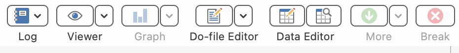
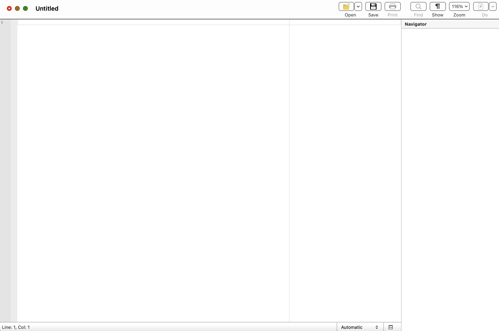
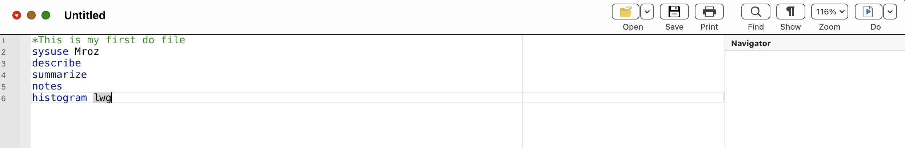
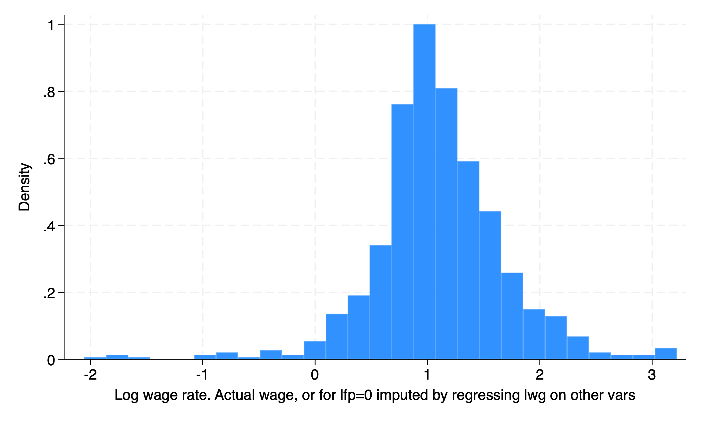
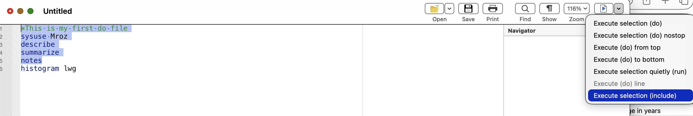
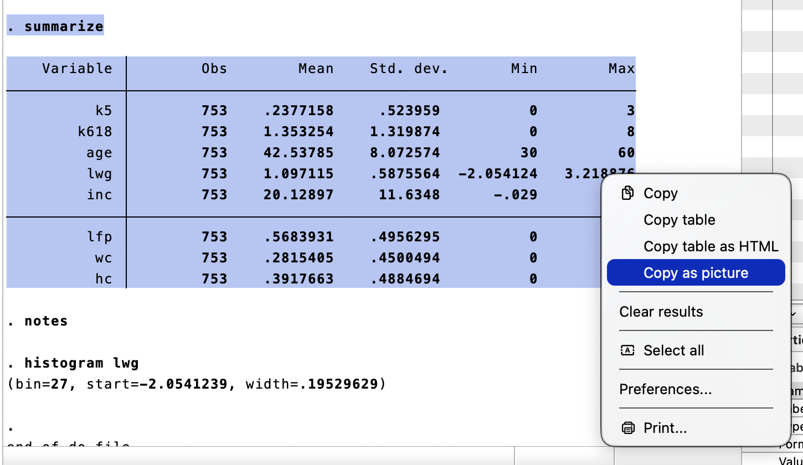
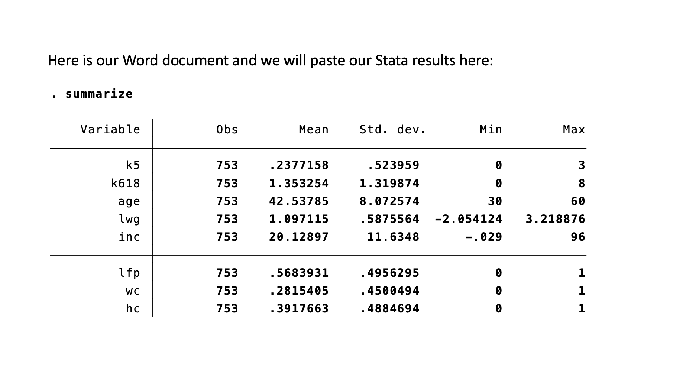

# Commands, Do Files, and Results

I don't spend much time on Data Editor, since we should be doing data transformations within our reproducible syntax in our do files. This will be our focus moving forward.

Why use do files? My two main points are the following:
  1. Efficiency
  2. Transparency
  
**Efficiency:** Your future time required to do routine tasks drops immensely once your syntax works. Not only can it reduce time for a routine task, you can take snippits of your syntax for other do files. No point in reinventing the wheel! Point and click may be faster up front, but on routine tasks point-and-clicks get left in the dust compared to syntax.

**Transparency:** You can provide evidence of your work. An independent person can take the source data independency, and apply your syntax to see if they get similar results. Not only that, they can check for any shenanigans within the syntax. You will see data replication packages in journals of the *American Economic Association*. 

## Commands

Before we start working with do files, we should have a base repository of commands, so we can work with data. We will cover other commands, such as *ttest*, *anova*, and *regress* a bit later.

```{r do1,echo=FALSE}
vars<-c("use","sysuse","import","cd","list","summarize","describe","codebook","tabulate","generate","replace","egen","graph","histogram","save","missing")
desc<-c("Put a Stata .dta file into Stata's memory",
        "Put a shipped or build-in data file into Stata's memory",
        "Put a non-Stata file, such as .xslx, into Stata's memory",
        "Change working directory",
        "List of the values of variables",
        "Summary statistics",
        "Describe the data in memory or in file",
        "Describe the data contents",
        "Tables of frequences",
        "Create a variable",
        "Change contents of a variable",
        "Extensions to generate",
        "The graph command",
        "Creates a histogram",
        "Saves a file to designated folder",
        "Is missing")
table<-data.frame(Variables=vars,Description=desc)
kable(table)
```

These commands will be workhorses for you, so it is good to begin working with them now. 

```{stata do11}
sysuse Mroz, clear
summarize lwg, detail 
```

We can dig deeper into the command by looking up the options of these command. We can look up the options for the *summarize* command with the following:
```{stata do2, eval=FALSE}
help summarize
```

## Qualifiers

We may want to qualifers for conditional commands. We may want to look at subsets when analzying data or apply a command under certain conditions. Stata's list of qualifiers is the following:

```{r do3,echo=FALSE}
vars<-c("==","!=","~=",">",">=","<","<=")
desc<-c("is or is equal to","is not or is not equal to","is not or is not equal to",
        "greater than","greater than or equal to","less than","less than or equal to")
table<-data.frame(RelationalOperators=vars,Description=desc)
kable(table)
```

```{r do4,echo=FALSE}
vars<-c("&","|","!")
desc<-c("And","Or","Not")
table<-data.frame(LogicalOperators=vars,Description=desc)
kable(table)
```

We can combine the commands with qualifiers. We can combine the *Not* operator with the missing command to find observations where age is not missing.

```{stata do5}
sysuse Mroz, clear
summarize lwg if !missing(age)
tab lfp if age >= 55
```

Our *summarize* command with a not missing qualifier show the natural log of wages when age is not missing.

Our *tabulate* command shows the labor force participation of individuals aged 55 or older.

## Do-File Edtior

Let's click the button to open a new do-file editor to write our first do file. Optionally, we can use the command line with the following:

```{stata do6, eval=FALSE}
doedit
```



Once we click the do-file editor button or type in *doedit*, a blank do file will appear.



Let's go ahead and write our first do file.

It should look like this.


Either click the "Do" button or press Ctrl+D for Windows or Shift+Command+D for OSX. Please note that you have some options with the do drop down menu.

```{stata do7}
*This is my first do file
sysuse Mroz
describe
summarize
histogram lwg
```



## Exporting Results

We'll start off with some very simple exporting of our results. We'll delve into better ETL tools later, but for now we will stick with the right-click copy-and-paste method.

Please note that I'm not a fan of the right-click copy-and-paste method, since it requires use input to complete. Acock (2020) provides a hint at some of Stata's tools for exporting results. This includes:

  1. *esttab*
  2. *etable*
  3. *putexcel* 
  4. *putdocx*
  5. *putpdf*
  6. *markdown*
  7. *dyndoc*

Highlight your do file for all the rows except for the histogram. Click the drop down menu for the "Do" button and select "execute selection".



Now we have some output let's highlight the results and right click for options. Let's say we want to paste our table right into a Word document. We can select "Copy as picture". If we wanted to paste the results into an Excel file, we can select "Copy as table". If we wanted to paste right into a html file, we can select "Copy as HTML".



Now we can go to our Word document and paste it.



We can also export out in LaTex, which we will discuss next week with the LyX word processor. Another option is Overleaf for working with LaTex.

Or, we can utilize Stata with RMarkdown as you see here. These pages are built with the Bookdown package that utilizes RMarkdown with Stata being called.

## Logs

We will cover log files a bit later in Mitchel (2020). But as a preview, you will need to use log files for your homework. However, I recommend not using log files until your syntax is working well. I have had plenty of do files fail to run since a log file was not properly closed during testing.


