# Descriptive Statistics fo One Variable

Understanding the central tendency and the distribution of a variable is an essential part of an empirical study. We will utilize Stata to calculate and display descriptive statistics of central tendency, variability, and distribution.

## Central Tendency

For central tendency, we can calculate the mean, median, and mode as previous discussed in SfBE. For measuring central tendency, the choice depends upon the type of variable you are working with. What is the level of measurement? What is the distribution? What are you trying to show?

```{r do1,echo=FALSE}
vars<-c("Categorical with no order (Nominal), Categorical with Order (Ordinal), Quantitative (Discrete, Continuous, Interval")
mode<-c("Yes","Yes","Yes")
median<-c("No","Yes","Yes")
mean<-c("No","Yes","Yes")
table<-data.frame(Level.of.Measurement=vars,Mode=mode,Median=median,Mean=mean)
kable(table)
```

  - For nominal categories variables, you can use the mode.
  - For ordinal categorical variables, you can use the mode and possibly the mean.
  - For quantitative variables, you can use mean, median, and mode.

Let's look at an example from the General Social Survey from Acock (2023). We will look at a ordinal categorical variable called "childs" which is the number of children in a household.

```{stata graph1, eval=FALSE}
use descriptive_gss, clear
graph bar (count) if childs > 0, over(childs,gap(0)) ///
  bar(1, lcolor(black)) title("Number of children in families with at least one child") ///
  caption("descriptive_gss.dta") ytitle("Frequency") lintensity(100)  
```

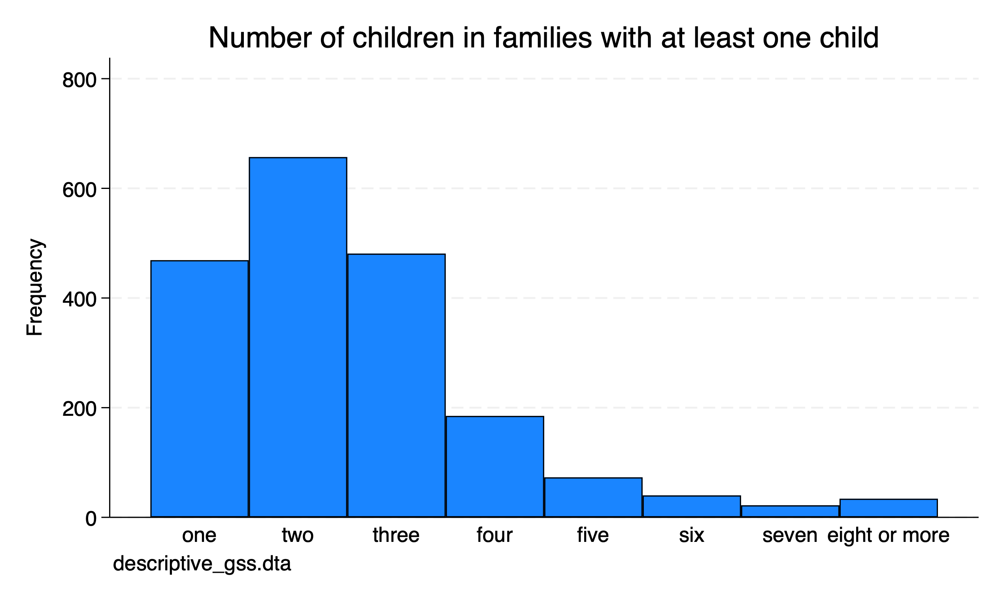

It is clear that the mode is 2, but what about the median or mean for the ordinal variable?

```{stata do2, eval=FALSE}
summarize childs, details
```

```{stata do2_1, echo=FALSE}
quietly cd "/Users/Sam/Desktop/Econ 643/Data/agis6r/"
quietly use descriptive_gss, clear
summarize childs if childs > 0, detail
```

From our summary statistics we can see that family with kids the median is 2 and the mean rounded up to 3. The data are slighly skewed since the mean > median and mean > mode.

## Distribution

For quantitative data, we want to the dispersion along with central tendency. Are the values concentrated in the middle or are they widely spread out? If we look at hypothetical SAT scores from applications to two universities. Both university have the same mean of 1,000 but different standard deviations are different. One university application SAT scores has a \(SD=100\) and the other university application SAT scores has a \(SD=200\). Let's plot the distribution of these SAT scores.

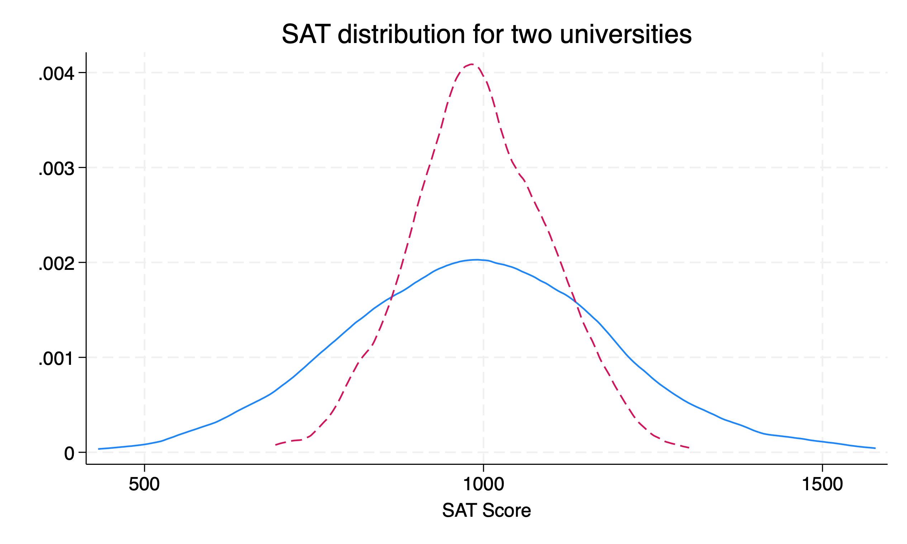

Both are normally distributed and have idential means \(\mu=1000\), but the university with a smaller \( SD \) has a distribution tightly packed around mean. The other distribution of SAT scores is much more dispersed around the mean.

## Nominal (Unordered) Categories

Nominal categorical variable do not have a natural order. Examples include ethnicity, sex, martial status, car color, food categories, etc. To summarize a unordered, nominal categorical variable is to utilize frequencies and the mode. We will use the "descriptive_gss.dta" dataset.

### Frequenices 

The *tabulate* command can be used to get frequencies of distributions for sex and marital status. Acock uses polviews as well, but I would agrue that there can be a clear order to political views.

Please note that the *tabulate* command for one-way tabulation can take one variable at a time. If we add two variables, we will conducte a two-way tabulation. If we want to conduct multiple one-way tabulations on one line, we can use the *tab1* command. Please note that *tab2* will conduct two-way tabulation of all combinations of variable included.

```{stata ex1, eval=FALSE}
use descriptive_gss, clear
tabulate sex

tab1 sex martial
```

```{stata ex1_1, echo=FALSE}
quietly cd "/Users/Sam/Desktop/Econ 643/Data/agis6r/"
quietly use descriptive_gss, clear
tabulate sex

tab1 sex marital
```

If we use the *tabulate* command with both marital and sex, we will calculate a two-way tabulation.
```{stata ex1_3, eval=FALSE}
use descriptive_gss, clear
tabulate sex martial
```

```{stata ex1_3_1, echo=FALSE}
quietly cd "/Users/Sam/Desktop/Econ 643/Data/agis6r/"
quietly use descriptive_gss, clear
tabulate sex marital
```

Let's take a look polviews.
```{stata ex1_1_1, eval=FALSE}
tabuate polviews
```

```{stata ex1_1_2, echo=FALSE}
quietly cd "/Users/Sam/Desktop/Econ 643/Data/agis6r/"
quietly use descriptive_gss, clear
tabulate polviews
```

I would agrue that there is a clear natural order to this variable. 

Ben Jann in 2007 provided a revision of *tab1* called *fre*. We can install his command using the *ssc install* command. The output from the *fre* command is a bit easier to read compared to tab1

```{stata ex2, eval=FALSE}
ssc install fre
```

```{stata ex3, eval=FALSE}
fre sex martial
```

```{stata ex3_1, echo=FALSE}
quietly cd "/Users/Sam/Desktop/Econ 643/Data/agis6r/"
use descriptive_gss, clear
fre sex marital polviews
```

### Pie Charts

**DO NOT USE PIE CHARTS!** 

There is no reason to use a pie chart when you can use a bar chart.

For pedagologic purposes only, you can create a pie chart with the *graph pie* command. Please do not use this.

```{stata pie1, eval=FALSE}
graph pie, over(marital) cw sort(marital) ///
	title(Marital status in the United States) note(descriptive_gss.dta) ///
	scheme(s2color)
```

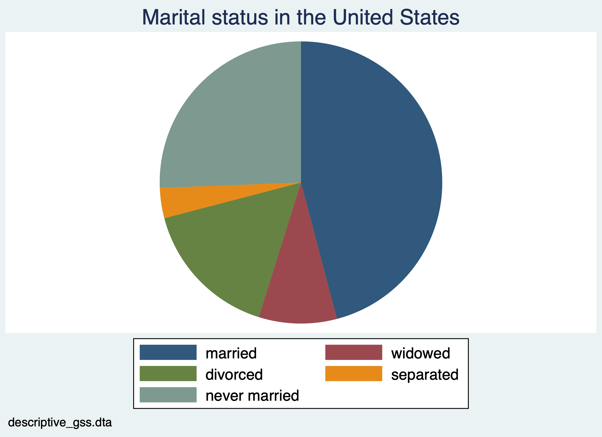

What I do want to bring to your attention is the options *title*, *note*, and *scheme*. We can add a title to the graph, a caption note, and a color scheme.

### Bar Charts

To display frequencies of nomimal variables, we should use bar charts. We have a couple of options with *graph bar*. We can display frequencies or we can display percentages.

First, we can use a bar chart with frequencies. We will use the *graph bar* command. However, we will not enter *graph bar marital*. What we need to do is add *(count)* for frequencies and the option *over(var)*. We will also want to label the data with the option *blabel(bar, format(%9.2f))*


```{stata bar1, eval=FALSE}
graph bar (count), over(marital) scheme(s2color) blabel(bar, format(%9.0f)) title("Marital status in the United States") note("descriptive_gss.dta")
```

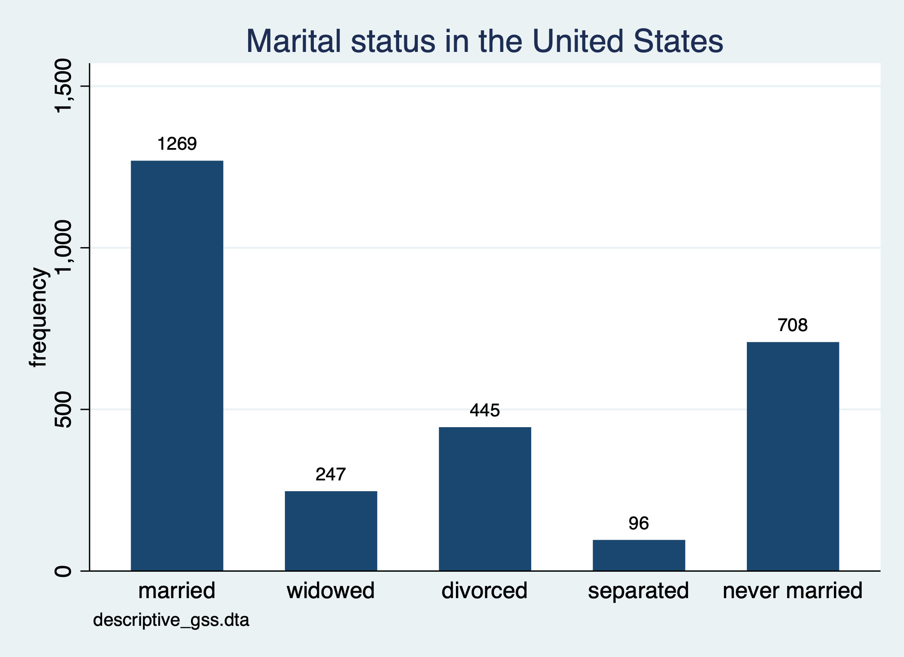

We can create a similar bar chart, but we will used percentages instead of frequencies. In order to create this type of chart we do not add *(count)* to the *graph bar* command.

```{stata bar2, eval=FALSE}
graph bar, over(marital) scheme(s2mono) blabel(bar, format(%9.2f)) title("Marital status in the United States") note("descriptive_gss.dta")
```

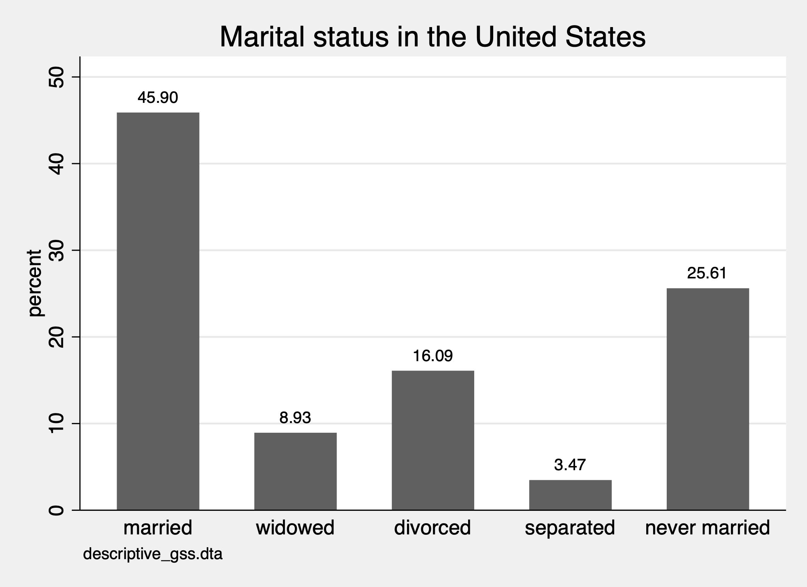

We can actually use histograms with the option *discrete*. Additional options for formatting are provided. *percentage* converts the two-decimal y-axis into two digit whole numbers. *gap* option increases the shape between bars.*addlabel* add values over the bars. *xlabel* add values to the x-axis.

```{stata bar3, eval=FALSE}
histogram marital, discrete percent gap(10) addlabel xlabel(, valuelabel) ///
	title(Marital status in the United States) note("descriptive_gss.dta") scheme(s2gcolor) 
```

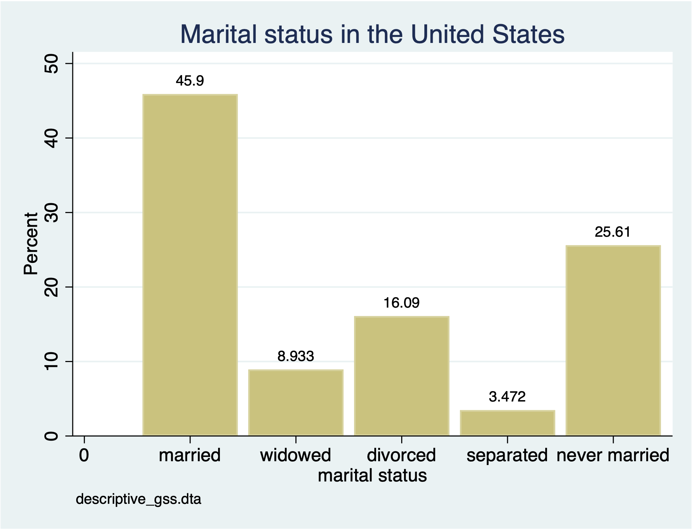

You may have noticed that the prior graph does not produce the frequencies we need. If we will use *histogram* command with the *discrete* option, then we need to add the option *freq* to create a freqency chart with the *histogram* command.

```{stata bar4, eval=FALSE}
histogram marital, discrete frequency gap(10) addlabel xlabel(, valuelabel) ///
	title(Marital status in the United States) note("descriptive_gss.dta") scheme(sj) 
```
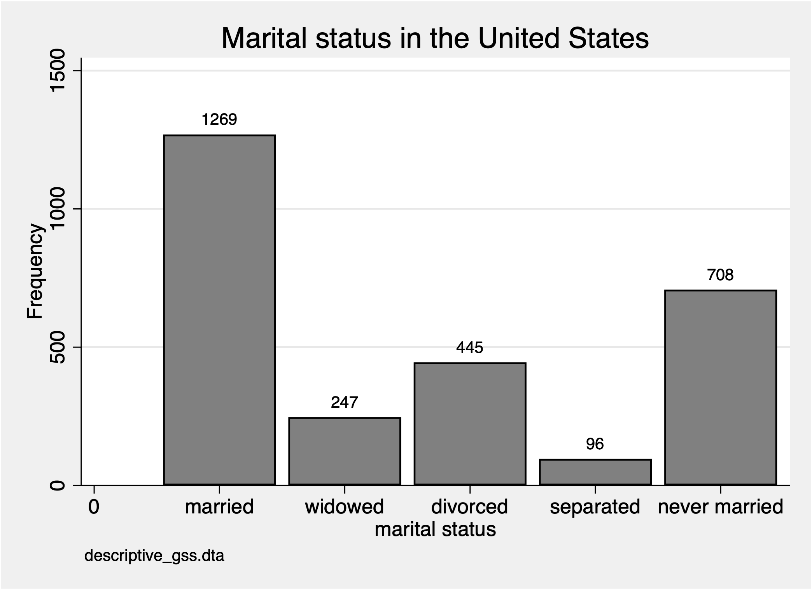

## Ordinal Categories

For ordinal categorical variables, we can use mode and median for central tendency. We can calculate the median, or \(50^{th}\) percentile, with the *summarize* command. To get different percentiles, including the median, we need to add the *detail* option.

```{stata ord1, eval=FALSE}
sum polviews, detail
```

```{stata ord1_1, echo=FALSE}
quietly cd "/Users/Sam/Desktop/Econ 643/Data/agis6r/"
quietly use descriptive_gss, clear
sum polviews, detail
```

The median value is 4 our of the 1 through 7. What does 4 imply?

We can also use the *tabulate* or *tab1* commands to find the mode and what each value means. If we want to show the value and the value label, we can run the *numlabel* command.

```{stata ord2, eval=FALSE}
numlabel _all, add
tab1 polviews
```

```{stata ord2_1, echo=FALSE}
quietly cd "/Users/Sam/Desktop/Econ 643/Data/agis6r/"
quietly use descriptive_gss, clear
numlabel _all, add
tab1 polviews
```

The mode is 4, which is moderate. So the median and mode are the same for *polviews* variable.

For distribution, we can use the *tabulate* or *tab1* commands and we can use *graph bar (count), over(var)* and *histgram var, discrete freq* commands.

First, we will use a *histogram var, discrete*, but we will change the color scheme.

```{stata pol1, eval=FALSE}
histogram polviews, discrete frequency start(1) ///
   title(Political views in the United States) subtitle(by adult population) ///
   caption(General Social Survey 2002) xtitle(Political conservatism) scheme(economist)
```

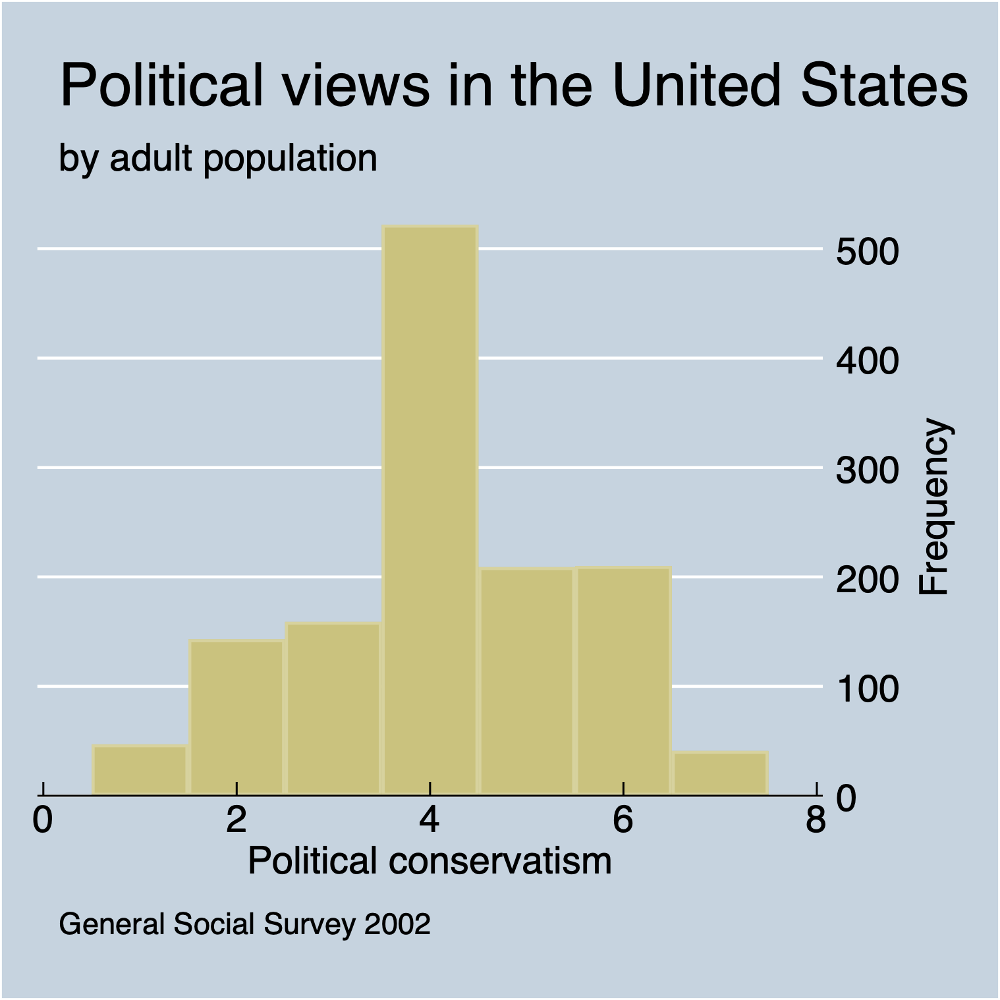

Now, we will conduct the same exercise but we will use a horizontal bar chart with the command *graph hbar*.

```{stata pol2, eval=FALSE}
graph hbar (count), over(polviews) title(Political views in the United States) subtitle(by adult population) note(General Social Survey 2002) scheme(s1mono)
```

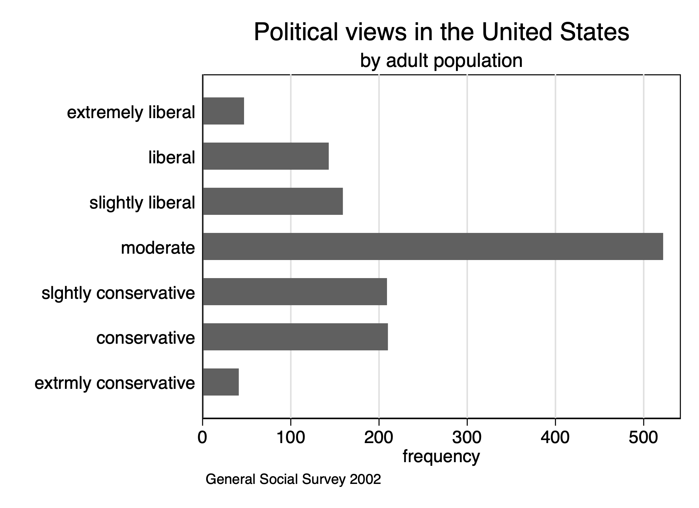

## Quantitative Variables

Our final category is quantitative variables, such as discrete or continuous variables. We will look at the number of hours spent on the internet *wwwhr* and hours worked *hrs1*

For central tendency for these measures, we can use mean, median, and mode. We'll use the *summarize var, detail* command to inspect the mean and median.

### Summarize and histograms 

```{stata quant1,eval=FALSE}
sum wwwhr, detail
sum hrs1, detail
```

```{stata quant1_1,echo=FALSE}
quietly cd "/Users/Sam/Desktop/Econ 643/Data/agis6r/"
quietly use descriptive_gss, clear

sum wwwhr, detail
sum hrs1, detail
```

For both variables, the median is less than the mean. There is possible skewness, so we can use the command *sktest* to calculate the skewness and kurtosis of the data.

```{stata quant2,eval=FALSE}
sktest wwwhr
sktest hrs1
```

```{stata quant2_1,echo=FALSE}
quietly cd "/Users/Sam/Desktop/Econ 643/Data/agis6r/"
quietly use descriptive_gss, clear

sktest wwwhr
sktest hrs1
```

Based on the skewness of both variables, the probability that *wwwhr* is normal is 0 and the probability that *hrs1* is normal is 0 as well. Based on the kurtosis, the probability that *wwwhr* is normal is 0 and the probability that *hrs1* is normal is 0 as well.

Now we will utilize the *histogram* command to examine the distribution. 

```{stata quant3, eval=FALSE}
histogram wwwhr, frequency
```

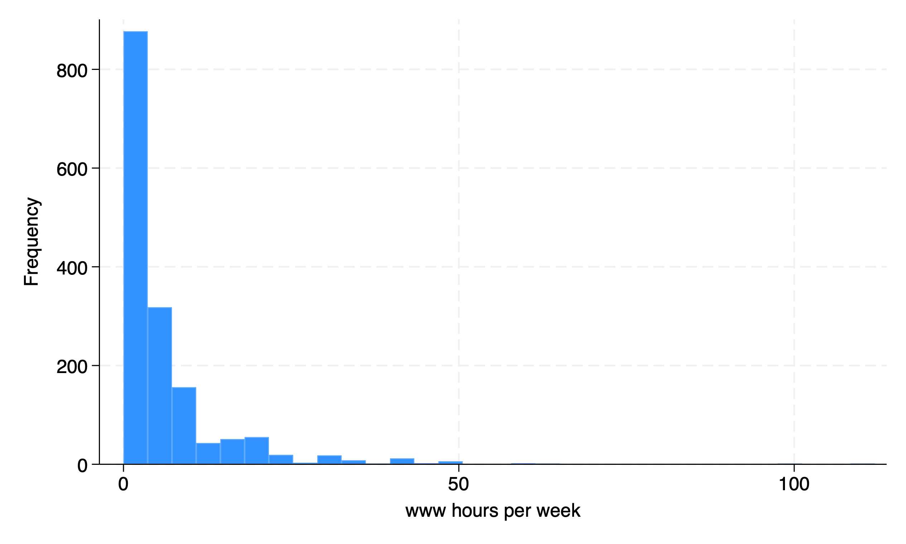

```{stata quant4,eval=FALSE}
histogram hrs1, frequency
```

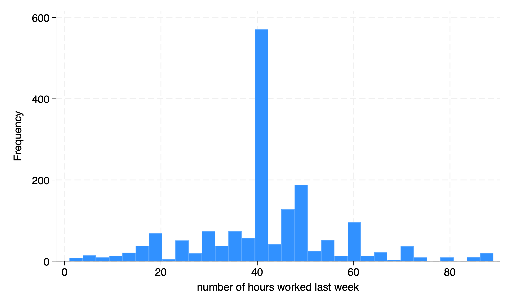

### Split by another variable

Next week, we will start to look at two variables, but we can subset our graphs by different groups. Let's look at internet usage in 2002 by women and men. We can use the *by var, sort:* prefix to our command to sort the data by sex.

```{stata quant5, eval=FALSE}
by sex, sort: summarize wwwhr
```

```{stata quant5_1, echo=FALSE}
quietly cd "/Users/Sam/Desktop/Econ 643/Data/agis6r/"
quietly use descriptive_gss, clear
by sex, sort: summarize wwwhr
```

We can use the *table* command to show descriptive statistics. We can ask fo rthe mean, median, standard deviation, interquartile range, skewness, kurtosis, and coefficient of variation. The *table* command has *rowvars* in the first parathesis and *colvars* in the second parathesis. So we will use sex as the rows and our descriptive statistics in the columns of our table.

```{stata quant6, eval=FALSE}
table (sex) (result), statistic(mean wwwhr) statistic(p50 wwwhr) statistic(sd wwwhr) statistic(iqr wwwhr) statistic(skewness wwwhr) statistic(kurtosis wwwhr) statistic(cv wwwhr)
```

```{stata quant6_1, echo=FALSE}
quietly cd "/Users/Sam/Desktop/Econ 643/Data/agis6r/"
quietly use descriptive_gss, clear

table (sex) (result), statistic(mean wwwhr) statistic(p50 wwwhr) statistic(sd wwwhr) statistic(iqr wwwhr) statistic(skewness wwwhr) statistic(kurtosis wwwhr) statistic(cv wwwhr)
```

We can export our table as well with the *collect* command after the *table* command. I recommend that you have export functionality in your scripts. This will reduce copy and paste requirements. You can export into a Word document, Excel document, PDF, HTML, \( LaTex \), SMCL, or Markdown. 

We will export a Word docx file and a Markdown file.

```{stata quant7, eval=FALSE}
collect export wwwhr.docx
collect export wwwhr.md
```


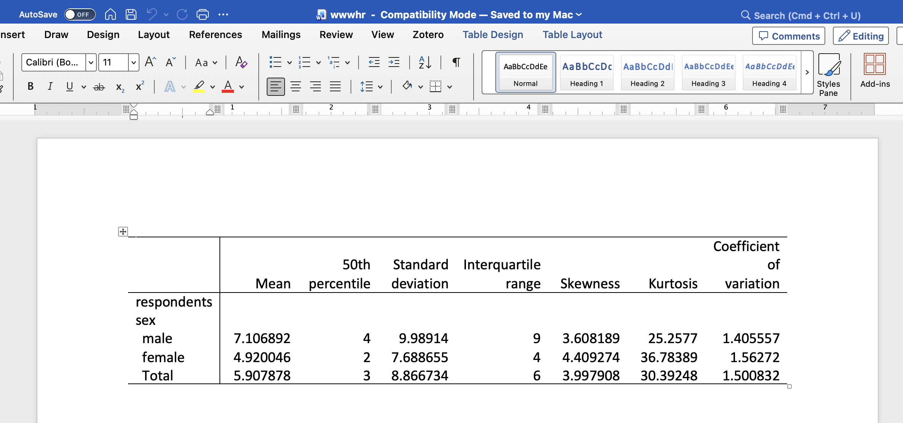

|                 | Mean     | 50th percentile | Standard deviation | Interquartile range | Skewness | Kurtosis | Coefficient of variation |
|-----------------|----------|-----------------|--------------------|---------------------|----------|----------|--------------------------|
| respondents sex |          |                 |                    |                     |          |          |                          |
|   male          | 7.106892 | 4               | 9.98914            | 9                   | 3.608189 | 25.2577  | 1.405557                 |
|   female        | 4.920046 | 2               | 7.688655           | 4                   | 4.409274 | 36.78389 | 1.56272                  |
|   Total         | 5.907878 | 3               | 8.866734           | 6                   | 3.997908 | 30.39248 | 1.500832                 |

We can also split the histogram by another variable to see if the distribution varies by sex. We can use the *by(var)* option to accomplish this split. We can also subset hours to less than 25 hours with the qualifier *if wwwhr < 25*.

```{stata quant7_1,eval=FALSE}
histogram wwwhr if wwwhr < 25, frequency by(sex)
```

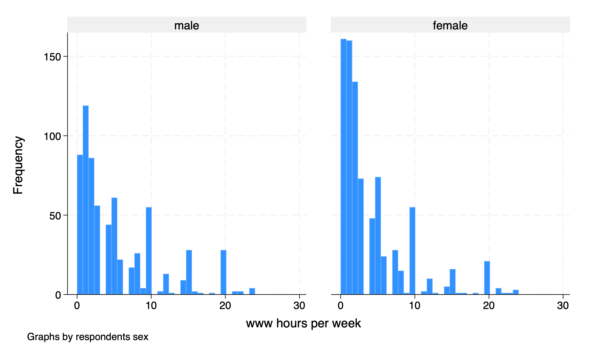

### Box Plots

Our file set of graphs is the box plot. We can calculate and graph box plots with the command *graph hbox* command for horizontal box plots. We will add the option *over(sex)* to split the data into women and men. 

```{stata quant8, eval=FALSE}
graph hbox wwwhr if wwwhr < 25, over(sex) title("Hours spent on the Internet") subtitle("By sex") caption("descriptive_gss.dta") scheme(economist)
```

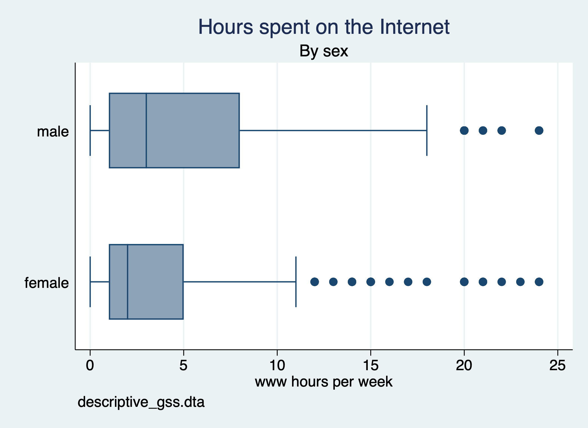