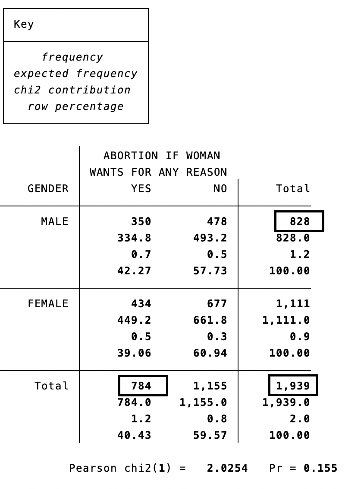
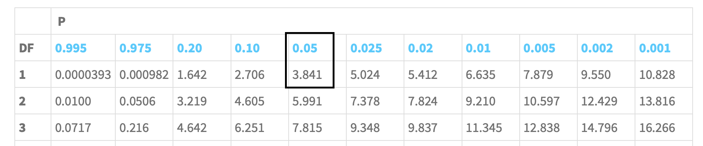
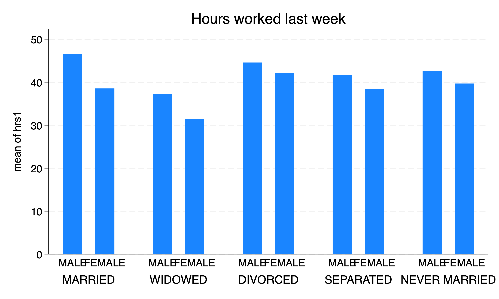
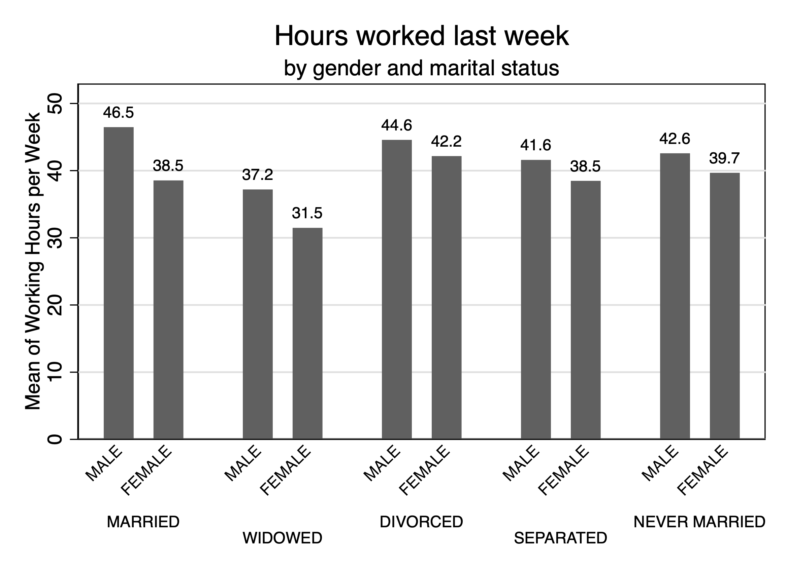

# Descriptive Statistics for Two Variables

At the end of last week, we began examine the relationship between variables. We split hours spent on the internet by sex. We were examining how hours varied between two groups, even though we were focusing on the descriptive statistics for one variable, 

Providing descriptive statistics is an essential part of any study. Before you can look at relationships, you need to describe the data: central tendency, variability, and distribution. However, we want to see how descriptive statistics may vary between two variables. 

Before more rigorous studies are conducted, researchers conduct descriptive analyses to see if there are associations between two variables. We will start to dive into the statistical methods to look for associations or relationshps between two variables.

Many research questions stem from the association between two variables

  1. Do women who are drug dependent us different drugs from those used by drug-dependent men?
  2. Are women more likely to be progressive than men?
  3. Is there a relationship between religiosity and support for increased spending on public health?
  4. Is there an association between a training program and long-term wages?
  5. Is a school intervention lead to higher rates of graduation?
  
We will learn how to describe relationship between categorical variables from this chapter. What are our tests? What are the potential problems with the test? What are possible misinterpretations? 

Acock (2023) tells us that the best statistics are the simplest statistics to use. Honestly, I agree. As we go through the empirical sequence, you will learn more sophisticated but the begin to tradeoff simplicity for rigor. This comes a cost of fewer people understanding your methods.

One of the simplest methods is the two-way tabulation or cross-tabulation. We can examine any potential relationship between two categorical with a \( \chi^2 \) test within a two-way tabulation or cross-tabulation.

## Crosstabulation or two-way tabulations

A two-way tabulation or cross-tabulation is a table of rows representing on categorical variable and columns representing another categorical variable. These tables are also sometimes called contigency tables, since response maybe contingent on another variable. For example, support for a particular policy may be contigent on someone's demographics, such as sex. 

Acock (2023) starts off with looking at cross-tabulations between abortion opinions and sex from the 2006 General Social Survey. We have two categorical variables, *sex* and *abany*. We will use sex as the row and abortion opinion as the columns. For the *tabulate* or *tab <rowvar> <colvar>* command, the first variable after the work *tabulate* is the row variable and the second is the column variable.

We will use *sex* as the explanatory variable and *abany* as the outcome or dependent variable. We want to explain someone's opinion on abortion by sex. Please note that explanatory variable may be called independent variables, explanatory variables, or predictor variables. 

Note: Acock (2023) brings up a good point about independent and dependent variables. Can dependent variable influence the independent variable? Pay attention to this, because you will delve more into this during Econ 645. This is also way it is essential to start with a research question and then use economic theory before using statistical methods. There could be a third variable that influences both the dependent and independent variable, which makes it look like there is a relationship when there isn't any. E.g.: There is an association between shark attacks and ice cream. However, once we understand the summer time is associated with both shark attacks and ice cream consumption, the spurious relationship dissolves.

```{stata ex1}
cd "/Users/Sam/Desktop/Econ 643/Data/agis6r/"
use gss2006_chapter6, clear
tabulate sex abany
```

350 out of 828 males reported it is okay to have an abortion for any reason, while 434 out of 1,111 women said the same. 

After looking over this result, it is hard to tell if there are differences in opinion between men and women. We can look at the within-row frequencies, but it is hard to compare. Let's look at **conditional probability**. What is \( P(Y|M) \) or what is the probability of saying yes given the individual is a male? What is \( P(N|W) \) or what is the probability of saying no when the individual is a male?

```{stata ex2, eval=FALSE}
tabulate sex abany, row
```

```{stata ex2_1, echo=FALSE}
quietly cd "/Users/Sam/Desktop/Econ 643/Data/agis6r/"
quietly use gss2006_chapter6, clear
tabulate sex abany, row
```

Interestingly, a higher percentage of males say it is okay to have an abortion for any reason at 42.3% compared to women at 39.1%. It is a small difference, so it makes us wonder if the result is statistically significant. In order to find out, we will use a \( \chi^2 \) test.

## \( \chi^2 \) test 

How can we say there is a relationship between sex and opinion on abortion? Is this by chance? Is it an actual relationship? Is the difference statistically significant? Maybe our \( N \) is large enough to find any difference is statistically significant.

We will set up a null hypothesis that there is no difference between men and women for abortion opinions. 

\( H_0: \) There is no difference between men and women.

\( H_A: \) There is a difference between men and women.

We will use a \( \chi^2 \) test to test the likelihood that the result occurred by chance. The \( \chi^2 \) test compares the frequency in each cell with what you would expect if there were no relationship. The expected frequency depends upon how many people are in the rows and columns. 

We will add three additional options to our *tabulate* command to test the relationship between *sex* and *abany*. We will add *row* to look for conditional probability. We will add *expected* to add the expected frequency if there were no relationship. Also, we will add *chi2* to conduct a \( \chi^2 \) test. We can add *cchi2* to look at the contributions toward \( \chi^2 \).

```{stata ex3, eval=FALSE}
tabulate sex abany, row
```

```{stata ex3_1, echo=FALSE}
quietly cd "/Users/Sam/Desktop/Econ 643/Data/agis6r/"
quietly use gss2006_chapter6, clear
tabulate sex abany, chi2 cchi2 expected row
```

Within each cell, we have the frequency, the expected frequency, the \( \chi^2 \) contribution, and the conditional probability. The expected frequency is calculated by the marginal frequencies of the row by the maringal frequency of the column divided by the total.

$$ (Total Men * Total Yes)/Total = Expected Frequency for Men and Yes $$

For our upper left cell:

$$ (784*828)/1,939 = 334.8 $$



$$ $$

We calculate the \( \chi_2 \) as the following:

$$ \chi_2 = \sum \frac{(O_i-E_i)^2 }{E_i} $$

Each the statistic for each **joint frequency** \( i \). Such that, for the upper left cell:

$$ \frac{(350-334.8)^2}{334.8}=0.7 $$
And we calculate \( \chi^2 \) as \( \chi^2 = 0.7+0.5+0.5+0.3=2.0 \)

We compare our \( \chi^2 \) statistic to a \( \chi^2 \) distribution. Before we go to the \( \chi^2 \) distribution, we need to get the **degrees of freedom**. Our degrees of freedom can be calculated as the number of rows minus 1 times the number of columns minus 1:

$$ df=(R-1)\times(C-1) $$

This means that we have one degree of freedom \( (2-1)\times(2-1)=1 \). 

Next, we need to get our **critical value** to compare. We will set our \( \alpha=0.05 \) or a 95% confidence level. Using this, we can go to a \( \chi^2 \) distribution to get our critical value to compare to our \( \chi^2 \) statistic.



$$ $$ 

Next, we will compare our \( \chi^2=2.02 \) to the critical value of \( 3.841 \). Since \( 2.02 < 3.841\),  we fail to reject the null hypothesis that there is no difference in abortion opinions between men and women at the 95% confidence level. We can also look at the \( p \)-value where \( p = 0.155 \) where \(p > 0.05 \), which means we fail to reject the null hypothesis at the 5% level.

As a side note, we can use Stata to get the \( \chi^2 \) table. 

```{stata ex4, eval=FALSE}
search chitable
```

After installing the package probtabl, you can get a \( \chi^2 \) table by typing *chitable 1* for the \( \chi^2 \) table with 1 degree of freedom:
```{stata ex5}
chitable 1
```

## Measures of Association

We need to be wary when we find statistical significance with large samples. Even weak relationship may appear to be significant. Our \( \chi^2 \) depends upon the relationship between two variables and the sample size. 

We can utilize Cramer's \( V \) to prevent misinterpreting a relationship when one does not exist. We can account for the sample size with Cramer's \( V \) with the following formula:

$$ V=\sqrt{ \frac{\chi^2}{N \times min(R-1,C-1)}} $$
\( V \) will be bound between 0 and 1. A Cramer's \( V \) between 0 and 0.19 is considered weak, while a value between 0.20 and 0.49 is considered moderate. A value of 0.5 or more is considered strong. Cramer's V looks for the relationship instead of statistical significance. Please note that \( V \) can be negative due to the order of the columns, so it is really bound between -1 and +1 with 0 showing no relationship.

We need to add the option *V* in *tabulate* to calculate Cramer's \( V \) in Stata.

```{stata ex6, eval=FALSE}
tabulate sex abany, chi2 row V
```

```{stata ex6_1, echo=FALSE}
quietly cd "/Users/Sam/Desktop/Econ 643/Data/agis6r/"
quietly use gss2006_chapter6, clear
tabulate sex abany, chi2 row V
```

Our result shows a weak relationship between sex and opinion on abortion. 

We can use a data set from the Steering Commitee of the Physicians' Health Study Research Group. This data set looks at the relationship between men and taking daily aspirin. 
```{stata ex7, eval=FALSE}
use chapter6_aspirin, clear
tabulate aspirin heartattack, chi2 row V
```

```{stata ex7_1, echo=FALSE}
quietly cd "/Users/Sam/Desktop/Econ 643/Data/agis6r/"
use chapter6_aspirin, clear
tabulate aspirin heartattack, chi2 row V
```

We can see that we reject the null hypothesis at the 5% level (even the 0.1% level) from the \( \chi^2 \) test. However, when we look at Cramer's \( V \) we see two things. One the value is negative and the value is near 0. The order of the column matter is the value is negative or positive, but the main take away is the relationship is weak.

## Ordinal Categorical Variables

We can test the relationship between two ordinal variables. We will look at *health* and *happy* for how respondents reported their health and happiness, respectively, in the 2006 General Social Survey. We will set health as the explanatory or independent variable and happiness as the outcome or dependent variable. 

We need to introduce two additional tests besides a \( \chi^2 \) test and Cramer's \( V \) when variables of interest of ordinal. We will introduce Goodman and Kruskal's \( \gamma \) and Kendall's \( \tau_{b} \). Both \( \gamma \) and \( \tau_{b} \) are measures of association for ordinal data. If one person is happier, then we expect them to be healthier, as well. \( \tau_b \) is close to a correlation coefficient. Such that, a \( \tau_b \) less than 0.2 shows a weak relationship, while a \( \tau_b \) between 0.2 and 0.49 shows a moderate relationship. A \( \tau_b \) of 0.5 or above indicate a strong relationship. 

In Stata, all we need to do is add the options *gamma* and *taub* to our *tabulate* command.

```{stata ex8, eval=FALSE}
use gss2006_chapter6, clear
tabulate health happy, chi2 column gamma row taub V
```


```{stata ex8_1, echo=FALSE}
quietly cd "/Users/Sam/Desktop/Econ 643/Data/agis6r/"
use gss2006_chapter6, clear
tabulate health happy, chi2 column gamma row taub V
```

Our results show that \( \chi^2 \) is statistically significant and our Cramer's \( V \) shows a moderate relationship. However, our \( \tau_b \) is closer to 0.25, which indicates a moderate positive relationship. This is not the end those. We see a value \(ASE\) next the \( \tau_b \). This is the asymptotic standard error for our \( \gamma \) and \( \tau_b \). Our asymptotic error is the estimated standard error and if we divide \( \tau_b \) by the \( ASE \), then we get a \(z\) test statistic. So, \( z=0.249/0.02=12.45 \) and \(z > 1.96 \), which means it is statistically significant at the 5% level. 

Please note that the asymptotic standard errors require large sample sizes to be valid.

**Question**: Does happiness affect health or does health affect happiness?
$$ health \rightarrow happiness $$

$$ health \leftarrow happiness $$

$$ health \leftrightarrow happiness $$

This is why theory is essential for conducting research. It informs us the direction of the relationship. 

## Linking categorical and quantitative variables

We can use the *table* command and *graph bar* commands to assess the relationships between categorical variables and quantitative variables. We will compare hours worked per week *hrs1* and *sex* to see if they have different means.

We will use the *table* command to accomplish this task. The *table* command has three inputs: *(row variable) (column variable) (tabular variable)*. We can add the test statistics of interest, mean and standard deviation, in the options with *statistic(mean hrs1)* and with *statistic(sd hrs1)*. We will also add the number of non-missing values with *statistic(count hrs1)*.

```{stata ex9, eval=FALSE}
table (sex) () (), statistic(mean hrs1) statistic(sd hrs1) statistic(count hrs1)
```

```{stata ex9_1, echo=FALSE}
quietly cd "/Users/Sam/Desktop/Econ 643/Data/agis6r/"
quietly use gss2006_chapter6, clear
table (sex) () (), statistic(mean hrs1) statistic(sd hrs1) statistic(count hrs1)
```

Men work about 45 hours per week compared to 39 for women.

What if we want to see the differences between *sex* and *marital*. We can add *marital* to the (column variable).

```{stata ex10, eval=FALSE}
table (sex) () (), statistic(mean hrs1) statistic(sd hrs1) statistic(count hrs1)
```

```{stata ex10_1, echo=FALSE}
quietly cd "/Users/Sam/Desktop/Econ 643/Data/agis6r/"
quietly use gss2006_chapter6, clear
table (sex) (marital) (), statistic(mean hrs1) statistic(sd hrs1) statistic(count hrs1)
```

We can see that married men have the highest average hours worked per week at 46 hours, while widowed women have the lowest at 31. 

We can use the *graph bar* to summarize a quantitative variable across multiple nominal quantitative variables. We use the command *graph bar (mean) hrs1* to display the mean of hours, and we need to add the options *over(sex)* and *over(marital)* to display mean hours.



$$ $$

This does the job, but it does not look very good. We can add some options to improve the format. First, we should add a subtitle to indicate that the means are by sex and marital status with the option *subtitle()*. Next our categorical labels are too big and overlapping. We will edit the option with options within options. For sex, we will edit *over(sex)* by angling the label and making it smaller with *over(sex, label(angle(45) labsize(small)))*. For marital status, we will alternative the labels so they don't overlap and make them smaller with *over(marital,label(alternate labsize(small)))*. Next, we should add a axis title for the y-axis with *ytitle()*.

```{stata ex11, eval=FALSE}
graph bar (mean) hrs1, over(sex,label(angle(45) labsize(small))) ///
  over(marital,label(alternate labsize(small))) blabel(bar, format(%9.1f)) ///
  title(Hours worked last week) subtitle(by gender and marital status) ///
  scheme(s1mono) ytitle("Mean of Working Hours per Week")
```



$$ $$

This is looking better. I will note that, in my personal opinion, formatting Stata graphics can be a challenge and can have a steep learning curve. My recommendation is finding chart formats that work and work of their code. You will eventually pick up how to format. Stata's help pdf are a great resource, but can be overwhelming for new users at first. 

**Question**: What is missing from this graph given that is a sample from the population?

## Power Analysis using \( \chi^2 \) test

We will hop ahead a bit and discuss power analysis. **Power** is the probability of correctly rejecting a \( H_0 \) when it is false (Anderson, et al, 2016). Power is related to our sample size. What is the sample size we need to find statistically significant results?

Acock (2023) takes a randomized subset of 10% of the 2006 General Social Survey and runs a two-way or cross-tabulation on *sex* and *health*. We will add the option *lrchi2*, which is a likelihood-ratio \( \chi^2 \) statistic. We will need this instead of the Pearson \( \chi^2 \) statistic.

```{stata ex12, eval=FALSE}
use gss2006_chapter6_10percent, clear
tabulate sex health, lrchi2 row
```

```{stata ex12_1, echo=FALSE}
quietly cd "/Users/Sam/Desktop/Econ 643/Data/agis6r/"
use gss2006_chapter6_10percent, clear
tabulate sex health, lrchi2 row
```

It seems that Men are more likely than women to report being in excellent health, while women are more likely to report being in poor health than men. However, we fail to reject the null hypothesis that they health differs between men and women, since \( Pr=0.106 \) which is greater than 0.05. 

Note, that we are only using 10% of the survey. How many observations do we need to find a statistically significant difference (if one exists) between men and women on reporting health? 

There is a user-generated command called *chi2power* from Philip Ender that can conduct a power analysis. We need to search for the *chi2power* package in Stata by running the following and installing the package.

```{stata ex13, eval=FALSE}
search chi2power
```

In order to run the *chi2power* command, we need to use the *lrchi2* option with the *tabulate* command. We conduct the power analysis by typing the command *chi2power*. Next, we need to provide the options. First, we will use the option *startf(1)*, which means start from 1 times the sample size or \(n=365\). Next, we will use the option *endf(10)*, which means end at 10 or end at \(n=365 \times 10\). Finally, we use the option *incr(1)*, which means increment from 1 to 10 by 1.

```{stata ex14, eval=FALSE}
chi2power, startf(1) endf(10) incr(1)
```

```{stata ex14_1, echo=FALSE}
quietly {
cd "/Users/Sam/Desktop/Econ 643/Data/agis6r/"
use gss2006_chapter6_10percent, clear
tabulate sex health, lrchi2 row
}
chi2power, startf(1) endf(10) incr(1)
```

We need power of at least \(0.80\) to find statistically significant results, but researchers prefer a power \(0.90\). Our results show that \(n=365\) then our power is only \( power=0.53\). This means we would obtain a statistically significant \(\chi^2\) about \(52.7\%\) of the time. However, if we double the sample size to \(n=730\) then our power becomes \( power=0.85 \). This means we will get a statistically significant \(\chi^2\) \(85\%\) of the time.

Power analysis is important so get an idea of the required sample size for you data collection. If our sample size included 500 observations, our power would be below the threshold of \(80\%\). However, if we collect 2,000 observations, then we an unnecessary and expensive survey. This is an inefficient use of the funds for the analysis.
