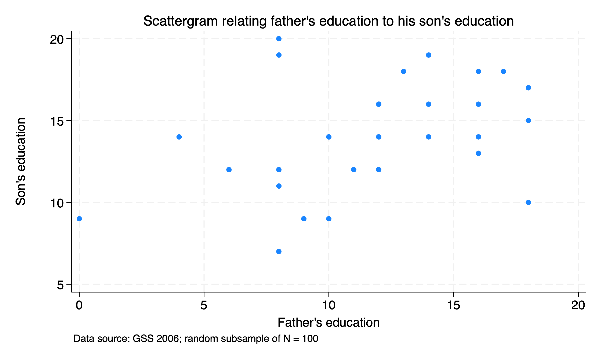
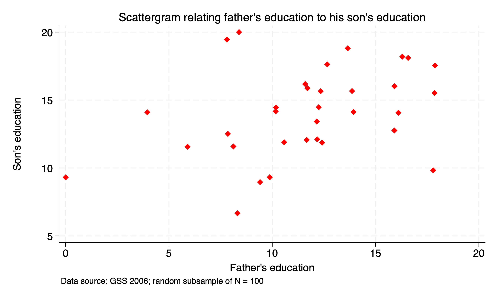
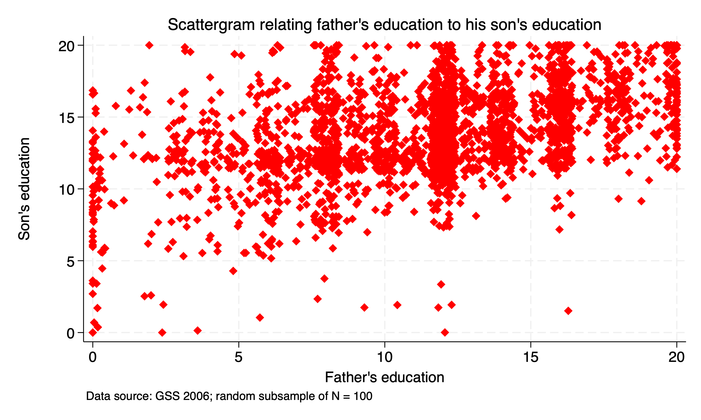
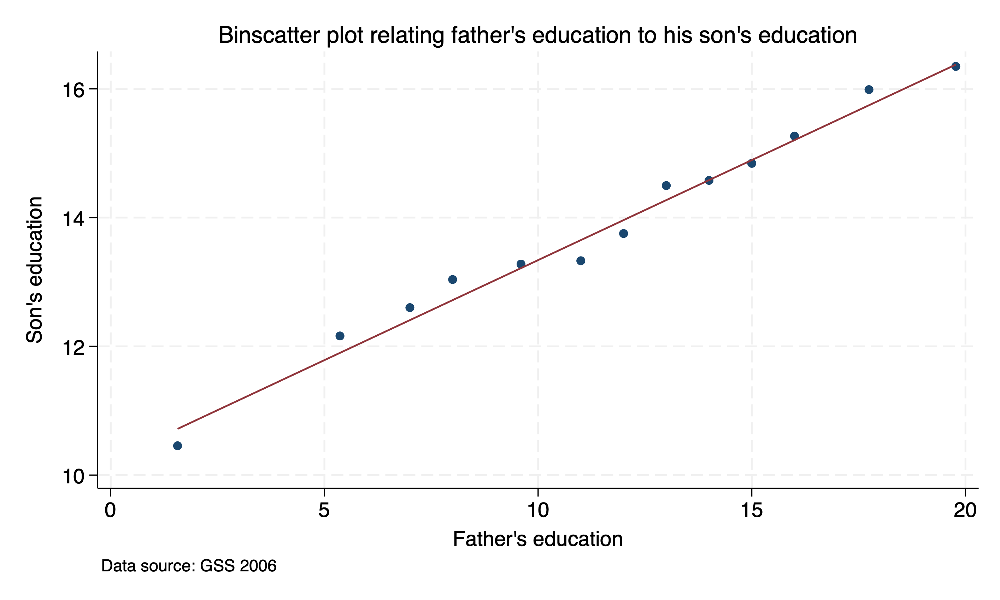
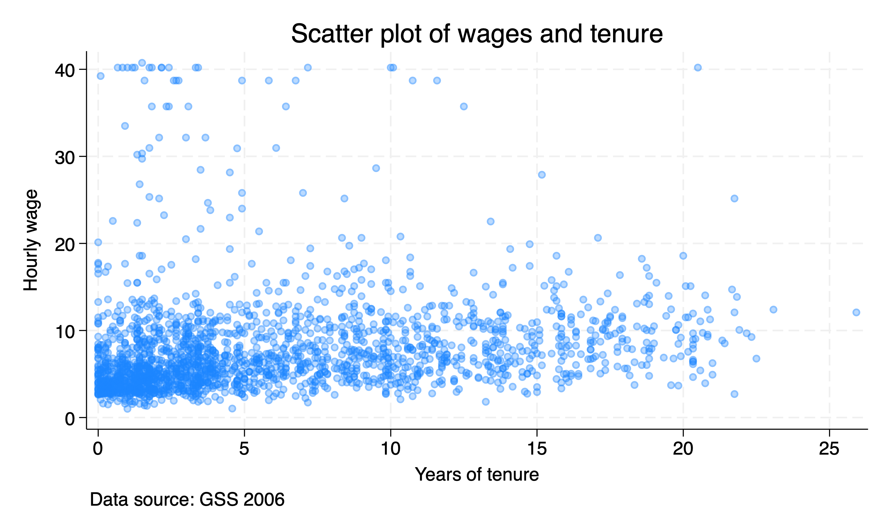
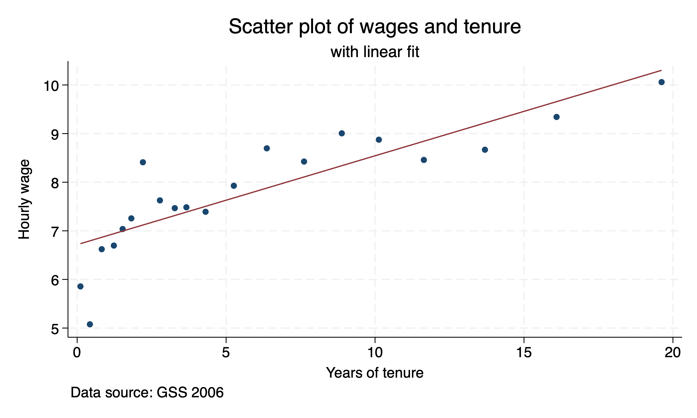
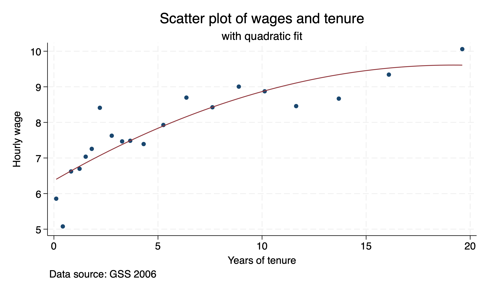
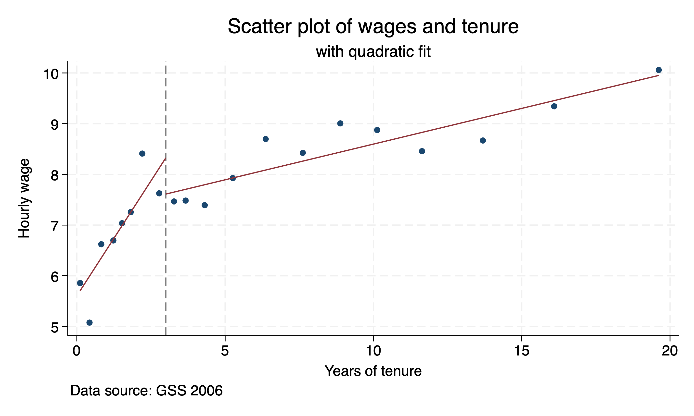
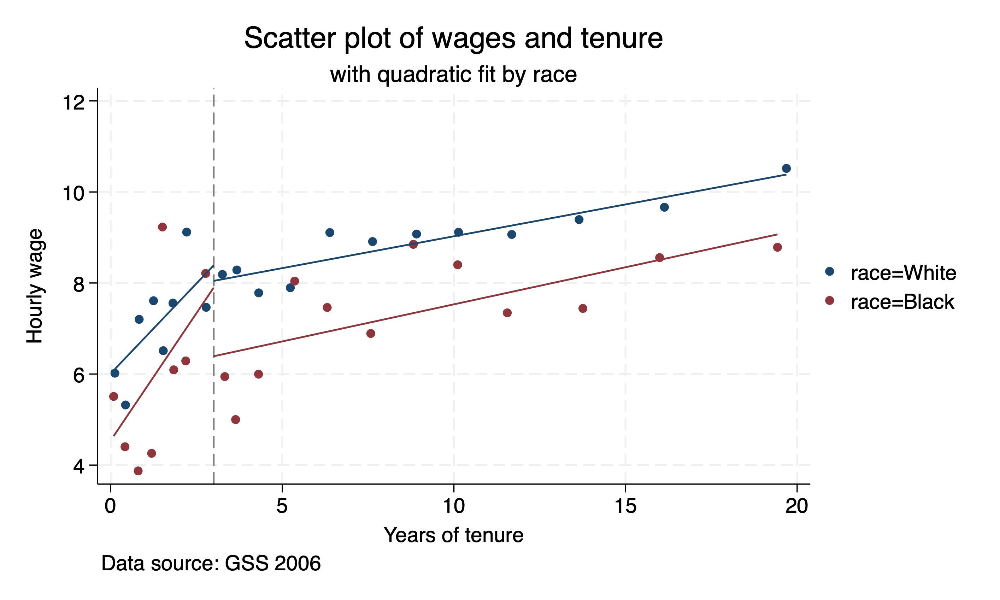

# Covariance and Bivariate Correlation

We will study the relationship between two variables. Covariance measures if two variables move together, while correlation measures how much they move together. Covariance is the linear association between two variables (Anderson, et al., 2016). Correlation is also a linear association but it is bound between -1 and 1, where -1 is a negative relationship, +1 is a positive relations, and 0 is no relationship (Anderson, et al., 2016). The correlation shows us the strength of the relationship (Acock, 2023). 


## Scattergrams

Scattergrams allow us to graph two continuous or discrete variables to examine any potential relationships. Acock (2023) uses the example of parent's education and child's education. A father with limited education may lack resources to invest into their child's education. A father with higher education may have more educational opportunities. We do not exact the two variables to be perfectly related, but we do expect them to move together in a positive direction.

We will use an extract from the 2006 General Social Survey to plot the relationship between parent and child years of education. We will use a random sample of 100 observations.

To get a random sample that we can replicate, we will use the command *set seed(#)*. This command specifies the initial value of the random-number seed used by the random-number functions. We get randomization, but a randomization we can replicate. 

Next, we will use the command *sample #, count* to get a random sample of **#** observations. Acock (2023) uses the number 111, but you can choose any number between 0 and 2,147,483,647

```{stata getdata, eval=FALSE}
cd "/Users/Sam/Desktop/Econ 643/Data/agis6r/"
use gss2006_chapter8, clear
set seed 111
sample 100, count
```

Next, we can use the *twoway* graphing command to compare education. First we will use *twoway (scatter educ paeduc)* to place a scatter plot. We will restrict the data to only males with *if sex==1*. We will add additional options of *title()*, *subtitle()*, and *note()*. We will add the option *size(medium)* **within** the title option (option within an option) to adjust the size of the dots. 

```{stata graph1, eval=FALSE}
twoway (scatter educ paeduc) if sex==1, ytitle(Son's education) ///
  yscale(titlegap(5)) xtitle(Father's education) ///
  title(Scattergram relating father's education to his son's education, ///
  size(medium)) note(Data source: GSS 2006; random subsample of N = 100) legend(off)
```



It appears to be a positive relationship between father and son years of education completed. However, it does not appear to be a perfect relationship, and there is a lot of variation.

We can adjust the scatter plot with additional options. The *jitter(#)* option adds spherical random noise to the data before plotting and the # represents the size of the noise as a percentage of the graphical area.  This helps prevent data points from overlapping. This is useful especially when the data are discrete, such as the years of education. Given that *jitter(#)* uses a randomization, we should use *jitterseed(#)* so we can have reproducible randomization. Note that the *jitter(#)* and *jitterseed* option are within the *scatter* not *twoway*

Another set of options that we can use with scatter are modifying the format of the dots. We will add *msymbol(**style**)* to change the shape of the dots to different styles, such as circles, diamonds, triangles, squares, x, etc. We can change the color with *mcolor(**color**)* and we can change the size with *msize(**style**)*, which styles include tiny, small, medium, medlarge, huge, etc.

```{stata graph2, eval=FALSE}
twoway (scatter educ paeduc, jitter(6) jitterseed(222) msymbol(diamond) mcolor(red)) if sex==1, ///
  ytitle(Son's education) yscale(titlegap(5)) xtitle(Father's education) ///
  title(Scattergram relating father's education to his son's education, ///
  size(medium)) note(Data source: GSS 2006; random subsample of N = 100) legend(off)
```



## Binscatter

An alternative to scatter plots is the binscatter plot. Even with the *jitter* option available, the number of observations may saturate the plot. 

### General Social Survey

Let's take our 2006 General Social Survey but use all observations. 

```{stata graph3, eval=FALSE}
use gss2006_chapter8, clear
twoway (scatter educ paeduc, jitter(6) jitterseed(222) msymbol(diamond) mcolor(red)) if sex==1, ///
  ytitle(Son's education) yscale(titlegap(5)) xtitle(Father's education) ///
  title(Scattergram relating father's education to his son's education, ///
  size(medium)) note(Data source: GSS 2006; random subsample of N = 100) legend(off)
```



We see bunching at 12 years, 14 years, and 16 years of Father's education. 

Michael Stepner developed the *binscatter* command to deal with this issue. This command generates binned scatterplots, and is optimized for speed in large datasets, such as the General Social Survey, Current Population Survey, American Community Survey PUMS, etc. The *binscatter* command calculates the mean within each bin/interval. Let's install the package.

```{stata binscatter1, eval=FALSE}
ssc install binscatter
```

We will run our scatter plot using the General Social Survey again, but we will use the *binscatter* command instead.

```{stata graph4, eval=FALSE}
binscatter educ paeduc, ytitle(Son's education) xtitle(Father's education) ///
  title(Binscatter plot relating father's education to his son's education, ///
  size(medium)) note(Data source: GSS 2006)
```



We see a fairly strong relationship between mean father's education and mean son's education across bins when we use the entire sample

### National Longitudinal Survey of Women

Let's use another data set from the 1988 National Longitudinal Survey of Women. We will plot the relationship between wages and years of tenure for women between ages of 35 and 44 for individuals who are either Black or White. We will use a scatter plot but we will set the opacity at 30% with the option *mcolor(%30)*. This should help us with overlapping dots.

```{stata graph5, eval=FALSE}
sysuse nlsw88, clear
keep if age > 34 & age < 45 & race < 3
scatter wage tenure, mcolor(%30)
```



We do see a weakly positive relationship, but we do have lots of bunching between 0 and 5 years of tenure. Let's try to use the *binscatter* command.

```{stata graph6, eval=FALSE}
binscatter wage tenure, title("Scatter plot of wages and tenure") linetype(lfit) ///
  subtitle("with linear fit") caption("Data source: GSS 2006") ///
  ytitle("Hourly wage") xtitle("Years of tenure") 
```



We can see a positive association, but a linear line does not seem to be the best fit. Especially for values 0 and 3. Let's change the *linetype* to a quadratic fit.

```{stata graph7, eval=FALSE}
binscatter wage tenure, title("Scatter plot of wages and tenure") linetype(qfit) ///
  subtitle("with quadratic fit") caption("Data source: GSS 2006") ///
  ytitle("Hourly wage") xtitle("Years of tenure") 
```



The quadratic fit appears to be better match than a linear fit, but it is still not quite right. Let's try to add a discontinuity at three years of tenure. We can add a discontinuity with the option *rd(3.0)*. 

```{stata graph8, eval=FALSE}
binscatter wage tenure, rd(3.0) title("Scatter plot of wages and tenure") ///
  subtitle("with quadratic fit") caption("Data source: GSS 2006") ///
  ytitle("Hourly wage") xtitle("Years of tenure") 
```

Adding a discontinuity, we see that there is a strong positive relationship between wages and tenure with less than 3 years of tenure. However, the relationship weakens as years of tenure increases beyond 3 years.



We can add nominal categorical variables to see if the trends remain similar among nominal values. Let's add race to the command to see if the relationship between wage and years of tenure differs among difference racial categories.

```{stata graph9, eval=FALSE}
binscatter wage tenure, rd(3.0) by(race) title("Scatter plot of wages and tenure") ///
  subtitle("with quadratic fit by race") caption("Data source: GSS 2006") ///
  ytitle("Hourly wage") xtitle("Years of tenure") 
```



The graph shows the relationship between wages and years of tenure under 3 years is stronger for Black workers compared to White workers. However, the trends remain relative parallel beyond 3 years of tenure.

## Covariance and Correlation

Covariance is the linear association between two variables (Anderson, et al., 2016). Correlation is also a linear association but it is bound between -1 and 1, where -1 is a negative relationship, +1 is a positive relations, and 0 is no relationship (Anderson, et al., 2016). The correlation shows us the strength of the relationship (Acock, 2023).

Bivariate correlation can be used to assess the bivariate relationship between two variables. Acock (2023) gives the example that calorie consumption and weight less are inversely related with \( r = -0.5 \), which indicates a strong negative relationship. Let's say years of education and wages has \( r = 0.5 \), which indicates a strong positive relationship.

Strengths of bivariate correlation:

  - \( \left| r \right| = 0.5 \) indicates a strong relationship
  - \( \left| r \right| = 0.3 \) indicates a moderate relationship
  - \( \left| r \right| = 0.1 \) indicates a weak relationship

### Covariance

Let's look an example. We'll use the 1988 National Longitudinal Survey for Women again. We again investigate the relationship between wages and years of tenure. We will start off with calculating the covariance, which can be implemented using the *correlate* command. If we want to see the covariance, then we add the option *covariance*

```{stata corr1}
sysuse nlsw88, clear
keep if age > 34 & age < 45 & race < 3
correlate wage tenure, covariance
```

We can see that the covariance is positive, which indicates a positive relationship between wages and years of tenure. However, it is difficult to interpret because it is in squared units.

### Correlation

We can easily calculate the bivarate correlation with the same *correlate* command, but we do not add the *covariance* option.

```{stata corr2, eval=FALSE}
correlate wage tenure
```

```{stata corr2_1, echo=FALSE}
quietly sysuse nlsw88, clear
quietly keep if age > 34 & age < 45 & race < 3
correlate wage tenure
```

\( r = 0.17 \) which indicates a weaker relationship. 

### Correlation Matrix

We may want to analyze multiple bivariate correlations at once. Bivariate correlation can be implemented in Stata easily enough. Let's say we are interested in the correlations among: weight loss and calorie consumption, weight loss and hours of exercise, and weight loss and days of exercise. We can compute a correlation matrix. We would expect all of these items to be moderately correlated.

We'll use the dataset from a study called "High School and Beyond" from UCLA Stata Portal. (I will give a plug for UCLA's OARC Stata resources. See https://stats.oarc.ucla.edu/stata/.) Our dataset has 200 observations. Our variables include education outcomes for math scores, reading scores, science scores, social science scores, and writing scores. We have additional explanatory variables of nominal race and sex, ordinal socioeconomic status, and type of schooling. 

We are interested in the bivariate relationship of the demographic factors and different outcomes. First, we will inspect our categorical variables with the *fre* command or *tab1*. Next, we will use our *correlate* command, but we will add all of the relevant variables to see the correlation matrix. We anticipate that socioeconomic status has a stronger correlation than sex.

```{stata corr3}
use https://stats.oarc.ucla.edu/stat/data/hsb2, clear
fre female ses schtyp prog
correlate read write math science ses female
```

We see that socioeconomic status is moderately correlated with math, reading, science, and writing scores. Sex does not appear to be correlated with reading or math schools. However, female students appear to be moderately correlated with writing scores, but negatively related to science scores.

### Pairwise correlation

The command *correlate* uses casewise deletion option, which means that if any observation is missing for any of the variables, even just one variable, the observation will be dropped from the analysis! We need to worry about nonrandom missing data and external validity with casewise deletion. 

Pairwise correlation uses pairwise deletion to estimate correlation on all the people who answered each pair of items. Pairwise deletion only deletes the observation for the relevant pairwise. For example, if the first observation has a reading score, math score, and socioeconomic status but is missing all other values, then a pairwise correlation will estimate the correlation between reading and math, math and socioeconomic status, and reading and socioeconomic status. Casewise would have deleted the entire observation.

Stata also have the *pwcorr* command, which displays all pairwise correlation coefficients. The *pwcorr* command can also provide statistical significance unlike the *correlate* command. We implement pairwise correlation with the command *pwcorr* along with all variables of interest. We can add the option *listwise* if we want casewise/listwise deletion. We can use the option *sig* to print significance level for each entry. The option *star(5)* will display the significance level with a star, where 5 indicates 0.05 level.

Let's recreate the correlation matrix above with listwise/casewise deletion, but we will add significance levels.

```{stata corr4, eval=FALSE}
pwcorr read write math science ses female, obs listwise sig star(5)
```

```{stata corr4_1, echo=FALSE}
quietly {
cd "/Users/Sam/Desktop/Econ 643/Data/agis6r/"
use hsb2, clear
}
pwcorr read write math science ses female, obs listwise sig star(5)
```

We can see that socioeconomic status is statistically significant in a bivariate analysis with different outcomes. Female was only statistically significant in explaining writing scores. It may come as no surprise but the different outcomes are highly correlated.

Now we will implement a pairwise correlation.

```{stata corr5, eval=FALSE}
pwcorr read write math science ses female, obs sig star(5)
```

```{stata corr5_1, echo=FALSE}
quietly {
cd "/Users/Sam/Desktop/Econ 643/Data/agis6r/"
use hsb2, clear
}
pwcorr read write math science ses female, obs sig star(5)
```

Our results are similar between pairwise and casewise/listwise deletion, since all observations were available.

## Spearman's \(\rho\): Rank-order correlation for ordinal data

Spearman's \(\rho\) calculates the correlation between two rank-order variables. The procedure coverts values into ranks, such as \( 1^{st}, 2^{nd}, ..., n^{th} \). Such that ages \( [18, 29, 35, 61, 20] \)  would be converted to \( [1^{st}, 3^{rd}, 4^{th}, 5^{th}, 2^{nd}] \) and then reordered. 


The *spearman* command implements a Spearman's \(\rho\) rank correlation coefficients. There is no need to rank your ordinal variables, since the *spearman* command will do this for you. We will use the dataset called spearman from Acock (2023). We will inspect our two variables age and an ordinal variable liberal.

```{stata corr6,eval=FALSE}
use spearman, clear
sum age
fre liberal
spearman age liberal
```

Our Spearman's \(\rho\) is strongly negatively correlated with \(\rho=-0.82\). It is also statistically significant at the 10% level, but we should take this with a grain of salt. Why? \(n=5\).

