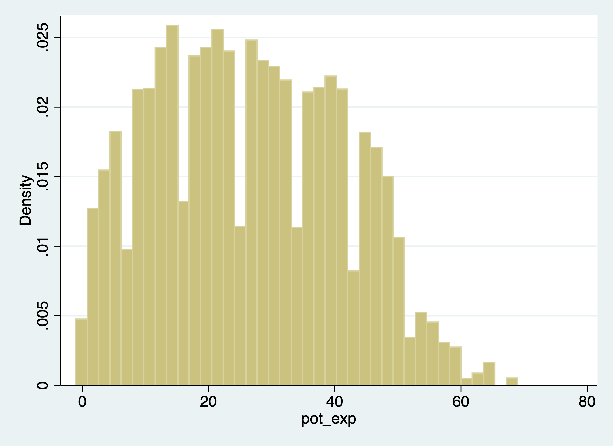

# Creating Data

The *generate* and replace will be the workhorses of creating and modifying variables
We'll deal with generating binary variables. We'll look into missing data and how to handle it. *Note: Please do not label your missing data, it just is a pain to deal with later*
The *egen* command is also a very practical and useful (I wish other software 
packages had this type of command). We'll deal with strings and converting between numerics and strings. 


## Creating and changing variables

One of the most basic tasks is to create, replace, and modify variables. Stata provides some nice and easy commands to work with variable generation and modification relative to other statistical software packages: *generate* and *replace*. These will be the workhorses for the creation and modification of variables. 

As we go through Mitchell's Chapter 6, we'll see that these are not the only two commands we will utilize. For example, Stata has a very helpful command called *egen*. It can be used to create new variables from old variables, especially when working with groups of observations. *Egen* becomes even more helpful when it is combined with *bysort*. We can sort our group and find the max, min, sum, etc. of a group of observations, which can come in handy when we are working with panel data. Furthermore, using indexes can make our generation commands more useful for creating lags or rebasing our data.

### Generate command

The *generate* or *gen* command is one command that you may already have plenty of experience with, but there are some helpful tips when working with generate. What we'll do first is to create a new variable called potential experience and potential experience squared.

Let's look at ages for workers earning weekly wages.
```{stata gen1}
cd "/Users/Sam/Desktop/Data/CPS"
use smalljul25pub, clear
summarize prtage if prerelg==1
generate pot_exp=prtage-16
summarize pot_exp if prerelg==1
```

Look for outliers and generate a histogram for outliers
```{stata gen2, eval=FALSE}
histogram pot_exp if prerelg==1
graph export "jul_25_pot_exp.png", replace
```


Now let's create a new variable for potential experience squared. We have two options:
```{stata gen3, eval=FALSE}
gen pot_exp2 = pot_exp*pot_exp
sum pot_exp2
drop pot_exp2

gen pot_exp2 = pot_exp^2
sum pot_exp2
```

```{stata gen4, echo=FALSE}
quietly {
cd "/Users/Sam/Desktop/Data/CPS"
use smalljul25pub, clear
generate pot_exp=prtage-16
}

gen pot_exp2 = pot_exp*pot_exp
sum pot_exp2
drop pot_exp2

gen pot_exp2 = pot_exp^2
sum pot_exp2
```

**Notice!**  Our age variable, prtage, is missing when the value is -1. The data dictionary provides us the information that -1 is a holder for missing data. Please note that when missing values are ".", we will see missings in an outlier check! Why? Because missing values are considered **very large values**. This is important because when creating binary or categorical variables through qualifiers, make sure you top code your qualifiers.

For example, if we are creating a binary on part-time vs full-time. We need to top code so we don't count missing hours as full-time workers, 
```{stata gen5, eval=FALSE}
gen fulltime if hours > 35 & hours < 999999,
```
Alternatively, you can use the missing function.
```{stata gen6, eval=FALSE}
gen fulltime if hours > 35 & !missing(hours)
```

Let's generate weekly earnings and plot the data. The CPS data dictionary tells us that pternwa is the weekly earnings, but it needs to be divided by 100 to get two decimal places. 
```{stata gen7, eval=FALSE}
gen earnings=pternwa/100
histogram earnings if prerelg==1, title(Weekly Earnings)
graph export "jul_25_weekly_earnings.png", replace
```


Another helpful trick is the before and after options. It might be helpful to have the newly created variable next to a similar variable, so let's drop our variable and generate it again with the after option
```{stata gen8, eval=FALSE}
drop weekwage
gen hrlyearn = pternwa/pehract1, after(pternwa)
drop hrlyearn
gen hrlyearn = pternwa/pehract1, before(pternwa)
```

### Replace

We use our *replace* command to modify a variable that has already been created. Similar to generate, you probably already have experience with replace, but we'll go over some useful tips.

Qualifiers will be an essential part of your syntax when using the *replace* command. 

Let's generate a variable called marital status and look at married and nevermarried variables. 
```{stata rep1}
quietly cd "/Users/Sam/Desktop/Econ 645/Data/Mitchell"
quietly use wws, clear
tabulate married nevermarried
```

We'll generate a new variable called maritalstatus.
```{stata rep2, eval=FALSE}
gen maritalstatus = .
```

I recommend generating a new categorical variable as missing instead of zero, because this prevents missing variables from being categorized as 0 when applicable.

We generally use qualifiers "=, >, <, >=, <=, !" when working with replace. Let's replace the marital status variable with married and nevermarried as qualifiers
```{stata rep3, eval=FALSE}
replace maritalstatus = 1 if married==0 & nevermarried==1
replace maritalstatus = 2 if married==1 & nevermarried==0
replace maritalstatus = 3 if married==0 & nevermarried==0
```

It's always a good idea to double check the variables against the variables they were created from to make sure your categories are what they are supposed to be.
```{stata rep4, eval=FALSE}
tabulate maritalstatus
table maritalstatus married nevermarried
```
```{stata rep5, echo=FALSE}
quietly {
quietly cd "/Users/Sam/Desktop/Econ 645/Data/Mitchell"
quietly use wws, clear
gen maritalstatus = .
replace maritalstatus = 1 if married==0 & nevermarried==1
replace maritalstatus = 2 if married==1 & nevermarried==0
replace maritalstatus = 3 if married==0 & nevermarried==0
}
tabulate maritalstatus
table maritalstatus married nevermarried
```

What will be helpful is to label our values, but we'll cover this next week.

We can also use the *replace* command with a continuous variable in the qualifier

Let's create a new variable called over40hours which will be categorized as 1 if it is over 40 hours, and 0 if it is 40 or under.
```{stata rep6, eval=FALSE}
generate over40hours = .
replace over40hours = 0 if hours <= 40
```
We need to make sure we don't include missing values so we need an additional qualifier besides hours > 40. We need to add !missing(hours).
```{stata rep7, eval=FALSE}
replace over40hours = 1 if hours > 40 & !missing(hours)
```
Now let's see the results. 
```{stata rep8, eval=FALSE}
tab over40hours
tab over40hours, sum(hours)
```

```{stata rep9, echo=FALSE}
quietly{
cd "/Users/Sam/Desktop/Econ 645/Data/Mitchell"
use wws, clear
generate over40hours = .
replace over40hours = 0 if hours <= 40
replace over40hours = 1 if hours > 40 & !missing(hours)
}
tab over40hours
tab over40hours, sum(hours)
```

## Numeric expressions and functions

Our standard numeric expressions
  1. addition +, 
  2. subtraction -, 
  3. multiplication *, 
  4. division /, 
  5. exponentiation ^, and 
  6. parentheses () for changing order of operation.

We also have some very useful numeric functions built into Stata:

The *int()* function removes any decimals.

The *round()* function rounds a number to the desired decimal place.Please note that this is different from Excel!!!

The *round(x,y)* rounds the numbers to the specified nearest value. Where x is your numeric and y is the nearest value you wish to round to.

For example:
  1. if y = 1, round(-5.2,1)=-5 and round(4.5)=5
  2. if y=.1, round(10.16,.1)=10.2 and round(34.1345,.1)=34.1
  3. if y=10, round(313.34,10)=310 and round(4.52,10)=0

**Note:** if y is missing, then it will round to the nearest integer round(10.16)=10
                  
The *ln()* function is our natural log function which we use a lot for transforming variables for elasticity estimates.

The *log10()* function is our logarithm base-10 function.

The *sqrt()* function is our square root function

```{stata num1}
	display int(10.65)
	display round(10.65,1)
	display ln(10.65)
	display log10(10.65)
	display sqrt(10.65)
```
Please note int(10.65) returns 10, while round(10.65,1) returns 11. 

### Random Numbers and setting seeds

There are several random number generating functions in Stata. 

*runiform()* is a random uniform distribution number generator has a distribution between 0 and 1.

*rnormal(m,sd)* is a random normal distribution number generator without arguments it will assume mean = 0 and sd = 1. 

*rchi2(df)* is a random chi-squared distribution number generator where df is the degrees of freedom that need to be specified

Let's look at some examples. 

Setting seeds is important if you want someone to replicate your results, since a set seed will generate the same random number each time it is run.
```{stata num2,eval=FALSE}
*Set our seed
set seed 12345

*Random uniform distribution 
gen runiformtest = runiform()
summarize runiformtest

*Random normal distribution
gen rnormaltest = rnormal()
gen rnormaltest2 = rnormal(100,15)
summarize rnormaltest rnormaltest2

*Random chi-squared distribution
gen rchi2test = rchi2(5)
summarize rchi2test
```
```{stata num2_1,echo=FALSE}
quietly{
cd "/Users/Sam/Desktop/Econ 645/Data/Mitchell"
use wws, clear
}
*Set our seed
set seed 12345

*Random uniform distribution 
gen runiformtest = runiform()
summarize runiformtest

*Random normal distribution
gen rnormaltest = rnormal()
gen rnormaltest2 = rnormal(100,15)
summarize rnormaltest rnormaltest2

*Random chi-squared distribution
gen rchi2test = rchi2(5)
summarize rchi2test
```

## Strings 
Working with string can be a pain, but there are some very helpful  functions that will get your task completed. 
```{stata str1, eval=FALSE}
help string functions
```

### String expressions and functions

Let's get some new data to work with strings and their functions.

We'll format the names with left-justification 17 characters long.
```{stata str2}
quietly cd "/Users/Sam/Desktop/Econ 645/Data/Mitchell"
use "authors.dta", clear	
format name %-17s
list name 
```

Notice white space(s) in front of some names and some names are not in the proper format (lowercase for initial letter instead of upper).

To fix these, we have a three string functions to work with.

The *ustrtitle()* function is the Unicode function to convert strings to title cases, which means that the first letter is always upper and all others are lower case for each word.

The *ustrlower()* is the Unicode function to convert strings to lower case.

The *ustrupper()* is the Unicode function to convert strings to upper case.

Please note that there are string function that do something similar but in ASCII. Our names are not in ASCII currently, so please note that not all string characters come in ASCII, but may come in Unicode: 
  1. *strproper()*
  2. *strlower()*
  3. *strupper()*

We'll generate some names and format our strings to 23 length and left-justified
```{stata str2_1, eval=FALSE}
generate name2 = ustrtitle(name)
generate lowname = ustrlower(name)
generate upname = ustrupper(name)
format name2 lowname upname %-23s
list name2 lowname upname
```
```{stata str3, echo=FALSE}
quietly {
cd "/Users/Sam/Desktop/Econ 645/Data/Mitchell"
use "authors.dta", clear
}
generate name2 = ustrtitle(name)
generate lowname = ustrlower(name)
generate upname = ustrupper(name)
format name2 lowname upname %-23s
list name2 lowname upname
```
We still need to get rid of leading white spaces in front of the name. The *ustrltrim()* will get reid of leading blanks.
```{stata str4, eval=FALSE}
generate name3 = ustrltrim(name2)
format name2 name3 %-17s
list name name2 name3
```
```{stata str5, echo=FALSE}
quietly {
cd "/Users/Sam/Desktop/Econ 645/Data/Mitchell"
use "authors.dta", clear
generate name2 = ustrtitle(name)
generate lowname = ustrlower(name)
generate upname = ustrupper(name)
format name2 lowname upname %-23s
}
generate name3 = ustrltrim(name2)
format name2 name3 %-17s
list name name2 name3
```

Let's work with the initials to identify the initial. In small datasets this is easy enough, but for large datasets we'll need to use some functions.

### substr functions

One of the more practical string functions is the substr functions:

The *usubstr(s,n1,n2)* is our Unicode substring.

The *substr(s,n1,n2)* is our ASCII substring

Where s is the string, n1 is the starting position, n2 is the length 
```{stata str6}
	display substr("abcdef",2,3)
```

Let's find names that start with the initial with substr. We'll start at the 2nd position and move 1 character. Let's use ASCII and compare it to Unicode.
```{stata str7,eval=FALSE}
gen secondchar = substr(name3,2,1)
gen firstinit = (secondchar == " " | secondchar == ".") if !missing(secondchar)
```

We might want to break up a string as well. This is helpful for names, addresses, etc.
We can use the strwordcount function.

The *ustrwordcount(s)* counts the number of words using word-boundary rules of Unicode strings. Where s is the string input.
```{stata str9, eval=FALSE}
generate namecount = ustrwordcount(name3)
list name3 namecount
```
```{stata str10,echo=FALSE}
quietly {
  cd "/Users/Sam/Desktop/Econ 645/Data/Mitchell"
  use "authors.dta", clear
  generate name2 = ustrtitle(name)
  generate lowname = ustrlower(name)
  generate upname = ustrupper(name)
  format name2 lowname upname %-23s
  generate name3 = ustrltrim(name2)
  format name2 name3 %-17s
}
generate namecount = ustrwordcount(name3)
list name3 namecount

```
Notice that there are three authors have a word count of 4 instead of 3 when it should be three.

To extract the words after word count, we can use the *ustrword()* command.
*ustrword(s,n)* returns the word in the string depending upon n. 
**Note:** a positive n returns the nth word from the left, while a -n returns the nth word from the right.

```{stata str11, eval=FALSE}
	generate uname1=ustrword(name3,1)
	generate uname2=ustrword(name3,2)
	generate uname3=ustrword(name3,3)
	generate uname4=ustrword(name3,4)
	list name3 uname1 uname2 uname3 uname4 namecount
```
```{stata str12,echo=FALSE}
quietly {
  cd "/Users/Sam/Desktop/Econ 645/Data/Mitchell"
  use "authors.dta", clear
  generate name2 = ustrtitle(name)
  generate lowname = ustrlower(name)
  generate upname = ustrupper(name)
  format name2 lowname upname %-23s
  generate name3 = ustrltrim(name2)
  format name2 name3 %-17s
  generate namecount = ustrwordcount(name3)
}
generate uname1=ustrword(name3,1)
generate uname2=ustrword(name3,2)
generate uname3=ustrword(name3,3)
generate uname4=ustrword(name3,4)
list name3 uname1 uname2 uname3 uname4 namecount
```

It seems that *ustrwordcount* counts "." as separate words, so let's use another very helpful string function called *subinstr*, which comes in Unicode *usubinstr()* and ASCII *subinstr()*

*usubinstr(s1,s2,s3,n)*  replaces the nth occurance of s2 in s1 with s3.

*subinstr(s1,s2,s3,n)* is the same thing but for ASCII.

Where s1 is our string, s2 is the string we want to replace, s3 is the string we want instead, and n is the nth occurance of s2.

If n is missing or implied, then all occurances of s2 will be replaced.
```{stata str13, eval=FALSE }
generate name4 = usubinstr(name3,".","",.)
replace namecount = ustrwordcount(name4)
list name4 namecount
```
```{stata str14, echo=FALSE}
quietly {
  cd "/Users/Sam/Desktop/Econ 645/Data/Mitchell"
  use "authors.dta", clear
  generate name2 = ustrtitle(name)
  generate lowname = ustrlower(name)
  generate upname = ustrupper(name)
  format name2 lowname upname %-23s
  generate name3 = ustrltrim(name2)
  format name2 name3 %-17s
  generate namecount = ustrwordcount(name3)
}
generate name4 = usubinstr(name3,".","",.)
replace namecount = ustrwordcount(name4)
list name4 namecount
```

Let's split the names. We'll use *ustrword(s,n)* retrieves the *nth* word in string *s*.
```{stata str15, eval=FALSE}
gen fname = ustrword(name4,1)
gen mname = ustrword(name4,2) if namecount==3
gen lname = ustrword(name4,namecount)
format fname mname lname %-15s
list name4 fname mname lname
```
```{stata str16, echo=FALSE}
quietly {
  cd "/Users/Sam/Desktop/Econ 645/Data/Mitchell"
  use "authors.dta", clear
  generate name2 = ustrtitle(name)
  generate lowname = ustrlower(name)
  generate upname = ustrupper(name)
  format name2 lowname upname %-23s
  generate name3 = ustrltrim(name2)
  format name2 name3 %-17s
  generate namecount = ustrwordcount(name3)
  generate name4 = usubinstr(name3,".","",.)
  replace namecount = ustrwordcount(name4)
}
gen fname = ustrword(name4,1)
gen mname = ustrword(name4,2) if namecount==3
gen lname = ustrword(name4,namecount)
format fname mname lname %-15s
list name4 fname mname lname
```

Some names have the middle initial first, so let's rearrange. The middle initial will only have a string length of one, so we need our string length functions. 
*ustrlen(s)* returns the length of the string.

*strlen(s)* is the same as above but for ASCII

Let's add the period back to the middle initial if the string length is 1.
```{stata str17, eval=FALSE}
replace fname=fname + "." if ustrlen(fname)==1
replace mname=mname + "." if ustrlen(mname)==1
list fname mname
```
```{stata str18, echo=FALSE}
quietly {
  cd "/Users/Sam/Desktop/Econ 645/Data/Mitchell"
  use "authors.dta", clear
  generate name2 = ustrtitle(name)
  generate lowname = ustrlower(name)
  generate upname = ustrupper(name)
  format name2 lowname upname %-23s
  generate name3 = ustrltrim(name2)
  format name2 name3 %-17s
  generate namecount = ustrwordcount(name3)
  generate name4 = usubinstr(name3,".","",.)
  replace namecount = ustrwordcount(name4)
  gen fname = ustrword(name4,1)
  gen mname = ustrword(name4,2) if namecount==3
  gen lname = ustrword(name4,namecount)
  format fname mname lname %-15s
}
replace fname=fname + "." if ustrlen(fname)==1
replace mname=mname + "." if ustrlen(mname)==1
list fname mname
```

Let's make a new variable that correctly arranges the parts of the name.
```{stata str19, eval=FALSE}
	gen mlen = ustrlen(mname)
	gen flen = ustrlen(fname)
	gen fullname = fname + " " + lname if namecount == 2
	replace fullname = fname + " " + mname + " " + lname if namecount==3 & mlen > 2
	replace fullname = fname + " " + mname + " " + lname if namecount==3 & mlen==2
	replace fullname = mname + " " + fname + " " + lname if namecount==3 & flen==2
	list fullname fname mname lname
```

```{stata str20, echo=FALSE}
quietly {
  cd "/Users/Sam/Desktop/Econ 645/Data/Mitchell"
  use "authors.dta", clear
  generate name2 = ustrtitle(name)
  generate lowname = ustrlower(name)
  generate upname = ustrupper(name)
  format name2 lowname upname %-23s
  generate name3 = ustrltrim(name2)
  format name2 name3 %-17s
  generate namecount = ustrwordcount(name3)
  generate name4 = usubinstr(name3,".","",.)
  replace namecount = ustrwordcount(name4)
  gen fname = ustrword(name4,1)
  gen mname = ustrword(name4,2) if namecount==3
  gen lname = ustrword(name4,namecount)
  format fname mname lname %-15s
  replace fname=fname + "." if ustrlen(fname)==1
  replace mname=mname + "." if ustrlen(mname)==1
}
gen mlen = ustrlen(mname)
gen flen = ustrlen(fname)
gen fullname = fname + " " + lname if namecount == 2
replace fullname = fname + " " + mname + " " + lname if namecount==3 & mlen > 2
replace fullname = fname + " " + mname + " " + lname if namecount==3 & mlen==2
replace fullname = mname + " " + fname + " " + lname if namecount==3 & flen==2
list fullname fname mname lname
```

If you are brave enough, learning regular express can pay off in the long run. Stata has string functions with regular express, such as finding particular sets of strings with *regexm()*. Regular expressions are a pain to work with, but they are very powerful.