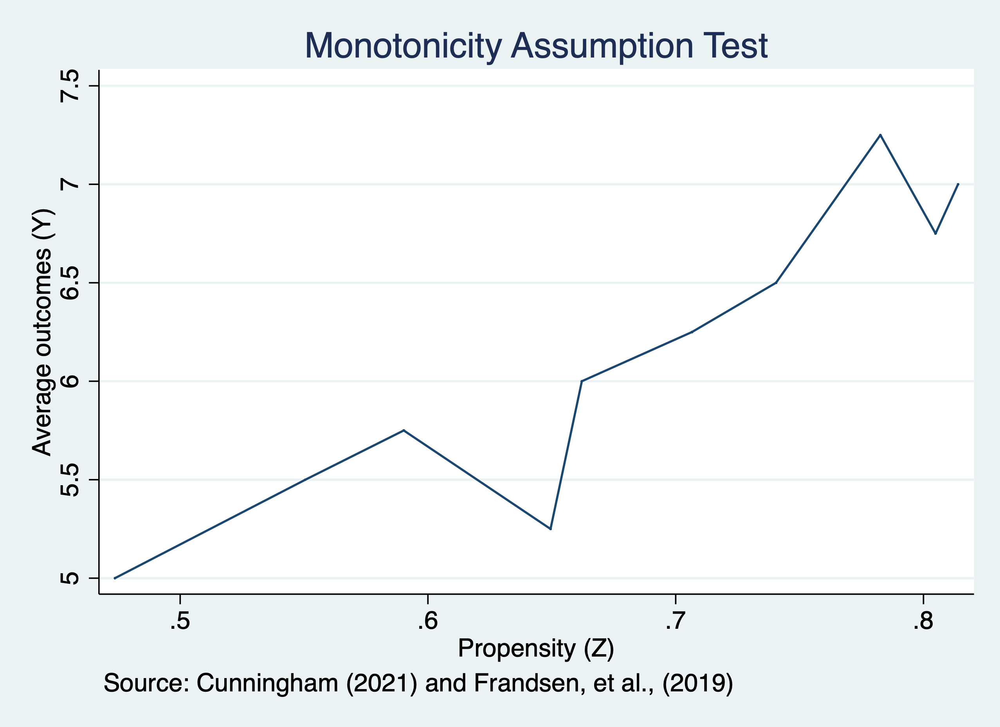

# Instrumental Variables

In-depth, institutional knowledge of programs, treatment, interventions provide some of the best sources of strong instruments (Angrist and Krueger, 2001)

We are going to estimate the marginal impact of going to college for those who comply with the instrument. 

$$ \delta^{IV}_{LATE}=\frac{E[Y_i(D^1_i,1)-Y_i(D^0_i,0)]}{E[D^1_i-D^0_i]}=E[Y^1_i-Y^0_i|D^1_i-D^0_i=1]$$

## Naive OLS

We will use a naive OLS to estimate the marginal effect of college on wages. We expect this to be upwards biased.

First, we will import our data from Card via Cunningham

```{stata ols1, eval=FALSE}
cd "/Users/Sam/Desktop/Econ 672/Data"
use card
```

$$ ln(wages_i)= \beta_0 + \beta_1 edu_i + \beta_2 expr_i + \beta_3 Black_i + \beta_4 South_i + \beta_5 married_i + a_i + \varepsilon_i $$

Where \(a_i \) are controls for metropolitian statistical areas.


```{stata ols2, eval=FALSE}
reg lwage  educ  exper black south married i.smsa
```

```{stata ols2_1, echo=FALSE}
quietly{
cd "/Users/Sam/Desktop/Econ 672/Data"
use card, clear
}
reg lwage  educ  exper black south married i.smsa
```

We find that our \(\hat{\beta_1}=0.0711\) and our interpretation is that college increases wages by \( (e^{0.0711}-1)*100\%=7.3\% \)

## Estimate Local Average Treatment Effect using IV

Next, we will use our instrument variable estimator to estimate the \(LATE\) for those who comply with the instrument. We will use the *ivregress 2sls* command. 

Our instrument is a binary if being in a county near a 4-year college.

Our first stage is: 
$$ educ_i=\pi_0 + \pi_1 nearc4_i + \pi_2 expr_i + \pi_3 Black_i + \pi_4 South + \pi_5 married + \pi_6 metro_i + \eta_i $$
Our second state is:
$$ ln(wages_i)= \beta_0 + \beta_1 \widehat{edu}_i + \beta_2 expr_i + \beta_3 Black_i + \beta_4 South_i + \beta_5 married_i + \beta_6 metro_i + \varepsilon_i $$

```{stata iv1, eval=FALSE}
ivregress 2sls lwage (educ=nearc4) exper black south married i.smsa, first 
```

```{stata iv1_1, echo=FALSE}
quietly {
cd "/Users/Sam/Desktop/Econ 672/Data"
use card, clear
}
ivregress 2sls lwage (educ=nearc4) exper black south married i.smsa, first 
```

Our 2SLS estimate of the LATE is 13.5%.  Being near a college increases the wages by \( (e^{0.124}-1)*100\%=13.5\% \) for compliers.

## Test Instrument Relevance

We will first test our instrument relevance assumption. This should be familiar from Econ 645. We will estimate the first stage by itself and then use an \(F\)-Test.

$$ educ_i=\pi_0 + \pi_1 nearc4_i + \pi_2 expr_i + \pi_3 Black_i + \pi_4 South + \pi_5 married + \pi_6 metro_i + \eta_i $$
```{stata test1, eval=FALSE}
reg educ nearc4 exper black south married i.smsa
```

```{stata test1_1, echo=FALSE}
quietly {
cd "/Users/Sam/Desktop/Econ 672/Data"
use card, clear
}
reg educ nearc4 exper black south married i.smsa
```

Being in a county near a college is associated with a 0.32 increase in years of education.

Next, we will use an \(F\)-test on the excludability of college in the county from the first stage regression.

```{stata test2, eval=FALSE}
test nearc4
```

```{stata test2_1, echo=FALSE}
quietly {
cd "/Users/Sam/Desktop/Econ 672/Data"
use card, clear
reg educ nearc4 exper black south married i.smsa
}
test nearc4
```

The \(F\)-statistic is 15.767 which is indicative of a good instrument

## Test Monotonicity

We will now test the monotonicity assumption of the IV. First, we will rerun the first stage regression and predict education.

```{stata test3,eval=FALSE}
quietly reg educ nearc4 exper black south married smsa
predict dhat
```

Next, we will average outcomes across dhat by using the *egen cut* to get bins of outcomes
```{stata test4, eval=FALSE}
sum lwage, detail
egen lwage_bins = cut(lwage), at(5,5.25,5.5,5.75,6,6.25,6.5,6.75,7,7.25,7.5)
sort lwage_bins
by lwage_bins: egen mean_z=mean(nearc4)
```

Now we will graph the monotonicity assumption. 

```{stata test5, eval=FALSE}
*Show Monotonicity Graph 
sort mean_z
twoway line lwage_bins mean_z
```



It is possible that monotonicity assumption is violated.

# Jackknife Instrument Variable Estimator 

We can use the Jackknife Instrument Variable Estimator (JIVE) for Judget Fixed Effects.

First we will start by installing the Jackknife IV estimator.

```{stata jive1, eval=FALSE}
net install st0108
```

Next we will load our data from Stevenson (2018) on guilt verdicts and cash bail/pretrail detention. 

```{stata jive2, eval=FALSE}
cd "/Users/Sam/Desktop/Econ 672/Data"
use judge_fe, clear
```

Next, we will set up some global macros for sets of covariates.

```{stata jive3, eval=FALSE}
*Set up global macros 
global judge_pre judge_pre_1 judge_pre_2 judge_pre_3 judge_pre_4 judge_pre_5 judge_pre_6 judge_pre_7 judge_pre_8
global demo black age male white 
global off  	fel mis sum F1 F2 F3 F M1 M2 M3 M 
global prior priorCases priorWI5 prior_felChar  prior_guilt onePrior threePriors
global control2 	day day2 day3  bailDate t1 t2 t3 t4 t5 t6
```

## Naive OLS

We will estimate a couple specifications using an OLS estimator. Our first model will have minimal controls for time variables, but our second model will have additional controls for demographics and prior justice involvement.

$$ guilt_i = \delta_0 +\delta_1 PretrailDentention_i + \gamma'Dates_i + \beta'Demo_i + \alpha'Crime_i + \varepsilon_i $$

```{stata jive4, eval=FALSE}
eststo minimal: quietly reg guilt jail3 $control2, robust
eststo maximum: quietly reg guilt jail3 possess robbery DUI1st drugSell aggAss $demo $prior $off  $control2 , robust

esttab minimal maximum, mtitle("Minimal" "Max Controls") keep(jail3)
```

```{stata jive4_1, echo=FALSE}
quietly {
cd "/Users/Sam/Desktop/Econ 672/Data"
use judge_fe, clear
*Macros
global judge_pre judge_pre_1 judge_pre_2 judge_pre_3 judge_pre_4 judge_pre_5 judge_pre_6 judge_pre_7 judge_pre_8
global demo black age male white 
global off  	fel mis sum F1 F2 F3 F M1 M2 M3 M 
global prior priorCases priorWI5 prior_felChar  prior_guilt onePrior threePriors
global control2 	day day2 day3  bailDate t1 t2 t3 t4 t5 t6
}
eststo minimal: quietly reg guilt jail3 $control2, robust
eststo maximum: quietly reg guilt jail3 possess robbery DUI1st drugSell aggAss $demo $prior $off  $control2 , robust

esttab minimal maximum, mtitle("Minimal" "Max Controls") keep(jail3)
```


The minimal OLS estimate of pretrail detention on guilty plea is -0.0007 increase in percentage points of a guily plea and not statistically significant at the 5 percent level, while maximum controls yields an estimate of 2.9 percentage points.

## Instrument Variables

We will estimate the reduced form equation for the first stage of the instrument variable estimator. We will estimate the first stage with two reduced form equations. One with date variables \(t_i\) and one with data variables plus demographics \(d_i\) and crime and/or prior justice involement \(c_i\).

$$ PreTrailDetention_i = \pi_0 + \pi_1 JFE_i + t_i + d_i+c_i + \varepsilon_i $$

```{stata jive5, eval=FALSE}
est clear
eststo rf1: quietly reg jail3 $judge_pre $control2, robust
eststo rf2: quietly reg jail3 possess robbery DUI1st drugSell aggAss $demo $prior $off  $control2 $judge_pre, robust
esttab rf1 rf2, mtitle("Min Controls" "Max Controls") keep(judge_pre_1 judge_pre_2 judge_pre_3 judge_pre_4 judge_pre_5 judge_pre_6 judge_pre_7 judge_pre_8)
```

```{stata jive5_1, echo=FALSE}
quietly {
cd "/Users/Sam/Desktop/Econ 672/Data"
use judge_fe, clear
*Macros
global judge_pre judge_pre_1 judge_pre_2 judge_pre_3 judge_pre_4 judge_pre_5 judge_pre_6 judge_pre_7 judge_pre_8
global demo black age male white 
global off  	fel mis sum F1 F2 F3 F M1 M2 M3 M 
global prior priorCases priorWI5 prior_felChar  prior_guilt onePrior threePriors
global control2 	day day2 day3  bailDate t1 t2 t3 t4 t5 t6  
}
est clear
eststo rf1: quietly reg jail3 $judge_pre $control2, robust
eststo rf2: quietly reg jail3 possess robbery DUI1st drugSell aggAss $demo $prior $off  $control2 $judge_pre, robust
esttab rf1 rf2, mtitle("Min Controls" "Max Controls") keep(judge_pre_1 judge_pre_2 judge_pre_3 judge_pre_4 judge_pre_5 judge_pre_6 judge_pre_7 judge_pre_8)
```

Next, we will estimate the \(F\)-statistics for our instrument relevance tests for both models.

```{stata jive6, eval=FALSE}
quietly {
reg jail3 $judge_pre $control2, robust
}
test $judge_pre
```

```{stata jive6_1, echo=FALSE}
quietly {
cd "/Users/Sam/Desktop/Econ 672/Data"
use judge_fe, clear
*Macros
global judge_pre judge_pre_1 judge_pre_2 judge_pre_3 judge_pre_4 judge_pre_5 judge_pre_6 judge_pre_7 judge_pre_8
global demo black age male white 
global off  	fel mis sum F1 F2 F3 F M1 M2 M3 M 
global prior priorCases priorWI5 prior_felChar  prior_guilt onePrior threePriors
global control2 	day day2 day3  bailDate t1 t2 t3 t4 t5 t6  
reg jail3 $judge_pre $control2, robust 
}
test $judge_pre
```

Our judge fixed effects appear to be relevant instruments since \( F-stat=35.25\) for our minimal controls model.

```{stata jive7, eval=FALSE}
quietly {
reg jail3 $judge_pre possess robbery DUI1st drugSell aggAss $demo $prior $off $control2 , robust 
}
test $judge_pre
```

```{stata jive7_1, echo=FALSE}
quietly {
cd "/Users/Sam/Desktop/Econ 672/Data"
use judge_fe, clear
*Macros
global judge_pre judge_pre_1 judge_pre_2 judge_pre_3 judge_pre_4 judge_pre_5 judge_pre_6 judge_pre_7 judge_pre_8
global demo black age male white 
global off  	fel mis sum F1 F2 F3 F M1 M2 M3 M 
global prior priorCases priorWI5 prior_felChar  prior_guilt onePrior threePriors
global control2 	day day2 day3  bailDate t1 t2 t3 t4 t5 t6 
reg jail3 $judge_pre possess robbery DUI1st drugSell aggAss $demo $prior $off $control2 , robust 
}
test $judge_pre
```

Our judge fixed effects appear to be relevant instruments since \( F-stat=42.67\) for our maximum controls model, as well.

Now let's estimate our two models with an IV estimator with the *ivregress 2sls* command.

```{stata jive7_2, eval=FALSE}
est clear
eststo iv1: quietly ivregress 2sls guilt (jail3= $judge_pre) $control2, robust first
eststo iv2: quietly ivregress 2sls guilt (jail3= $judge_pre) possess robbery DUI1st drugSell aggAss $demo $prior $off $control2 , robust first
esttab iv1 iv2, mtitle("Min IV Model" "Max IV Model") keep(jail3)
```

```{stata jive7_3, echo=FALSE}
quietly {
cd "/Users/Sam/Desktop/Econ 672/Data"
use judge_fe, clear
*Macros
global judge_pre judge_pre_1 judge_pre_2 judge_pre_3 judge_pre_4 judge_pre_5 judge_pre_6 judge_pre_7 judge_pre_8
global demo black age male white 
global off  	fel mis sum F1 F2 F3 F M1 M2 M3 M 
global prior priorCases priorWI5 prior_felChar  prior_guilt onePrior threePriors
global control2 	day day2 day3  bailDate t1 t2 t3 t4 t5 t6 
}
est clear
eststo iv1: quietly ivregress 2sls guilt (jail3= $judge_pre) $control2, robust first
eststo iv2: quietly ivregress 2sls guilt (jail3= $judge_pre) possess robbery DUI1st drugSell aggAss $demo $prior $off $control2 , robust first
esttab iv1 iv2, mtitle("Min IV Model" "Max IV Model") keep(jail3)
```

Our \(LATE\) estimate is an increase of guilty plea by 15.1 percentage points for individuals with a guilty plea with the minimal-controls model. 

Our \(LATE\) estimate is an increase of guilty plea by 18.6 percentage points for individuals with a guilty plea with the maximum-controls model.

## Jackknife Instrument Variable Estimator

Now we will implement our Jackknife IV estimator and estimate miminal-control and maximum-control models. We use the *jive* command after doing our install of package st0108.

```{stata jive8, eval=FALSE}
jive guilt (jail3= $judge_pre) $control2, robust
```

```{stata jive8_1, echo=FALSE}
quietly {
cd "/Users/Sam/Desktop/Econ 672/Data"
use judge_fe, clear
*Macros
global judge_pre judge_pre_1 judge_pre_2 judge_pre_3 judge_pre_4 judge_pre_5 judge_pre_6 judge_pre_7 judge_pre_8
global demo black age male white 
global off  	fel mis sum F1 F2 F3 F M1 M2 M3 M 
global prior priorCases priorWI5 prior_felChar  prior_guilt onePrior threePriors
global control2 	day day2 day3  bailDate t1 t2 t3 t4 t5 t6 
}
jive guilt (jail3= $judge_pre) $control2, robust
```

Our estimated \(LATE\) with JIVE is a 16.2 percentage point increase in a guilty plea for individuals with a pre-trail detention.

```{stata jive9, eval=FALSE}
jive guilt (jail3= $judge_pre) possess robbery DUI1st drugSell aggAss $demo $prior $off $control2 , robust
```

```{stata jive9_1, echo=FALSE}
quietly {
cd "/Users/Sam/Desktop/Econ 672/Data"
use judge_fe, clear
*Macros
global judge_pre judge_pre_1 judge_pre_2 judge_pre_3 judge_pre_4 judge_pre_5 judge_pre_6 judge_pre_7 judge_pre_8
global demo black age male white 
global off  	fel mis sum F1 F2 F3 F M1 M2 M3 M 
global prior priorCases priorWI5 prior_felChar  prior_guilt onePrior threePriors
global control2 	day day2 day3  bailDate t1 t2 t3 t4 t5 t6 
}
jive guilt (jail3= $judge_pre) possess robbery DUI1st drugSell aggAss $demo $prior $off $control2 , robust
```

Our estimated \(LATE\) with JIVE is a 21.2 percentage point increase in a guilty plea for individuals with a pre-trail detention

Also, don't forget to clear your global macros! Local macros expire at the end of a run, but global macros will remain, and you need to tell Stata to remove them.
```{stata jive10, eval=FALSE}
clear all 
macro drop _all
```