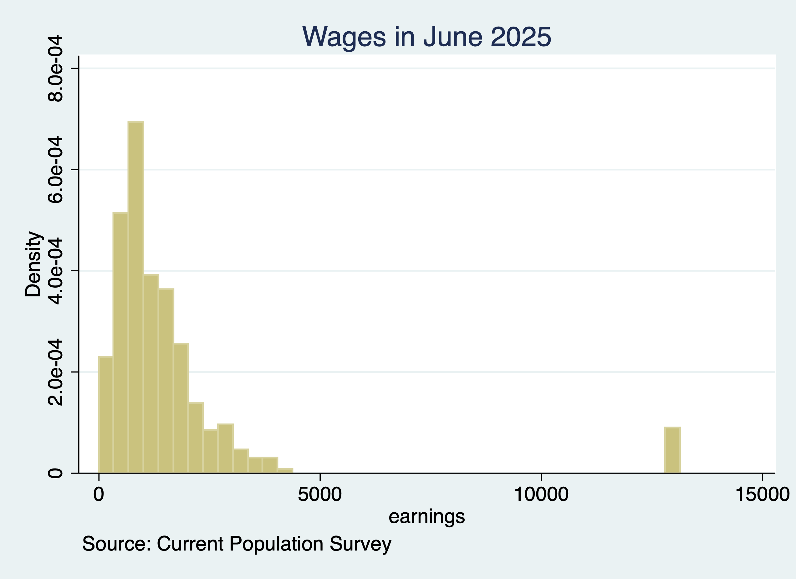

# Automate Graphs and Figures
Stata makes saving graphs easy, so if there is a minor fix all you need to do is rerun the scripts and have your graph fixed. Use the **graph export** command to save a graph.

```{stata graphs1, eval=FALSE}
*Get CPS Data
use jun25pub.dta
gen earnings=pternwa/100 if prerelg==1
histogram earnings if prerelg==1, title("Wages in June 2025") caption("Source: Current Population Survey")
graph export "Wages_June_2025.png"
```

```{stata graph2, echo=FALSE}
cd "/Users/Sam/Desktop/Econ 645/Data/CPS/"
use jun25pub.dta
  
gen earnings=pternwa/100
summarize earnings if prerelg==1
histogram earnings if prerelg==1, title("Wages in June 2025") caption("Source Current Population Survey") replace
graph export "/Users/Sam/Wages_in_June_2025.png"
```

