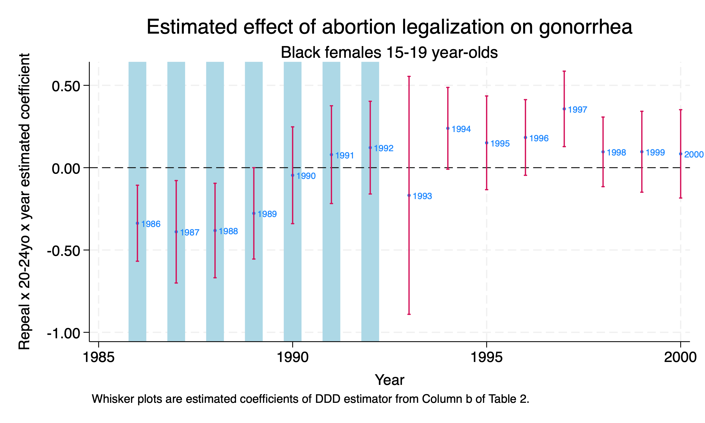
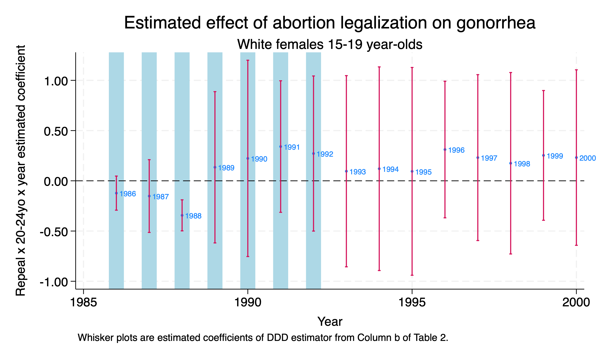
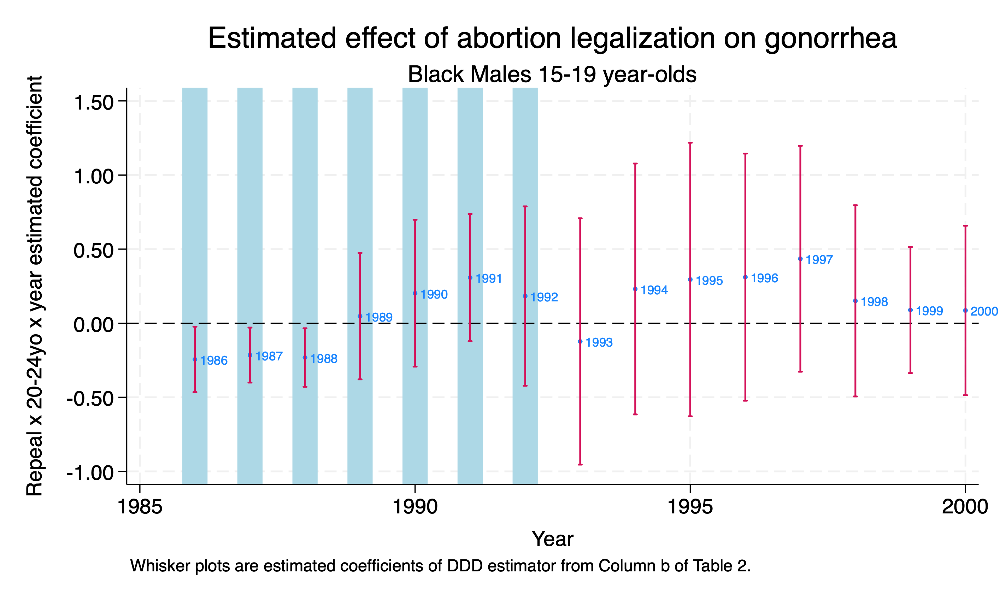
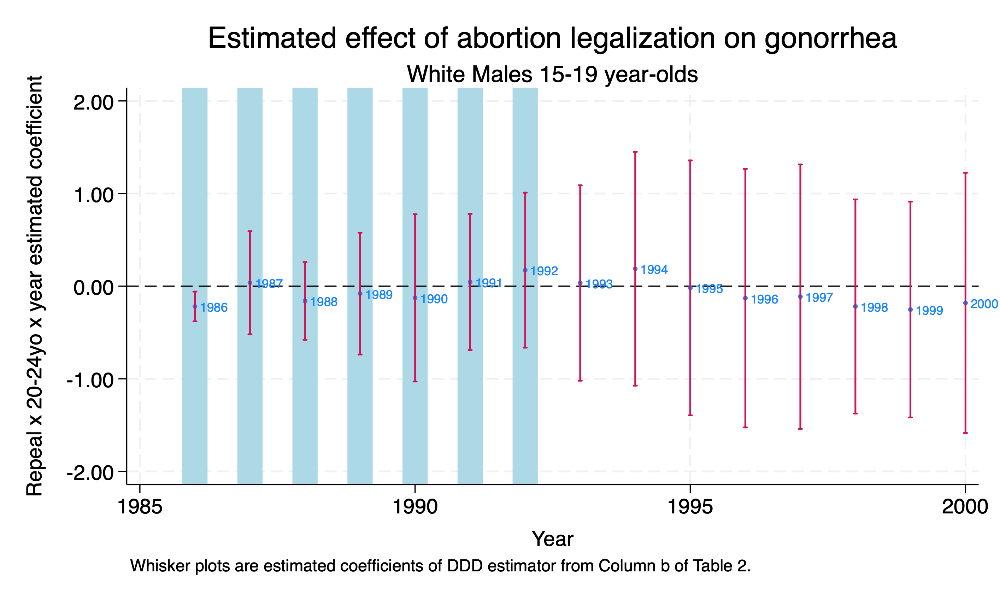
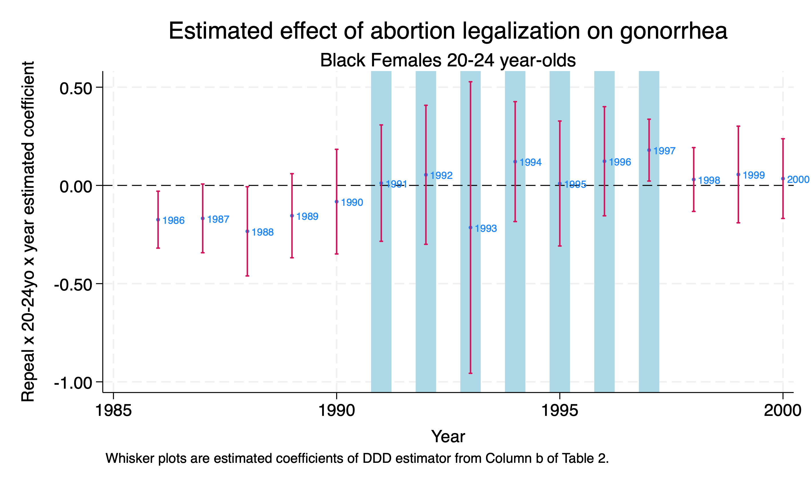
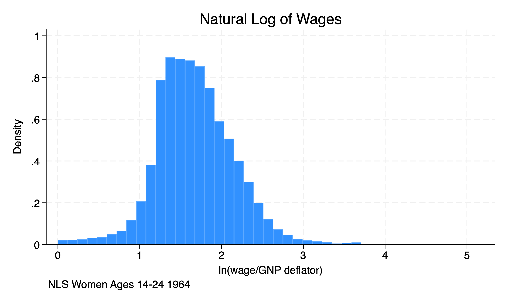
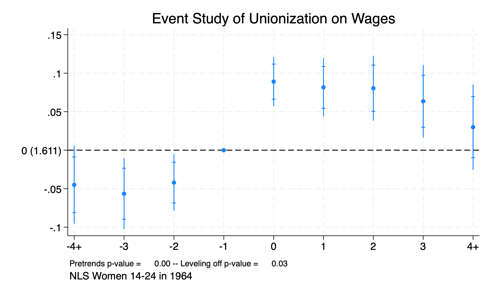
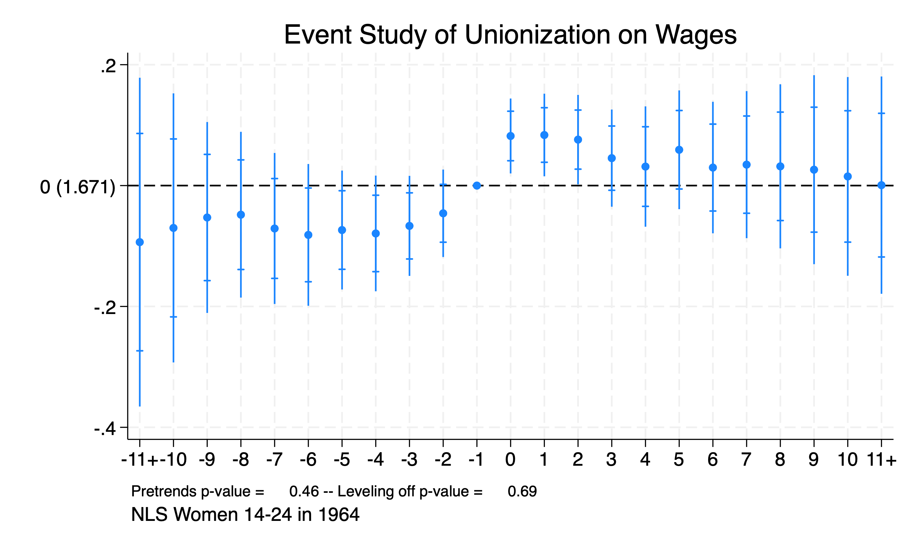

# Difference-in-Difference-in-Differences

We'll bring back Cunningham and Cornwell (2013) to assess the impact of abortion on long-term gonorrhea incidencess. The abortion hypothesis from Gruber, Levine, and Staiger (1999) makes very specific predictions about reproductive health and poverty outcomes. If there are far-reaching effects of abortion legalization in the early 1970s, then some of those effects will show up later. Levitt (2004) finds controversial evidence that abortion legalization caused a 10% decline in crime between 1991 an 2001. 

The authors' focus on long-term gonorrehea cases is due to the correlation between single-parent status and risky behaviors. The authors focus on 15-19 year olds, since they would have been treated in the 5 early adopter states before complete legalization. 

The authors use 25-29 year olds for a comparison group. The reason is that 25-29 year olds would be exposed to treatment but should not be affected by the treatment but close enough to 15-19 to prevent spillover effects.

## The Estimator

Our Difference-in-Difference-in-Differences (DDD) is the following:

$$ y_{ijt} = \alpha + \psi X_{ijt} + \beta_{1} \tau_{t} + \beta_{2} \delta _{j} + \beta_{3} D_{i} + \beta_{4} (\delta * \tau)_{jt} + \beta_{5} (\tau * D)_{tj} + \beta_{6} (\delta*D) + \beta_{7} (\gamma*\tau*D)_{ijt} + \varepsilon_{ijt} $$

All interactions are included in a DDD design

  1. Treatment group dummy \(D_i\)
  2. Post-treatment dummy \(\tau_{t}\)
  3. Group dummy \(\delta_{j}\)
  4. \(X_{ijt}\) is a set of covariates of interest

Where

  1. \(D_{i}\) represents treatment state (5 adapters)  and our control states
  2. \(\tau_{t}\) represents prepost-post period 1986-1992 and post-1992
  3. \(\delta_{j}\) represents our two groups of 15-19 vs 25-29 year olds 

Our parameter of interest is \( \beta_{7} \) to compare our DDD estimate to our original DD estimate. \(\beta_{7}\) is the full-interaction term. We want to test \(\beta_{7}\) to see if it is similar to our original difference-in-difference estimate. 

Our diff-in-diff parameter for the placebo group is \(\beta_{5}\). We should expect to fail to reject the null hypothesis that \( H_{0}: \beta_{5}=0 \).

## 15-19 year olds vs. 20-24 year olds

Let's read in our data and prepare it. We'll set up our demographic groups first. 

```{stata ddd1}
cd "/Users/Sam/Desktop/Econ 672/Data/"
use "abortion.dta", clear

gen yr=(repeal) & (younger==1)
*White Male
gen wm=(wht==1) & (male==1)
*White Female
gen wf=(wht==1) & (male==0)
*Black Male
gen bm=(wht==0) & (male==1)
*Black Female
gen bf=(wht==0) & (male==0)

char year[omit] 1985
char repeal[omit] 0
char younger[omit] 0
char fip[omit] 1
char fa[omit] 0
char yr[omit] 0 
```

Then we will estimate the DDD estimate for 15-19 year olds vs. 20-24 year olds in repeal vs Roe states without fixed effects.

```{stata ddd2, eval=FALSE}
reg lnr i.repeal##i.year##i.younger i.fip##c.t acc pi ir alcohol crack  poverty income ur if bf==1 & (age==15 | age==25) [aweight=totpop], cluster(fip)
```

```{stata ddd2_1, echo=FALSE}
quietly {
cd "/Users/Sam/Desktop/Econ 672/Data/"
use "abortion.dta", clear

gen yr=(repeal) & (younger==1)
*White Male
gen wm=(wht==1) & (male==1)
*White Female
gen wf=(wht==1) & (male==0)
*Black Male
gen bm=(wht==0) & (male==1)
*Black Female
gen bf=(wht==0) & (male==0)

char year[omit] 1985
char repeal[omit] 0
char younger[omit] 0
char fip[omit] 1
char fa[omit] 0
char yr[omit] 0 

}
reg lnr i.repeal##i.year##i.younger i.fip##c.t acc pi ir alcohol crack  poverty income ur if bf==1 & (age==15 | age==25) [aweight=totpop], cluster(fip)
```


We reject the null hypothesis that coefficients for the DDD estimators in 1986-1989 are 0 for 15-19 year olds, and we conlude that the rates of long-term gonorrehea declines in the earlier adopters at the 5% level for 15-19 year olds.

We do notice that we reject the null hypothesis for parameters in 1991-1992 for 25-29 year olds for i.repeal##i.year interactions. This can possibility be a concern.

Next, we will plot our DDD parameters estimates.

```{stata ddd3, eval=FALSE}
xi: reg lnr i.repeal*i.year i.younger*i.repeal i.younger*i.year i.yr*i.year ///
i.fip*t acc pi ir alcohol crack  poverty income ur if bf==1 & (age==15 | age==25) ///
[aweight=totpop], cluster(fip)

*Parameter Estimate into dataframe
parmest, label for(estimate min95 max95 %8.2f) li(parm label estimate min95 max95) saving(bf15_DDD.dta, replace)

*Get Parameter Estimate Dataframe
use ./bf15_DDD.dta, replace

*Keep Triple Difference-in-Differences Parameter Estimates only
keep in 82/96

gen		year=.
replace year=1986 in 1
replace year=1987 in 2
replace year=1988 in 3
replace year=1989 in 4
replace year=1990 in 5
replace year=1991 in 6
replace year=1992 in 7
replace year=1993 in 8
replace year=1994 in 9
replace year=1995 in 10
replace year=1996 in 11
replace year=1997 in 12
replace year=1998 in 13
replace year=1999 in 14
replace year=2000 in 15

sort year

*Graph the Triple Diff-in-Diff
twoway (scatter estimate year, mlabel(year) mlabsize(vsmall) msize(tiny)) ///
 (rcap min95 max95 year, msize(vsmall)), ///
 ytitle(Repeal x 20-24yo x year estimated coefficient) yscale(titlegap(2)) ///
 yline(0, lwidth(thin) lcolor(black)) xtitle(Year) ///
 xline(1986 1987 1988 1989 1990 1991 1992, lwidth(vvvthick) lpattern(solid) ///
 lcolor(ltblue)) xscale(titlegap(2)) ///
 title(Estimated effect of abortion legalization on gonorrhea) ///
 subtitle(Black females 15-19 year-olds) ///
 note(Whisker plots are estimated coefficients of DDD estimator from Column b of Table 2.) ///
 legend(off)
```




It is interesting that we fail to reject the null hypothesis for 15-19 year olds in 1991-1992, but we reject the null hypothesis for 25-29 year olds in 1991-1992.

We can run the estimates for White women, Black males, and White males. The code is the same as above with the exception of the subset.




We fail to reject the null hypothesis that parameters for the DDD estimator are 0 with the exception of 1988.




We reject the null hypothesis that the parameters of the DDD estimator is 0 for 1986-1988, but we fail to reject the null hypothesis for years 1989-1992.




We fail to reject the null hypothesis that the parameters of the DDD estimator are 0 for White Males, except for 1986. 

These results show that the policy impacts may vary by demographics. However, these tests show some support to what Cunningham and Cornwell (2013) hypothesis. However, as Cunningham (2021) notes the abortion hypothesis makes very specific predictions, and we fail to find a parabolic relationship.

## 20-24 year olds vs 25-29 year olds

Next, we will conduct the same exercise, but we will focus on 20-24 year olds. 

```{stata ddd4, eval=FALSE}
quietly {
use "/Users/Sam/Desktop/Econ 672/Data/abortion.dta", clear

Second DDD model for 20-24 year olds vs 25-29 year olds black females in repeal vs Roe states
gen younger2 = 0 
replace younger2 = 1 if age == 20

gen yr2=(repeal==1) & (younger2==1)

gen wm=(wht==1) & (male==1)
gen wf=(wht==1) & (male==0)
gen bm=(wht==0) & (male==1)
gen bf=(wht==0) & (male==0)
char year[omit] 1985 
char repeal[omit] 0 
char younger2[omit] 0 
char fip[omit] 1 
char fa[omit] 0 
char yr2[omit] 0 

*Triple DDD 
*Compare 20-24 to 25-29 year olds in repeal vs Roe states
*OR
reg lnr i.repeal##i.year##i.younger2 i.fip##c.t acc pi ir alcohol crack  poverty ///
 income ur if bf==1 & (age==20 | age==25) [aweight=totpop], cluster(fip) 
*XI
xi: reg lnr i.repeal*i.year i.younger2*i.repeal i.younger2*i.year i.yr2*i.year ///
  i.fip*t acc pi ir alcohol crack  poverty income ur if bf==1 & (age==20 | age==25) ///
  [aweight=totpop], cluster(fip) 
  
 parmest, label for(estimate min95 max95 %8.2f) li(parm label estimate min95 max95) saving(bf20_DDD.dta, replace)

*Get Parameter Estimate Dataframe
use ./bf20_DDD.dta, replace

keep in 82/96

gen		year=.
replace year=1986 in 1
replace year=1987 in 2
replace year=1988 in 3
replace year=1989 in 4
replace year=1990 in 5
replace year=1991 in 6
replace year=1992 in 7
replace year=1993 in 8
replace year=1994 in 9
replace year=1995 in 10
replace year=1996 in 11
replace year=1997 in 12
replace year=1998 in 13
replace year=1999 in 14
replace year=2000 in 15

sort year
}
*Graph the Triple Diff-in-Diff
twoway (scatter estimate year, mlabel(year) mlabsize(vsmall) msize(tiny)) ///
 (rcap min95 max95 year, msize(vsmall)), ///
 ytitle(Repeal x 20-24yo x year estimated coefficient) yscale(titlegap(2)) ///
 yline(0, lwidth(thin) lcolor(black)) xtitle(Year) ///
 xline(1991 1992 1993 1994 1995 1996 1997, lwidth(vvvthick) lpattern(solid) ///
 lcolor(ltblue)) xscale(titlegap(2)) ///
 title(Estimated effect of abortion legalization on gonorrhea) ///
 subtitle(Black Females 20-24 year-olds) ///
 note(Whisker plots are estimated coefficients of DDD estimator from Column b of Table 2.) ///
 legend(off)

```




We fail to reject the null hypothesis in the time period of interest. One concern is that 20-24 year olds are too close in age to 25-29 year olds for a comparison. If these groups are interacting, then we will have a spillover effect. This spillover effect will violate our Stable Unit Treatment Value Assumptions (SUTVA).

The abortion hypothesis provides very specific predictions, and our results show some skepticism for the abortion hypothesis explaining long-term gonorrehea incidences.

# Event Studies

We can use panel event studies to assess pre-treatment trends. (Please do not confuse panel event studies with time series event studies). We will use data from the National Longitudinal Survey for Women to assess the impact of unionization on wages. 

Luckily, we have some Stata commands that will help us with event studies. I have found these commands easier to use than the syntax provided by Cunningham (2021). Freyaldenhoven, Hansen, Perez, and Shapiro (2021) provide their command package *xtevent* to estimate the parameters of an event study, plot the estimates, and test the estimates.

```{stata es1, eval=FALSE}
ssc install xtevent
```

## National Longitudinal Survey

First, we will need to import the data and inspect the dataset.

```{stata es2}
cd "/Users/Sam/Desktop/Econ 672/Data/"
use nlswork

describe
```

We can see that this is a longitudinal survey of women ages 14-24 in 1964. Let's inspect the outcome of interest, the natural log of wages.

```{stata es3, eval=FALSE}
sum ln_wages, detail
histogram ln_wage, title(Natural Log of Wages) caption(NLS Women Ages 14-24 1964)
```

```{stata es3_1, echo=FALSE}
quietly {
cd "/Users/Sam/Desktop/Econ 672/Data/"
use nlswork
}
sum ln_wages, detail
```



Next, we will set up the panel 

```{stata es4, eval=FALSE}
by idcode (year): gen time=_n
xtset idcode time
```

```{stata es4_1, echo=FALSE}
quietly {
cd "/Users/Sam/Desktop/Econ 672/Data/"
use nlswork 
}
by idcode (year): gen time=_n
xtset idcode time
```


Generate a policy variable that follows staggered adoption. This observe changes in the union status or treatment variable of interest.

```{stata es5, eval=FALSE}
by idcode (time): gen union2 = sum(union)
replace union2 = 1 if union2 > 1
tab year union2
```

```{stata es5_1, echo=FALSE}
quietly {
cd "/Users/Sam/Desktop/Econ 672/Data/"
use nlswork 
by idcode (year): gen time=_n
xtset idcode time
}
by idcode (time): gen union2 = sum(union)
replace union2 = 1 if union2 > 1
tab year union2
```

## *xtevent*

We can utilize the command *xtevent* to calculate and plot an panel event study instead of complex syntax. The command is the following:

**xtevent** *depvar* [*indepvars*], policyvar(*PostTreatVar*) panelvar(*idvar*) timevar(*timevarname*)

We have several options that we need to consider as well. One of the key option is the *window* options. We will set the window to 3 and then rerun the *xtevent* command with a window of 10.

```{stata es6, eval=FALSE}
xtevent ln_w age c.age#c.age ttl_exp c.ttl_exp#c.ttl_exp tenure , pol(union2) w(3) cluster(idcode) impute(nuchange)
```

```{stata es6_1, echo=FALSE}
quietly{
cd "/Users/Sam/Desktop/Econ 672/Data/"
use nlswork 
by idcode (year): gen time=_n
xtset idcode time
by idcode (time): gen union2 = sum(union)
replace union2 = 1 if union2 > 1
}
xtevent ln_w age c.age#c.age ttl_exp c.ttl_exp#c.ttl_exp tenure , pol(union2) w(3) cluster(idcode) impute(nuchange) plot
```

From the event study, we find that unionization increases wages for women by \((e^{0.089}-1)*100\% = 9.8\% \) to about \((e^{0.06356}-1)*100\% = 6.6\%\) for four years after unionization.

Now, we will expand the window to 10 years.

```{stata es7, eval=FALSE}
xtevent ln_w age c.age#c.age ttl_exp c.ttl_exp#c.ttl_exp tenure , pol(union2) w(10) cluster(idcode) impute(nuchange)
```

```{stata es7_1, echo=FALSE}
quietly{
cd "/Users/Sam/Desktop/Econ 672/Data/"
use nlswork 
by idcode (year): gen time=_n
xtset idcode time
by idcode (time): gen union2 = sum(union)
replace union2 = 1 if union2 > 1
}
xtevent ln_w age c.age#c.age ttl_exp c.ttl_exp#c.ttl_exp tenure , pol(union2) w(10) cluster(idcode) impute(nuchange) plot
```

We can see the range of outcomes is similar, but for only three years after the event.

## *xteventplot*

We can plot the results from the *xtevent* command in two ways. One way is to add the option *plot* to the *xtevent* command. The second way is to use the command *xteventplot*, which I prefer due to more options.

We can visualize the pretreatment trends to see if parallel trends holds.

```{stata es8,eval=FALSE}
quietly xtevent ln_w age c.age#c.age ttl_exp c.ttl_exp#c.ttl_exp tenure , pol(union2) w(3) cluster(idcode) impute(nuchange) plot

xteventplot, title("Event Study of Unionization on Wages") caption("NLS Women 14-24 in 1964"")
```



From our plot, we can easily see that we reject the null hypothesis that our pretreatment parameters are equal to 0.

We will run it with a window of 10 years for pretreatment.

```{stata es9, eval=FALSE }
xtevent ln_w age c.age#c.age ttl_exp c.ttl_exp#c.ttl_exp tenure , pol(union2) w(10) cluster(idcode) impute(nuchange)

xteventplot, title("Event Study of Unionization on Wages") caption("NLS Women 14-24 in 1964")

```



Our plot shows that we reject the null hypothesis for the pretreatment years 3-5. We need to be concerned that the parallel trends assumption does not hold.

## *xteventtest*

We can test the null hypothesis that the cumulative pretreatment variables are equal to 0 with the command *xteventtest* command. We can add the options *allpre* and *allpre cumul* to test our pretreatment trends.

These conduct \(F\)-tests to test the joint exclusion restriction, which is similar to what we did in Econ 645.

We'll use the 3-year pretreatment window.


```{stata es10, eval=FALSE}
quietly xtevent ln_w age c.age#c.age ttl_exp c.ttl_exp#c.ttl_exp tenure , pol(union2) w(3) cluster(idcode) impute(nuchange)
xteventtest, allpre cumul
```

```{stata es10_1, echo=FALSE}
quietly{
cd "/Users/Sam/Desktop/Econ 672/Data/"
use nlswork 
by idcode (year): gen time=_n
xtset idcode time
by idcode (time): gen union2 = sum(union)
replace union2 = 1 if union2 > 1

xtevent ln_w age c.age#c.age ttl_exp c.ttl_exp#c.ttl_exp tenure , pol(union2) w(3) cluster(idcode) impute(nuchange) plot
}
xteventtest, allpre cumul
```

Our results from the \(F\)-test show that we reject the null hypothesis that the cumulative pretreatment trend is 0.

We'll test this for the 10-year pretreatment window.

```{stata es11, eval=FALSE}
quietly xtevent ln_w age c.age#c.age ttl_exp c.ttl_exp#c.ttl_exp tenure , pol(union2) w(10) cluster(idcode) impute(nuchange)
xteventtest, allpre cumul
```

```{stata es11_1, echo=FALSE}
quietly{
cd "/Users/Sam/Desktop/Econ 672/Data/"
use nlswork 
by idcode (year): gen time=_n
xtset idcode time
by idcode (time): gen union2 = sum(union)
replace union2 = 1 if union2 > 1

xtevent ln_w age c.age#c.age ttl_exp c.ttl_exp#c.ttl_exp tenure , pol(union2) w(10) cluster(idcode) impute(nuchange) plot
}
xteventtest, allpre cumul
```

Again, our results from the \(F\)-test show that we reject the null hypothesis that the cumulative pretreatment trend is 0.


