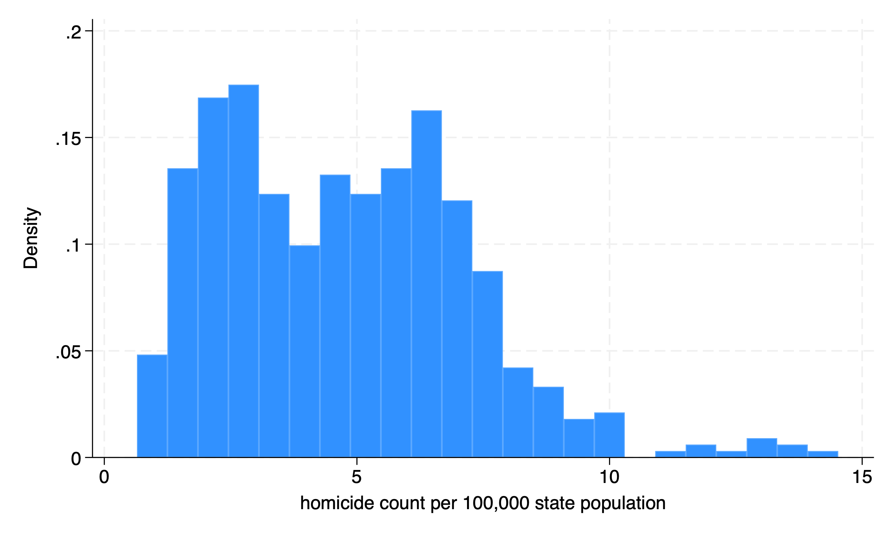
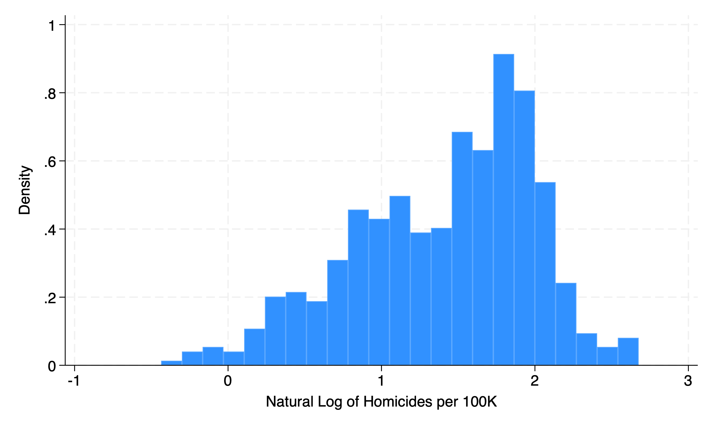
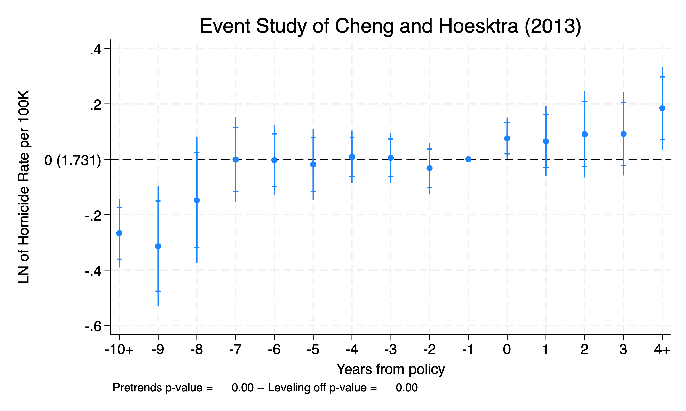
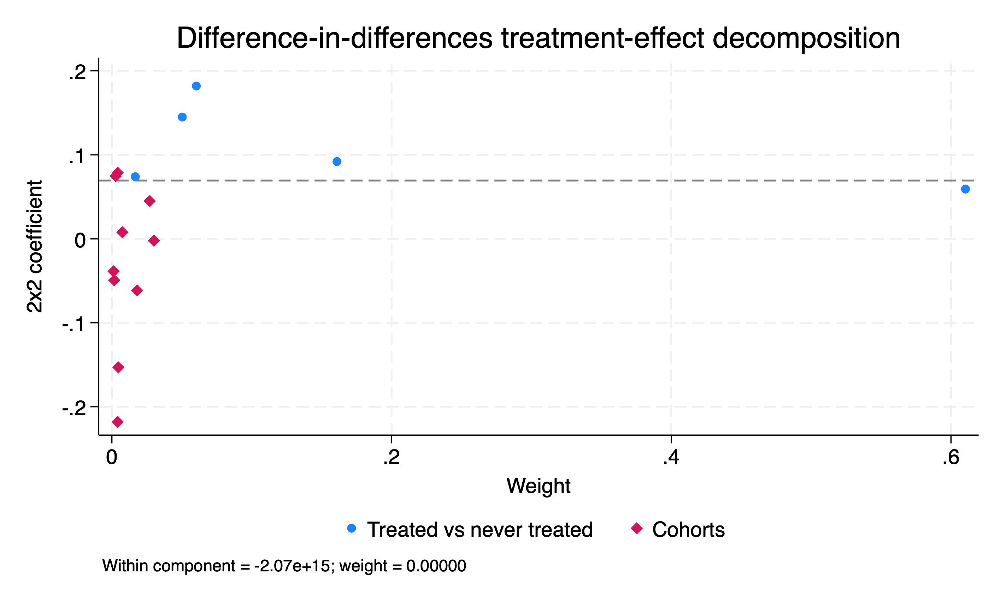
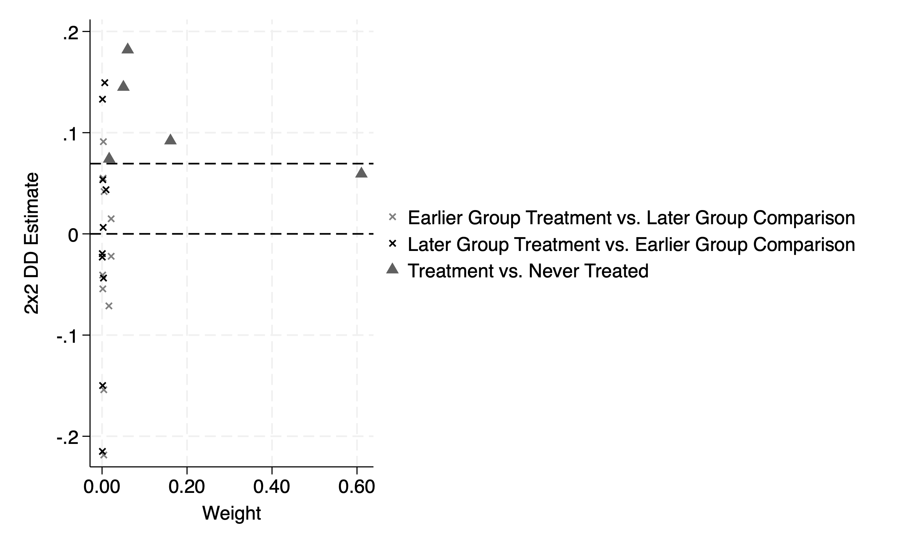

# Two-way Fixed Effects with Differential Timing

## Replicate Cheng and Hoesktra (2013)

We will replicate Cheng and Hoesktra (2013) in our Two-Way Fixed Effects (TWFE) example. Cheng and Hoekstra (2013) evaluate the impact of gun reform on violence with time differential adoption of gun reform after the death of Trayvon Martin in 2012.

The policy change of interest are castle-doctrine statutes (or “Stand Your Ground” laws). Between 2000 and 2010, 21 states expanded their castle-doctrine by extending the castle-doctrine to outside of the home where lethal force could legally be used. It eliminated the long-standing common law of a victim’s duty to retreat. And, if the victim felt threatened, then they could legally use lethal force.

The authors assess the reform of castle-doctrine statutes  on homicides. Proponents argue that it reduces crime through deterrance, while opponents argue it increases homicides due to more guns being present. Cunningham argues that these doctrines reduce the marginal cost of manslaughter by reducing civil liability. 

The authors utilize a TWFE estimator, since there are differential timings in treatment. States did not adopt castle-doctrine reform simultaneously. Therefore, we need to be concerned about comparing early treated to late treated.

Model

$$ Y_{it}=\alpha+\delta D_{it} + \gamma X_{it} + \lambda_{i} + \tau_{t}+\varepsilon_{it} $$
Where

  - \( Y_{it} \) is the homicide rate per \(100k\)
  - \( D_{it} \) is the binary for castle doctrine present in state \(i\) at time \(t\)
  - \( X_{it} \) are region-by-region fixed effects (so a treatment state's counterfactual comes from its region)
  - \( lambda_{i} \) are state fixed effects
  - \( \tau_{t} \) are time fixed effects
  - \( \varepsilon_{it} \) is the idiosyncratic error clustered at the state level

We have a few option for implementing Goodman-Bacon Decomposition. The first one is the *bacondecomp* package and the other is a post-estimation command with *xtdidregress*.

```{stata ch1,eval=FALSE}
ssc install bacondecomp
```

## Inspect the data

We will import our data and inspect the outcomes and treatment variables. 

```{stata ch2}
clear
cd "/Users/Sam/Desktop/Econ 672/Data"
use castle

sum homicide, detail
```

Our median homicide rate per 100K is 4.65, while the mean is 4.76.

We'll inspect the histogram of both homicide per 100K and the natural log of homicides per 100K.

```{ch3, eval=FALSE}
histogram homicide
```



```{ch3_1, eval=FALSE}
histogram l_homicide, xtitle("Natural Log of Homicides per 100K")
```



Next, we will inspect our treatment variable of interest, which is the change in states adopting caste-doctrine statutes in state \(i\) at time \(t\).

```{stata ch4, eval=FALSE}
label variable post "Year of treatment"
tab year post
```

```{stata ch4_1, echo=FALSE}
quietly {
cd "/Users/Sam/Desktop/Econ 672/Data"
use castle
}
label variable post "Year of treatment"
tab year post
```

We can see that 1 state adopted the policy in 2006. There were 13 more adopters in 2007, 4 more in 2008, 2 more in 2009, and 1 more in 2010. The key issue is that states did not adopt castle-doctrine statutes simultaneously.

Next, we will set up our global macros first to replicate Cheng and Hoesktra (2013). Our state level covariates, \(X_{it}\), includes demographic variables, state linear trends, region, LN of exogenous crime rates, LN of public expenditures, LN of FTE police, unemployment rates, poverty rates, LN of median state income, LN of incarceration rate, and a lag in LN of incarceration rate.

```{stata ch5, eval=FALSE}
global crime1 jhcitizen_c jhpolice_c murder homicide  robbery assault burglary larceny motor robbery_gun_r 
global demo blackm_15_24 whitem_15_24 blackm_25_44 whitem_25_44 //demographics
global lintrend trend_1-trend_51 //state linear trend
global region r20001-r20104  //region-quarter fixed effects
global exocrime l_larceny l_motor // exogenous crime rates
global spending l_exp_subsidy l_exp_pubwelfare 
global xvar l_police unemployrt poverty l_income l_prisoner l_lagprisoner $demo $spending
```

## TWFE with Differential Timing

We will use our *xtreg* command to estimate the TWFE estimator. 

```{stata ch6, eval=FALSE}
xtset sid year
xtreg l_homicide i.year $region $xvar $lintrend post [aweight=popwt], fe vce(cluster sid)
```

```{stata ch6_1, echo=FALSE}
quietly {
cd "/Users/Sam/Desktop/Econ 672/Data"
use castle
label variable post "Year of treatment"
global crime1 jhcitizen_c jhpolice_c murder homicide  robbery assault burglary larceny motor robbery_gun_r 
global demo blackm_15_24 whitem_15_24 blackm_25_44 whitem_25_44 //demographics
global lintrend trend_1-trend_51 //state linear trend
global region r20001-r20104  //region-quarter fixed effects
global exocrime l_larceny l_motor // exogenous crime rates
global spending l_exp_subsidy l_exp_pubwelfare 
global xvar l_police unemployrt poverty l_income l_prisoner l_lagprisoner $demo $spending
}
xtset sid year
xtreg l_homicide i.year $region $xvar $lintrend post [aweight=popwt], fe vce(cluster sid)
```

We can also use *xtdidregress*, which gives a concise estimate of the \(ATET\) and allows for us to test for pre-treatment trends.

```{stata ch7, eval=FALSE}
xtdidregress (l_homicide i.year $region $xvar $lintrend) (post) [aweight=popwt], group(sid) time(year)
```

```{stata ch7_1, echo=FALSE}
quietly {
cd "/Users/Sam/Desktop/Econ 672/Data"
use castle
label variable post "Year of treatment"
global crime1 jhcitizen_c jhpolice_c murder homicide  robbery assault burglary larceny motor robbery_gun_r 
global demo blackm_15_24 whitem_15_24 blackm_25_44 whitem_25_44 //demographics
global lintrend trend_1-trend_51 //state linear trend
global region r20001-r20104  //region-quarter fixed effects
global exocrime l_larceny l_motor // exogenous crime rates
global spending l_exp_subsidy l_exp_pubwelfare 
global xvar l_police unemployrt poverty l_income l_prisoner l_lagprisoner $demo $spending
xtset sid year
}
xtdidregress (l_homicide i.year $region $xvar $lintrend) (post) [aweight=popwt], group(sid) time(year)
```

From our TWFE, we find that the \(ATET\) is equal to \(0.076949 \). Castle-doctrine statutes increase homicides per 100K by \( (e^{.076949}-1)*100\% = 8.0\% \), which is statistically significant at the 5% level.

## Event Study

```{stata ch8, eval=FALSE}
xtevent l_homicide $region [aweight=popwt], pol(post) cluster(sid) timevar(year) window(max) impute(stag) reghdfe 
```

```{stata ch8_1, echo=FALSE}
quietly {
cd "/Users/Sam/Desktop/Econ 672/Data"
use castle
label variable post "Year of treatment"
global crime1 jhcitizen_c jhpolice_c murder homicide  robbery assault burglary larceny motor robbery_gun_r 
global demo blackm_15_24 whitem_15_24 blackm_25_44 whitem_25_44 //demographics
global lintrend trend_1-trend_51 //state linear trend
global region r20001-r20104  //region-quarter fixed effects
global exocrime l_larceny l_motor // exogenous crime rates
global spending l_exp_subsidy l_exp_pubwelfare 
global xvar l_police unemployrt poverty l_income l_prisoner l_lagprisoner $demo $spending
xtset sid year
}
xtevent l_homicide $region [aweight=popwt], pol(post) cluster(sid) timevar(year) window(max) impute(stag) reghdfe 
```

Next, we will plot our leads and lags of the event study.

```{stata ch9, eval=FALSE}
xteventplot, xtitle("Years from policy") ytitle("LN of Homicide Rate per 100K") title("Event Study of Cheng and Hoesktra (2013)")
```



Except for year 9 and year 8, there is no statistically significant difference between treatment and never treated.  There may be spurious factors influencing year 9 and year 8 before the policy and there are very few units in the lead9 (1 out of 550) and lead8 (3 out of 550), so it is probably best to disregard.


# Goodman-Bacon Decomposition

We will again use the data from Cheng and Hoesktra (2013) to assess the Bacon-Goodman Decomposition of the different \(ATETs\) when there is differential timing. We have a few options to calculate the individual \(ATETs\) and different variance weights. We will focus on *estat bdecomp*, *bacondecomp* and *ddtimg*. Please note that *ddtiming* has been depreciated.

## *estat bdecomp*

Our first method to implement the Bacon-Goodman Decomposition is *estat bdecomp*. We run this command after we use *xtdidregress* or *didregress*. Please note that we use the option *graph* to display the individual \(ATET\) and the corresponding weights.

```{stata dd2, eval=FALSE}
xtdidregress (l_homicide) (post), group(sid) time(year)
estat bdecomp, graph
```

```{stata dd2_1, echo=FALSE}
quietly {
cd "/Users/Sam/Desktop/Econ 672/Data"
use castle
label variable post "Year of treatment"
sort sid year
xtset sid year

global crime1 jhcitizen_c jhpolice_c murder homicide  robbery assault burglary larceny motor robbery_gun_r 
global demo blackm_15_24 whitem_15_24 blackm_25_44 whitem_25_44 //demographics
global lintrend trend_1-trend_51 //state linear trend
global region r20001-r20104  //region-quarter fixed effects
global exocrime l_larceny l_motor // exogenous crime rates
global spending l_exp_subsidy l_exp_pubwelfare
global xvar l_police unemployrt poverty l_income l_prisoner l_lagprisoner $demo $spending
global law cdl  
}
xtdidregress (l_homicide) (post), group(sid) time(year)
estat bdecomp, graph
```



We can check the weights of the individual \(ATET\) to examine the heterogeneity of the estimates. The summary shows the Treated vs Never Treated, Treated Earlier vs Treated Later, and Treated Later vs Treated Earlier \(ATETs\) along with their corresponding weights.

We can see that Treated vs Never Treated has the largest weight of 89.8%, from our graph and our summary table. 

We can delve into the early treated vs late treated in the cohort full decomposition. An interesting outcome is that our Treated vs Never Treated \(ATET\) are always positive and range from 0.059 to 0.182. 

However, our Early Treated vs Late Treated and Late Treated vs Early Treated have a lot of heterogeneity. 9 are positive, while 11 are negative. It indicated we may need to worry about heterogeneity bias. However, the weights for both cohorts is 10.1% (7.7% for early treated vs late treated and 2.4% for late treated vs early treated). 

## *bacondecomp*

Our second method to implement the Bacon-Goodman Decomposition is *bacondecomp*
```{stata dd3, eval=FALSE}
ssc install bacondecomp
```

We will first run a TWFE regression with *areg* and then run Bacondecomp after regression, but it generates stubs. Notice that the *areg* will have similar outcome as our *xtdidregress*

```{stata dd4, eval=FALSE}
areg l_homicide post i.year, absorb(sid) robust
bacondecomp l_homicide post, stub(Bacon_) robust ddetail
drop Bacon_*
```

```{stata dd4_1, echo=FALSE}
quietly {
cd "/Users/Sam/Desktop/Econ 672/Data"
use castle
label variable post "Year of treatment"
sort sid year
xtset sid year

global crime1 jhcitizen_c jhpolice_c murder homicide  robbery assault burglary larceny motor robbery_gun_r 
global demo blackm_15_24 whitem_15_24 blackm_25_44 whitem_25_44 //demographics
global lintrend trend_1-trend_51 //state linear trend
global region r20001-r20104  //region-quarter fixed effects
global exocrime l_larceny l_motor // exogenous crime rates
global spending l_exp_subsidy l_exp_pubwelfare
global xvar l_police unemployrt poverty l_income l_prisoner l_lagprisoner $demo $spending
global law cdl  
}
areg l_homicide post i.year, absorb(sid) robust
bacondecomp l_homicide post, stub(Bacon_) robust ddetail
drop Bacon_*
```

Notice that the TWFE estimator is the same between *areg* and *xtdidregress*. One thing about this command is that we lack details of the individual groups. We only see Early_v_Late and Late_v_Early. I personally prefer the *estat bdecomp* command.

## *ddtiming* 

```{stata dd5, eval=FALSE}
net install ddtiming, from(https://raw.githubusercontent.com/tgoldring/ddtiming/master)
```

```{stata dd6, eval=FALSE}
ddtiming l_homicide post, i(sid) t(year) yline(0) 
```

```{stata dd6_1, echo=FALSE}
quietly {
cd "/Users/Sam/Desktop/Econ 672/Data"
use castle
label variable post "Year of treatment"
sort sid year
xtset sid year

global crime1 jhcitizen_c jhpolice_c murder homicide  robbery assault burglary larceny motor robbery_gun_r 
global demo blackm_15_24 whitem_15_24 blackm_25_44 whitem_25_44 //demographics
global lintrend trend_1-trend_51 //state linear trend
global region r20001-r20104  //region-quarter fixed effects
global exocrime l_larceny l_motor // exogenous crime rates
global spending l_exp_subsidy l_exp_pubwelfare
global xvar l_police unemployrt poverty l_income l_prisoner l_lagprisoner $demo $spending
global law cdl 
}
ddtiming l_homicide post, i(sid) t(year) yline(0) 
```



We get similar results, but the issue is that *ddtiming* has been depreciated. 