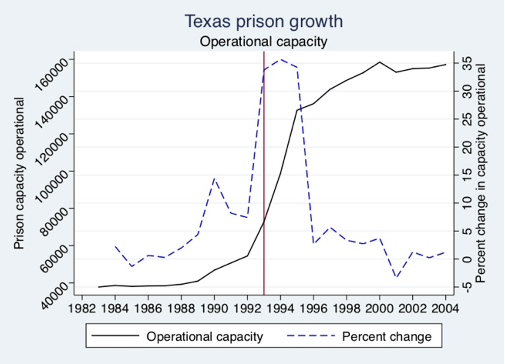
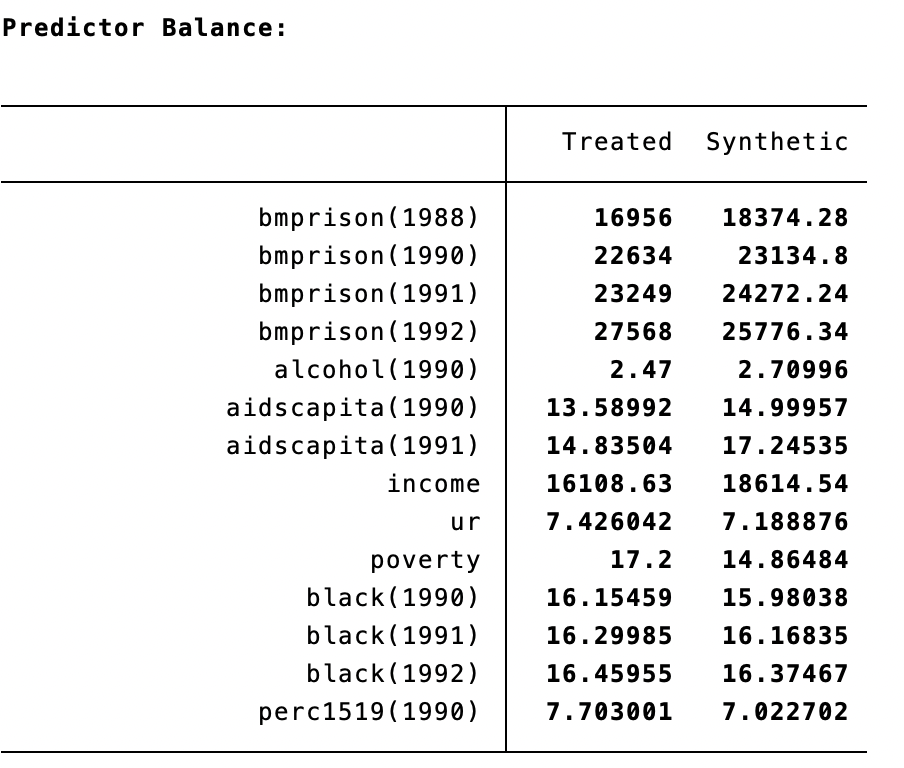
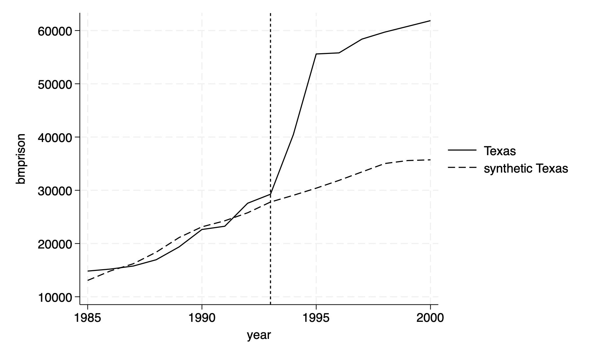
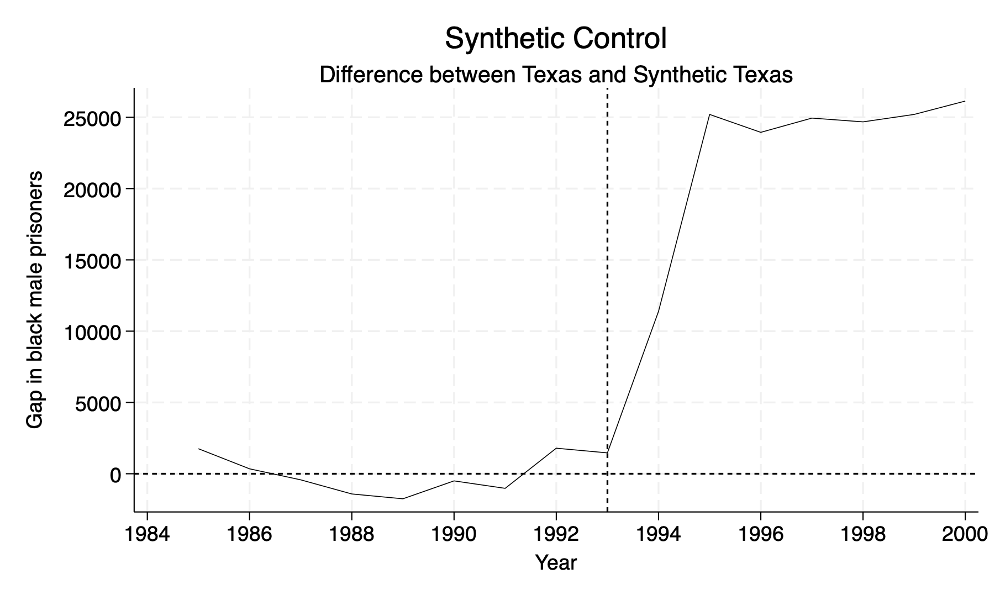
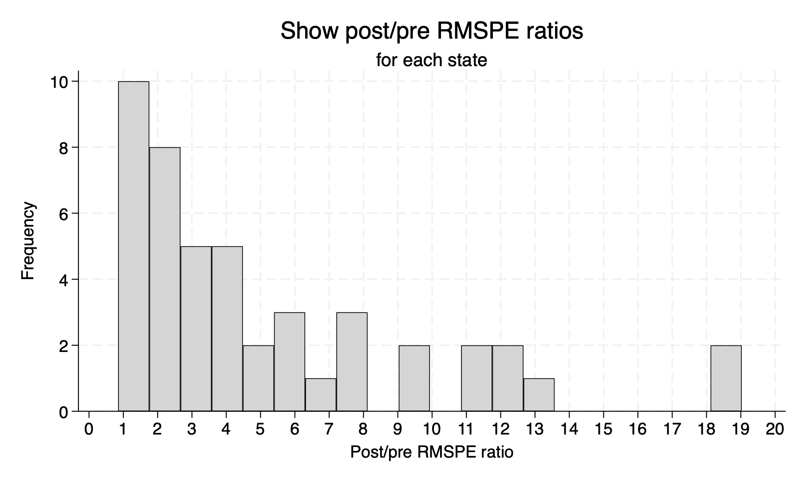
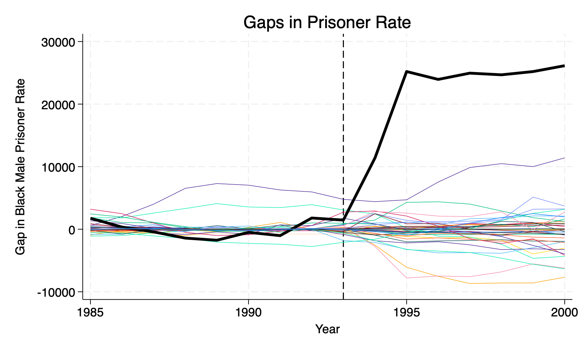
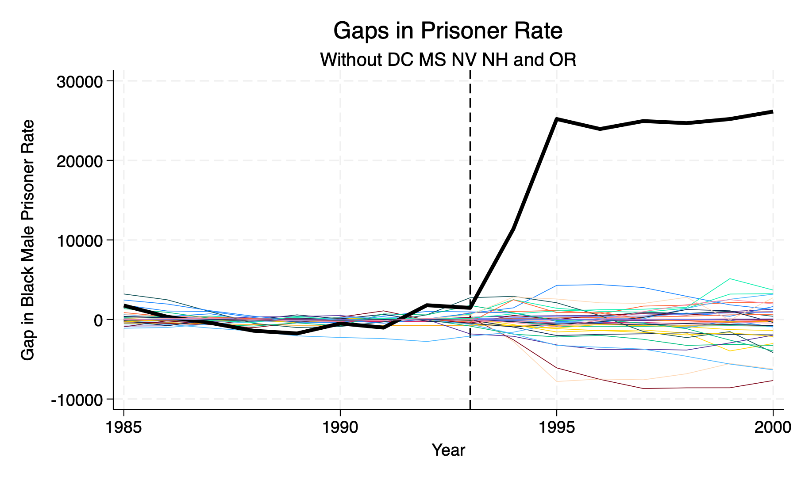

# Synthetic Control

This is just a generalization of the difference-in-differences design and one of the most important evaluation designs in recent years (Athey and Imben, 2017). We use a quantitative comparative case study by focusing on a particular single unit, such as a state, school, county, group, etc. We optimize a set of weights from a donor pool of comparison states to generate a counterfactual for the treatment state.

**The Premise:** Abadie and Gardeazabal (2003) use a method of a weighted average of units from a donor pool to model a counterfactual (synthetic control)


## The estimator

Our synthetic contorl method is the following:

$$ \hat{\delta} = Y_{1t}-\sum^{J+1}_{j=2}w^*_jY_{jt} $$

Where 

  - \(J=1\) is our treatment group
  - \(J+1\) is our donor pool of comparison
  - \(Y_1t\) is the outcome of the treatment group
  - \(Y_{jt} \) is the outcome from donor \(j\)
  - \(w^*_j\) is a vector of optimized weights that is a function of our choice of covariates

The synthetic control estimator estimates the effect of the program at time \(t \geq T_{0} \).

It’s just the difference between our treatment group and a weighted control group at time \( T_{0} \). Where our optimized-weighted control group will depend on our set of covariates we choose

**Matching variables:** Matching variables \(X_1\) and \(X_0\) are chosen as predictors of post-intervention outcomes and must be unaffected by the program, treatment, or intervention.


## *synth* package

First, we will install the *synth* package.

```{stata sc1, eval=FALSE}
ssc install synth 
```

Next, we will install the *mat2txt* package.

```{stata sc1_1, eval=FALSE}
ssc install mat2txt
```

## Prison Construction 

We will recreate Cunningham and Kang (2019) work on the effect of building prisons and black male incarceration rates. We will import and inspect our data after installing our packages.

Cunningham (2021) provides the change in prison in Texas and shows that 1993 begins the prison construction boom.



Next, let's bring the data and summarize the black male incarceration rate per 100,000.

```{stata sc2}
cd "/Users/Sam/Desktop/Econ 672/Data"
use texas, clear

sum bmprison, detail
```

We can see that the mean black male incarceration rate is 3,055 per 100,000.

Next we need to set our idcount and check for redundant values. This is a good practice when working with panel data.

```{stata sc3, eval=FALSE}
sort statefip year
by statefip year: gen idcount = _N
tab idcount

*No redundent or repeated values
drop idcount

```

```{stata sc3_1, echo=FALSE}
quietly {
cd "/Users/Sam/Desktop/Econ 672/Data"
use texas, clear
}
sort statefip year
by statefip year: gen idcount = _N
tab idcount

*No redundent or repeated values
drop idcount

```

Now, we can set the panel with statefips being our unit of analysis and year being our time dimension

```{stata sc4, eval=FALSE}
xtset statefip year
```

```{stata sc4_1, echo=FALSE}
quietly {
cd "/Users/Sam/Desktop/Econ 672/Data"
use texas, clear

sort statefip year
by statefip year: gen idcount = _N
tab idcount

drop idcount
}
xtset statefip year
```

We have a balanced panel to begin our synthetic control. This step is not necessary for the analysis, but I recommend establishing your panel before further analysis.

## Estimate the Weighted Treatment Effect

We will next calculate the gaps, or the weighted average treatment effect on the treated compared to a synthetic comparison.

We will use our outcome, but also lags in our outcomes, covariates, and lags in our covariates. We will specify that Texas, \(FIPS=48\), is our treatment unit and the time of treatment is 1993. We specify the pre-intervention period from 1985 to 1993 and increment by 1 year with *mseperiod*. This is the period where we want to minimize the Mean Squared Predicted Error or \(MSPE\).

Cunningham provides the covariates used to estimate synthetic Texas

  - Lagged pre-treatment rates in 1988, 1990, 1991, and 1992
  - Unemployment rate, income, and poverty
  - Lagged AIDS per capita in 1990, 1991
  - Lagged Black population % in 1990,1991, and 1992
  - Percentage of 15-24 year olds in 1990

```{stata sc5, eval=FALSE}
synth 	bmprison bmprison(1988) bmprison(1990) bmprison(1991) bmprison(1992) alcohol(1990)
aidscapita(1990) aidscapita(1991) income ur poverty black(1990) black(1991) black(1992)
perc1519(1990), trunit(48) trperiod(1993) unitnames(state) mspeperiod(1985(1)1993)
resultsperiod(1985(1)2000) keep(synth_bmprate.dta) replace
```

```{stata sc5_1, echo=FALSE}
quietly{
cd "/Users/Sam/Desktop/Econ 672/Data"
use texas, clear
sort statefip year
by statefip year: gen idcount = _N
tab idcount
*No redundent or repeated values
drop idcount

xtset statefip year
}
synth 	bmprison bmprison(1988) bmprison(1990) bmprison(1991) bmprison(1992) alcohol(1990) aidscapita(1990) aidscapita(1991) income ur poverty black(1990) black(1991) black(1992) perc1519(1990), trunit(48) trperiod(1993) unitnames(state) mspeperiod(1985(1)1993) resultsperiod(1985(1)2000) keep(synth_bmprate.dta) replace 

```

We have a few interesting results. 

First, our \(RMSPE=1295.489\). We can and should continue to test the combination of covariates that reduces the \(RMSPE\) in the pre-treatment period. Recall that Abadie, Diamond, and Hainmueller suggest choosing a \(V\) that minimizes the mean squared prediction error in the pre-treatment period. Recall that we can influence the \(w\) through \(V\) since \(V\) is a function of our covariates.

$$ RMSPE=\sqrt{\sum^{T_0}_{t=1} \left( Y_{1t}-\sum^{J+1}_{j=2}w^{*}_{j}(V)Y_{jt}\right)^2} $$

Second, our results show that California is the largest donor with a weight of 40.8%. Illinois is next with a weight of 36%, while Louisiana and Florida are the thrird and fourth largest donors at 12.2% and 10.9%, respectively.

Next we have our predictor balance between Texas and Synthetic Texas.




These looked balanced, but what are we missing? Ways to test the null hypothesis that these are not different! 

## Plot the Graph

We can add the option *figure* to the *synth* command to plot the Texas vs Synthetic Texas.

```{stata sc6, eval=FALSE}
synth 	bmprison bmprison(1988) bmprison(1990) bmprison(1991) bmprison(1992) alcohol(1990) aidscapita(1990) aidscapita(1991) income ur poverty black(1990) black(1991) black(1992) perc1519(1990), trunit(48) trperiod(1993) unitnames(state) mspeperiod(1985(1)1993) resultsperiod(1985(1)2000) keep(synth_bmprate.dta) replace fig
```



## Plot the Gap or Difference

We are going to pull our results from the synthetic control method with the file *synth_bmprate.dta*, which we defined in the *keep* option.

```{stata sc7, eval=FALSE}
use synth_bmprate.dta, clear
```

The first two columns are our donor pool and their weights. We don't need these now so we can drop them. The 3rd and 4th columns are our outcomes of interest: \(Y\) of Texas and \(Y\) of Synthetic Texas. The 5 column is our time period

```{stata sc8, eval=FALSE}
keep _Y_treated _Y_synthetic _time
drop if _time==.
rename _time year
rename _Y_treated  treat
rename _Y_synthetic counterfact
```

Generate the difference/gap between Texas outcome and Synthetic Texas outcome.

```{stata sc9, eval=FALSE}
gen gap48=treat-counterfact
sort year
```

Finally, we will plot the difference between two outcomes

```{stata sc10, eval=FALSE}
twoway (line gap48 year,lp(solid)lw(vthin)lcolor(black)), yline(0, lpattern(shortdash) lcolor(black)) ///
	xline(1993, lpattern(shortdash) lcolor(black)) xtitle("Year",si(medsmall)) xlabel(#10) ///
	ytitle("Gap in black male prisoners", size(medsmall)) legend(off)

save synth_bmprate_48.dta, replace
```



We can see an difference about 25,000 black males incarcerated per capita in 1995. However, we need to test the null hypothesis to see if this is a statistically significant effect.

# Randomized Inference

We have estimated the difference between Texas and Synthetic Texas, but we have not been able to infer the impact. We will use randomized inference to test our hypothesis.

We will establish a null hypothesis of "no treatment effect", and then use randomized inference to test the hypothesis.

Our process to get exact \(p\)-values will be the following:

  1. Loop through each state to calculate placebo treatments
  2. Calculate the \(RMSPE\) for each placebo state in the pre-treatment period
  3. Calculate the \(RMSPE\) for each placebo state in the post-treatment period
  4. Compute the ratio of \(\frac{post-treatment}{pre-treatment} \)
  5. Sort this ratio in descending order
  6. Calculate the treatment units ratio in the distribution of \(p=\frac{RANK}{Total}\)

## Placebo Tests

First, we will set local macro with fips codes for the 39 states used. We will want to include Texas as part of the donor pool for each placebo test.

```{stata ri1, eval=FALSE}
local statelist  1 2 4 5 6 8 9 10 11 12 13 15 16 17 18 20 21 22 23 24 25 26 27 28 ///
                 29 30 31 32 33 34 35 36 37 38 39 40 41 42 45 46 47 48 49 51 53 55 
```

### Caculate \(RMSPE\) for each state

Next, we will calculate the Root Mean Squared Prediction Error \(RMSPE\) for each state in the donor pool for each time period.

```{stata ri2, eval=FALSE}
foreach i of local statelist {
quietly synth 	bmprison  ///
		bmprison(1990) bmprison(1992) bmprison(1991) bmprison(1988) ///
		alcohol(1990) aidscapita(1990) aidscapita(1991) /// 
		income ur poverty black(1990) black(1991) black(1992) ///  
		perc1519(1990), ///		 
			trunit(`i') trperiod(1993) unitnames(state) ///
			mspeperiod(1985(1)1993) resultsperiod(1985(1)2000) /// 
			keep(synth_bmprate_`i'.dta) replace
  /* check the V matrix */
  matrix state`i' = e(RMSPE)  
}
```

We will store the \(RMSPE\) results from each placebo test.

```{stata ri3, eval=FALSE}
foreach i of local statelist {
  quietly matrix rownames state`i'=`i'
  matlist state`i', names(rows) 
}
```

```{stata ri3_1, echo=FALSE}
quietly {
  cd "/Users/Sam/Desktop/Econ 672/Data"
  use texas.dta, clear
  *Set local macro with fips codes for the 39 states used
  *We will want to include Texas as part of the donor pool for each placebo test
  local statelist  1 2 4 5 6 8 9 10 11 12 13 15 16 17 18 20 21 22 23 24 25 26 27 28 ///
                   29 30 31 32 33 34 35 36 37 38 39 40 41 42 45 46 47 48 49 51 53 55 
  *Loop through each state
  foreach i of local statelist {
    synth 	bmprison  ///
	  	bmprison(1990) bmprison(1992) bmprison(1991) bmprison(1988) ///
  		alcohol(1990) aidscapita(1990) aidscapita(1991) /// 
  	 	income ur poverty black(1990) black(1991) black(1992) ///  
	  	perc1519(1990), ///		 
			trunit(`i') trperiod(1993) unitnames(state) ///
			mspeperiod(1985(1)1993) resultsperiod(1985(1)2000) /// 
			keep(synth_bmprate_`i'.dta) replace

    matrix state`i' = e(RMSPE)  
  }
  }
  
  foreach i of local statelist {
    quietly matrix rownames state`i'=`i'
    matlist state`i', names(rows) 
}
```

### Calculate the gap for each state

Next, we will generate gaps for each donor state. Note: Here begins a divergence between Mixtape and my work. It is much easier to use a long format for the data instead of wide format.

We will generate a gap between treat and control for each year, and we will loop through each state and calculate a gap.

```{stata ri4, eval=FALSE}
local statelist  1 2 4 5 6 8 9 10 11 12 13 15 16 17 18 20 21 22 23 24 25 26 27 28 ///
                 29 30 31 32 33 34 35 36 37 38 39 40 41 42 45 46 47 48 49 51 53 55
 foreach i of local statelist {
 	use synth_bmprate_`i' ,clear
 	keep _Y_treated _Y_synthetic _time
 	drop if _time==.
	rename _time year
 	rename _Y_treated  treat
 	rename _Y_synthetic counterfact
 	gen gap=treat-counterfact
 	sort year 
	gen state = `i'
 	save synth_gap_bmprate`i', replace
}
```

Append all placebos to main treatment effect into a tempfile. Our placebo_pmprate.dta file will be in long format not wide format, which will save us a lot of headache below.

```{stata ri5, eval=FALSE}
tempfile gap
save `gap', emptyok
clear

local statelist  1 2 4 5 6 8 9 10 11 12 13 15 16 17 18 20 21 22 23 24 25 26 27 28 ///
                 29 30 31 32 33 34 35 36 37 38 39 40 41 42 45 46 47 48 49 51 53 55
foreach i of local statelist {
	append using synth_gap_bmprate`i'
	save `gap', replace 
}
save placebo_bmprate.dta, replace
```

## Calculate pre-treatment and post-treatment \(RMSPE\)

We will calculate the exact \(p\)-values by estimating the pre-RMSPE and post-RMSPE. We will then calculate the ratio of the \( \frac{post-RMSPE}{pre-RMSPE}	\)

```{stata ri6, eval=FALSE}
sort state year
gen gap3 = gap*gap

by state: egen postmean=mean(gap3) if year>1993
by state: egen premean=mean(gap3) if year<=1993
gen rmspe=sqrt(premean) if year<=1993
replace rmspe=sqrt(postmean) if year>1993
gen ratio=rmspe/rmspe[_n-1] if 1994
gen rmspe_post=sqrt(postmean) if year>1993
gen rmspe_pre=rmspe[_n-1] if 1994

save synth_rmspe.dta, replace

keep if year == 1994
```

## Sort and Rank

Next, we will sort and rank. We can use *gsort* for this task. We will get the rank by using \(_n\) and total by using \(_N\).

```{stata ri7, eval=FALSE}
*Generate Rank and exact p-value
gsort -ratio
gen rank = _n
gen total = _N
```

## Calculate exact \(p\)-values

Finally, we calculate the exact \(p\)-value for each state and plot the data.

```{stata ri8, eval=FALSE}

gen p=rank/total
histogram ratio, bin(20) frequency fcolor(gs13) lcolor(black) ylabel(0(2)10) /// 
	xtitle(Post/pre RMSPE ratio) xlabel(0(1)20)
* Show the post/pre RMSPE ratio for all states, generate the histogram.
list rank p if state==48 // exact p-value for Texas is 0.04347
```

```{stata ri8_1, echo=FALSE}
quietly {
cd "/Users/Sam/Desktop/Econ 672/Data"
use synth_rmspe.dta, clear
keep if year == 1994
gsort -ratio
gen rank = _n
gen total = _N 
}
gen p=rank/total
list rank p if state==48 
```

Our exact p-value for Texas is 0.04347, which is statistically significant at the 5% level.





## Plot all Placebos

Finally, we will plot the gaps in the outcomes for each state. 
I really don't feel like programming line gap year if state==n for each state
So we will utilize macros 
Drop 1 and 55 from local

```{stata ri9, eval=FALSE}
use placebo_bmprate.dta, clear

local statelist  1 2 4 5 6 8 9 10 11 12 13 15 16 17 18 20 21 22 23 24 25 26 27 28 ///
                 29 30 31 32 33 34 35 36 37 38 39 40 41 42 45 46 47 48 49 51 53 55

```

We are going to loop through each state between 1 and 55 and append it

```{stata ri10, eval=FALSE}
local graphappend " "
foreach s of local statelist {
  display "`s'"
  display "`graphappend'"
  *We want Texas (FIPS==48) to be a bit different, so we will use a if-else statement
  if `s' == 48 {
    local graph`s' " line gap year if state==`s',lp(solid) lw(thick) color(black) ||"
  }
  else {
    local graph`s' " line gap year if state==`s',lp(solid) lw(vthin) ||"
  }
  local graphappend = "`graphappend'" + "`graph`s''" 
 }

local graphfinal = "`graphstate1'" + "`graphappend'" + "`graphstate55'" + ///
                   ",legend(off) ytitle(Gap in Black Male Prisoner Rate) xtitle(Year)" ///
				   + "xline(1993,lp(dash)) title(Gaps in Prisoner Rate)"
display "`graphfinal'"

twoway `graphfinal'
```




## Remove poor matches

Remember, Abadie, et al. (2010) suggest dropping any pre-treatment that is greater than 2 times your treatment state. Let's drop observations that were different from Texas in the pre-treatment period. We will drop the outliers \(RMSPE\) is 5 times more than Texas. 

This means that we will drop:

  - D.C. (11)
  - Mississippi (28)
  - Nevada (32)
  - New Hampshire (33)
  - Oregon (41)
  
We will grab our pre-treatment \(RMSPE\) that we got after we ran our placebo tests and compare them to Texas (42).

```{stata ri12, eval=FALSE}
use synth_rmspe.dta, clear
keep if year==1993
keep state rmspe_pre

sort state
gen ratio_check = rmspe_pre/rmspe_pre[42] //Texas is the 42 observation
sort ratio_check
```

We see that DC and CA have 2 times the RMSPE in pre-treatment. An issue is that CA has important weight!

```{stata ri13, eval=FALSE}
use placebo_bmprate.dta, clear

*I really don't feel like programming line gap year if state==n for each state
*So we will utilize macros 
*Drop 1 and 55 from local
local statelist  1 2 4 5 8 9 10 12 13 15 16 17 18 20 21 22 23 24 25 26 27 28 ///
                 29 30 31 32 33 34 35 36 37 38 39 40 41 42 45 46 47 48 49 51 53 55

*We are going to loop through each state between 1 and 55 and append it
local graphappend " "
foreach s of local statelist {
  display "`s'"
  display "`graphappend'"

  *We want Texas (FIPS==48) to be a bit different, so we will use a if-else statement
  if `s' == 48 {
    local graph`s' " line gap year if state==`s',lp(solid) lw(thick) color(black) ||"
	*twoway line gap year if state==`s'
  }
  else {
    local graph`s' " line gap year if state==`s',lp(solid) lw(vthin) ||"
  }
  local graphappend = "`graphappend'" + "`graph`s''" 
}
*Let's add some options - turn off legend and add titles
local graphfinal = "`graphstate1'" + "`graphappend'" + "`graphstate55'" + ///
                   ",legend(off) ytitle(Gap in Black Male Prisoner Rate) xtitle(Year)" ///
				   + "xline(1993,lp(dash)) title(Gaps in Prisoner Rate) subtitle(Without DC MS NV NH and OR)"

twoway `graphfinal'
```

