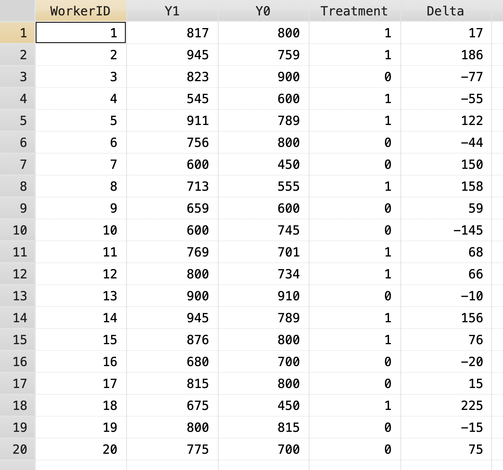
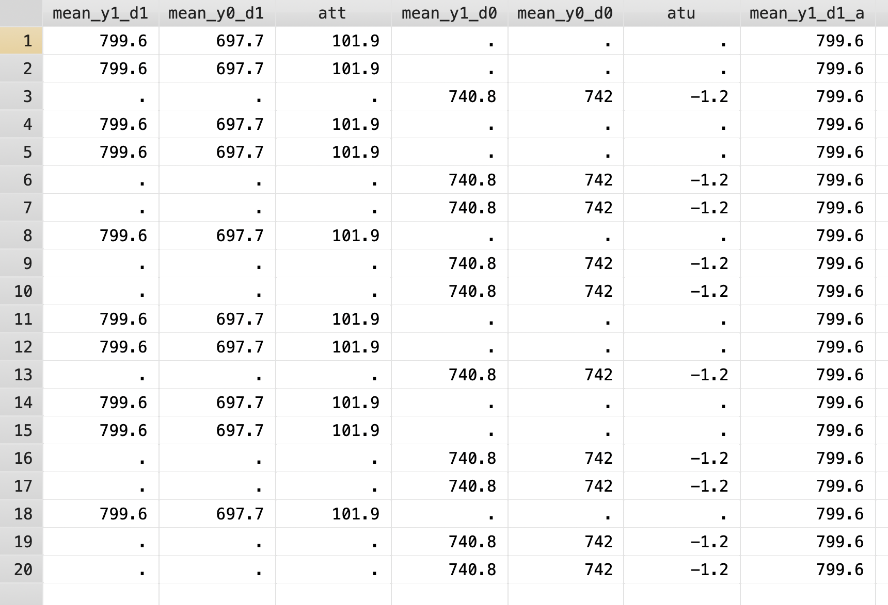
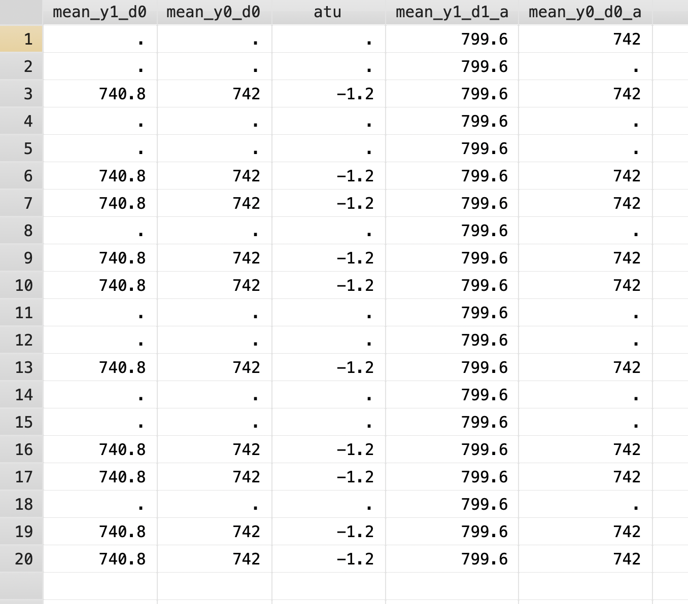
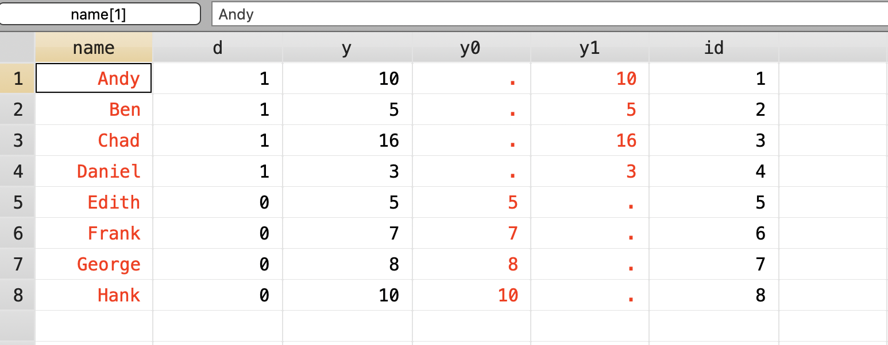
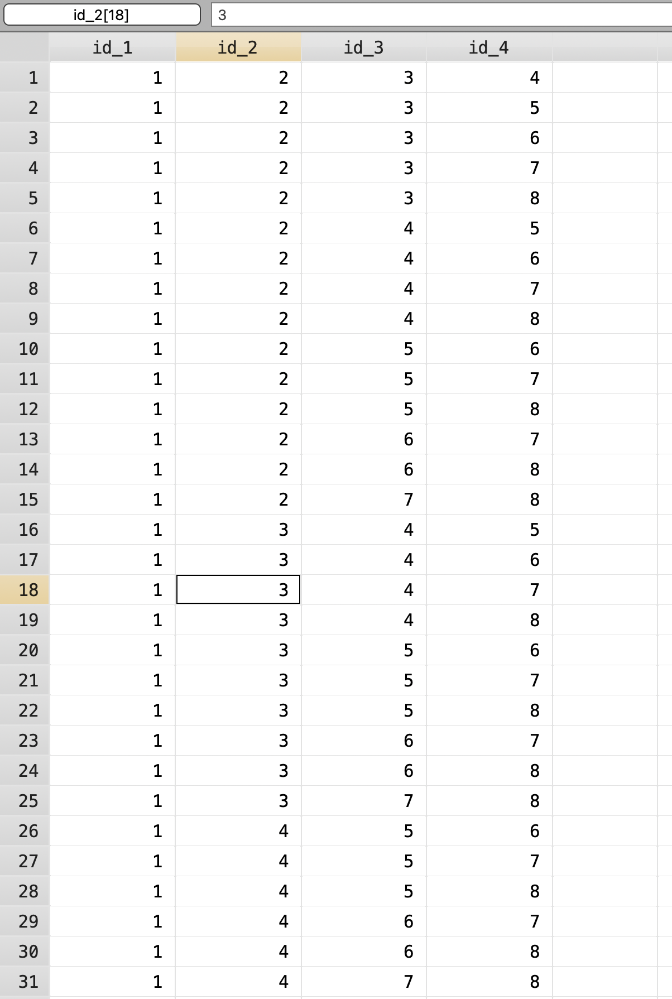
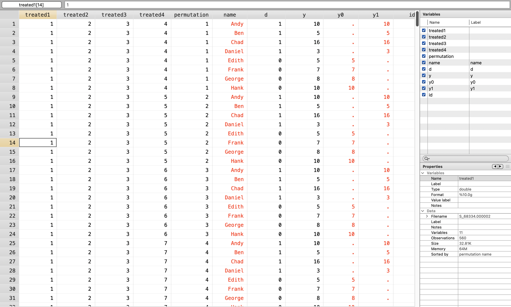
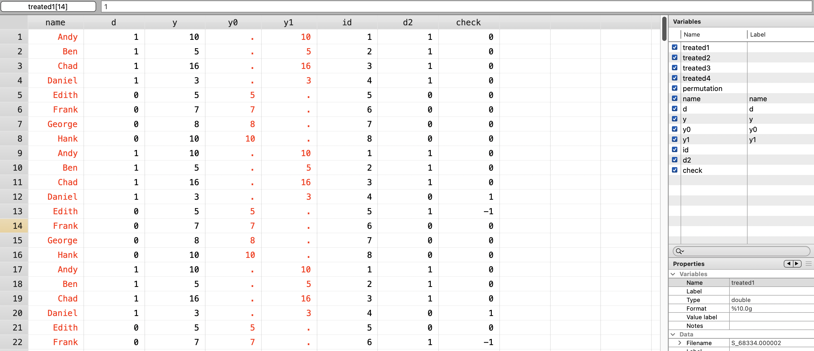
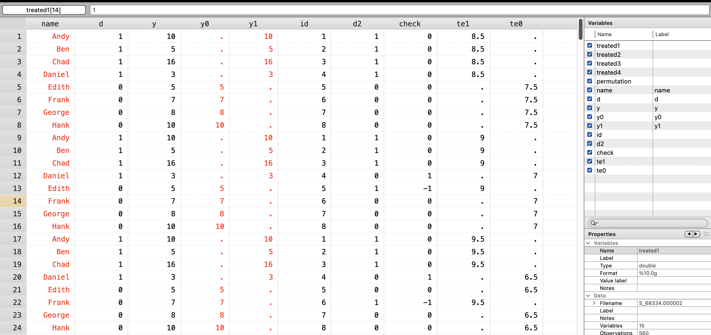
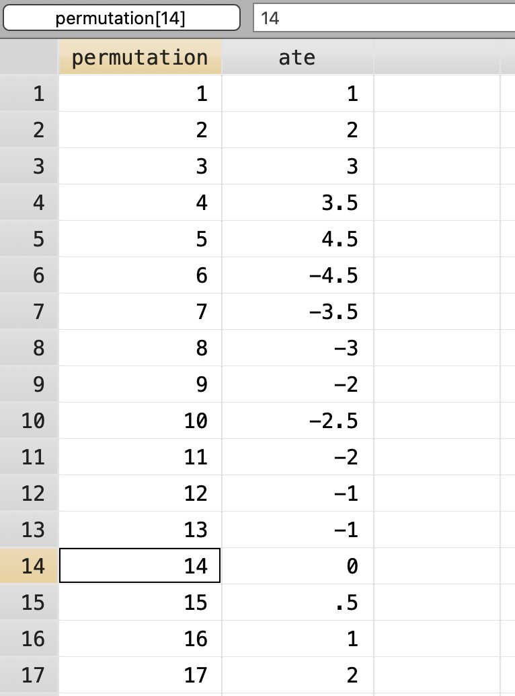
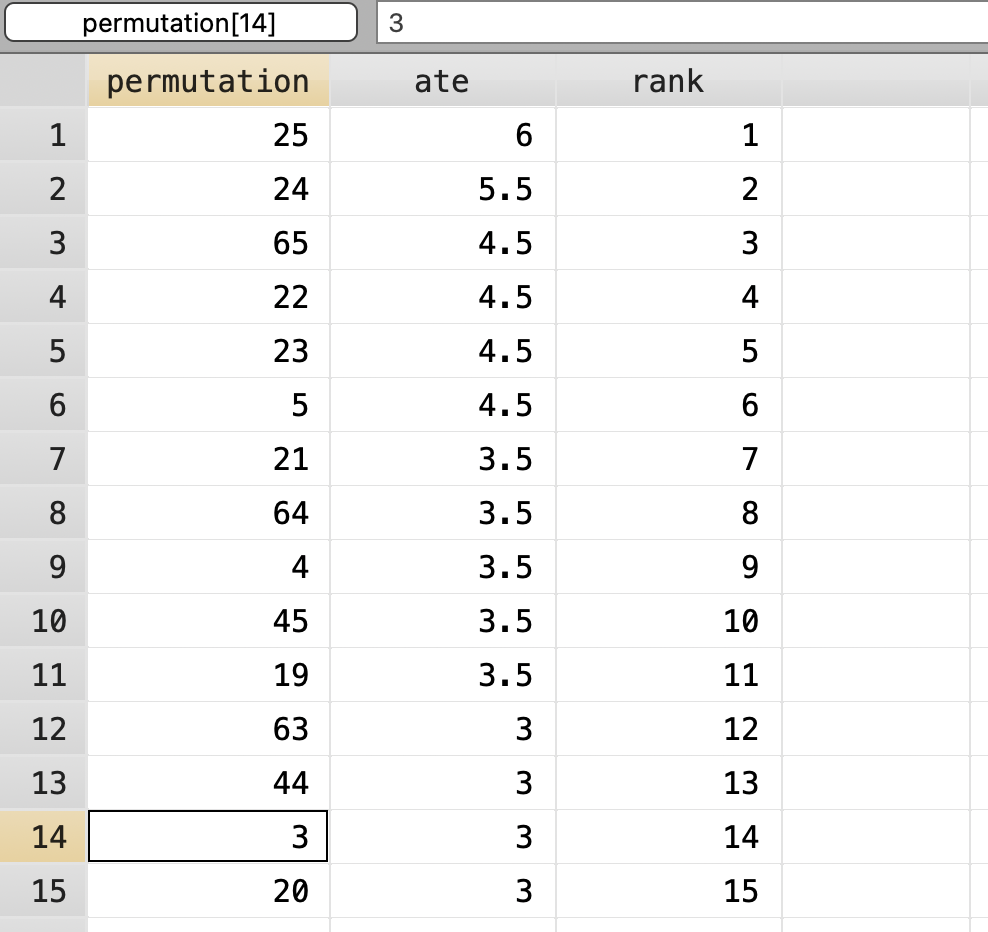

# Potential Outcomes and Calculating Treatment Effects

We will use a hypothetical example to show average treatment effects \( (ATE) \), average treatment effects on the treated \( (ATET) \), and the average treatment effects on the untreated \( (ATEU) \). We have potential outcomes of wages for workers for both \( Y^1 \) and \( Y^0 \). In real life we only realize one outcome, but we will do this for pedagogical purposes. 

```{stata cte1, eval=FALSE}
clear
set more off
cd "/Users/Sam/Desktop/Econ 672/Data"
use potential_outcomes_example, clear
```



The \( ATEU \) is -1.2.

## Calculate the ATE

First we will calculate the average treatment effects \( (ATE) \). We can calculate individual treatment effects under this hypothetical example and find the average treatment effects. What we calculate is \( ATE=E[Y^1]-E[Y^0] \)

We will find the mean for \( Y^1 \) and the mean for \( Y^0 \), and then subtract \( \mu_1 \) from \( \mu_0 \).

```{stata cte2, eval=FALSE}
egen mean_y1 = mean(Y1)
egen mean_y0 = mean(Y0)
gen ate = mean_y1 - mean_y0


list ate mean_y1 mean_y0 in 1/1
```

```{stata cte2_1, echo=FALSE}
quietly {
clear
set more off
cd "/Users/Sam/Desktop/Econ 672/Data"
use potential_outcomes_example, clear 
}
egen mean_y1 = mean(Y1)
egen mean_y0 = mean(Y0)
gen ate = mean_y1 - mean_y0


list ate mean_y1 mean_y0 in 1/1
```

We estimate the average treatment effect to be 50.35.

## Calculate the ATET

Next, we can calculate the average treatment effect on the treated \( (ATET) \). We will subset only for those who actually received treatment. What we are calculating is \( ATET=E[Y^1|D=1]-E[Y^0|D=0] \). 

```{stata cte3, eval=FALSE}
egen mean_y1_d1 = mean(Y1) if Treatment == 1
egen mean_y0_d1 = mean(Y0) if Treatment == 1
gen att = mean_y1_d1 - mean_y0_d1

list att mean_y1_d1 mean_y0_d1 in 1/1
```

```{stata cte3_1, echo=FALSE}
quietly {
clear
set more off
cd "/Users/Sam/Desktop/Econ 672/Data"
use potential_outcomes_example, clear 
}
egen mean_y1_d1 = mean(Y1) if Treatment == 1
egen mean_y0_d1 = mean(Y0) if Treatment == 1
gen att = mean_y1_d1 - mean_y0_d1

list att mean_y1_d1 mean_y0_d1 in 1/1
```

Our \( ATET \) is 101.9.

## Calculate the ATEU

Finally, we will estimate the average treatment effect on the untreated \( (ATEU) \). We will subset for those who did not receive treatment. We are calculating \( ATEU=E[Y^1|D=0]-E[Y^0|D=0] \). In real life, we do not know \( E[Y^1|D=0] \)

```{stata cte4, eval=FALSE}
egen mean_y1_d0 = mean(Y1) if Treatment == 0
egen mean_y0_d0 = mean(Y0) if Treatment == 0
gen atu = mean_y1_d0 - mean_y0_d0

list atu mean_y1_d0 mean_y0_d0 in 3
```

```{stata cte4_1, echo=FALSE}
quietly {
clear
set more off
cd "/Users/Sam/Desktop/Econ 672/Data"
use potential_outcomes_example, clear 
}
egen mean_y1_d0 = mean(Y1) if Treatment == 0
egen mean_y0_d0 = mean(Y0) if Treatment == 0
gen atu = mean_y1_d0 - mean_y0_d0

list atu mean_y1_d0 mean_y0_d0 in 3
```

The \( ATEU \) is -1.6

## Calculate the SDO
We need to compare \( E[Y^1|D=1] \) and \( E[Y^0|D=0] \) to calculate the simple difference in outcomes. Since we have already calculated \( E[Y^1|D=1] \) and \( E[Y^0|D=0] \), we will just fill in the blanks with some Stata data managment. 

First, we will set up a duplicate column for \( E[Y^1|D=1] \). Since we have a value for \( E[Y^1|D=1] \), we can push the value forward with *[_n-1]* or the prior value of the observation.  
```{stata cte5, eval=FALSE}
gen mean_y1_d1_a = mean_y1_d1
replace mean_y1_d1_a = mean_y1_d1_a[_n-1] if missing(mean_y1_d1_a)
```



Next, we will set up a duplicate column for \( E[Y^0|D=0] \). Since we do not have a value for \( E[Y^0|D=0] \) in the first observation, we will need to add another line of code. We have \( E[Y^0|D=0] \) in the last value, so we can use [_N] to get that observation and copy it to the first observation. Next, we will push the values forward similar to the prior example.

```{stata cte6, eval=FALSE}
gen mean_y0_d0_a = mean_y0_d0

replace mean_y0_d0_a = mean_y0_d0_a[_N] if missing(mean_y0_d0_a[1])
replace mean_y0_d0_a = mean_y0_d0_a[_n-1] if missing(mean_y0_d0_a)
```



Finally, we can calculate the simple difference in outcomes \( (SDO) \).

```{stata cte7, eval=FALSE}
gen sdo = .
replace sdo = mean_y1_d1_a - mean_y0_d0_a
list ate sdo if _n ==1
```

```{stata cte7_1, echo=FALSE}
quietly {
cd "/Users/Sam/Desktop/Econ 672/Data"

clear
set more off
use potential_outcomes_example, clear

egen mean_y1 = mean(Y1)
egen mean_y0 = mean(Y0)
gen ate = mean_y1 - mean_y0

list ate mean_y1 mean_y0 in 1/1

egen mean_y1_d1 = mean(Y1) if Treatment == 1
egen mean_y0_d1 = mean(Y0) if Treatment == 1
gen att = mean_y1_d1 - mean_y0_d1

list att mean_y1_d1 mean_y0_d1 in 1/1

egen mean_y1_d0 = mean(Y1) if Treatment == 0
egen mean_y0_d0 = mean(Y0) if Treatment == 0
gen atu = mean_y1_d0 - mean_y0_d0

list atu mean_y1_d0 mean_y0_d0 in 3

gen mean_y1_d1_a = mean_y1_d1
replace mean_y1_d1_a = mean_y1_d1_a[_n-1] if missing(mean_y1_d1_a)

gen mean_y0_d0_a = mean_y0_d0
replace mean_y0_d0_a = mean_y0_d0_a[_N] if missing(mean_y0_d0_a[1])
replace mean_y0_d0_a = mean_y0_d0_a[_n-1] if missing(mean_y0_d0_a)

}
gen sdo = .
replace sdo = mean_y1_d1_a - mean_y0_d0_a
list ate sdo if _n ==1
```

The \( SDO \) is upwards biased by 6.25 dollars in this hypothetical example.

# Experimental Research Design

We can estimate the \( ATE \) using experimental research designs. If the experiments were well-designed and well-implemented experiments, then we can use the *ttest* command to calculate the simple difference in outcomes or \( SDO \)

## Job Corps (2001) Evaluation

The Deparment of Labor wanted an evaluation of the Job Corps program. The Job Corps program serves disadvantaged youth to improve employment outcomes. Individuals were randomly assigned to Job Corps or out of Job Corps due to limited slots.

### Inspect the Data

Let's inspect our outcome variable and treatment variable
```{stata job1, eval=FALSE}
cd "/Users/Sam/Desktop/Econ 672/Data"
use JC, clear

describe earny4
describe assignment

sum earny4
tab assignment

```

```{stata job1_1, echo=FALSE}
cd "/Users/Sam/Desktop/Econ 672/Data"
use JC, clear
quietly {
label variable assignment "Random assignment to Job Corps"
label define assignment1 0 "Randomly assigned out of Job Corps" 1 "Randomly assigned to Job Corps"
label values assignment assignment1

label variable earny4 "Earnings 4 years after assignment"
}
describe earny4
describe assignment

sum earny4, detail
tab assignment
```

Our outcome variable shows that the median earnings is $181.71, while the mean is $207.62. 

Our treatment variable has 5,577 assigned to treatment and 3,663 assigned to the control group.

### Estimate the impact

We can estimate the simple differnce in outcomes with the *ttest* command.
```{stata job2, eval=FALSE}
ttest earny4, by(assignment)
```

```{stata job2_1, echo=FALSE}
quietly {
cd "/Users/Sam/Desktop/Econ 672/Data"
use JC, clear

label variable assignment "Random assignment to Job Corps"
label define assignment1 0 "Randomly assigned out of Job Corps" 1 "Randomly assigned to Job Corps"
label values assignment assignment1

label variable earny4 "Earnings 4 years after assignment"
}
ttest earny4, by(assignment)
```

Next, let's run an OLS regression with and without robust standard errors
```{stata job3, eval=FALSE}
reg earny4 i.assignment
reg earny4 i.assignment, robust
```

```{stata job3_1, echo=FALSE}
quietly {
cd "/Users/Sam/Desktop/Econ 672/Data"
use JC, clear

label variable assignment "Random assignment to Job Corps"
label define assignment1 0 "Randomly assigned out of Job Corps" 1 "Randomly assigned to Job Corps"
label values assignment assignment1

label variable earny4 "Earnings 4 years after assignment"
}
reg earny4 i.assignment
reg earny4 i.assignment, robust
```

We see simple difference in outcomes is about 16 dollars higher, which is what we see in the Schochet, P. Z., Burghardt, J., Glazerman, S. (2001): "National Job Corps study: The impacts of Job Corps on participants' employment and related outcomes", Mathematica Policy Research, Washington, DC.

### Covariate Balance Test and Specification Tests

Next, let's test the is there are any covariates associated with the treatment after randomization

```{stata job4, eval=FALSE}

ttest age, by(assignment)
ttest educ, by(assignment)
ttest educmum, by(assignment)
ttest educdad, by(assignment)
```

```{stata job4_1, echo=FALSE}
quietly {
cd "/Users/Sam/Desktop/Econ 672/Data"
use JC, clear

label variable assignment "Random assignment to Job Corps"
label define assignment1 0 "Randomly assigned out of Job Corps" 1 "Randomly assigned to Job Corps"
label values assignment assignment1

label variable earny4 "Earnings 4 years after assignment"
}
ttest age, by(assignment)
ttest educ, by(assignment)
ttest educmum, by(assignment)
ttest educdad, by(assignment)
```

We fail to reject the null hypothesis that there are differences between treatment and control among the covariates of age, education attained, mother's education, and father's education.

```{stata job5, eval=FALSE}
tab black assignment, chi2
tab female assignment, chi2
tab hispanic assignment, chi2
tab cohabmarried assignment, chi2
tab haschild assignment, chi2
```

```{stata job5_1, echo=FALSE}
quietly {
cd "/Users/Sam/Desktop/Econ 672/Data"
use JC, clear

label variable assignment "Random assignment to Job Corps"
label define assignment1 0 "Randomly assigned out of Job Corps" 1 "Randomly assigned to Job Corps"
label values assignment assignment1

label variable earny4 "Earnings 4 years after assignment"

label variable black "Individual is Black or African American"
label define black1 0 "Non-Black" 1 "Black"
label values black black1

label variable female "Individual is female"
label define female1 0 "Male" 1 "Female"
label values female female1

label variable hispanic "Individual is Latino/Hispanic"
label define hispanic1 0 "Non-Latino" 1 "Latino/Hispanic"
label values hispanic hispanic1

label variable cohabmarried "Individual is Married or Cohabiting at assignment"
label define cohab1 0 "Not Married or cohabiting" 1 "Married or Cohabiting"
label values cohabmarried cohab1

label variable haschild "Individual has child or children at assignment"
label define haschild1 0 "No chilren" 1 "Has at least one child"
label values haschild haschild1

label variable everwkd "Individual has ever worked at assignment"
label define everwkd1 0 "Never worked" 1 "Has worked"
label values everwkd everwkd1

}
tab black assignment, chi2
tab female assignment, chi2
tab hispanic assignment, chi2
tab cohabmarried assignment, chi2
tab haschild assignment, chi2
tab everwkd assignment, chi2
```

We see that we fail to reject the null hypothesis that there is a difference between treatment and control for individuals for Black, Latino/Hispanic, Married/Cohabiting, and Ever Worked. However, we reject the null hypothesis that there is no difference between treatment and control for being female or having any children. 

Should we be concerned? Yes! 

Let's do a sensitivity tests. The first model will be the simple difference, while the second model will include the covariates we rejected the null hypothesis. The third model will include all covariates.

While there is some concern for a lack of covariate balance, the full data set utilizes weights which we do not have in the public use data.

*What happens to the standard errors
```{stata job6, eval=FALSE}
est clear
eststo m1: quietly reg earny4 i.assignment
eststo m2: quietly reg earny4 i.assignment i.female i.haschild
eststo m3: quietly reg earny4 i.assignment i.female i.black i.hispanic i.cohabmarried i.haschild i.everwkd age educ educmum educdad

esttab m1 m2 m3, mtitle("Model 1" "Model 2" "Model 3") keep(1.assignment)
```

```{stata job6_1, echo=FALSE}
quietly {
cd "/Users/Sam/Desktop/Econ 672/Data"
use JC, clear

label variable assignment "Random assignment to Job Corps"
label define assignment1 0 "Randomly assigned out of Job Corps" 1 "Randomly assigned to Job Corps"
label values assignment assignment1

label variable earny4 "Earnings 4 years after assignment"

label variable black "Individual is Black or African American"
label define black1 0 "Non-Black" 1 "Black"
label values black black1

label variable female "Individual is female"
label define female1 0 "Male" 1 "Female"
label values female female1

label variable hispanic "Individual is Latino/Hispanic"
label define hispanic1 0 "Non-Latino" 1 "Latino/Hispanic"
label values hispanic hispanic1

label variable cohabmarried "Individual is Married or Cohabiting at assignment"
label define cohab1 0 "Not Married or cohabiting" 1 "Married or Cohabiting"
label values cohabmarried cohab1

label variable haschild "Individual has child or children at assignment"
label define haschild1 0 "No chilren" 1 "Has at least one child"
label values haschild haschild1

label variable everwkd "Individual has ever worked at assignment"
label define everwkd1 0 "Never worked" 1 "Has worked"
label values everwkd everwkd1

}
est clear
eststo m1: quietly reg earny4 i.assignment
eststo m2: quietly reg earny4 i.assignment i.female i.haschild
eststo m3: quietly reg earny4 i.assignment i.female i.black i.hispanic i.cohabmarried i.haschild i.everwkd age educ educmum educdad, robust

esttab m1 m2 m3, mtitle("Model 1" "Model 2" "Model 3") keep(1.assignment)
```

We see that our ATE increase estimates range from 16 dollars to 21 dollars.

## Leaftlet Information Evaluation

Next we will look at an impact evaluation of an information leaflet about coffee production on students' awareness. The target population is Bulgarian high school and high school students and the outcome is the awareness of environmental issues due to coffee production.

### Inspect the Data

Let's inspect the data by running some descriptive statistics. Our dependent variable is awarewaste, while treatment is a leaflet treatment is randomly assigned to students.

```{stata lie1, eval=FALSE}
cd "/Users/Sam/Desktop/Econ 672/Data"
use CoffeeLeaflet, clear

tab awarewaste
tab treatment
```

```{stata lie1_1, echo=FALSE}
cd "/Users/Sam/Desktop/Econ 672/Data"
use CoffeeLeaflet, clear

label variable awarewaste "Awareness of waste production due to coffee production"
label define awarewaste1 1 "Not Aware" 2 "Slightly Not Aware" 3 "Neither"4 "Slightly Aware" 5 "Fully Aware"
label values awarewaste awarewaste1

label variable treatment "Treatment Status"
label define treatment1 0 "Control Group" 1 "Leaflet Treatment Group"
label values treatment treatment1

tab awarewaste
tab treatment
```

### Estimate the impact

Let's run the simple difference in outcomes with *ttest* command.

```{stata lie2, eval=FALSE}
ttest awarewaste, by(treatment)
```

```{stata lie2_1, echo=FALSE}
quietly {
cd "/Users/Sam/Desktop/Econ 672/Data"
use CoffeeLeaflet, clear

label variable awarewaste "Awareness of waste production due to coffee production"
label define awarewaste1 1 "Not Aware" 2 "Slightly Not Aware" 3 "Neither"4 "Slightly Aware" 5 "Fully Aware"
label values awarewaste awarewaste1

label variable treatment "Treatment Status"
label define treatment1 0 "Control Group" 1 "Leaflet Treatment Group"
label values treatment treatment1
}
ttest awarewaste, by(treatment)
```

We reject the null hypothesis that the leaflet treatment had no impact, and it increases awareness by 0.28. 

Let's run an OLS regression.
```{stata lie3, eval=FALSE}
reg awarewaste i.treatment
```

```{stata lie3_1, echo=FALSE}
quietly {
cd "/Users/Sam/Desktop/Econ 672/Data"
use CoffeeLeaflet, clear

label variable awarewaste "Awareness of waste production due to coffee production"
label define awarewaste1 1 "Not Aware" 2 "Slightly Not Aware" 3 "Neither"4 "Slightly Aware" 5 "Fully Aware"
label values awarewaste awarewaste1

label variable treatment "Treatment Status"
label define treatment1 0 "Control Group" 1 "Leaflet Treatment Group"
label values treatment treatment1
}
reg awarewaste i.treatment
```

Wait a second! What does 0.28 mean? What is a potential problem here?

Look at the outcome variable again. It is an ordinal variable! Let's use a \( \chi^2 \) test
```{stata lie4, eval=FALSE}
tab awarewaste treatment, chi2
```

```{stata lie4_1, echo=FALSE}
quietly {
cd "/Users/Sam/Desktop/Econ 672/Data"
use CoffeeLeaflet, clear

label variable awarewaste "Awareness of waste production due to coffee production"
label define awarewaste1 1 "Not Aware" 2 "Slightly Not Aware" 3 "Neither"4 "Slightly Aware" 5 "Fully Aware"
label values awarewaste awarewaste1

label variable treatment "Treatment Status"
label define treatment1 0 "Control Group" 1 "Leaflet Treatment Group"
label values treatment treatment1

}
tab awarewaste treatment, chi2
```

Let's run an ordinal logit regression.
```{stata lie5, eval=FALSE}
ologit awarewaste i.treatment, or
```

```{stata lie5_1, echo=FALSE}
quietly {
cd "/Users/Sam/Desktop/Econ 672/Data"
use CoffeeLeaflet, clear

label variable awarewaste "Awareness of waste production due to coffee production"
label define awarewaste1 1 "Not Aware" 2 "Slightly Not Aware" 3 "Neither"4 "Slightly Aware" 5 "Fully Aware"
label values awarewaste awarewaste1

label variable treatment "Treatment Status"
label define treatment1 0 "Control Group" 1 "Leaflet Treatment Group"
label values treatment treatment1

}
ologit awarewaste i.treatment
```

Individuals who received treatment were 1.46 times more likely to be aware of the effect of coffee production on environmental issues than those in the control group.

### Covariate Balance Test

Let's test covariate balance
```{stata lie6, eval=FALSE}
foreach v of varlist sex mumedu dadedu bulgnationality drinkcoffee citysofia {
  tab awarewaste `v', chi2
}
```

```{stata lie6_1, echo=FALSE}
quietly {
cd "/Users/Sam/Desktop/Econ 672/Data"
use CoffeeLeaflet, clear

label variable awarewaste "Awareness of waste production due to coffee production"
label define awarewaste1 1 "Not Aware" 2 "Slightly Not Aware" 3 "Neither"4 "Slightly Aware" 5 "Fully Aware"
label values awarewaste awarewaste1

label variable treatment "Treatment Status"
label define treatment1 0 "Control Group" 1 "Leaflet Treatment Group"
label values treatment treatment1
}
foreach v of varlist sex mumedu dadedu bulgnationality drinkcoffee citysofia {
  tab awarewaste `v', chi2
}
```

From our covariate balance test, we have a slight concern for imbalance in sex. However, all other characteristics were no correlated with treatment status.

```{stata lie7, eval=FALSE}
est clear
quietly {
eststo m1: ologit awarewaste i.treatment, or
eststo m2: ologit awarewaste i.treatment i.mumedu i.sex, or
eststo m3: ologit awarewaste i.treatment i.drinkcoffee i.sex i.mumedu i.dadedu i.bulgnationality i.citysofia, or
}

esttab m1 m2 m3, mtitle("Model 1" "Model 2" "Model 3") keep(1.treatment)
```

```{stata lie7_1, echo=FALSE}
quietly {
cd "/Users/Sam/Desktop/Econ 672/Data"
use CoffeeLeaflet, clear

label variable awarewaste "Awareness of waste production due to coffee production"
label define awarewaste1 1 "Not Aware" 2 "Slightly Not Aware" 3 "Neither"4 "Slightly Aware" 5 "Fully Aware"
label values awarewaste awarewaste1

label variable treatment "Treatment Status"
label define treatment1 0 "Control Group" 1 "Leaflet Treatment Group"
label values treatment treatment1
}

est clear
quietly {
eststo m1: ologit awarewaste i.treatment, or
eststo m2: ologit awarewaste i.treatment i.mumedu i.sex, or
eststo m3: ologit awarewaste i.treatment i.drinkcoffee i.sex i.mumedu i.dadedu i.bulgnationality i.citysofia, or
}

esttab m1 m2 m3, mtitle("Model 1" "Model 2" "Model 3") keep(1.treatment)
```

Our estimates range from an odd ratio of 1.46 to 1.58. Notice that as we add covariates, our sample size is dropping, which means not all observations provided characteristic information.

# Randomized Inference
Adapted from Cunningham (2021)

We will use a placebo-based test to calculate exact p-values. We need every single permutation of treatment to calculate the exact p-values from the ATE.

## Set up the Dataset
First we will set the seed so we can replicate our randomized results
```{stata ri1,eval=FALSE}
set seed 1234
```

Next we will bring in our 
```{stata ri2, eval=FALSE}
cd "/Users/Sam/Desktop/Econ 672/Data"
use ri.dta, clear
tempfile ri
gen id = _n
save "`ri'", replace
```


Next we will create all combinations from our eight observations. We will need to install the *percom* package into stata.

```{stata ri3, eval=FALSE}
ssc install percom
```

Out of 8 observations, we get 70 permutations.
We can use the *combin* command  to get these permutations. From the *help combin*, the *combin* command generates \( k \) unique combinations from a set of \( n \) objects, where \( k \) is not greater than \( 5 (2 =< k <= 5) \).
Program first arranges \( k \) possible permutations and then retains unique combinations. It supports both string and numeric variables.
                                                
combination: \( \frac{n!}{k!(n-k)!} \)

We will tell the *combin* command that we want 4 combinations from our 8 observations.
```{stata ri4, eval=FALSE}
combin id, k(4)
```

```{stata ri4_1, echo=FALSE}
quietly {
cd "/Users/Sam/Desktop/Econ 672/Data"
use ri.dta, clear
tempfile ri
gen id = _n
}
combin id, k(4)
```


Next we will label the permutations 1 to 70.
```{stata ri5, eval=FALSE}
gen permutation = _n
tempfile combo
save "`combo'", replace

forvalue i =1/4 {
	rename id_`i' treated`i'
}
```

Next we will merge our permutations with our dataset of potential outcomes
```{stata ri6, eval=FALSE}
destring treated*, replace
cross using `ri'
```



## Randomize Assignment to Treatment

Next we will randomized treatment and calculate other test statistics.

First, we create a fake treatment variable \( d2 \)
```{stata ri7, eval=FALSE}
gen d2 = .
replace d2 = 1 if id == treated1 | id == treated2 | id == treated3 | id == treated4
replace d2 = 0 if ~(id == treated1 | id == treated2 | id == treated3 | id == treated4)
gen check = d - d2
```



Next, we will calculate true effect using absolute value of simple difference in outcomes \( (SDO) \).
```{stata ri8, eval=FALSE}
egen te1 = mean(y) if d2==1, by(permutation)
egen te0 = mean(y) if d2==0, by(permutation)
```



## Calculate the exact p-value

Get average treatment effects \( (ATE) \)
```{stata ri9, eval=FALSE}
collapse (mean) te1 te0, by(permutation)
gen 	ate = te1 - te0
keep 	ate permutation
```



Next, we rank the permutations
```{stata ri10, eval=FALSE}
gsort -ate
gen rank = _n
sum rank if permutation==1
```



Finally, we calculate Exact \( p \)-value
```{stata ri11, eval=FALSE}
gen pvalue = (`r(mean)'/70)
list pvalue if permutation==1
```

```{stata r11_1, echo=FALSE}
quietly {

clear 
cd "/Users/Sam/Desktop/Econ 672/Data"

set seed 1234

*Get Data from Github
use ri.dta, clear

tempfile ri
gen id = _n
save "`ri'", replace

* Create all combinations 
* ssc install percom

*Out of 8 observations, we get 70 permutations
combin id, k(4)
*ID count of permutations
gen permutation = _n
tempfile combo
save "`combo'", replace

forvalue i =1/4 {
	rename id_`i' treated`i'
}
*

destring treated*, replace
cross using `ri'
*Your first permutation is the one of interest
sort permutation name
*Randomize the treatment assignment and calculate other test statistics
gen d2 = .
replace d2 = 1 if id == treated1 | id == treated2 | id == treated3 | id == treated4
replace d2 = 0 if ~(id == treated1 | id == treated2 | id == treated3 | id == treated4)
gen check = d - d2

* Calculate true effect using absolute value of SDO
egen te1 = mean(y) if d2==1, by(permutation)
egen te0 = mean(y) if d2==0, by(permutation)

*Get ATE
collapse (mean) te1 te0, by(permutation)
gen 	ate = te1 - te0
keep 	ate permutation

*Rank Permutations
gsort -ate
gen rank = _n
sum rank if permutation==1
}
gen pvalue = (`r(mean)'/70)
list pvalue if permutation==1
```

