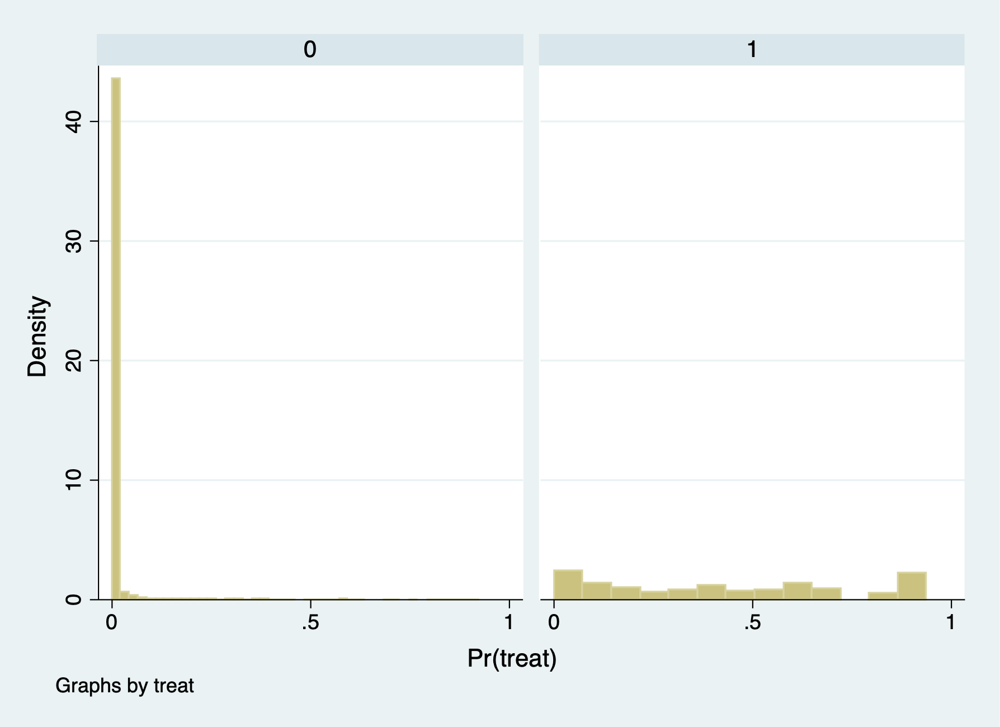
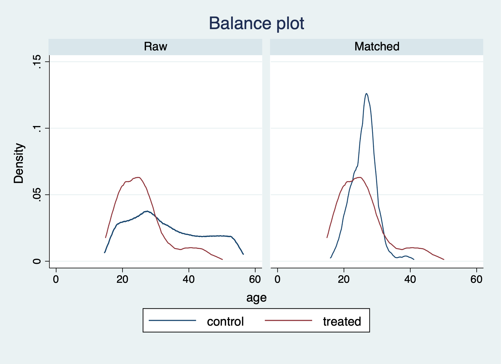
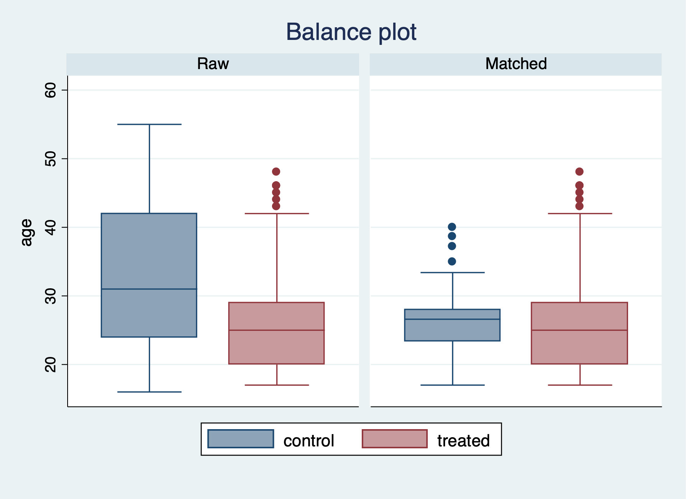
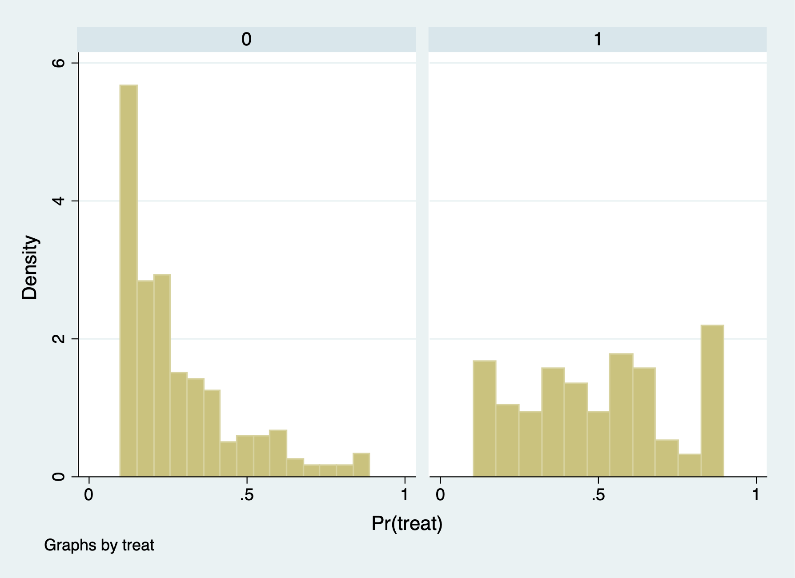
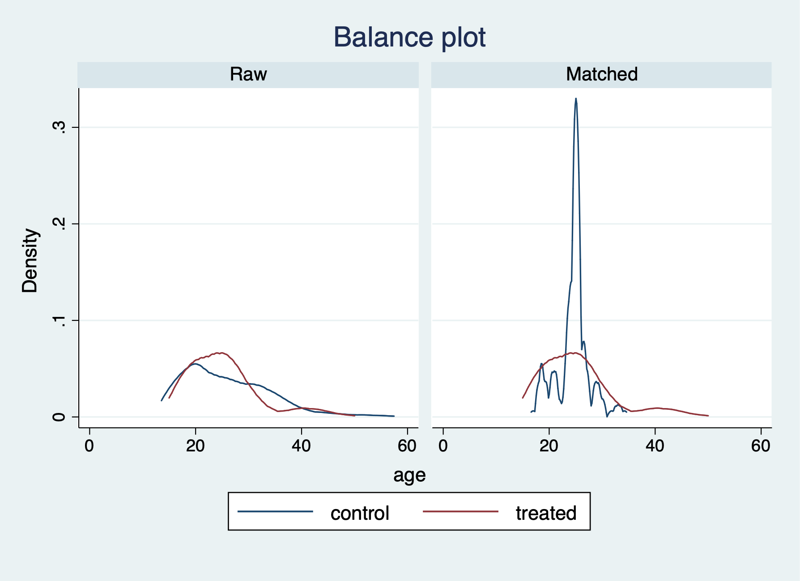
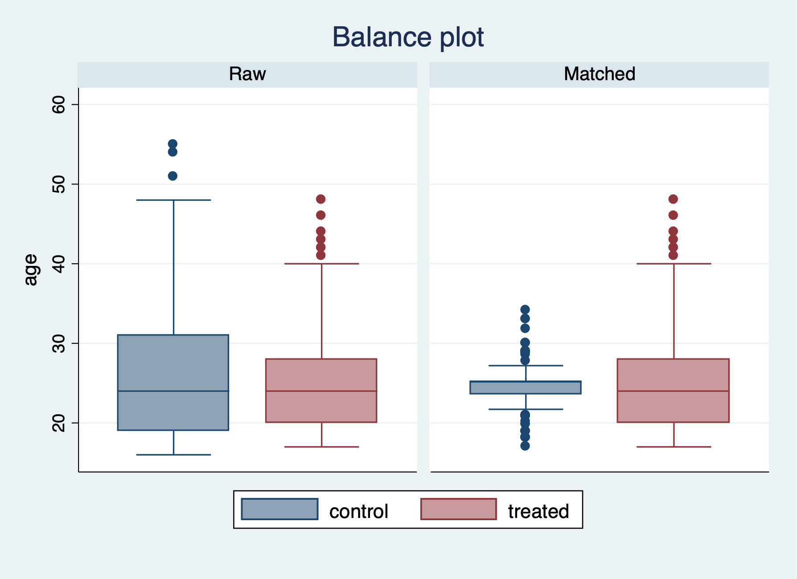

# Propensity Score Matching

We will go through the process of manually estimating propensity scores before we use the *teffects* commands. After estimating the propensity scores, we will estimate the \( ATE \) and \( ATT \)

We will use the data from Dehejia and Wahba (2002) for treatment from Department of Labor Employment and Training Adminstration (ETA) job training. Instead of using the control group from the orgininal RCT, we will use data from the Current Population Survey (CPS) for a comparison group.

## Generate propensity score

First, we will import and drop the experimental control group, so we can append our comparison group from the CPS.

```{stata psm1, eval=FALSE}
use https://github.com/scunning1975/mixtape/raw/master/nsw_mixtape.dta, clear
drop if treat==0
```

Now merge in the CPS controls from footnote 2 of Table 2 (Dehejia and Wahba 2002)
```{stata psm2, eval=FALSE}
append using https://github.com/scunning1975/mixtape/raw/master/cps_mixtape.dta
```

Now we will generate additional variables of interest: age, education, demographics, and unemployment status

```{stata psm3, eval=FALSE}
gen agesq=age*age
gen agecube=age*age*age
gen edusq=educ*edu
gen u74 = 0 if re74!=.
replace u74 = 1 if re74==0
gen u75 = 0 if re75!=.
replace u75 = 1 if re75==0
gen interaction1 = educ*re74
gen re74sq=re74^2
gen re75sq=re75^2
gen interaction2 = u74*hisp
```

Next, we will use logistic regression to estimate \( \beta \) and estimate the \( p \)-scores. 

```{stata psm4, eval=FALSE}
logit treat age agesq agecube educ edusq marr nodegree black hisp re74 re75 u74 u75 interaction1 
predict pscore
```

```{stata psm4_1, echo=FALSE}
quietly {
cd "/Users/Sam/Desktop/Econ 672/Data"
use nsw_mixtape.dta, clear
drop if treat==0
append using cps_mixtape.dta

gen agesq=age*age
gen agecube=age*age*age
gen edusq=educ*edu
gen u74 = 0 if re74!=.
replace u74 = 1 if re74==0
gen u75 = 0 if re75!=.
replace u75 = 1 if re75==0
gen interaction1 = educ*re74
gen re74sq=re74^2
gen re75sq=re75^2
gen interaction2 = u74*hisp
}
logit treat age agesq agecube educ edusq marr nodegree black hisp re74 re75 u74 u75 interaction1 
predict pscore
```
Now, we will compare the propensity score between treatment and comparison groups with summary statistics and histograms. 

```{stata psm5, eval=FALSE}
sum pscore if treat==1, detail
sum pscore if treat==0, detail
```

```{stata psm5_1, echo=FALSE}
quietly {
cd "/Users/Sam/Desktop/Econ 672/Data"
use nsw_mixtape.dta, clear
drop if treat==0
append using cps_mixtape.dta

gen agesq=age*age
gen agecube=age*age*age
gen edusq=educ*edu
gen u74 = 0 if re74!=.
replace u74 = 1 if re74==0
gen u75 = 0 if re75!=.
replace u75 = 1 if re75==0
gen interaction1 = educ*re74
gen re74sq=re74^2
gen re75sq=re75^2
gen interaction2 = u74*hisp
logit treat age agesq agecube educ edusq marr nodegree black hisp re74 re75 u74 u75 interaction1 
predict pscore
}
sum pscore if treat==1, detail
sum pscore if treat==0, detail
```

The comparison group has a mean propensity score of 0.01.
The treatment group has a mean propensity score is 0.42

```{stata psm6, eval=FALSE}
histogram pscore, by(treat) binrescale
```

It seems that there is very little overlap for the common support assumption. It would be problematic to estimate the \( ATE \) and \( ATT \) without trimming to get common support.

## Estimate the \( ATE \) and \( ATT \) without trimming

We will estimate the \( ATE \) and \( ATT \) with the *teffects psmatch* command. We will use the 5 nearest neighbors with the option *nn(5)*. Note that Stata generates new variables defined by you. Here we are defining *pstub_cps*.

Estimate \(ATT\)
```{stata psm7, eval=FALSE}
teffects psmatch (re78) (treat age agesq agecube educ edusq marr nodegree black ///
 hisp re74 re75 u74 u75 interaction1, logit), atet gen(pstub_cps) nn(5)
drop pstub_cps*
```

```{stata psm7_1, echo=FALSE}
quietly {
cd "/Users/Sam/Desktop/Econ 672/Data"
use nsw_mixtape.dta, clear
drop if treat==0
append using cps_mixtape.dta

gen agesq=age*age
gen agecube=age*age*age
gen edusq=educ*edu
gen u74 = 0 if re74!=.
replace u74 = 1 if re74==0
gen u75 = 0 if re75!=.
replace u75 = 1 if re75==0
gen interaction1 = educ*re74
gen re74sq=re74^2
gen re75sq=re75^2
gen interaction2 = u74*hisp
logit treat age agesq agecube educ edusq marr nodegree black hisp re74 re75 u74 u75 interaction1 
predict pscore
}
teffects psmatch (re78) (treat age agesq agecube educ edusq marr nodegree black ///
 hisp re74 re75 u74 u75 interaction1, logit), atet gen(pstub_cps) nn(5)
drop pstub_cps*
```

\( \widehat{ATT} = \$1,725.082 \)

We have a few more options for checking the balance after the PSM with nearest neighbor of 5. We can use the *teblance* commands to check our balance. *tebalance density* will give us a distribution of propensity scores by our variable of choice between treatment and comparison. We can also use *tebalance box* that will give is a box-and-whisker chart for the propensity scores by our variable of choice between treatment and comparison.

```{stata psm8, eval=FALSE}
tebalance summarize, baseline
```

```{stata psm8_1, echo=FALSE}
quietly {
cd "/Users/Sam/Desktop/Econ 672/Data"
use nsw_mixtape.dta, clear
drop if treat==0
append using cps_mixtape.dta

gen agesq=age*age
gen agecube=age*age*age
gen edusq=educ*edu
gen u74 = 0 if re74!=.
replace u74 = 1 if re74==0
gen u75 = 0 if re75!=.
replace u75 = 1 if re75==0
gen interaction1 = educ*re74
gen re74sq=re74^2
gen re75sq=re75^2
gen interaction2 = u74*hisp
logit treat age agesq agecube educ edusq marr nodegree black hisp re74 re75 u74 u75 interaction1 
predict pscore

teffects psmatch (re78) (treat age agesq agecube educ edusq marr nodegree black ///
 hisp re74 re75 u74 u75 interaction1, logit), atet gen(pstub_cps) nn(5)
}
tebalance summarize, baseline

```

After running *tebalance summarize*, we can see without trimming that our covariates are not really balanced between treatment and comparison groups. 

```{stata psm8_2, eval=FALSE}
tebalance density age
```



```{stata psm8_3, eval=FALSE}
tebalance box age
drop pstub_cps* 
```



Next, we will estimate the \(ATE\) with *teffects psmatch*.

```{stata psm9, eval=FALSE}
teffects psmatch (re78) (treat age agesq agecube educ edusq marr nodegree black ///
 hisp re74 re75 u74 u75 interaction1, logit), ate gen(pstub_cps) nn(5)

drop pstub_cps*
```

We find that we have an error estimating the \( ATE \), since we lack common support. 


## Trim the data

We will use the trim the \( p \)-scores. All values below \( 10\% \) and above \( 90\% \) will be dropped.

```{stata psm10, eval=FALSE}
drop if pscore <= 0.1 
drop if pscore >= 0.9
```

We can see that the comparison group has a lot of observations with \(p\)-scores less than or equal to 0.1 (15,802), but we only drop 14 observations with \(p\)-scores greater than or equal 0.9.

```{stata psm10_1, echo=FALSE}
quietly {
cd "/Users/Sam/Desktop/Econ 672/Data"
use nsw_mixtape.dta, clear
drop if treat==0
append using cps_mixtape.dta
  
gen agesq=age*age
gen agecube=age*age*age
gen edusq=educ*edu
gen u74 = 0 if re74!=.
replace u74 = 1 if re74==0
gen u75 = 0 if re75!=.
replace u75 = 1 if re75==0
gen interaction1 = educ*re74
gen re74sq=re74^2
gen re75sq=re75^2
gen interaction2 = u74*hisp
logit treat age agesq agecube educ edusq marr nodegree black hisp re74 re75 u74 u75 interaction1 
predict pscore
}
drop if pscore <= 0.1 
drop if pscore >= 0.9
```

## Check for balance again
```{stata psm11, eval=FALSE}
histogram pscore, by(treat) binrescale
graph export "pscore2.png", replace
```


We can now see we have better overlap between treatment and comparison after trimming the extreme values of the \(p\)-scores.

## Reestimate the \( ATT \) and \( ATE \)

```{stata psm12, eval=FALSE}
teffects psmatch (re78) (treat age agesq agecube educ edusq marr nodegree black ///
 hisp re74 re75 u74 u75 interaction1, logit), ate gen(pstub_cps) nn(5)

drop pstub_cps*
```

```{stata psm12_1, echo=FALSE}
quietly {
cd "/Users/Sam/Desktop/Econ 672/Data"
use nsw_mixtape.dta, clear
drop if treat==0
append using cps_mixtape.dta
gen agesq=age*age
gen agecube=age*age*age
gen edusq=educ*edu
gen u74 = 0 if re74!=.
replace u74 = 1 if re74==0
gen u75 = 0 if re75!=.
replace u75 = 1 if re75==0
gen interaction1 = educ*re74
gen re74sq=re74^2
gen re75sq=re75^2
gen interaction2 = u74*hisp
logit treat age agesq agecube educ edusq marr nodegree black hisp re74 re75 u74 u75 interaction1 
predict pscore
drop if pscore <= 0.1 
drop if pscore >= 0.9
}
teffects psmatch (re78) (treat age agesq agecube educ edusq marr nodegree black ///
 hisp re74 re75 u74 u75 interaction1, logit), ate gen(pstub_cps) nn(5)

drop pstub_cps*
```


\( \widehat{ATE}= \$1758.84 \)

```{stata psm13, eval=FALSE}
teffects psmatch (re78) (treat age agesq agecube educ edusq marr nodegree black ///
 hisp re74 re75 u74 u75 interaction1, logit), atet gen(pstub_cps) nn(5)

```

```{stata psm13_1, echo=FALSE}
quietly {
cd "/Users/Sam/Desktop/Econ 672/Data"
use nsw_mixtape.dta, clear
drop if treat==0
append using cps_mixtape.dta
gen agesq=age*age
gen agecube=age*age*age
gen edusq=educ*edu
gen u74 = 0 if re74!=.
replace u74 = 1 if re74==0
gen u75 = 0 if re75!=.
replace u75 = 1 if re75==0
gen interaction1 = educ*re74
gen re74sq=re74^2
gen re75sq=re75^2
gen interaction2 = u74*hisp
logit treat age agesq agecube educ edusq marr nodegree black hisp re74 re75 u74 u75 interaction1 
predict pscore
drop if pscore <= 0.1 
drop if pscore >= 0.9
}
teffects psmatch (re78) (treat age agesq agecube educ edusq marr nodegree black ///
 hisp re74 re75 u74 u75 interaction1, logit), atet gen(pstub_cps) nn(5)

```

\( \widehat{ATE}= \$2519.446 \)

## Recheck for balance 

```{stata psm14, eval=FALSE}
tebalance summarize, baseline
```

```{stata psm14_1, echo=FALSE}
quietly {
cd "/Users/Sam/Desktop/Econ 672/Data"
use nsw_mixtape.dta, clear
drop if treat==0
append using cps_mixtape.dta
gen agesq=age*age
gen agecube=age*age*age
gen edusq=educ*edu
gen u74 = 0 if re74!=.
replace u74 = 1 if re74==0
gen u75 = 0 if re75!=.
replace u75 = 1 if re75==0
gen interaction1 = educ*re74
gen re74sq=re74^2
gen re75sq=re75^2
gen interaction2 = u74*hisp
logit treat age agesq agecube educ edusq marr nodegree black hisp re74 re75 u74 u75 interaction1 
predict pscore
drop if pscore <= 0.1 
drop if pscore >= 0.9
teffects psmatch (re78) (treat age agesq agecube educ edusq marr nodegree black ///
 hisp re74 re75 u74 u75 interaction1, logit), atet gen(pstub_cps) nn(5)
}
tebalance summarize, baseline
```

Our balance is greatly improved after trimming the tail ends of the propensity scores.

Let's check the variable age with *tebalance density* and *tebalance box*.

```{stata psm15, eval=FALSE}
tebalance density age
```




```{stata psm16, eval=FALSE}
tebalance box age
```



# Inverse Probability Weights

We will reload our treatment group and CPS comparison group, and use the *teffects ipw* command to estimate the \( ATE \).

We will repull our data, estimate our \(p\)-score, and check our balance

```{stata ipw1, eval=FALSE}
*Get Data
use https://github.com/scunning1975/mixtape/raw/master/nsw_mixtape.dta, clear
drop if treat==0
append using https://github.com/scunning1975/mixtape/raw/master/cps_mixtape.dta

*Calculate Variables
gen agesq=age*age
gen agecube=age*age*age
gen edusq=educ*edu
gen u74 = 0 if re74!=.
replace u74 = 1 if re74==0
gen u75 = 0 if re75!=.
replace u75 = 1 if re75==0
gen interaction1 = educ*re74
gen re74sq=re74^2
gen re75sq=re75^2
gen interaction2 = u74*hisp

*Estimate the coefficients
logit treat age agesq agecube educ edusq marr nodegree black hisp re74 re75 u74 u75 interaction1 
predict pscore

* Checking mean propensity scores for treatment and control groups
sum pscore if treat==1, detail
sum pscore if treat==0, detail

* Now look at the propensity score distribution for treatment and control groups
histogram pscore, by(treat) binrescale
```


## Manual Calculate the \(ATE\)

We will manually calculate inverse probability weighting (IPW) with Propensity Scores. Please note that IPW is not matching, even though we use propensity scores. 

**IPW with Non-normalized Weights:**
$$ \widehat{ATE} = \frac{1}{n}*\sum_{n=1}^{N} \left( {\frac{Y_i*D_i}{\hat{p}(x)_i}} \right)-\frac{1}{n}*\sum_{n=1}^{N} \left( {\frac{Y_i*(1-D_i)}{1-\hat{p}(x)_i}} \right) $$

**IPW with Normalized Weights:**

$$ \widehat{ATE}=\left[\sum_{n=1}^{N}\frac{Y_i*D_i}{\hat{p}(x)_i} \right] / \left[\sum_{n=1}^{N}\frac{D_i}{\hat{p}(x)_i} \right] - \left[\sum_{n=1}^{N}\frac{Y_i*(1-D_i)}{(1-\hat{p}(x)_i)} \right] / \left[\sum_{n=1}^{N}\frac{(1-D_i)}{(1-\hat{p}(x)_i)} \right] $$

### Calculate \(E[Y^1] \) and \(E[Y^0] \)

First, we need to calculate normalization weights
```{stata ipw2, eval=FALSE}
gen d1=treat/pscore
gen d0=(1-treat)/(1-pscore)
```

Sum the inverse pscore
```{stata ipw3, eval=FALSE}
egen s1=sum(d1)
egen s0=sum(d0) 
gen total = _N
egen total_T = sum(treat)
egen total_C = sum(1-treat)
```

First, we will manually calculate \(E[Y^1]\) with non-normalized weights using all the data. Calculate \(E[Y^1]=\frac{1}{n}*\sum_{n=1}^{N}\frac{Y_i*D_i}{\hat{p}(x)_i} \)
```{stata ipw4, eval=FALSE}
gen y1=treat*re78/pscore
egen y1_2 = sum(y1)
gen y1_3 = y1_2/total
```

Next, we will manually calculate \(E[Y^0]\) with non-normalized weights using all the data. Calculate \(E[Y^0]=\frac{1}{n}*\sum_{n=1}^{N}\frac{Y*(1-D_i)}{(1-\hat{p}(x)_i)} \)
```{stata ipw5, eval=FALSE}
gen y0=(1-treat)*re78/(1-pscore) 
egen y0_2 = sum(y0)
gen y0_3 = y0_2/total
```

Then calculate the \(ATE\) by taking the difference in \(E[Y^1]-E[Y^0]\).
```{stata ipw6, eval=FALSE}
*Way 1
gen ht=y1-y0
*Way 2
gen ht2=y1_3-y0_3
*Same results
sum ht ht2
```

```{stata ipw6_1, echo=FALSE}
quietly {
cd "/Users/Sam/Desktop/Econ 672/Data"
use nsw_mixtape.dta, clear
drop if treat==0
append using cps_mixtape.dta

*Calculate Variables
gen agesq=age*age
gen agecube=age*age*age
gen edusq=educ*edu
gen u74 = 0 if re74!=.
replace u74 = 1 if re74==0
gen u75 = 0 if re75!=.
replace u75 = 1 if re75==0
gen interaction1 = educ*re74
gen re74sq=re74^2
gen re75sq=re75^2
gen interaction2 = u74*hisp

*Estimate the coefficients
logit treat age agesq agecube educ edusq marr nodegree black hisp re74 re75 u74 u75 interaction1 
predict pscore

* Checking mean propensity scores for treatment and control groups
sum pscore if treat==1, detail
sum pscore if treat==0, detail

*weights
gen d1=treat/pscore
gen d0=(1-treat)/(1-pscore)

*inverse p-scores
egen s1=sum(d1)
egen s0=sum(d0) 
gen total = _N
egen total_T = sum(treat)
egen total_C = sum(1-treat)

*Calculate E[Y1]
gen y1=treat*re78/pscore
egen y1_2 = sum(y1)
gen y1_3 = y1_2/total

*Calculate E[Y0]
gen y0=(1-treat)*re78/(1-pscore) 
egen y0_2 = sum(y0)
gen y0_3 = y0_2/total

*Way 1
gen ht=y1-y0
*Way 2
gen ht2=y1_3-y0_3
*Same results
}
sum ht ht2
```


Now we will calculate the \(ATE\) manually using normalized weights
```{stata ipw7, eval=FALSE}
*Way 1
replace y1=(treat*re78/pscore)/(s1/total)
replace y0=((1-treat)*re78/(1-pscore))/(s0/total)
*Way 2
replace y1_3=y1_2/s1
replace y0_3=y0_2/s0
*Get the estimated ATE
gen norm=y1-y0
gen norm2=y1_3-y0_3
*Same Results for ht:ht2 and norm:norm2
sum ht ht2 norm norm2
```

```{stata ipw7_1, echo=FALSE}
quietly {
cd "/Users/Sam/Desktop/Econ 672/Data"
use nsw_mixtape.dta, clear
drop if treat==0
append using cps_mixtape.dta

*Calculate Variables
gen agesq=age*age
gen agecube=age*age*age
gen edusq=educ*edu
gen u74 = 0 if re74!=.
replace u74 = 1 if re74==0
gen u75 = 0 if re75!=.
replace u75 = 1 if re75==0
gen interaction1 = educ*re74
gen re74sq=re74^2
gen re75sq=re75^2
gen interaction2 = u74*hisp

*Estimate the coefficients
logit treat age agesq agecube educ edusq marr nodegree black hisp re74 re75 u74 u75 interaction1 
predict pscore

* Checking mean propensity scores for treatment and control groups
sum pscore if treat==1, detail
sum pscore if treat==0, detail

*weights
gen d1=treat/pscore
gen d0=(1-treat)/(1-pscore)

*inverse p-scores
egen s1=sum(d1)
egen s0=sum(d0) 
gen total = _N
egen total_T = sum(treat)
egen total_C = sum(1-treat)

*Calculate E[Y1]
gen y1=treat*re78/pscore
egen y1_2 = sum(y1)
gen y1_3 = y1_2/total

*Calculate E[Y0]
gen y0=(1-treat)*re78/(1-pscore) 
egen y0_2 = sum(y0)
gen y0_3 = y0_2/total

*Way 1
gen ht=y1-y0
*Way 2
gen ht2=y1_3-y0_3
*Same results
}
*Way 1
replace y1=(treat*re78/pscore)/(s1/total)
replace y0=((1-treat)*re78/(1-pscore))/(s0/total)
*Way 2
replace y1_3=y1_2/s1
replace y0_3=y0_2/s0
*Get the estimated ATE
gen norm=y1-y0
gen norm2=y1_3-y0_3
*Same Results for ht:ht2 and norm:norm2
sum ht ht2 norm norm2
```

ATE under non-normalized weights is -$11,876.
ATE under normalized weights is -$7,238.

Why are they so much different than the experimental research design estimates? Given that the mean \(1-p(x)\) is close to 1, a lot of weight is given to \(Y^0\). What we need to do is trim and recalculate.

### Trim the data

We will drop our calculated variables and then trim our \(p\)-scores.
```{stata ipw8, eval=FALSE}
drop d1 d0 s1 s0 y1 y0 ht norm
drop if pscore <= 0.1 
drop if pscore >= 0.9
```

We will recalculate the non-normalized weights using trimmed data.
```{stata ipw9, eval=FALSE}
gen d1=treat/pscore
gen d0=(1-treat)/(1-pscore)
egen s1=sum(d1)
egen s0=sum(d0)

gen y1=treat*re78/pscore
gen y0=(1-treat)*re78/(1-pscore)
gen ht=y1-y0
```

We will recalculate the normalized weights using trimmed data.
```{stata ipw10, eval=FALSE}
replace y1=(treat*re78/pscore)/(s1/_N)
replace y0=((1-treat)*re78/(1-pscore))/(s0/_N)
gen norm=y1-y0
sum ht norm
```

```{stata ipw10_1, echo=FALSE}
quietly {
  
*Load data
cd "/Users/Sam/Desktop/Econ 672/Data"
use nsw_mixtape.dta, clear
drop if treat==0
append using cps_mixtape.dta

*Calculate Variables
gen agesq=age*age
gen agecube=age*age*age
gen edusq=educ*edu
gen u74 = 0 if re74!=.
replace u74 = 1 if re74==0
gen u75 = 0 if re75!=.
replace u75 = 1 if re75==0
gen interaction1 = educ*re74
gen re74sq=re74^2
gen re75sq=re75^2
gen interaction2 = u74*hisp

*Estimate the coefficients
logit treat age agesq agecube educ edusq marr nodegree black hisp re74 re75 u74 u75 interaction1 
predict pscore
  
*Trim pscores
drop if pscore <= 0.1 
drop if pscore >= 0.9
  
*Calculate Weights and Calculate E[Y1] and E[Y0]
gen d1=treat/pscore
gen d0=(1-treat)/(1-pscore)
egen s1=sum(d1)
egen s0=sum(d0)

gen y1=treat*re78/pscore
gen y0=(1-treat)*re78/(1-pscore)
gen ht=y1-y0
  
*Normalized Weights
replace y1=(treat*re78/pscore)/(s1/_N)
replace y0=((1-treat)*re78/(1-pscore))/(s0/_N)
gen norm=y1-y0

}
replace y1=(treat*re78/pscore)/(s1/_N)
replace y0=((1-treat)*re78/(1-pscore))/(s0/_N)
replace norm=y1-y0
sum ht norm
```

ATE under non-normalized weights is $2,006, while the estimated ATE under normalized weights is $1,807.

These are much closer to our experimental research design estimates.

## Calculate \(ATE\) and \(ATT\) using *teffects*

Luckily, we have a built-in Stata command with *teffects ipw*, so we don't need to manually calculate the \(ATE\) everytime. (However, it is a good exercise to see how Stata calculate the estimate). The *teffects* command will also calculate our standard errors, as well. 

We will reload our data, trim the data, and use the *teffects ipw* command. We will also trim our data, since we know that there is a lack of overlap at the tail ends of the estimated \(p\)-scores.

```{stata ipw11, eval=FALSE}
* Reload Data
use https://github.com/scunning1975/mixtape/raw/master/nsw_mixtape.dta, clear
drop if treat==0

*Now merge in the CPS controls from footnote 2 of Table 2 (Dehejia and Wahba 2002)
append using https://github.com/scunning1975/mixtape/raw/master/cps_mixtape.dta
gen agesq=age*age
gen agecube=age*age*age
gen edusq=educ*edu
gen u74 = 0 if re74!=.
replace u74 = 1 if re74==0
gen u75 = 0 if re75!=.
replace u75 = 1 if re75==0
gen interaction1 = educ*re74
gen re74sq=re74^2
gen re75sq=re75^2
gen interaction2 = u74*hisp

* Now estimate the propensity score
logit treat age agesq agecube educ edusq marr nodegree black hisp re74 re75 u74 u75 interaction1 
predict pscore

* Checking mean propensity scores for treatment and control groups
sum pscore if treat==1, detail
sum pscore if treat==0, detail

* Trimming the propensity score
drop if pscore <= 0.1 
drop if pscore >= 0.9
```

With the *teffects* command, we need to specify *ipw* for inverse probability weights and we need to use the option *logit* to tell Stata to calculate the \(p\)-scores using a logistic regresion. In addition, we will use the option *osample* to look for any overlap between treatment and comparison. Finally, we will use the option *atet* to specify that we want to estimate the \(ATT\).

```{stata ipw12, eval=FALSE}
teffects ipw (re78) (treat age agesq agecube educ edusq marr nodegree ///
black hisp re74 re75 u74 u75 interaction1, logit), osample(overlap) atet
capture drop overlap
```

```{stata ipw12_1, echo=FALSE}
quietly {
* Reload Data
use https://github.com/scunning1975/mixtape/raw/master/nsw_mixtape.dta, clear
drop if treat==0

*Now merge in the CPS controls from footnote 2 of Table 2 (Dehejia and Wahba 2002)
append using https://github.com/scunning1975/mixtape/raw/master/cps_mixtape.dta
gen agesq=age*age
gen agecube=age*age*age
gen edusq=educ*edu
gen u74 = 0 if re74!=.
replace u74 = 1 if re74==0
gen u75 = 0 if re75!=.
replace u75 = 1 if re75==0
gen interaction1 = educ*re74
gen re74sq=re74^2
gen re75sq=re75^2
gen interaction2 = u74*hisp

* Now estimate the propensity score
logit treat age agesq agecube educ edusq marr nodegree black hisp re74 re75 u74 u75 interaction1 
predict pscore

* Checking mean propensity scores for treatment and control groups
sum pscore if treat==1, detail
sum pscore if treat==0, detail

* Trimming the propensity score
drop if pscore <= 0.1 
drop if pscore >= 0.9
}
teffects ipw (re78) (treat age agesq agecube educ edusq marr nodegree ///
black hisp re74 re75 u74 u75 interaction1, logit), osample(overlap) atet
capture drop overlap
```

The ATT is estimated at $2,647 

Before we calculate the \(ATE\), we need to rescale the dependent variable for concavity of logit. We will do so by dividing re78 by 1000 dollars

The ATE is estimated at $1,611

```{stata ipw13, eval=FALSE}
gen re78_scaled = re78/1000
teffects ipw (re78_scaled) (treat age agesq agecube educ edusq marr nodegree ///
black hisp re74 re75 u74 u75 interaction1, logit), osample(overlap) ate
```

```{stata ipw13_1, echo=FALSE}
quietly {
* Reload Data
use https://github.com/scunning1975/mixtape/raw/master/nsw_mixtape.dta, clear
drop if treat==0

*Now merge in the CPS controls from footnote 2 of Table 2 (Dehejia and Wahba 2002)
append using https://github.com/scunning1975/mixtape/raw/master/cps_mixtape.dta
gen agesq=age*age
gen agecube=age*age*age
gen edusq=educ*edu
gen u74 = 0 if re74!=.
replace u74 = 1 if re74==0
gen u75 = 0 if re75!=.
replace u75 = 1 if re75==0
gen interaction1 = educ*re74
gen re74sq=re74^2
gen re75sq=re75^2
gen interaction2 = u74*hisp

* Now estimate the propensity score
logit treat age agesq agecube educ edusq marr nodegree black hisp re74 re75 u74 u75 interaction1 
predict pscore

* Checking mean propensity scores for treatment and control groups
sum pscore if treat==1, detail
sum pscore if treat==0, detail

* Trimming the propensity score
drop if pscore <= 0.1 
drop if pscore >= 0.9
}

*Rescale the dependent variable for concavity of the logistic regression.
gen re78_scaled = re78/1000
teffects ipw (re78_scaled) (treat age agesq agecube educ edusq marr nodegree ///
black hisp re74 re75 u74 u75 interaction1, logit), osample(overlap) ate
```

# Doubly Robust Estimator

Next we will implement our doubly robust estimator. We are combining our regression adjusted outcome model and our IPW using \(p\)-scores. We have two chances to get the correct specification with the doubly robust estimator.

$$ ATE_{DR} = \left[ E[Y^1]-E[Y^0]\right]+E\left[\frac{(Y-E[Y^1])*D}{p(x)}-\frac{(Y-E[Y^0])(1-D)}{(1-p(x))} \right] $$

The left-hand side is our OLS-based model and the right-hand side is our Inverse Probability Weighted Model. If we specified the OLS model correctly, our second term equals zero.

First, we will reload our data and do the trimming.

```{stata dre1, eval=FALSE}
* Reload Data
use https://github.com/scunning1975/mixtape/raw/master/nsw_mixtape.dta, clear
drop if treat==0

*Now merge in the CPS controls from footnote 2 of Table 2 (Dehejia and Wahba 2002)
append using https://github.com/scunning1975/mixtape/raw/master/cps_mixtape.dta
gen agesq=age*age
gen agecube=age*age*age
gen edusq=educ*edu
gen u74 = 0 if re74!=.
replace u74 = 1 if re74==0
gen u75 = 0 if re75!=.
replace u75 = 1 if re75==0
gen interaction1 = educ*re74
gen re74sq=re74^2
gen re75sq=re75^2
gen interaction2 = u74*hisp

* Now estimate the propensity score
logit treat age agesq agecube educ edusq marr nodegree black hisp re74 re75 u74 u75 interaction1 
predict pscore

* Checking mean propensity scores for treatment and control groups
sum pscore if treat==1, detail
sum pscore if treat==0, detail

* Trimming the propensity score
drop if pscore <= 0.1 
drop if pscore >= 0.9
```

## Calculate the \(ATE\) and \(ATT\) using Doubly Robust Estimator

Our Doubly Robust Estimator using teffects includes *teffects ipwra (OUTCOME MODEL) (TREATMENT MODEL)* In the first set of paratheses, we will use the variables to estimate the regression adjustment model or outcome model. In the second set of paratheses we will estimate the treatment model or the model for to estimate our \(p\)-scores.

Next, we will calculate the \(ATT\). Note: We have to rescale for the concavity of the logit.
```{stata dre2, eval=FALSE}
gen re78_scaled = re78/1000

teffects ipwra (re78_scaled age agesq agecube educ edusq ///
marr nodegree black hisp re74 re75 u74 u75 interaction1) (treat age agesq agecube educ edusq marr nodegree ///
black hisp u74 u75 interaction1, logit), atet
```

```{stata dre2_1, echo=FALSE}
quietly{
* Reload Data
use https://github.com/scunning1975/mixtape/raw/master/nsw_mixtape.dta, clear
drop if treat==0

*Now merge in the CPS controls from footnote 2 of Table 2 (Dehejia and Wahba 2002)
append using https://github.com/scunning1975/mixtape/raw/master/cps_mixtape.dta
gen agesq=age*age
gen agecube=age*age*age
gen edusq=educ*edu
gen u74 = 0 if re74!=.
replace u74 = 1 if re74==0
gen u75 = 0 if re75!=.
replace u75 = 1 if re75==0
gen interaction1 = educ*re74
gen re74sq=re74^2
gen re75sq=re75^2
gen interaction2 = u74*hisp

* Now estimate the propensity score
logit treat age agesq agecube educ edusq marr nodegree black hisp re74 re75 u74 u75 interaction1 
predict pscore

* Checking mean propensity scores for treatment and control groups
sum pscore if treat==1, detail
sum pscore if treat==0, detail

* Trimming the propensity score
drop if pscore <= 0.1 
drop if pscore >= 0.9
}
gen re78_scaled = re78/1000

teffects ipwra (re78_scaled age agesq agecube educ edusq ///
marr nodegree black hisp re74 re75 u74 u75 interaction1) (treat age agesq agecube educ edusq marr nodegree ///
black hisp u74 u75 interaction1, logit), atet
```

We find that our estimate \(ATT\) is $2,566.

Next we will estimate the \(ATE\), and we use the option *ate* to specify that we want to estimate the \(ATE\).

```{stata dre3, eval=FALSE}
teffects ipwra (re78_scaled age agesq agecube educ edusq ///
marr nodegree black hisp re74 re75 u74 u75 interaction1) (treat age agesq agecube educ edusq marr nodegree ///
black hisp u74 u75 interaction1, logit), ate
```

```{stata dre3_1, echo=FALSE}
quietly{
* Reload Data
use https://github.com/scunning1975/mixtape/raw/master/nsw_mixtape.dta, clear
drop if treat==0

*Now merge in the CPS controls from footnote 2 of Table 2 (Dehejia and Wahba 2002)
append using https://github.com/scunning1975/mixtape/raw/master/cps_mixtape.dta
gen agesq=age*age
gen agecube=age*age*age
gen edusq=educ*edu
gen u74 = 0 if re74!=.
replace u74 = 1 if re74==0
gen u75 = 0 if re75!=.
replace u75 = 1 if re75==0
gen interaction1 = educ*re74
gen re74sq=re74^2
gen re75sq=re75^2
gen interaction2 = u74*hisp

* Now estimate the propensity score
logit treat age agesq agecube educ edusq marr nodegree black hisp re74 re75 u74 u75 interaction1 
predict pscore

* Checking mean propensity scores for treatment and control groups
sum pscore if treat==1, detail
sum pscore if treat==0, detail

* Trimming the propensity score
drop if pscore <= 0.1 
drop if pscore >= 0.9
gen re78_scaled = re78/1000
}
teffects ipwra (re78_scaled age agesq agecube educ edusq ///
marr nodegree black hisp re74 re75 u74 u75 interaction1) (treat age agesq agecube educ edusq marr nodegree ///
black hisp u74 u75 interaction1, logit), ate
```

We find that our estimate \(ATE\) is $1,609.

