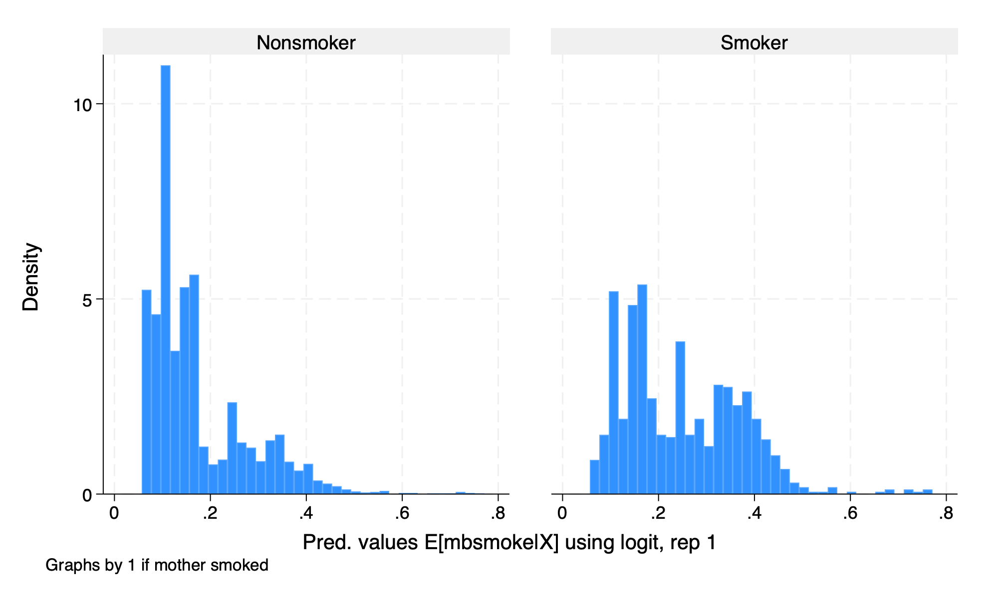
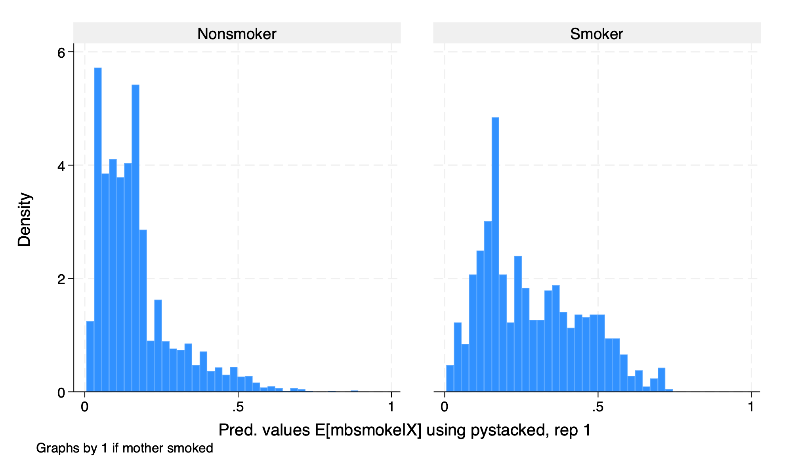
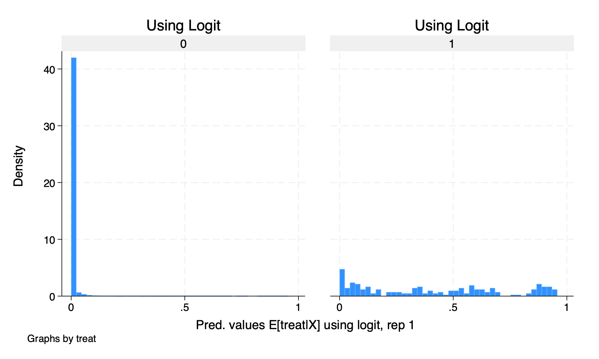
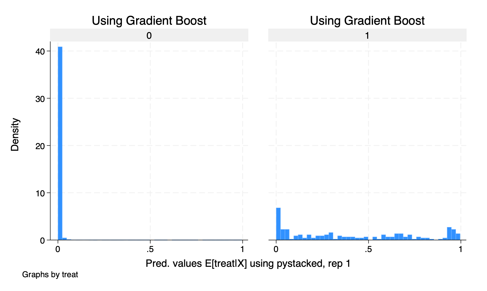
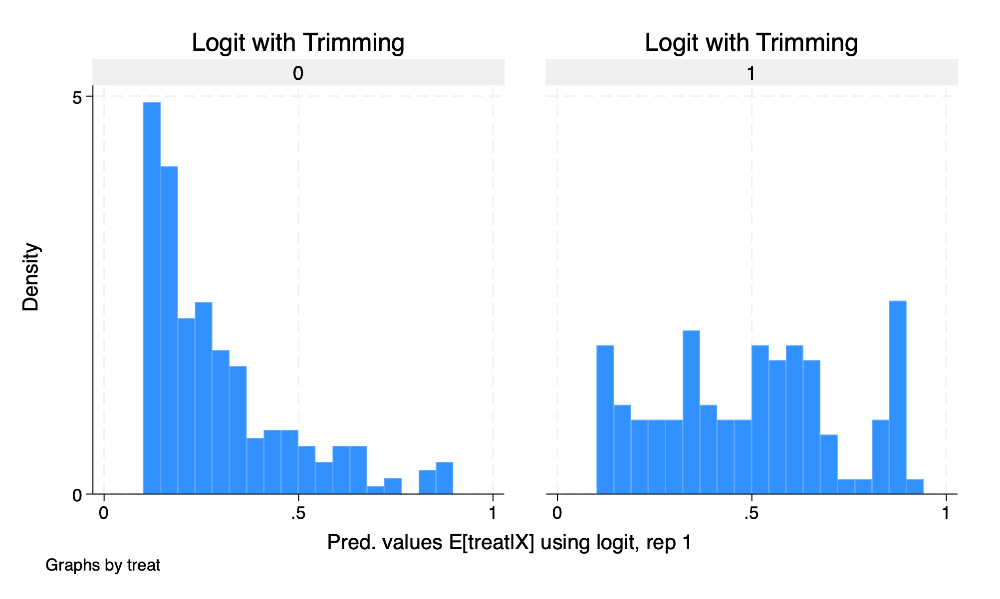
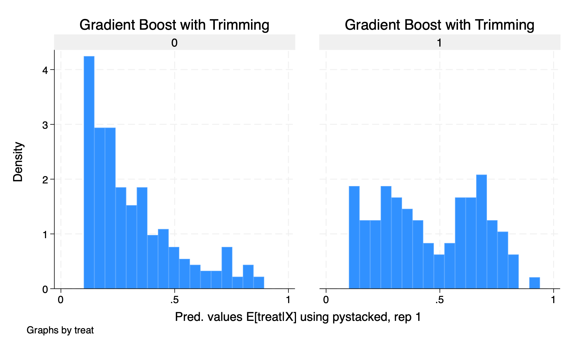

# Installing DDML and Python Engine

## Install DDML

The main command of interest will be *ddml* command for double/debiased machine learning estimator. We can download the package from Stata 

```{stata install1,eval=FALSE}
net install ddml, from(https://raw.githubusercontent.com/aahrens1/ddml/master) replace
```

Another option is: 

```{stata install2, eval=FALSE}
ssc install ddml
```

## Install Python

Before we can use the Double/Debiased Machine Learning \(DDML\), we need to have at least Stata 16 and a connection to a Python engine. We need a Python engine due to the *pystacked* commands in the *ddml* commands need *scikit-learn*. This is a command machine learning package used in Python.

### Step 1: Check for Python

Check to see if you have python already installed on your computer with the Stata command *python search*.

```{stata py1}
python search
```

Stata returns that it found Python on my computer at "/usr/bin/python3", but it may return "no Python installation found; minimum version required is 2.7." if you do not have a Python engine installed.

### Step 2: Download Python

If you do not have python, you can download Python here: https://www.python.org/downloads/

Additional information from Ahrens (2026) can be found here: https://statalasso.github.io/docs/python/

### Another Option

You can install Anaconda with Python and connect it to Python. There is a Stata Youtube tutorial here if you prefer this option: https://www.youtube.com/watch?v=hPiFBfGpKyk.

## Connect Python to Stata

After you download the Python engine, we need to integrate the Stata with the Python engine. We can use the *python set exec* command to connect Stata to Python

```{stata py2, eval=FALSE}
python set exec "/usr/bin/python3", permanently
```

Next, run a query to check everything is set up.

```{stata py3}
python query
```

## Test

Finally, we want to test that we can use Python commands in Stata.

```{stata py6}
display "Hello Python, I am Stata."
python
print("Hello Stata.")
print("I am Python.")
end
display "Nice to meet you Python!"
```

## Install *scikit-learn*

This can be the tricky part. I personally had to use the OSX terminal to install *scikit-learn*.

For OSX:
You will need <Python path> -m pip install -U scikit-learn
```{r py4, eval=FALSE}
"/usr/bin/python3" -m pip install -U scikit-learn
```

For Windows:
You need to use the pip installation as well
```{r py5, eval=FALSE}
pip install -U scikit-learn
```

# Partial Linear Model

For the partial linear model, \( D \) can be binary or continuous with the partial linear model. 

$$ Y=\delta D+g_0(X)+\varepsilon $$

$$ \delta^{ATE} = \frac{E[(Y-l_0(X))(D-m_0(X))] }{E[(D-m_0(X))^2 ]} $$

## Assumptions

Our main assumption for the partial linear model is **conditional orthogonality**

$$ E[Cov(U,D|X)]=0 $$

## Explore the data

Before we establish our partial linear model, we should inspect the data. Our outcome \(Y\) is net total financial assests, and our treatment of interest \(D\) is \(401(k)\) eligibility. 

Our data come from the 1991 Survey of Income and Program Participation (SIPP).

```{stata partial0}
macro drop _all

use https://github.com/aahrens1/ddml/raw/master/data/sipp1991.dta, clear
global Y net_tfa
global D e401
global X tw age inc fsize educ db marr twoearn pira hown

sum $Y, detail
```

Our mean net financial worth is \( \$18,051.53 \), while our median net worth is \( \$1,499 \) with a minimum of \( -\$502,302 \) and a maximum 

```{stata partial0_1,eval=FALSE}
tab $D
```

```{stata partial0_11,echo=FALSE}
quietly {
macro drop _all

use https://github.com/aahrens1/ddml/raw/master/data/sipp1991.dta, clear
global Y net_tfa
global D e401
global X tw age inc fsize educ db marr twoearn pira hown
set seed 42
}
tab $D
```


```{stata partial0_2,eval=FALSE}
sum $X
```

```{stata partial0_21,echo=FALSE}
quietly {
macro drop _all

use https://github.com/aahrens1/ddml/raw/master/data/sipp1991.dta, clear
global Y net_tfa
global D e401
global X tw age inc fsize educ db marr twoearn pira hown
set seed 42
}
sum $X
```
## Initiate the model

First, we need to set our seed so we can recreate our results. If not, we have a different randomization everytime we run the syntax.

```{stata partial1, eval=FALSE}
set seed 42
```

We use the command *ddml init partial* with the partial linear model. One of the key options here is the *kfolds* option. This will tell Stata/Python how many cross-validation/cross-fitting folds you want to run. The default option is 5 if you do not specify *kfolds(\(k)\)*.

Please note that we have the option of *rep(\(n\))* to specify how many cross-fitting resampling repetitions we want to do for our methods. Such that cross-fitting repetitions is how often the cross-fitting procedure is repeated on randomly generated fold.

```{stata partial2, eval=FALSE}
ddml init partial, kfolds(5)
```

## Set and train your model

We we use command *ddml <eq>: * to add our supervised machine learning method where <eq> is the model for \( E[Y|X]\) and  \(E[D|X]\)

For \(E[Y|X]\), we will run an OLS and a random forest to estimate the parameters in this example.
We will use *ddml \(E[Y|X]\): reg* for OLS and we will use *ddml \(E[Y|X]\): pystacked <model>, type(reg) method(rf)* for Random Forest.

For our OLS regression, the syntax is straightforward. We just need to add *ddml \(E[Y|X]\):* before *reg $Y $X*.

For our machine learning methods, we have some additional syntax. 

First, we need to use the command *pystacked* to call Python for our machine learnings methods before our model. 

Next, we need to use the option *type()*. This option clarifies if the machine learning method is used as a regression with *type(reg)* or as a classifier with *type(class)*.

Finally, we can specify the machine learning method with the *method* option. For this example, we will be using random forest. We can use random forest as a regression and a classifier.

```{stata partial3, eval=FALSE}
ddml E[Y|X]: reg $Y $X
ddml E[Y|X]: pystacked $Y $X, type(reg) method(rf)
```

For \(E[D|X]\), we will run a logit and a random forest to estimate the paramters in this example.
```{stata partial4, eval=FALSE}
ddml E[D|X]: logit $D $X
ddml E[D|X]: pystacked $D $X, type(class) method(rf)
```

If you need to check what learners you have used to train your model, use the *ddml desc* command.

```{stata partial4_0, eval=FALSE}
ddml desc
```

```{stata partial4_1, echo=FALSE}
quietly {
macro drop _all

use https://github.com/aahrens1/ddml/raw/master/data/sipp1991.dta, clear
global Y net_tfa
global D e401
global X tw age inc fsize educ db marr twoearn pira hown
set seed 42

ddml init partial, kfolds(5)

ddml E[Y|X]: reg $Y $X
ddml E[Y|X]: pystacked $Y $X, type(reg) method(rf)
ddml E[D|X]: logit $D $X
ddml E[D|X]: pystacked $D $X, type(class) method(rf)
}
ddml desc
```

We have two training models for \(E[Y|X]\) and two training models for \(E[D|X]\).

## Crossfitting/Cross-Validation 

Our next step is to use the crossfitting/crossvalidation method to test our model. Our main command will be *ddml crossfit*

```{stata partial5, eval=FALSE}
ddml crossfit
```

```{stata partial5_1, echo=FALSE}
quietly {
macro drop _all

use https://github.com/aahrens1/ddml/raw/master/data/sipp1991.dta, clear
global Y net_tfa
global D e401
global X tw age inc fsize educ db marr twoearn pira hown
set seed 42

ddml init partial, kfolds(5)

ddml E[Y|X]: reg $Y $X
ddml E[Y|X]: pystacked $Y $X, type(reg) method(rf)
ddml E[D|X]: logit $D $X
ddml E[D|X]: pystacked $D $X, type(class) method(rf)
}
ddml crossfit
```

## Estimation

We use the command *ddml estiamte* to calculate the \(ATE\). 

```{stata partial7, eval=FALSE}
ddml estimate, robust allcombos
```

```{stata partial7_1, echo=FALSE}
quietly {
macro drop _all

use https://github.com/aahrens1/ddml/raw/master/data/sipp1991.dta, clear
global Y net_tfa
global D e401
global X tw age inc fsize educ db marr twoearn pira hown
set seed 42

ddml init partial, kfolds(5)

ddml E[Y|X]: reg $Y $X
ddml E[Y|X]: pystacked $Y $X, type(reg) method(rf)
ddml E[D|X]: logit $D $X
ddml E[D|X]: pystacked $D $X, type(class) method(rf)

ddml crossfit 
}
ddml estimate, robust allcombos
```

We find that \(401(k)\) eligibility increases net financial worth by about \(\$7,096\) dollars. We can also notice that the 3rd specification was chosen, which was logit for estimating \(e401\). If we want to the results of the other three specification, you can rerun *ddml estimate* with the option *spec(n)* where \(n\) is the specification you want. We will try this with the first specification.

```{stata partial8, eval=FALSE}
ddml estimate, robust allcombos spec(1) replay
```

```{stata partial8_1, echo=FALSE}
quietly {
macro drop _all

use https://github.com/aahrens1/ddml/raw/master/data/sipp1991.dta, clear
global Y net_tfa
global D e401
global X tw age inc fsize educ db marr twoearn pira hown
set seed 42

ddml init partial, kfolds(5)

ddml E[Y|X]: reg $Y $X
ddml E[Y|X]: pystacked $Y $X, type(reg) method(rf)
ddml E[D|X]: logit $D $X
ddml E[D|X]: pystacked $D $X, type(class) method(rf)

ddml crossfit 
}
ddml estimate, robust allcombos spec(1)
```

Using the first specification, which was OLS for \( E[Y|X] \) and logit for \( E[D|X] \), our \( \widehat{ATE} \) is equal to \( \$5,309 \)

# Interactive Model 

For the interactive model , \( D \) is binary in interactive model. This will be more familiar to what we have seen in other methods.

$$ Y=g_{0}(D,X)+\varepsilon $$

$$ \delta^{ATE}=E[g_0(1,X)-g_0(0,X)] $$
$$ \delta^{ATET}=E[g_0(1,X)-g_0(0,X)|D=1] $$

## Assumptions

Our assumptions should be familiar:

  1. **Conditional Mean Independence**: \(E[U|D,X]=0 \) 
  2. **Overlap or Common Support Assumption**: \(Pr(D=1|X) \in (0,1) \)

This is similar to our matching estimators discussed previously.

## Explore the data

We will use data from Cattaneo (2010) on smoking and birth weight. Our outcome of interest will be birth weight of a babay in grams, and our treatment of interest will be a binary if the mother smoked. 

```{stata inter1}
macro drop _all
webuse cattaneo2, clear
global Y bweight
global D mbsmoke
global X mage prenatal1 mmarried fbaby mage medu
set seed 42

sum $Y, detail

tab $D

sum $X
```

We see that the median and mean birth weight is \(3.4 kg\) with a minimum of \( 0.3 kg \) and a maximum of \( 5.5 kg \). 

For our treatment variable, \(864\) women smoked while \(3,778\) women did not smoke.

## Initiate the model

We will train the model with the command *ddml init interactive*. We will use k-fold of 5 and 5 repetitions of resampling.

```{stata inter2, eval=FALSE}
ddml init interactive, kfolds(5) reps(5)
```

## Set your models 

Next we will set our models. We need to establish \( E[D|X] \) for our propensity to treatment and \( E[Y|X,D] \) for our conditional outcomes. 

We will use OLS regression and Lasso regression with the option *lassocv* to estimate our conditional means. We need to set the type to *reg* for regression.

```{stata inter3, eval=FALSE}
ddml E[Y|X,D]: reg $Y $X
ddml E[Y|X,D]: pystacked $Y $X, type(reg) method(lassocv)
```

We will use logit and gradient boost, which is a tree-based model, for estimating the propensity to receive treatment.

```{stata inter4, eval=FALSE}
ddml E[D|X]: logit $D $X
ddml E[D|X]: pystacked $D $X, type(class) method(gradboost)
```

## Crossfitting/Cross-Validation

We again use the command *ddml crossfit* for crossfitting/crossvalidation for the interactive model.

```{stata inter5, eval=FALSE}
ddml crossfit
histogram D1_logit_1, by(mbsmoke)
histogram D2_pystacked_1, by(mbsmoke)
```





## Estimation

After our crossfitting/crossvalidation to test the model, we can now estimate our parameters of interest, which are the \(ATE\) and the \(ATET\).

```{stata inter6, eval=FALSE}
ddml estimate, ate allcombos
ddml estimate, atet allcombos
```

```{stata inter6_1, echo=FALSE}
quietly {
macro drop _all
webuse cattaneo2, clear
global Y bweight
global D mbsmoke
global X mage prenatal1 mmarried fbaby mage medu
set seed 42

ddml init interactive, kfolds(5) reps(5)

ddml E[Y|X,D]: reg $Y $X
ddml E[Y|X,D]: pystacked $Y $X, type(reg) method(lassocv)

ddml E[D|X]: logit $D $X
ddml E[D|X]: pystacked $D $X, type(class) method(gradboost)

ddml crossfit
}
ddml estimate, allcombos
ddml estimate, atet allcombos
```

Our \(\widehat{ATE} \) is \(-216.024 \) or smoking reduces birth weight of a baby by 213 grams, which is statistically significant at the \( 5\% \) level.

Our \(\widehat{ATET} \) is \(-234.692 \) or smoking reduces birth weight of a baby by 234 grams for the treatment group, which is statistically significant at the  \( 5\% \) level.

Please note that the median over the minimum-MSE specification per resampling iteration is shown in the output. Below the output is a table that shows summary statistics of the resampling iterations.

# Training Example Revisited

I want to revisit the training sample to show the importance of our second assumption of common support. 

## Doubly Robust Estimator 

Let's reload the data and run our double robust estimator.

```{stata train1}
quietly {
use https://github.com/scunning1975/mixtape/raw/master/nsw_mixtape.dta, clear
drop if treat==0

* Now merge in the CPS controls from footnote 2 of Table 2 (Dehejia and Wahba 2002)
append using https://github.com/scunning1975/mixtape/raw/master/cps_mixtape.dta
gen agesq=age*age
gen agecube=age*age*age
gen edusq=educ*edu
gen u74 = 0 if re74!=.
replace u74 = 1 if re74==0
gen u75 = 0 if re75!=.
replace u75 = 1 if re75==0
gen interaction1 = educ*re74
gen re74sq=re74^2
gen re75sq=re75^2
gen interaction2 = u74*hisp


* Now estimate the propensity score
logit treat age agesq agecube educ edusq marr nodegree black hisp re74 re75 u74 u75 interaction1 
predict pscore

* Checking mean propensity scores for treatment and control groups
sum pscore if treat==1, detail
sum pscore if treat==0, detail

* Now look at the propensity score distribution for treatment and control groups
histogram pscore, by(treat) binrescale

* Trimming the propensity score
drop if pscore <= 0.1 
drop if pscore >= 0.9

}
*ATT
*We have to rescale for the concavity of the logit.
gen re78_scaled = re78/1000

teffects ipwra (re78_scaled age agesq agecube educ edusq marr nodegree black hisp re74 re75 u74 u75 interaction1) (treat age agesq agecube educ edusq marr nodegree black hisp u74 u75 interaction1, logit), atet
capture drop overlap

*ATE
teffects ipwra (re78_scaled age agesq agecube educ edusq marr nodegree black hisp re74 re75 u74 u75 interaction1) (treat age agesq agecube educ edusq marr nodegree black hisp u74 u75 interaction1, logit), ate

```

Our estimate \(\widehat{ATE}\) is \(\$1,609\), and the estimate \(\widehat{ATET}\) is estimated \( \$2,566 \). Recall that we need to trim our \(p\)-scores to satisfy the common support/overlap assumption.

## DDML Estimator

Let's rerun this, but we will use lasso and gradient boost for our training models along side OLS and logit.

```{stata train2}
quietly {
macro drop _all

use https://github.com/scunning1975/mixtape/raw/master/nsw_mixtape.dta, clear
drop if treat==0

* Now merge in the CPS controls from footnote 2 of Table 2 (Dehejia and Wahba 2002)
append using https://github.com/scunning1975/mixtape/raw/master/cps_mixtape.dta
gen agesq=age*age
gen agecube=age*age*age
gen edusq=educ*edu
gen u74 = 0 if re74!=.
replace u74 = 1 if re74==0
gen u75 = 0 if re75!=.
replace u75 = 1 if re75==0
gen interaction1 = educ*re74
gen re74sq=re74^2
gen re75sq=re75^2
gen interaction2 = u74*hisp

gen re78_scaled = re78/1000

global Y re78_scaled
global D treat
global X age agesq agecube educ edusq marr nodegree black hisp re74 re75 u74 u75 interaction1
set seed 123456
display "$X"
}
ddml init interactive, kfolds(5)

ddml E[Y|X,D]: reg $Y $X
ddml E[Y|X,D]: pystacked $Y $X, type(reg) method(lassocv)
ddml E[D|X]: logit $D $X
ddml E[D|X]: pystacked $D $X, type(class) method(gradboost)

ddml crossfit

bysort treat: summarize D1_logit, detail
bysort treat: summarize D2_pystacked, detail
```

We can see that our \(\hat{p}\)-scores are quiet different between treatment and comparison groups. We saw this last week with our matching methods for this training example.

Let's graph our histograms by \(\hat{p}\)-scores

```{stata train3, eval=FALSE}
histogram D1_logit_1, by(treat) title("Using Logit")
graph export "/Users/Sam/Desktop/Econ 672/Bookdown/Week5/Train_logit_histogram.png", replace
```



```{stata train4, eval=FALSE}
histogram D2_pystacked_1, by(treat) title ("Using Gradient Boost")
graph export "/Users/Sam/Desktop/Econ 672/Bookdown/Week5/Train_gradboost_histogram.png", replace
```



We see that our common support assumption is violated. Let's run our estimate using DDML without trimming.

```{stata train5, eval=FALSE}
ddml estimate, allcombos robust
```

```{stata train5_1, echo=FALSE}
quietly{
macro drop _all

use https://github.com/scunning1975/mixtape/raw/master/nsw_mixtape.dta, clear
drop if treat==0

* Now merge in the CPS controls from footnote 2 of Table 2 (Dehejia and Wahba 2002)
append using https://github.com/scunning1975/mixtape/raw/master/cps_mixtape.dta
gen agesq=age*age
gen agecube=age*age*age
gen edusq=educ*edu
gen u74 = 0 if re74!=.
replace u74 = 1 if re74==0
gen u75 = 0 if re75!=.
replace u75 = 1 if re75==0
gen interaction1 = educ*re74
gen re74sq=re74^2
gen re75sq=re75^2
gen interaction2 = u74*hisp

gen re78_scaled = re78/1000

global Y re78_scaled
global D treat
global X age agesq agecube educ edusq marr nodegree black hisp re74 re75 u74 u75 interaction1
set seed 123456
display "$X"

ddml init interactive, kfolds(5)

ddml E[Y|X,D]: reg $Y $X
ddml E[Y|X,D]: pystacked $Y $X, type(reg) method(lassocv)
ddml E[D|X]: logit $D $X
ddml E[D|X]: pystacked $D $X, type(class) method(gradboost)

ddml crossfit

}
ddml estimate, allcombos robust
```

Our estimated \(\widehat{ATE}\) is \( -\$6,440 \), which is a far cry from our RCT estimate.

## Trimming

Let's do some trimming. Our model shows that the logit has a lower MSE than the gradiant boost, so we will use that first and then show our estimate with the 

```{stata train6, eval=FALSE}
histogram D1_logit_1 if D1_logit_1 >.1 & D1_logit_1 <.9, by(treat) title(Logit with Trimming)
graph export "/Users/Sam/Desktop/Econ 672/Bookdown/Week5/Train_logit_histogram_trimmed.png", replace
```



```{stata train7, eval=FALSE}
histogram D2_pystacked_1 if D2_pystacked_1 >.1 & D2_pystacked_1 <.9, by(treat) title(Gradient Boost with Trimming)
graph export "/Users/Sam/Desktop/Econ 672/Bookdown/Week5/Train_gradboost_histogram_trimmed.png", replace
```



Let's rerun our estimate but with trimmed data.
```{stata train8, eval=FALSE}
ddml estimate if D1_logit_1 > .1 & D1_logit_1 < .9, allcombos robust
```

```{stata train8_1, echo=FALSE}
quietly{
macro drop _all

use https://github.com/scunning1975/mixtape/raw/master/nsw_mixtape.dta, clear
drop if treat==0

* Now merge in the CPS controls from footnote 2 of Table 2 (Dehejia and Wahba 2002)
append using https://github.com/scunning1975/mixtape/raw/master/cps_mixtape.dta
gen agesq=age*age
gen agecube=age*age*age
gen edusq=educ*edu
gen u74 = 0 if re74!=.
replace u74 = 1 if re74==0
gen u75 = 0 if re75!=.
replace u75 = 1 if re75==0
gen interaction1 = educ*re74
gen re74sq=re74^2
gen re75sq=re75^2
gen interaction2 = u74*hisp

gen re78_scaled = re78/1000

global Y re78_scaled
global D treat
global X age agesq agecube educ edusq marr nodegree black hisp re74 re75 u74 u75 interaction1
set seed 123456
display "$X"

ddml init interactive, kfolds(5)

ddml E[Y|X,D]: reg $Y $X
ddml E[Y|X,D]: pystacked $Y $X, type(reg) method(lassocv)
ddml E[D|X]: logit $D $X
ddml E[D|X]: pystacked $D $X, type(class) method(gradboost)

ddml crossfit 
}
ddml estimate if D1_logit_1 > .1 & D1_logit_1 < .9, allcombos robust
```

Our estimated \(\hat{ATE}\) is \(\$1,423\), which is below our DR estimate and the RCT estimate and it is not statistically significant at the \(5\%\) level.