# Continuity Assumption

We will simulate the continuity assumption with fake data. We cannot directly test the continuity assumption, but we will simulate it to see what it looks like.

## Simulate Continuity Assumption

We will set our observation count to 1,000 and set a seed for reproducible results.

```{stata ca1, eval=FALSE}
clear
set obs 1000
set seed 1234567
```

Next, we will generate our fake running variable
```{stata ca2, eval=FALSE}
gen x = rnormal(50, 25)
replace x=0 if x < 0
drop if x > 100
sum x, det
```

```{stata ca2_1, echo=FALSE}
quietly {
set obs 1000
set seed 1234567
}
gen x = rnormal(50, 25)
replace x=0 if x < 0
drop if x > 100
sum x, det
```

Now we will generate the cutoff point at \(X=50\) and when \(X >= 50 \) our units of observation are considered treated. We will create a data generation process with \( \alpha=25 \) and \(y\) is a function of the running variable \(1.5*x\).

```{stata ca3, eval=FALSE}
gen D = 0
replace D = 1 if x > 50
gen y1 = 25 + 0*D + 1.5*x + rnormal(0, 20)
```

Here we have an example of \(Y^1\) not jumping at the cutoff. The potential outcomes are smooth across the discontinuity. Notice that the data generation process had \(0*D\), such that \(\delta^{LATE}=0\)

```{stata ca4, eval=FALSE}
twoway (scatter y1 x if D==0, msize(vsmall) msymbol(circle_hollow)) ///
(scatter y1 x if D==1, sort mcolor(blue) msize(vsmall) msymbol(circle_hollow)) ///
 (lfit y1 x if D==0, lcolor(red) msize(small) lwidth(medthin) lpattern(solid)) ///
 (lfit y1 x, lcolor(dknavy) msize(small) lwidth(medthin) lpattern(solid)), ///
 xtitle(Test score (X)) xline(50) legend(off) xlabel(0 "0" 20 "20" 40 "40" ///
 50 "Cutoff" 60 "60" 80 "80" 100 "100") ///
 title("Smoothness of Potential Outcome (Y1)")
```

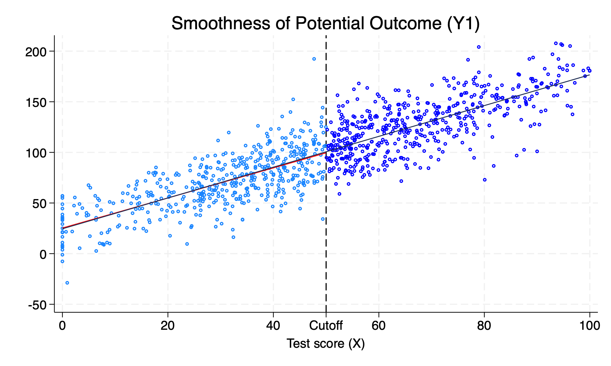

## Simulate the discontinuity

We will set the discontinuity or the \(LATE\) equal to \(40\) or \(\delta^{LATE}=40\). In our prior example, \(\delta^{LATE}=0\) and then replot the data. Now our data generation process will show that there is a disconinuous jump at the cutoff.

```{stata ca5, eval=FALSE}
gen y = 25 + 40*D + 1.5*x + rnormal(0, 20)
scatter y x if D==0, msize(vsmall) || ///
scatter y x if D==1, msize(vsmall) ///
legend(off) xline(50, lstyle(foreground)) || ///
lfit y x if D ==0, color(red) || lfit y x if D ==1, ///
color(red)  title("Estimated LATE using simulated data") ///
ytitle("Outcome (Y)")  xtitle("Test Score (X)")  ///
xlabel(0 "0" 20 "20" 40 "40" ///
 50 "Cutoff" 60 "60" 80 "80" 100 "100")
```

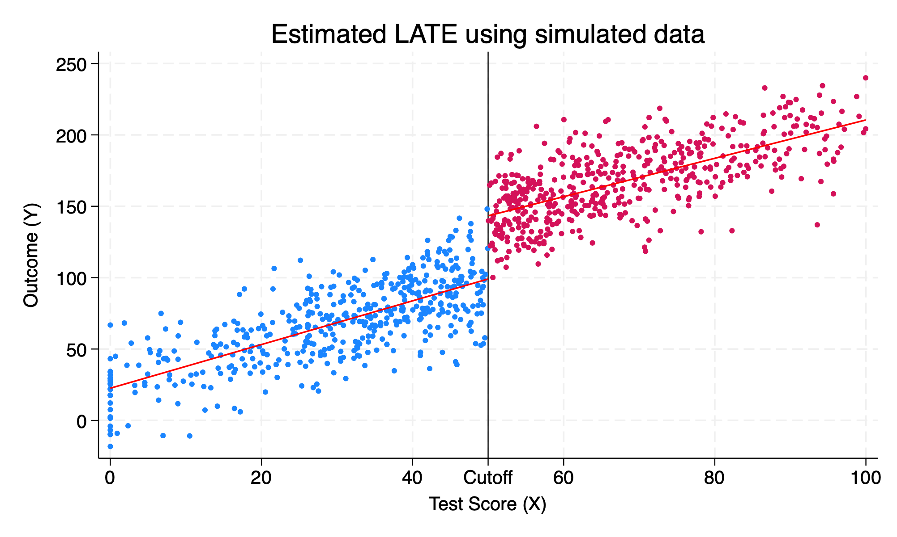

We can see that \(\delta=40\) increase in the outcome, \(Y\).

## Nonlinear data generation process

What happens when the data generation process is nonlinear? We need to be careful with the \(RDD\) design to not impose a linear fit to nonlinear data and assume a discontinuous jump.

We will set the cutoff at \(X=140\), where \(D\) is treated if \(X > 140\). Due to the functional form, there isn't a discontinuous jump at 140. However, our RDD design it shows that there is a discontinous jump.

```{stata ca6}
set obs 1000
gen x = rnormal(100, 50)
replace x=0 if x < 0
drop if x > 280
sum x, det
gen D = 0
replace D = 1 if x > 140
gen x2 = x*x
gen x3 = x*x*x
gen y = 10000 + 0*D - 100*x +x2 + rnormal(0, 1000)
reg y D x
```

We estimte that the \(LATE\) is equal to \(6340.6\). However, we can visualize the incorrect RDD by imposing a linear function form onto a nonlinear function

```{stata ca7, eval=FALSE}
scatter y x if D==0, msize(vsmall) || scatter y x ///
  if D==1, msize(vsmall) legend(off) xline(140, ///
  lstyle(foreground)) ylabel(none) || lfit y x ///
  if D ==0, color(red) || lfit y x if D ==1, ///
  color(red) xtitle("Test Score (X)") ///
  ytitle("Outcome (Y)") title("Applying Linear Fit to Nonlinear Data") ///
  caption("Spurious discontinuity effect due to incorrect specification")
```
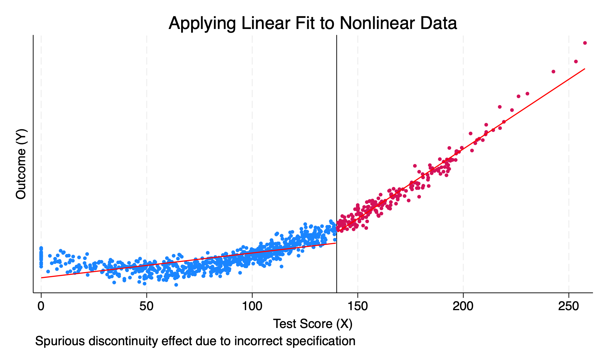


We will now model the RDD using a polynomial instead of a linear function.

```{stata ca8, eval=FALSE}
capture drop y 
gen y = 10000 + 0*D - 100*x +x2 + rnormal(0, 1000)
reg y D x x2 x3
predict yhat 
```

```{stata ca8_1, echo=FALSE}
quietly {
set obs 1000
gen x = rnormal(100, 50)
replace x=0 if x < 0
drop if x > 280
sum x, det
gen D = 0
replace D = 1 if x > 140
gen x2 = x*x
gen x3 = x*x*x
gen y = 10000 + 0*D - 100*x +x2 + rnormal(0, 1000)
}
capture drop y 
gen y = 10000 + 0*D - 100*x +x2 + rnormal(0, 1000)
reg y D x x2 x3
predict yhat 
```

We fail to reject the null hypothesis that \(H_0: \delta = 0 \).

We can visualize the correct functional form, and we can see that the functional form is smooth and continuous.
```{stata ca9, eval=FALSE}
scatter y x if D==0, msize(vsmall) || scatter y x ///
  if D==1, msize(vsmall) legend(off) xline(140, ///
  lstyle(foreground)) ylabel(none) || line yhat x ///
  if D ==0, color(red) sort || line yhat x if D==1, ///
  sort color(red) xtitle("Test Score (X)") ///
  ytitle("Outcome (Y)") title("Applying Nonlinaear Fit to Nonlinear Data") ///
  caption("Polynomial fit shows no discontinuity impact at cutoff")
```
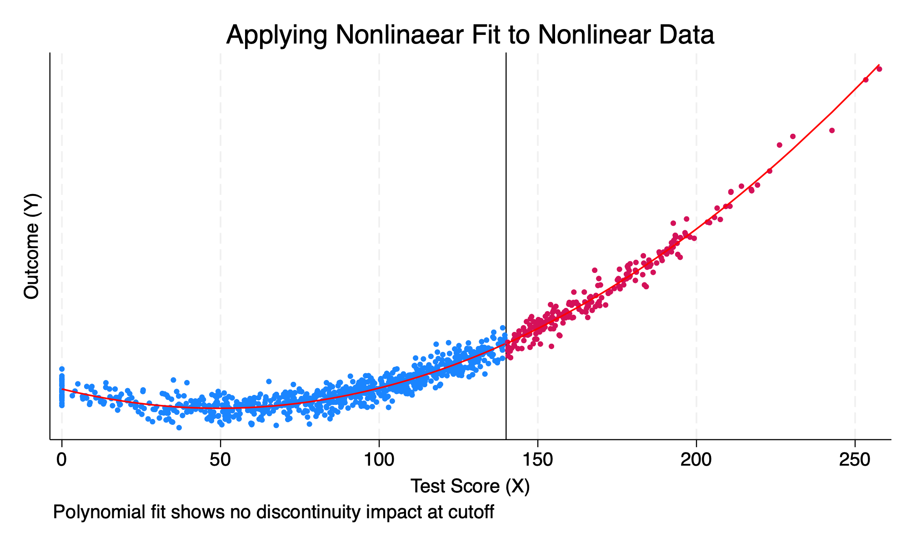


# Sharp RDD

## Replicate Lee, Moretti, and Butler (2004)

Lee, Moretti, and Butler (2004) wanted to test the convergence theory or the divergence theory for policy making. The convergence theory states that candidates will have to moderate their position to appeal to the median voter. The divergence theory states that the winning candidate pursues their preferred policy choices.

### Theory

Before an election, or ex ante, voters expect a candidate to choose some policies \(x^e\) for democracts and \(y^e\) for republicans. Voters expect candidates to win with probability \(Pr(x^e,y^e)\). 

When \(x^e > y^e \), then \( \frac{\partial P}{\partial x^e}>0\) and \( \frac{\partial P}{\partial y^e} < 0 \).

\(P^\ast \) represents a latent (underlying but not seen) popularity of the democractic party. In other words, \(P^\ast \) is the probability that \(D\) would win if policy \(x\) is chosen at the democratic policy bliss point \(c\)

**Convergence Theory**: If the convergence theory holds, then \( \frac{\partial x^\ast}{\partial P^L} > 0 \). An exogenuous shock in \(x^L\) would change a change in \(P^L\) and the candidate would change their position to satisfy the median voter.

**Divergence Theory**: If the divergence theory holds, then \( \frac{\partial x^L}{\partial P^\ast} = 0 \). Popularity has no affect on policy and voters elect politicians who pursue their preferences and not the voters.

### Potential roll-calling voting records outcomes 

We are interested in potential roll-call voting records of a candidate following an election. It can be expressed in the following:

$$ RC_t=\alpha_0 + \pi_0 P^\ast_t + \pi_1 D_t + \varepsilon_t $$

Where \(RC_t \) is roll-call voting record in time period \(t\), \( P^\ast_t \) is latent popularity of the democratic party in time period \( t \), and \( D_t \) is a binary if the democratic candidate won in time period \(t\). In other words, only the winning candidate's voting record is observed. 

We are interested in potential roll-call voting records of a candidate following an election in period \(t+1\). It can be expressed in the following:

$$ RC_{t+1}=\alpha_0 + \pi_0 P^\ast_{t+1}+ \pi_1 D_{t+1} + \varepsilon_{t+1} $$

Where \(RC_{t+1} \) is roll-call voting record in time period \( t+1 \), \( P^\ast_{t+1} \) is latent popularity of the democratic party in time period \( t+1 \), and \( D_{t+1} \) is a binary if the democratic candidate won in time period \( t+1 \).

**The Problem**: We never observe \(P^\ast_{t}\) and \(P^\ast_{t+1}\).

If \(D_t\) were randomized, then we could estimate an unbiased impact of \pi_1, but we know that is not the scenario. If this holds then we have the following:

$$  \underbrace{E[RC_{t+1}|D_t=1]-E[RC_{t+1}|D_t=0]}_{Oservable} = \underbrace{\pi_0 [P^{\ast_D}_{t+1}-P^{\ast_R}_{t+1}]}_{Latent}+\underbrace{\pi_1 [P^D_{t+1}-P^R_{t+1}]}_{Observable} = \underbrace{\gamma}_{Total\ Effect} $$

Where 

  1. \( \gamma \) is the total effect of a democratic victory in time \(t\) on future policy choice \(RC_{t+1}\)
  2. \( \pi_0 [P^{\ast_D}_{t+1}-P^{\ast_R}_{t+1}] \) is "Affect" component
  3. \( \pi_1 [P^D_{t+1}-P^R_{t+1}] \) is the "Elect" component


**Key**: if voters merely "elect" policies (under divergence), we should observe little change in the candidate's intended policies following an exogenous increase in the probability in victory. Such that, the "affect" component, \( \pi_0 [P^{\ast_D}_{t+1}-P^{\ast_R}_{t+1}]\), will be very small.

**What to do**: Given that \(\pi_0 [P^{\ast_D}_{t+1}-P^{\ast_R}_{t+1}] \) is latent and unobservable, we will back out this part through the parts that are observable: \(\gamma\),\( \pi_1 \), and \( [P^D_{t+1}-P^R_{t+1}] \)

Where the elect component is composed of \( \pi_1 \ast ([P^D_{t+1}-P^R_{t+1}] \) is estimated as the difference between voting records in mean voting records between parties at time \(t\)

First, we will estimate the total effect: \(\gamma\)

$$ \underbrace{\gamma}_{Total Effect}=\underbrace{\pi_0 [P^{\ast_D}_{t+1}-P^{\ast R}_{t+1}]}_{"Affect"}+\underbrace{\pi_1 [P^{D}_{t+1}-P^{R}_{t+1}]}_{"Elect"} $$


Second, we will estimate the first part of the elect component: \(\pi_1\)

$$ \underbrace{E[RC_t|D_t=1]-E[RC_t|D_t=0]}_{Observable} = \pi_1 $$ 

Next, we see the second part of the elect component: \(P^D_{t+1}-P^R_{t+1}\)

$$ \underbrace{E[D_{t+1}|D_t=1]-E[D_{t+1}|D_t=0]}_{Observable}=P^D_{t+1}-P^R_{t+1} $$

Next, we will use the Americans for Democractic Action (ADA) voting score that is linked to representatives in the US House of Representatives for \(RC\). The roll call is indexed from 0 to 100, where scores closer to 100 are considered more "libreral". 

We will use the vote share as the running variable. 

*We argue that comes from the exogenous shock in discontinuity in the running variable with a window around the cutoff*

### Replicate

First, we will replicate Table 1 of Lee, Moretti and Butler (2004) using vote share as our running variable and 50 percent as our cutoff. 

We will narrow our window to \( (0.48,0.52) \) for our local regression, and cluster our errors by our \(id\) variable. Note that our \(id\) variable is state-district-year identifiers.

First we will estimate our total effect of initial win on future roll calls or \(\gamma\) using a local linear regression with a window of \([0.48,0.52]\)

```{stata rep1}
use "/Users/Sam/Desktop/Econ 672/Data/lmb-data.dta", clear
reg score lagdemocrat    if lagdemvoteshare>.48 & lagdemvoteshare<.52, cluster(id)
```

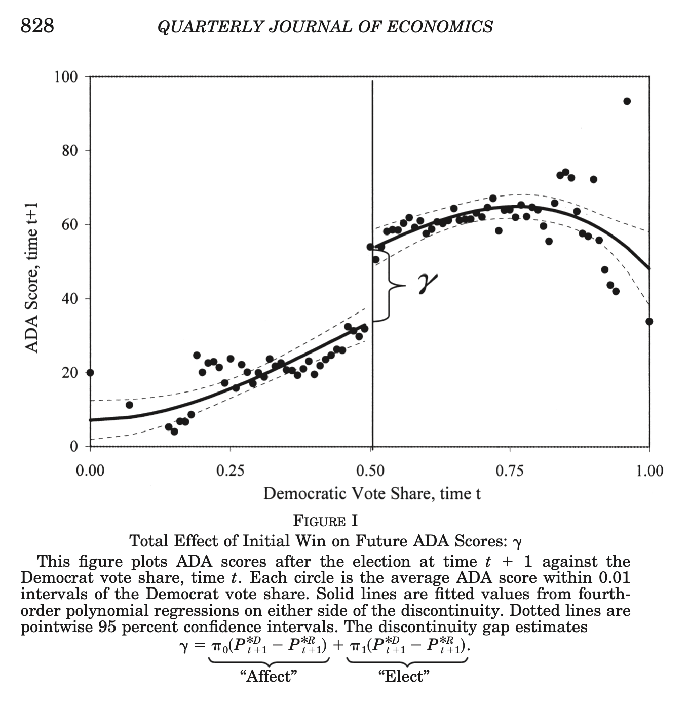

We see a 21.28 increase in the ADA score at the discontinuity, which includes the "elect" and "affect" components.


Next, we will estimate \(\pi_1\) from the elect component using a local regression using a window of \([0.48,0.52]\).

```{stata rep2, eval=FALSE}
reg score democrat       if lagdemvoteshare>.48 & lagdemvoteshare<.52, cluster(id)
```

```{stata rep2_1, echo=FALSE}
quietly use "/Users/Sam/Desktop/Econ 672/Data/lmb-data.dta", clear
reg score democrat       if lagdemvoteshare>.48 & lagdemvoteshare<.52, cluster(id)
```


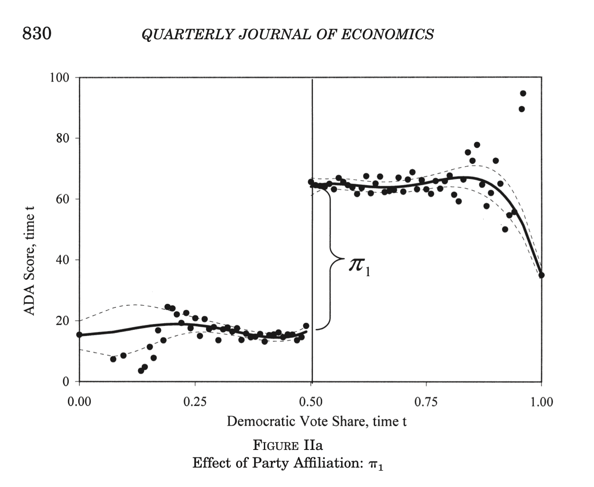

Our \(\hat{\pi}_1\) is 47.6, which is the increase in ADA scores at time \(t\) due to a \(D\) treatment/win.

Next, we will calculate \( P^D_{t+1} - P^R_{t+1} \)
```{stata rep3, eval=FALSE}
reg democrat lagdemocrat if lagdemvoteshare>.48 & lagdemvoteshare<.52, cluster(id)
```

```{stata rep3_1, echo=FALSE}
quietly use "/Users/Sam/Desktop/Econ 672/Data/lmb-data.dta", clear
reg democrat lagdemocrat if lagdemvoteshare>.48 & lagdemvoteshare<.52, cluster(id)
```

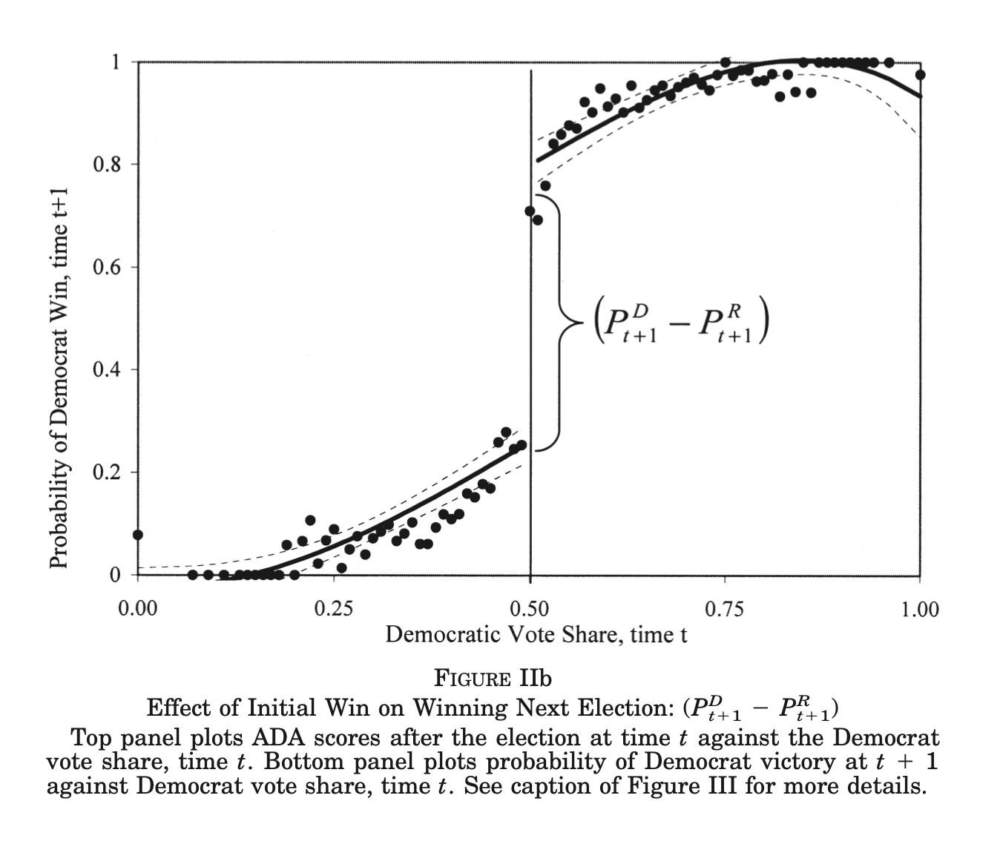

Our \(\hat{\pi}_1 * \widehat{(PDt+1 - PRt+1)}\) is 0.48, which is the effect of initial win on winning the next election.

Now, we have all three of our estimate, so we can back out the "affect" component.

<!-- \(\pi_1 \) is "elect". -->

<!-- \(\pi_0 \) is "affect" -->

<!-- total effect \(gamma\) \( \pi_1 \ast (P^D_{t+1} - P^R_{t+1}) = \pi_0 \) -->

<!-- The gap at 0.5 comes from \(\pi_1\) or "elect" and not \(\pi_0\) or "affect" -->

$$ \widehat{\gamma} - (\hat{\pi}_1 * \widehat{(PDt+1 - PRt+1)}) = \hat{\pi}_0 $$
The gap at 0.5 comes from \(\pi_1\) or "elect" and not \(\pi_0\) or "affect".

We can see this in the authors' results.

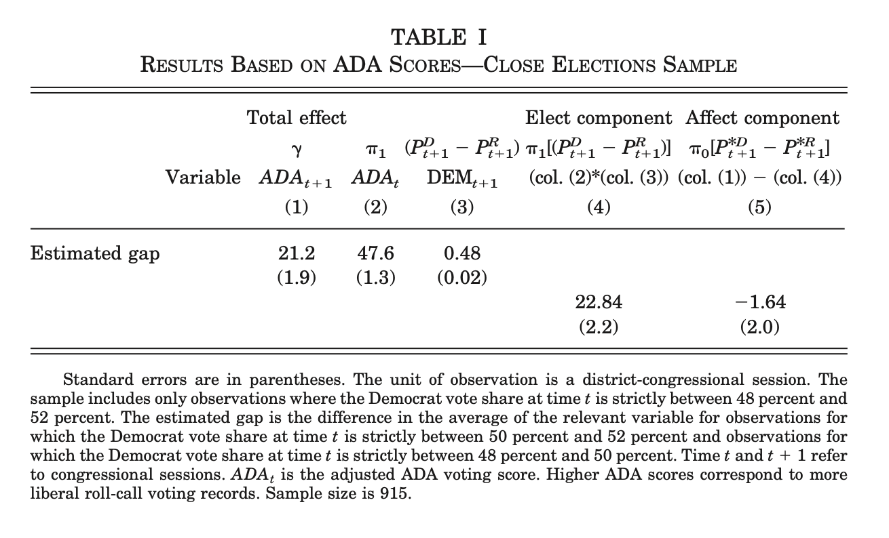


## Different functional forms of RDD

Now we will replicate Lee, et al. (2004) using different specifications for the RDD. First, we will use all of the data with OLS instead of a local regression without a running variable. Next, we will incorporate a recentered running variable using all of the data. Then, we will use an interaction term between treatment and the running variable using all of the data. For our last global regression, we will use a quadratic interaction term between our running variable and the treatment. Finally, we will use a local regression.

### Treatment with no running variable

We will use all of the data instead of just the window around the cutoff. This is the full data set and not a local linear regression.


```{stata fun1, eval=FALSE}
reg score lagdemocrat, cluster(id)
reg score democrat, cluster(id)
reg democrat lagdemocrat, cluster(id)
```

```{stata fun1_1, echo=FALSE}
quietly use "/Users/Sam/Desktop/Econ 672/Data/lmb-data.dta", clear
reg score lagdemocrat, cluster(id)
reg score democrat, cluster(id)
reg democrat lagdemocrat, cluster(id)
```

We can see that our discontinuities are qiuet different under a global regression. However, we do not control the running variable, so we should not put too much stock in these results.

Note: Stata code attributed to Marcelo Perraillon.

### Recentered running variable and treatment

Next, we will recenter our running variable and use a global regression. We recenter our 0 to 1 vote share by subtracting by 0.5. So our range becomes \([-0.5,0.5]\) with 0 being our center.

Recenter running variable of voteshare and rerun regressions
```{stata fun2,eval=FALSE}
gen demvoteshare_c = demvoteshare - 0.5
reg score lagdemocrat demvoteshare_c, cluster(id)
reg score democrat demvoteshare_c, cluster(id)
reg democrat lagdemocrat demvoteshare_c, cluster(id)
```

```{stata fun2_1,echo=FALSE}
quietly use "/Users/Sam/Desktop/Econ 672/Data/lmb-data.dta", clear
gen demvoteshare_c = demvoteshare - 0.5
reg score lagdemocrat demvoteshare_c, cluster(id)
reg score democrat demvoteshare_c, cluster(id)
reg democrat lagdemocrat demvoteshare_c, cluster(id)
```

Our results are closer to Lee, et al. (2004), but they are still far off. Please note that we keep the function form of the slope for the running variable the same on both sides of the cutoff.

Note: Stata code attributed to Marcelo Perraillon.

### Interaction between treatment and running variable

We are going to allow for intercepts and slopes to differ with interacting categorical and continuous variables. Why do we want to do this? We allow for the slope to differ on both sides of the discontinuity. As seen above in Figure 1, the slopes may differ on each side of the discontinuity.

Please note that Cunningham likes to use the *xi:*, while I prefer to use the interaction operators *##*.

```{stata fun3,eval=FALSE}
xi: reg score i.lagdemocrat*demvoteshare_c, cluster(id)
xi: reg score i.democrat*demvoteshare_c, cluster(id)
xi: reg democrat i.lagdemocrat*demvoteshare_c, cluster(id)
```

```{stata fun3_1,echo=FALSE}
quietly {
use "/Users/Sam/Desktop/Econ 672/Data/lmb-data.dta", clear
gen demvoteshare_c = demvoteshare - 0.5
}
xi: reg score i.lagdemocrat*demvoteshare_c, cluster(id)
xi: reg score i.democrat*demvoteshare_c, cluster(id)
xi: reg democrat i.lagdemocrat*demvoteshare_c, cluster(id)
```

Note: *xi* is interaction expansion: https://www.stata.com/manuals13/rxi.pdf

Note: Stata code attributed to Marcelo Perraillon.

You can use ## between to variables for interactions as well (I prefer this method). You use i.varname for the categorical and c.varname for the continuous. So we are interacting a binary variable with a continuous one here to 
allow for different slopes and intercepts.

```{stata fun4, eval=FALSE}
reg score i.lagdemocrat##c.demvoteshare_c, cluster(id)
reg score i.democrat##c.demvoteshare_c, cluster(id)
reg democrat i.lagdemocrat##c.demvoteshare_c, cluster(id)
```

```{stata fun4_1, echo=FALSE}
quietly {
use "/Users/Sam/Desktop/Econ 672/Data/lmb-data.dta", clear
gen demvoteshare_c = demvoteshare - 0.5
}

reg score i.lagdemocrat##c.demvoteshare_c, cluster(id)
reg score i.democrat##c.demvoteshare_c, cluster(id)
reg democrat i.lagdemocrat##c.demvoteshare_c, cluster(id)
```

With our full-sample interaction, we are starting to get closer to our results from the local linear regression and the results Lee, Moretti, and Butler (2004). 

### Quadratic interaction between treatment and running variable

Next, we will use a global linear regression using an quadratic interaction. Why do we want to use a quadratic interaction? Not only do we allow the slopes to differ, we also allow for flexibility in the function form. This will better match the data on both sides of the discontinuity. Furthermore, if we misspecify the functinoal form, then we may attribute a discontinuity when one does not exist.

```{stata fun5, eval=FALSE}
gen demvoteshare_sq = demvoteshare_c^2
reg score i.lagdemocrat##c.(demvoteshare_c demvoteshare_sq), cluster(id)
reg score i.democrat##c.(demvoteshare_c demvoteshare_sq), cluster(id)
reg democrat i.lagdemocrat##c.(demvoteshare_c demvoteshare_sq), cluster(id)
```

```{stata fun5_1, echo=FALSE}
quietly {
use "/Users/Sam/Desktop/Econ 672/Data/lmb-data.dta", clear
gen demvoteshare_c = demvoteshare - 0.5
gen demvoteshare_sq = demvoteshare_c^2
}

reg score i.lagdemocrat##c.(demvoteshare_c demvoteshare_sq), cluster(id)
reg score i.democrat##c.(demvoteshare_c demvoteshare_sq), cluster(id)
reg democrat i.lagdemocrat##c.(demvoteshare_c demvoteshare_sq), cluster(id)
```

With our quadratic interaction, we start to move away from our local linear regression (except for the estimate of \(\pi_1\)). Our estimates of \(\gamma\)  and \((PDt+1 - PRt+1)\) are far off from where we expect them to be.

### Local regression: 5 points from cutoff with OLS

Finally, we will use a local linear regression with a quadratic interaction. With our local linear regression with a quadratic interaction, we narrow our window, but we allow for a more flexible functional form on both sides of the discontinuity.

```{stata fun6, eval=FALSE}
reg score i.lagdemocrat##c.(demvoteshare_c demvoteshare_sq) if lagdemvoteshare>.45 & lagdemvoteshare<.55, cluster(id)
reg score i.democrat##c.(demvoteshare_c demvoteshare_sq) if lagdemvoteshare>.45 & lagdemvoteshare<.55, cluster(id)
reg democrat i.lagdemocrat##c.(demvoteshare_c demvoteshare_sq) if lagdemvoteshare>.45 & lagdemvoteshare<.55, cluster(id)
```

```{stata fun6_1, echo=FALSE}
quietly {
use "/Users/Sam/Desktop/Econ 672/Data/lmb-data.dta", clear
gen demvoteshare_c = demvoteshare - 0.5
gen demvoteshare_sq = demvoteshare_c^2
}

reg score i.lagdemocrat##c.(demvoteshare_c demvoteshare_sq) if lagdemvoteshare>.45 & lagdemvoteshare<.55, cluster(id)
reg score i.democrat##c.(demvoteshare_c demvoteshare_sq) if lagdemvoteshare>.45 & lagdemvoteshare<.55, cluster(id)
reg democrat i.lagdemocrat##c.(demvoteshare_c demvoteshare_sq) if lagdemvoteshare>.45 & lagdemvoteshare<.55, cluster(id)
```

Interestingly, our local linear regression with a quadratic interaction does much worse for estimating \(\gamma\) and \((PDt+1 - PRt+1)\)

# Visualize Global and Local Regressions

We'll now switch to local polynomial regressions as a way to assess the impact of treatment at the cutoff. A nonparametric method in RDD is to estimate a model that doesn't assume a functional form for the relationship between the outcome and running variable:

$$ y=f(x)+\varepsilon $$


We'll calculate the \(E[Y]\) for each bin of the running variable \(x\). Stata has *cmogram* command to estimate nonparametric graphics.

## Install *cmogram*

One method to help look for discontinuities and the **continuity assumption** is *cmogram*. It is good to visualize what potential trends in the running variable are - e.g. your eyes.

First, we will need to install cmogram.

```{stata cmogram1, eval=FALSE}
ssc install cmogram //If this gives you an error, please comment it out and install cmogram manually
```

Make sure to check the bins after cmogram has run in the output window with *cmogram*. If there doesn't seem to be any trends in the running variable, then polynomials will not help much.  


## Global Regression with Quadratic Fit
Next, we can visualize our different functional forms.

```{stata cmogram2, eval=FALSE}
cmogram score lagdemvoteshare, cut(0.5) scatter line(0.5) qfitci title("Global with Quadratic Fit")
```
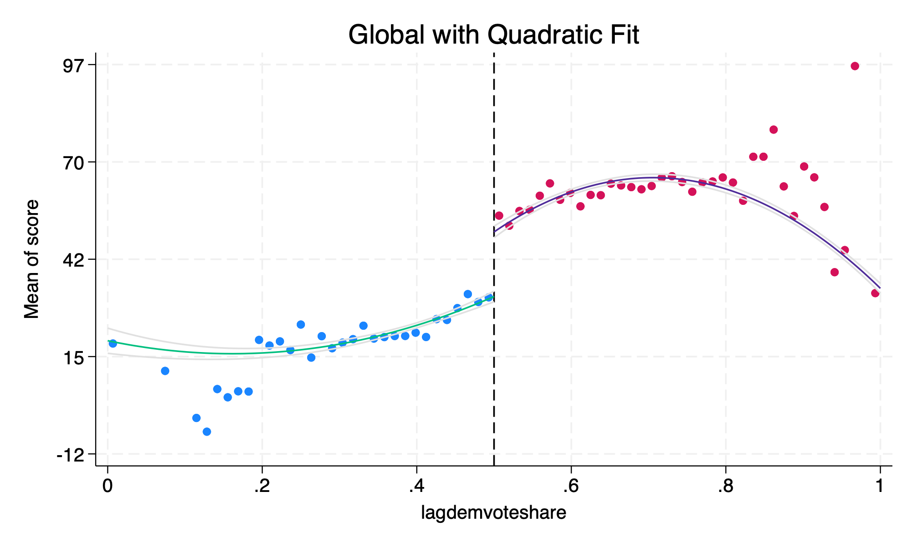

This is similar to Lee, et al. (2004) Figure 1, but with slightly different bin sizes. A quadratic fit seem to mimic Lee, Moretti, and Butler (2004) the closest. 

## Local Regression with Quadratic Fit

Next, we will use a local regression with a window of \( (0.4,0.6) \) and use a quadratic fit. 

```{stata cmogram3, eval=FALSE}
cmogram score lagdemvoteshare if lagdemvoteshare > 0.4 & lagdemvoteshare < 0.6, cut(0.5) scatter line(0.5) qfitci title("Local with Quadratic Fit")
```
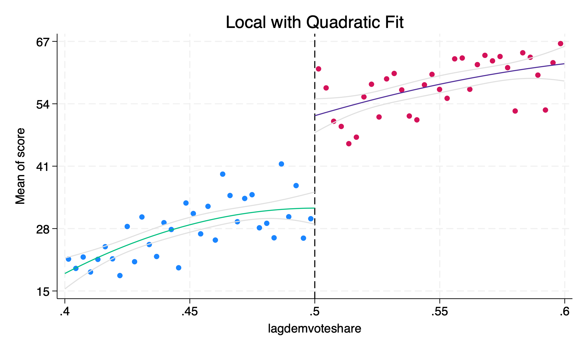

The quadratic fit might not be appropriate here, which is maybe why our estimates were so far off.

## Global Regression with Linear Fit

Next, we will focus on a global linear regression.

```{stata cmogram4, eval=FALSE}
cmogram score lagdemvoteshare, cut(0.5) scatter line(0.5) lfit title("Global with Linear Fit")
```
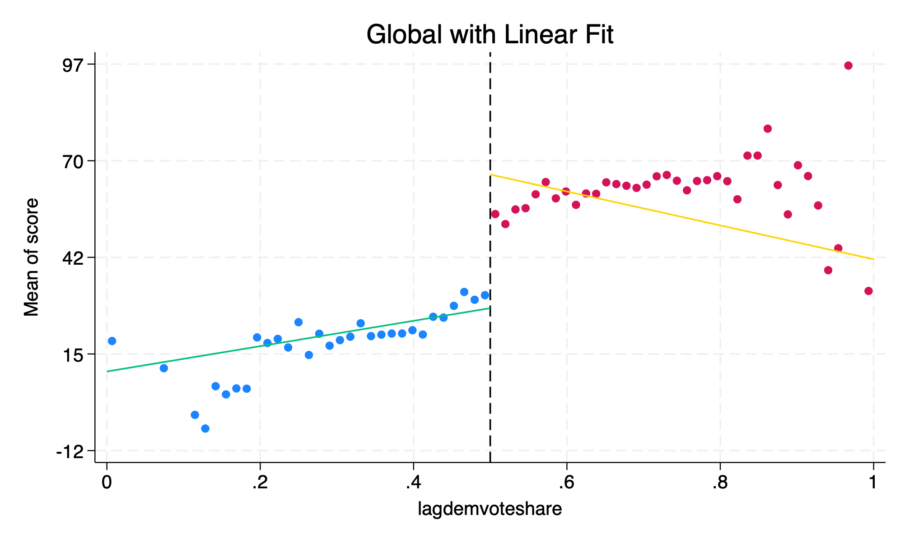

Linear Fit seem to be influenced by outliers far from the cutoff. The global linear fit may work around \([0.2,0.8]\), but does not perform well below \(0.2\) and \(0.8\).

## Local Regression with Linear Fit

Next, we will use a local linear regression with a window of \((0.4,0.6)\).

```{stata cmogram5, eval=FALSE}
cmogram score lagdemvoteshare if lagdemvoteshare > 0.4 & lagdemvoteshare < 0.6, cut(0.5) scatter line(0.5) lfit title("Local with Linear Fit")
```

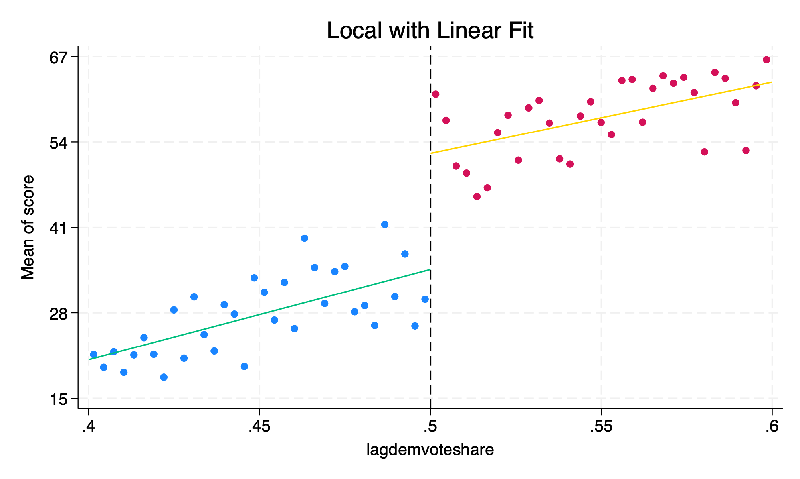

The local linear fit appears to be appropriate. Using this method, we find our results were closest to Lee, et al. (2004).

## Global Regression with Lowess Fit

Finally, we will use a global regression but we will use a lowess fit. Lowess comes from "locally weighted scatter plot smooth". A lowess fit is a non-parametric regression method that is particularly useful for creating a smooth line through a scatterplot of data points.

```{stata cmogram6, eval=FALSE}
cmogram score lagdemvoteshare, cut(0.5) scatter line(0.5) lowess title ("Global with Lowess Fit")
```

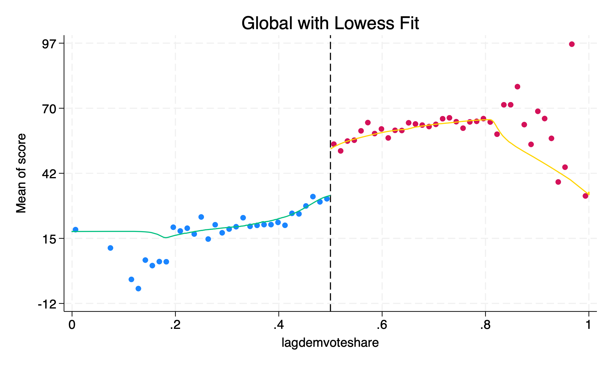


# Kernel-weighted local polynomial regression

Kernel-weighted local polynomial regressions are a weighted regression restricted to a window-like (local) where the chosen kernel provides the weights. Observations closer to the cutoff have greater weight, and you need to select the bandwidth window. The method is sensitive to the size of the bandwidth window

We use a triangle kernel with the function *lpoly*. We need to specify the options *kernel(triangle)* and we need to specify the bandwidth size with *(bwidth)*
```{stata kernel1, eval=FALSE}
capture drop sdem* x1 x0
lpoly score demvoteshare if democrat == 0, nograph kernel(triangle) gen(x0 sdem0) bwidth(0.1)}
lpoly score demvoteshare if democrat == 1, nograph kernel(triangle) gen(x1 sdem1)  bwidth(0.1)}
scatter sdem1 x1, color(red) msize(small) || scatter sdem0 x0, msize(small) color(red) ///
xline(0.5,lstyle(dot)) legend(off) xtitle("Democratic vote share") ytitle("ADA score")
```

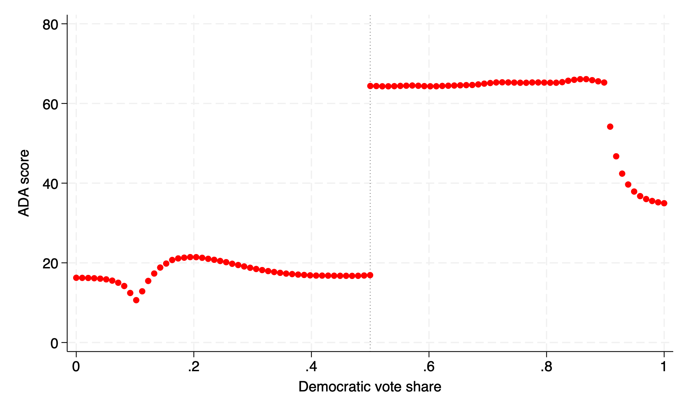

We estimate the local polynomial \(LATE\) using the following:
```{stata kernel2, eval=FALSE}
gen diff = sdem1 - sdem0
list sdem1 sdem0 diff in 1/1
```

```{stata kernel2_1, echo=FALSE}
quietly {
use "/Users/Sam/Desktop/Econ 672/Data/lmb-data.dta", clear
gen demvoteshare_c = demvoteshare - 0.5
gen demvoteshare_sq = demvoteshare_c^2
lpoly score demvoteshare if democrat == 0, nograph kernel(triangle) gen(x0 sdem0) bwidth(0.1)}
lpoly score demvoteshare if democrat == 1, nograph kernel(triangle) gen(x1 sdem1)  bwidth(0.1)}

}
gen diff = sdem1 - sdem0
list sdem1 sdem0 diff in 1/1

```
*Stata code attributed to Marcelo Perraillon.*

# RDRobust

There is a bias-variance tradeoff when selecting bandwidth size. The smaller the bandwidth window, the lower the bias, but fewer observations which increases the variance.  The larger the window, the higher the bias, but more observations, which decreases the variance. *RDRobust* optimizes the tradeoff by choosing the optimal bandwidth sizes
*Which may vary to the left or right of the cutoff. 

Use local polynomial point estimators with bias correction
```{stata rdrobust1, eval=FALSE}
ssc install rdrobust
```

We can estimate the \(LATE\) with the *RDrobust* command.
```{stata rdrobust2, eval=FALSE}
rdrobust score demvoteshare, c(0.5)
```

```{stata rdrobust2_1, echo=FALSE}
quietly {
  use "/Users/Sam/Desktop/Econ 672/Data/lmb-data.dta", clear
}
rdrobust score demvoteshare, c(0.5)

```

# McCrary Density Test

We can use local polynomial density estimations with *RDDensity* and *LPDensity* commands. The McCrary density test can test to see if there were any manipulations in the running variable at the cutoff. Our null hypothesis for the McCrary density test is no manipulation around the cutoff.

We want to make sure that the following are not occurring:

  1. The assignment rule is known in advance
  2. Economic agents are interested in adjusting
  3. Economic agents have time to adjust
  4. The cutoff is not exogenous (or is endogenous with other factors)
  5. There is non-random heaping along the running variable
  
When we look at arbitrary rules known in advanced, such as the FMLA cutoff at 50 employees, we see a pileup or heaping of firms with 49 employees. Such that, the density of firms with 49 employees is much greater than the density of firms with 50 employees. Firms are economic agents self-selecting into 49 employees to avoid regulation.

```{stata mccrary1, eval=FALSE}
net install rddensity, from(https://raw.githubusercontent.com/rdpackages/rddensity/master/stata) replace
net install lpdensity, from(https://raw.githubusercontent.com/nppackages/lpdensity/master/stata) replace
```

```{stata mccrary2, eval=FALSE}
rddensity demvoteshare, c(0.5) plot
```

```{stata mccrary2_1, echo=FALSE}
quietly {
use "/Users/Sam/Desktop/Econ 672/Data/lmb-data.dta", clear
}
rddensity demvoteshare, c(0.5) plot
```

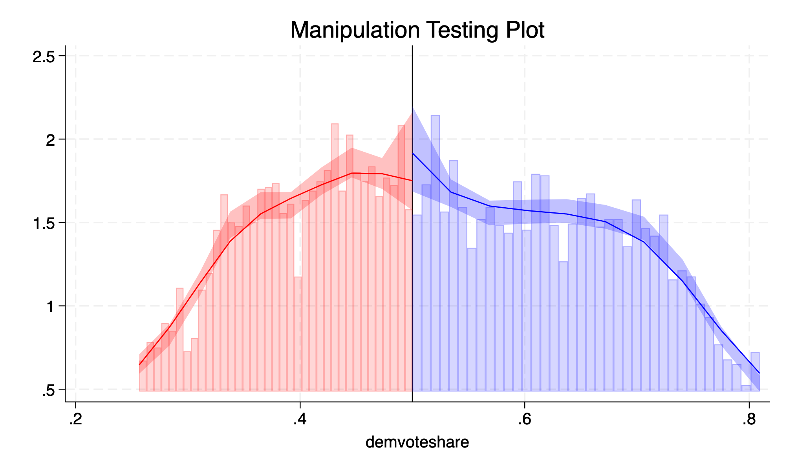


We fail to reject the null hypothesis, and we do not see evidence of maninupation around the cutoff.

*Stata code attributed to Marcelo Perraillon.*

