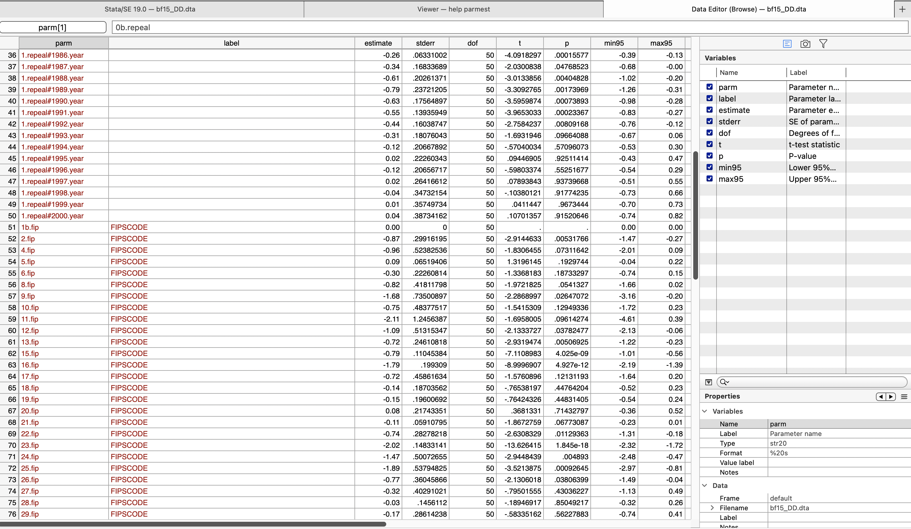
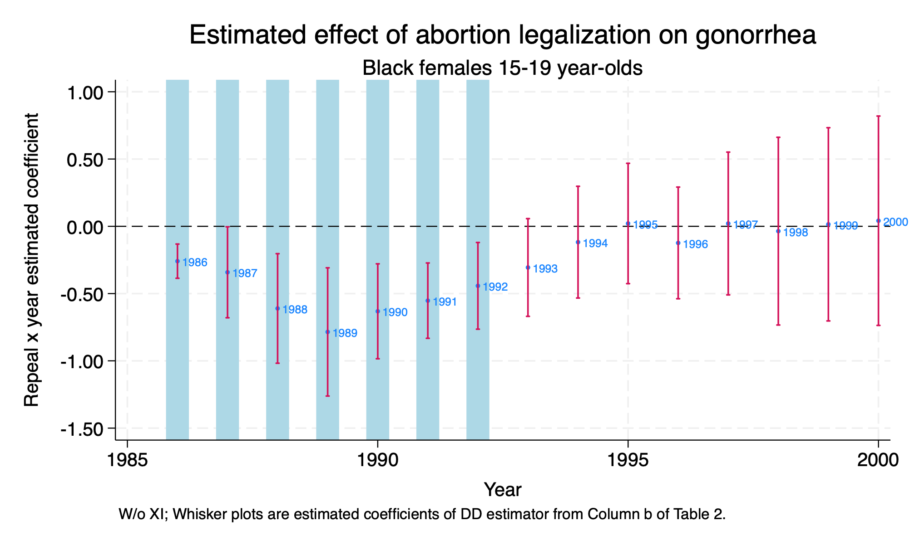
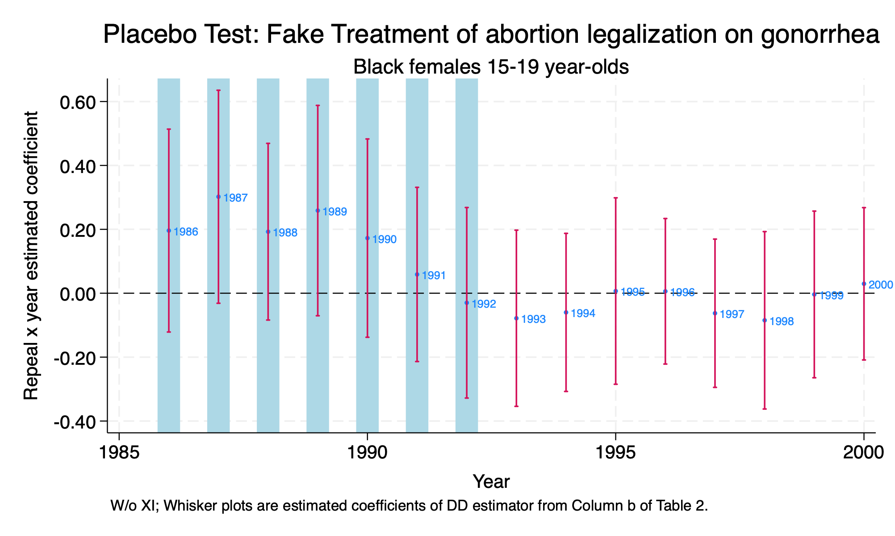
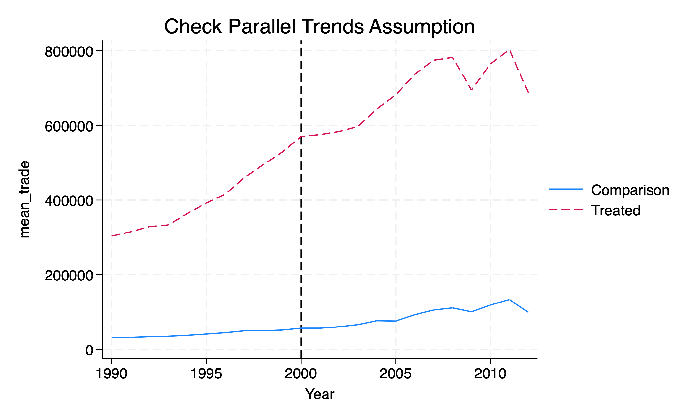
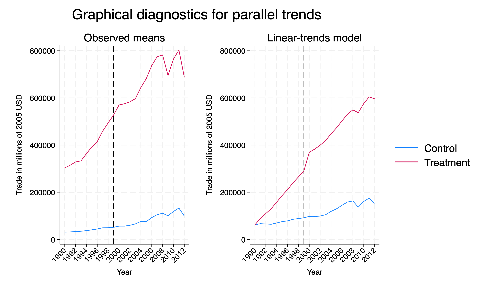
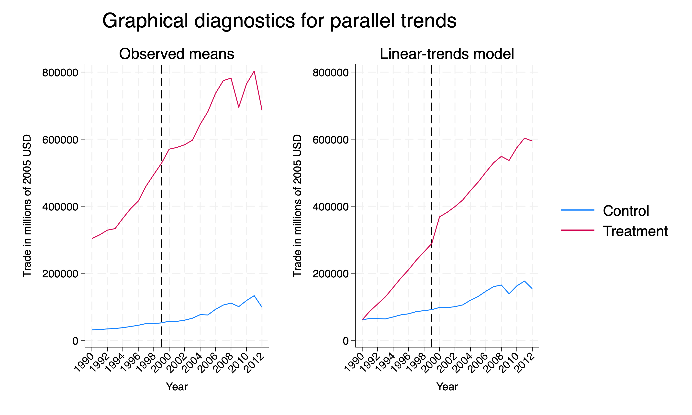

# Difference-in-Differences

## Background

Cunningham and Cornwell (2013) use a difference-in-difference design as opposed to Donohue and Levitt (2001) that use lagged ratio values at the state level.

Cunningham makes a good point with good theories provide very specific falsifiable hypotheses. More specific the hypothesis, the more compelling the theory if evidence supports the theory.

Five states legalized abortion and then all states are exposed to legalized abortion. There is a three-year lag between the five states and Roe v Wade decision, which should lead to a nonlinear parabolic treatment effect.

There should be increasingly negative effect of abortion legalization on the outcome between the treatment states and control states.

Our repeal states are Alaska (02), California (06), Hawaii (15), New York (36), Washington (53).

## Estimator

We will use the difference-in-differences estimator. Cunningham and Cornwell (2013) model is the following:

$$ Y_{st} = \alpha + \beta_1 RepealST_s + \beta_2 Year_t + \delta (RepealST*Year)_{st}+\psi X_{st}+\gamma ST_s+ \varepsilon_{st} $$
Where 

  1. \( Y_{st}\) is outcome of interest: new gonorrhea cases for 15-19 year olds per 100,000
  2. \( \delta \) is our parameter of interest. 
  3. \( RepealST_s \) is a binary for treatment state 
  4. \( Year_t \) is a time binary for each year
  5. \( RepealST*Year_{st} \) is our interaction term
  6. \( X_{st} \) are a set of covariates, such as alcholo consumption per capita, real income per capita, etc.
  7. \( ST_s \) are state fixed effects

## Parameter Estimates

We will estimate the \(ATET\) with the difference-in-differences estimator. We will use the *##* operator for the interaction between treatment state and year. We will use analytical weights to account for population. We will cluster our standard errors by FIPS code (state). 

```{stata dd1}
use "/Users/Sam/Desktop/Econ 672/Data/abortion.dta", clear

reg lnr i.repeal##i.year i.fip acc ir pi alcohol crack poverty income ur if bf15==1 [aweight=totpop], cluster(fip)
```

We can see that the difference-in-differnces interaction is statistically significant from 1986 to 1992. After 1992, we fail to reject the null hypothesis.

## Graph

We can save our parameter estimates using the *parmest* command, so that we can graph our difference-in-differences output.

```{stata dd2, eval=FALSE}
parmest, label for(estimate min95 max95 %8.2f) li(parm label estimate min95 max95) saving(bf15_DD.dta, replace)
```

Now we need to bring the data into Stata and work with the years. First, use the Parameter estimates data frame. The data set looks like the following:

```{stata dd3, eval=FALSE}
use ./bf15_DD.dta, replace
```



We will keep the difference-in-difference parameters, which are row 36 through row 50 observations.

```{stata dd4, eval=FALSE}
keep in 36/50
```

Next, we will generate a year variable for each year of the parameter estimates, and then we will sort the data.

```{stata dd5, eval=FALSE}
*Generate year 
gen		year=.
replace year=1986 in 1
replace year=1987 in 2
replace year=1988 in 3
replace year=1989 in 4
replace year=1990 in 5
replace year=1991 in 6
replace year=1992 in 7
replace year=1993 in 8
replace year=1994 in 9
replace year=1995 in 10
replace year=1996 in 11
replace year=1997 in 12
replace year=1998 in 13
replace year=1999 in 14
replace year=2000 in 15

sort year
```

Now we will graph our parameters using a twoway graph

```{stata dd6, eval=FALSE}
twoway (scatter estimate year, mlabel(year) mlabsize(vsmall) msize(tiny)) ///
  (rcap min95 max95 year, msize(vsmall)), ytitle(Repeal x year estimated coefficient) ///
  yscale(titlegap(2)) yline(0, lwidth(thin) lcolor(black)) xtitle(Year) ///
  xline(1986 1987 1988 1989 1990 1991 1992, lwidth(vvvthick) ///
  lpattern(solid) lcolor(ltblue)) xscale(titlegap(2)) ///
  title(Estimated effect of abortion legalization on gonorrhea) ///
  subtitle(Black females 15-19 year-olds) ///
  note(W/o XI; Whisker plots are estimated coefficients of DD estimator from Column b of Table 2.) ///
  legend(off)

```




# Placebo Tests: False Treatment

We have two major types of difference-in-differences placebo tests: 

  1. False Treatment
  2. False Timing

## False Treatment

Our repeal states are Alaska (02), California (06), Hawaii (15), New York (36), Washington (53), so let's do false treatment placebo. We will assign Florida (12), Minnesota (27), Nevada (32), Ohio (39), and Pennsylvania (42) as our false treatment/repeal states.

```{stata test1}
use "/Users/Sam/Desktop/Econ 672/Data/abortion.dta", clear

gen repeal_fake = 0
replace repeal_fake = 1 if fip == 12
replace repeal_fake = 1 if fip == 27
replace repeal_fake = 1 if fip == 32
replace repeal_fake = 1 if fip == 39
replace repeal_fake = 1 if fip == 42

tab fip repeal_fake

reg lnr i.repeal_fake##i.year i.fip acc ir pi alcohol crack poverty income ur if bf15==1 [aweight=totpop], cluster(fip)
```

Again, we will save the parameter estimates, keep the difference-in-difference parameters, and graph our results.

```{stata test2, eval=FALSE}
parmest, label for(estimate min95 max95 %8.2f) li(parm label estimate min95 max95) ///
 saving(bf15_DD_false.dta, replace)
 
use ./bf15_DD_false.dta, replace  
```

Keep the Diff-in-Diff Interaction Parameter Estimates and generate a year variable
```{stata test3, eval=FALSE}
keep in 36/50

gen		year=.
replace year=1986 in 1
replace year=1987 in 2
replace year=1988 in 3
replace year=1989 in 4
replace year=1990 in 5
replace year=1991 in 6
replace year=1992 in 7
replace year=1993 in 8
replace year=1994 in 9
replace year=1995 in 10
replace year=1996 in 11
replace year=1997 in 12
replace year=1998 in 13
replace year=1999 in 14
replace year=2000 in 15
```

Finally, we will sort and graph our data.
```{stata test4, eval=FALSE}
sort year

*Graph Parameter Estimates with Confidence Intervals
twoway (scatter estimate year, mlabel(year) mlabsize(vsmall) msize(tiny)) ///
  (rcap min95 max95 year, msize(vsmall)), ytitle(Repeal x year estimated coefficient) ///
  yscale(titlegap(2)) yline(0, lwidth(thin) lcolor(black)) xtitle(Year) ///
  xline(1986 1987 1988 1989 1990 1991 1992, lwidth(vvvthick) ///
  lpattern(solid) lcolor(ltblue)) xscale(titlegap(2)) ///
  title(Placebo Test: Fake Treatment of abortion legalization on gonorrhea) ///
  subtitle(Black females 15-19 year-olds) ///
  note(W/o XI; Wh
```



In support of Cunningham and Cormwell's hypothesis, we fail to reject the null hypothesis at the 5 percent level across the years.


# *xtdidregress* commmands

In addition to using *xtreg* or *reg* for estimating our \(\delta^{ATET}_{DD} \), we can use some built in Stata commands instead. These commands include *xtdidregress* and *didregress*.

For additional information we can use the *help* command.
```{stata wdi0,eval=FALSE}
help didregress
```

Stata's help page provides us with the following information:

For repeated cross-sections:

**didregress** (*ovar omvarlist*) (*tvar*[, **continuous**]) [*if*] [*in*] [*weight*], **group**(*groupvars*) [**time**(*timevar*) *options*]

For panel data:

**xtdidregress** (*ovar omvarlist*) (*tvar*[, **continuous**]) [*if*] [*in*] [*weight*], **group**(*groupvars*) [**time**(*timevar*) *options*]


Where
  1. *ovar* is our outcome of interest
  2. *omvarlist* is a list of our explanatory covariates
  3. *tvar* is a binary indicating treatment status or a continuous indicating intensity of treatment
  4. *groupvars* are categorical variables indicating treatment level, such as individual, state, etc.
  5. *timevar* is our time variable, such as year


## World Development Index
We will use the World Development Index to assess the impact of a trade policy in 2000 on total amount of trade (imports + exports) in millions of 2005 US dollars. These data are provided by Princeton. 

```{stata wdi1}
cd "/Users/Sam/Desktop/Econ 672/Data/"
use wdipol, clear
describe
```

We will focus on years 1990 forward. 
```{stata wdi2, eval=FALSE}
drop if year < 1990
sum export import trade, detail
```

```{stata wdi2_1, echo=FALSE}
quietly{
cd "/Users/Sam/Desktop/Econ 672/Data/"
use wdipol, clear
}
drop if year < 1990
sum export import trade, detail
```

Looking at combined imports and exports, the median amount of trade is 19.4 billion 2005 US dollars.

Now, we set our post period at 2000 or later. An indicator for when trade relations were normalized between the U.S. and China and China's ascension into the World Trade Organization (WTO).

```{stata wdi2_2, eval=FALSE}
gen post = .
replace post = 0 if year < 2000
replace post = 1 if year >= 2000
```
Next we will assign the treatment countries, which are the following western countries: Australia, Austria, Belgium, Canada, Denmark, Finland, France, Germany, Greece, Ireland, Italy, Luxembourg, Netherlands, New Zealand, Norway, Portugal, Spain, Sweden, Switzerland, United Kingdom, and United States.

```{stata wdi3, eval=FALSE}
gen treatment = 0
replace treatment = 1 if country == "Australia" | country == "Austria" | country == "Belgium" | country == "Canada" | country == "Denmark" | country == "Finland" | country == "France" | country == "Germany" | country == "Greece" | country == "Ireland" | country == "Italy" | country == "Luxembourg" | country == "Netherlands" | country == "New Zealand" | country == "Norway" | country == "Portugal" | country == "Spain" |country == "Sweden" | country == "Switzerland" | country == "United Kingdom" | country == "United States"
```

Next, we will set up the difference-in-differences interaction.
```{stata wdi4, eval=FALSE}
gen treat_post=treatment*post
```

Now we need to establish our panel, but we need to use the *encode* command on countries so we can use the *xtset* command. 

```{stata wdi5, eval=FALSE}
*Encode country
encode country, gen(countrynum)

*Set Panel
sort countrynum year
xtset countrynum year
```

```{stata wdi5_1, echo=FALSE}
quietly {
cd "/Users/Sam/Desktop/Econ 672/Data/"
use wdipol, clear
gen post = .
replace post = 0 if year < 2000
replace post = 1 if year >= 2000
drop if year < 1990
gen treatment = 0
replace treatment = 1 if country == "Australia" | country == "Austria" | country == "Belgium" | country == "Canada" | country == "Denmark" | country == "Finland" | country == "France" | country == "Germany" | country == "Greece" | country == "Ireland" | country == "Italy" | country == "Luxembourg" | country == "Netherlands" | country == "New Zealand" | country == "Norway" | country == "Portugal" | country == "Spain" |country == "Sweden" | country == "Switzerland" | country == "United Kingdom" | country == "United States"  
gen treat_post=treatment*post  
}
*Encode country
encode country, gen(countrynum)

*Set Panel
sort countrynum year
xtset countrynum year
```

Our panel is unbalanced, which means we do have gaps among some of the countries.

We will first start with our tried and true method with *xtreg* and use the *fe* option, and we will cluster our standard errors at the unit of observation level.
```{stata wdi6, eval=FALSE}
xtreg trade treat_post i.year, fe vce (cluster countrynum)
```

```{stata wdi6_1, echo=FALSE}
quietly {
cd "/Users/Sam/Desktop/Econ 672/Data/"
use wdipol, clear
drop if year < 1990
gen post = .
replace post = 0 if year < 2000
replace post = 1 if year >= 2000
gen treatment = 0
replace treatment = 1 if country == "Australia" | country == "Austria" | country == "Belgium" | country == "Canada" | country == "Denmark" | country == "Finland" | country == "France" | country == "Germany" | country == "Greece" | country == "Ireland" | country == "Italy" | country == "Luxembourg" | country == "Netherlands" | country == "New Zealand" | country == "Norway" | country == "Portugal" | country == "Spain" |country == "Sweden" | country == "Switzerland" | country == "United Kingdom" | country == "United States"  
gen treat_post=treatment*post  
encode country, gen(countrynum)
sort countrynum year
xtset countrynum year
}
xtreg trade treat_post i.year, fe vce (cluster countrynum)
```


Our difference-in-difference estimator indicates that the change in trade policy increased total trade by 255 billion 2005 US dollars, which is statistically significant at the 1% level. 

To visualize our parallel trends, we need to use *egen* to get the mean outcome by year for treatment and comparison groups. Next, we will visually inspect the parallel trends assumption with *twoway line* charts.
```{stata wid7, eval=FALSE}
bysort year treatment: egen mean_trade = mean(trade)

twoway line mean_trade year if treatment == 0, sort || ///
       line mean_trade year if treatment == 1, sort lpattern (dash) ///
       legend(label(1 "Control") label(2 "Treated")) ///
       xline(2000) title("Check Parallel Trends Assumption")
```



## *xtdidregress* 

We have other commands for estimating difference-in-differences, such as the *xtdidregress* and *didregress* commands. These commands will estimate our \(\delta^{ATET}_{DD}\) of interest. 

Why should we use this command? They provide helpful post-estimation commands for testing the parallel trends assumption! 

```{stata wdi8, eval=FALSE}
xtdidregress (trade) (treat_post), group(countrynum) time(year)
```

```{stata wdi8_1,echo=FALSE}
quietly {
cd "/Users/Sam/Desktop/Econ 672/Data/"
use wdipol, clear
drop if year < 1990
gen post = .
replace post = 0 if year < 2000
replace post = 1 if year >= 2000
gen treatment = 0
replace treatment = 1 if country == "Australia" | country == "Austria" | country == "Belgium" | country == "Canada" | country == "Denmark" | country == "Finland" | country == "France" | country == "Germany" | country == "Greece" | country == "Ireland" | country == "Italy" | country == "Luxembourg" | country == "Netherlands" | country == "New Zealand" | country == "Norway" | country == "Portugal" | country == "Spain" |country == "Sweden" | country == "Switzerland" | country == "United Kingdom" | country == "United States"  
gen treat_post=treatment*post  
encode country, gen(countrynum)
sort countrynum year
xtset countrynum year
}
xtdidregress (trade) (treat_post), group(countrynum) time(year)
```

We get the same result, such that trade increases $254,619.5 millions or 255 billion 2005 US dollars

We can also add some covariates in case the parallel trends is conditional on controlling for covariates.

```{stata wdi9, eval=FALSE}
xtdidregress (trade unemp polity) (treat_post), group(countrynum) time(year)
```

```{stata wdi9_1,echo=FALSE}
quietly {
cd "/Users/Sam/Desktop/Econ 672/Data/"
use wdipol, clear
drop if year < 1990
gen post = .
replace post = 0 if year < 2000
replace post = 1 if year >= 2000
gen treatment = 0
replace treatment = 1 if country == "Australia" | country == "Austria" | country == "Belgium" | country == "Canada" | country == "Denmark" | country == "Finland" | country == "France" | country == "Germany" | country == "Greece" | country == "Ireland" | country == "Italy" | country == "Luxembourg" | country == "Netherlands" | country == "New Zealand" | country == "Norway" | country == "Portugal" | country == "Spain" |country == "Sweden" | country == "Switzerland" | country == "United Kingdom" | country == "United States"  
gen treat_post=treatment*post  
encode country, gen(countrynum)
sort countrynum year
xtset countrynum year
}
xtdidregress (trade unemp polity) (treat_post), group(countrynum) time(year)
```

Our estimate is little change after controlling for unemployment and political system of the country. Our estimate is \(\hat{\delta}^{ATET}_{DD}=\$253B\).

# Postestimation Command

The question remains if our parallel trends assummption holds. We visually inspected the parallel trends assumption with a graph, but we did not test any null hypotheses. With the *xtdidregress* and *didregress* commands we have two helpful commands: *estat ptrends* and *estat trendplots*.

## *estat ptrends*

Let's test the null hypothesis that the trends between treatment and comparison are the same. We will use the diff-in-diff without covariates first

```{stata pc1, eval=FALSE}
quietly xtdidregress (trade) (treat_post), group(countrynum) time(year)
estat ptrends
```

```{stata pc1_1, echo=FALSE}
quietly {
cd "/Users/Sam/Desktop/Econ 672/Data/"
use wdipol, clear
drop if year < 1990
gen post = .
replace post = 0 if year < 2000
replace post = 1 if year >= 2000
gen treatment = 0
replace treatment = 1 if country == "Australia" | country == "Austria" | country == "Belgium" | country == "Canada" | country == "Denmark" | country == "Finland" | country == "France" | country == "Germany" | country == "Greece" | country == "Ireland" | country == "Italy" | country == "Luxembourg" | country == "Netherlands" | country == "New Zealand" | country == "Norway" | country == "Portugal" | country == "Spain" |country == "Sweden" | country == "Switzerland" | country == "United Kingdom" | country == "United States"  
gen treat_post=treatment*post  
encode country, gen(countrynum)
sort countrynum year
xtset countrynum year

xtdidregress (trade) (treat_post), group(countrynum) time(year)

}
estat ptrends
```

Our \(F\)-statistic is \(9.09\) and we reject the null hypothesis at the 1% level. Now let's add the covariates to see if parallel trends are conditional on additional covariates of unemployment and political system.

```{stata pc2, eval=FALSE}
quietly xtdidregress (trade unemp polity) (treat_post), group(countrynum) time(year)
estat ptrends
```

```{stata pc2_1, echo=FALSE}
quietly {
cd "/Users/Sam/Desktop/Econ 672/Data/"
use wdipol, clear
drop if year < 1990
gen post = .
replace post = 0 if year < 2000
replace post = 1 if year >= 2000
gen treatment = 0
replace treatment = 1 if country == "Australia" | country == "Austria" | country == "Belgium" | country == "Canada" | country == "Denmark" | country == "Finland" | country == "France" | country == "Germany" | country == "Greece" | country == "Ireland" | country == "Italy" | country == "Luxembourg" | country == "Netherlands" | country == "New Zealand" | country == "Norway" | country == "Portugal" | country == "Spain" |country == "Sweden" | country == "Switzerland" | country == "United Kingdom" | country == "United States"  
gen treat_post=treatment*post  
encode country, gen(countrynum)
sort countrynum year
xtset countrynum year

xtdidregress (trade unemp polity) (treat_post), group(countrynum) time(year)

}
estat ptrends
```

Our \(F\)-statistic barely changes and we reject the null hypothesis at the 1% level.

## *estat trendsplot*

Even though we reject the null hypothesis at the 1% level, we can still provide a visualization that is easier to implement than our *twoway line* graph above. With *estat trendsplot*, the syntax is more concise and less likely to have an operator error. With the *twoway line* command, we need to make sure to graph both treatment and comparison lines. 

We will compare the parallel trends with and without covariates. The command is the same regardless if we have covariates or not.

```{stata pc3, eval=FALSE}
quietly xtdidregress (trade) (treat_post), group(countrynum) time(year)
estat trendplots, ytitle(Trade in millions of 2005 USD) xlabel(1990(2)2012)
```



We can clearly see that the parallel trend assumption does not hold. This visually confirms what we saw with out \(F\)-test.

Next, we will add covariates.

```{stata pc4, eval=FALSE}
quietly xtdidregress (trade) (treat_post), group(countrynum) time(year)
estat trendplots, ytitle(Trade in millions of 2005 USD) xlabel(1990(2)2012)
```



Again, we clearly see that the parallel trends assumption does not hold even if we add covariates. 

# Placebo Tests: False Timing

Our second major type of placebo test for difference-in-differences estimator is false timing. We can accomplish this by changing our \(t\) to \(t-n\). 

## False Timing

For our trade example, our treatment date is the year 2000, but let's set the date to 1995. 

```{stata pc5, eval=FALSE}
gen post2 = .
replace post2 = 0 if year < 1995
replace post2 = 1 if year >= 1995

gen treat_post2=treatment*post2
```

We should expect no statistically significant difference between treatment and comparison for our placebo test.

```{stata pc6, eval=FALSE}
xtdidregress (trade) (treat_post2), group(countrynum) time(year)
```

```{stata pc6_1, echo=FALSE}
quietly {
cd "/Users/Sam/Desktop/Econ 672/Data/"
use wdipol, clear
drop if year < 1990
gen post = .
replace post = 0 if year < 2000
replace post = 1 if year >= 2000
gen treatment = 0
replace treatment = 1 if country == "Australia" | country == "Austria" | country == "Belgium" | country == "Canada" | country == "Denmark" | country == "Finland" | country == "France" | country == "Germany" | country == "Greece" | country == "Ireland" | country == "Italy" | country == "Luxembourg" | country == "Netherlands" | country == "New Zealand" | country == "Norway" | country == "Portugal" | country == "Spain" |country == "Sweden" | country == "Switzerland" | country == "United Kingdom" | country == "United States"  
gen treat_post=treatment*post  
encode country, gen(countrynum)
sort countrynum year
xtset countrynum year

gen post2 = .
replace post2 = 0 if year < 1995
replace post2 = 1 if year >= 1995

gen treat_post2=treatment*post2
}
xtdidregress (trade) (treat_post2), group(countrynum) time(year)
```

We reject the null hypothesis that the parameter is equal to zero, so our placebo test fails. There is something going on with these countries that may increase trade relative to other countries besides the trade policy change.