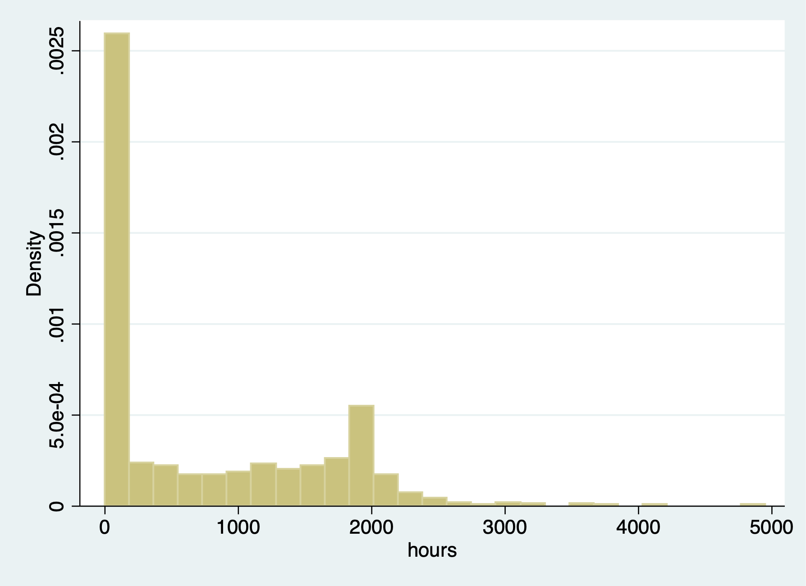
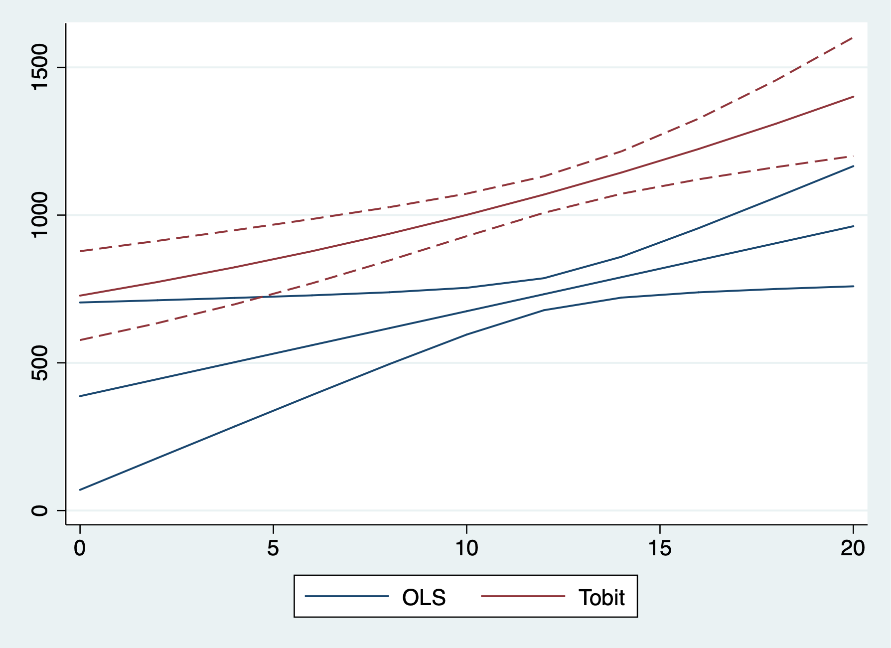

# Corner Solution - Tobit Model

## Married Women's Annual Labor Supply {-}

**Lesson:** 
  1. Tobit and OLS have the same sign; 
  2. Tobit and OLS magnitudes are not directly comparable. We need an adjustment factor, or use marginal effects.

We'll look at hours of labor being supplied. We have data on married women' annual labor supply with hours of work for wage in the labor force. There are 428 women employed with hours, and 325
women have no hours. Since we have a sizable about of 0 (corner soluation), we can use a Tobit model.

Summarize hours
```{stata hours1}
cd "/Users/Sam/Desktop/Econ 645/Data/Wooldridge"
use mroz.dta, clear
sum hours
tab inlf, sum(hours)
tab hours if hours == 0
tabstat hours, by(inlf) stat(mean median sd)
```

We have 325 women who had 0 hours.
```{stata hours2, eval=FALSE}
histogram hours
graph export "/Users/Sam/Desktop/Econ 645/Stata/week8_hourhist.png", replace
```


We have corner solution for women have 0 hours of labor

The range for women who do have working hours - ranges from 12 to 4950 hours
```{stata hours3, eval=FALSE}
sum hours if hours > 0
```

```{stata hours3_1, echo=FALSE}
quietly {
cd "/Users/Sam/Desktop/Econ 645/Data/Wooldridge"
use mroz.dta, clear
}
sum hours if hours > 0
```

### OLS Model {-}
```{stata hours4, eval=FALSE}
est clear
eststo OLS: reg hours nwifeinc educ exper expersq age kidslt6 kidsge6
margins
```

```{stata hours4_1, echo=FALSE}
quietly {
cd "/Users/Sam/Desktop/Econ 645/Data/Wooldridge"
use mroz.dta, clear
}
est clear
eststo OLS: reg hours nwifeinc educ exper expersq age kidslt6 kidsge6
margins
```

### Tobit Model {-}
```{stata hours5, eval=FALSE}
eststo TOBIT: tobit hours nwifeinc educ exper expersq age kidslt6 kidsge6, ll(0)
quietly sum exper
local exp2=r(mean)^2
```

```{stata hours5_1, echo=FALSE}
quietly {
cd "/Users/Sam/Desktop/Econ 645/Data/Wooldridge"
use mroz.dta, clear
est clear
}
eststo TOBIT: tobit hours nwifeinc educ exper expersq age kidslt6 kidsge6, ll(0)
quietly sum exper
local exp2=r(mean)^2
```

#### Average Marginal Effects {-}
Using *ystar* option with the *margins* command tells Stata to act like there is no censoring even though the model allows for it 
<a href="https://www.statalist.org/forums/forum/general-stata-discussion/general/1531196-tobit-marginal-effects">
Statelist Discussion 1531196</a>
```{stata hours6, eval=FALSE}
quietly margins, dydx(*) predict(ystar(0,.)) at(expersq=`exp2')
eststo AME: margins, dydx(*) predict(ystar(0,.)) at(expersq=`exp2') post
```

```{stata hours6_1, echo=FALSE}
quietly {
cd "/Users/Sam/Desktop/Econ 645/Data/Wooldridge"
use mroz.dta, clear
est clear
eststo TOBIT: tobit hours nwifeinc educ exper expersq age kidslt6 kidsge6, ll(0)
quietly sum exper
local exp2=r(mean)^2
}
quietly margins, dydx(*) predict(ystar(0,.)) at(expersq=`exp2')
eststo AME: margins, dydx(*) predict(ystar(0,.)) at(expersq=`exp2') post
```
Don't forget to use the *post* option when using *eststo*

#### Marginal Effects at the Average {-}
We will need to rerun the Tobit again to get our marginal effects at the average.
```{stata hours8, eval=FALSE}
quietly tobit hours nwifeinc educ exper expersq age kidslt6 kidsge6, ll(0)
eststo MEA: margins, dydx(*) predict(ystar(0,.)) at(expersq=`exp2') atmeans post
```

```{stata hours8_1, echo=FALSE}
quietly {
cd "/Users/Sam/Desktop/Econ 645/Data/Wooldridge"
use mroz.dta, clear
est clear
quietly sum exper
local exp2=r(mean)^2
}
quietly tobit hours nwifeinc educ exper expersq age kidslt6 kidsge6, ll(0)
eststo MEA: margins, dydx(*) predict(ystar(0,.)) at(expersq=`exp2') atmeans post
```

Compare our results. Remember we cannot directly OLS and Tobit due to the scale factor.
```{stata hours9, eval=FALSE}
esttab OLS TOBIT, mtitle
```

```{stata hours9_1, echo=FALSE}
quietly {
cd "/Users/Sam/Desktop/Econ 645/Data/Wooldridge"
use mroz.dta, clear
est clear
quietly sum exper
local exp2=r(mean)^2
eststo OLS: reg hours nwifeinc educ exper expersq age kidslt6 kidsge6
eststo TOBIT: tobit hours nwifeinc educ exper expersq age kidslt6 kidsge6, ll(0)
}
esttab OLS TOBIT, mtitle
```

Compare OLS and Average Marginal Effects and Marginal Effects at the Average.
```{stata hours10, eval=FALSE}
esttab OLS AME MEA, mtitle("OLS" "AME" "MEA")
```

```{stata hours10_1, echo=FALSE}
quietly {
cd "/Users/Sam/Desktop/Econ 645/Data/Wooldridge"
use mroz.dta, clear
est clear
quietly sum exper
local exp2=r(mean)^2
eststo OLS: reg hours nwifeinc educ exper expersq age kidslt6 kidsge6
eststo TOBIT: tobit hours nwifeinc educ exper expersq age kidslt6 kidsge6, ll(0)
eststo AME: margins, dydx(*) predict(ystar(0,.)) at(expersq=`exp2') post
tobit hours nwifeinc educ exper expersq age kidslt6 kidsge6, ll(0)
eststo MEA: margins, dydx(*) predict(ystar(0,.)) at(expersq=`exp2') atmeans post
}
esttab OLS AME MEA, mtitle("OLS" "AME" "MEA")
```

When we compare marginal effects, we see that an additional year of education increases annual hours by 48 to 52 hours with the Tobit estimator. We see that an additional child less than 6 reduces the annual hours by a range of 530 to 577 hours.

### Graph Results {-}
```{stata hours11, eval=FALSE}
est clear
```

#### OLS Model {-}
```{stata hours12, eval=FALSE}
quietly reg hours nwifeinc educ exper expersq age kidslt6 kidsge6
eststo OLS: quietly margins, at(educ=(0(2)20)) post
```

#### Tobit Model {-}
```{stata hours13, eval=FALSE}
quietly tobit hours nwifeinc educ exper expersq age kidslt6 kidsge6, ll(0)
eststo Tobit: quietly margins, at(educ=(0(2)20)) predict(e(0,6000)) post
```

#### Coefplot {-}
```{stata hours14, eval=FALSE}
coefplot (OLS, ciopts(recast(rline) lpattern(solid))) (Tobit, ciopts(recast(rline) lpattern(dash))), at recast(line)

graph export "/Users/Sam/Desktop/Econ 645/Stata/week8_tobitols.png", replace
```



# Poisson Regression

**Lesson:** We should use a count model when we have a Poisson distribution for the outcome of interest. Our coefficients are expected log counts so we *need to transform our coefficients for interpretation.


We want to look at arrest data to see the number of times a man was arrested in 1986. There are 1,970 zeros out of 2,725 men in the sample and only eight observations are greater than 5. An OLS will not account for a count model but a Poisson distribution will.

We have 
  1. pcnv - proportion of prior arrest that lead to a conviction 
  2. avgsen - the average sentence served from prior convictions (in months)
  3. tottime - months spent in prison since age 18 prior to 1986
  4. ptime86 - months spent in prison in 1986
  5. qemp86 - number of quarters that the person was legally employed in 1986
  6. inc86 - income in 1986
  7. Hispanic - Hispanic/Latino binary
  8. Black - Black binary
  9. ptime86 - prison time in 1986 

$$ narr86_{t}=\alpha + \beta_1 pcnv_t + \beta_2 avgsen_t + \beta_3 tottime_t + \beta_4 ptime86_t + \beta_5 qemp86_t + \beta_6 inc86_t + x'_t\delta + \varepsilon_t  $$

### OLS {-}
```{stata poisson1}
cd "/Users/Sam/Desktop/Econ 645/Data/Wooldridge"
use "crime1.dta", clear
reg narr86 pcnv avgsen tottime ptime86 qemp86 inc86 black hispan born60 
```

### Poisson {-}
We use the *poisson* command to estimate a Poisson regression. **Our coefficients are the change in expected log counts.** We will need a transformation to interpret the results.

```{stata poisson2, eval=FALSE}
poisson narr86 pcnv avgsen tottime ptime86 qemp86 inc86 black hispan born60 
```

```{stata poisson2_1, echo=FALSE}
quietly {
cd "/Users/Sam/Desktop/Econ 645/Data/Wooldridge"
use "crime1.dta", clear
}
poisson narr86 pcnv avgsen tottime ptime86 qemp86 inc86 black hispan born60 
```

Test \( E(y|x)=Var(y|x) \)
```{stata poisson3, eval=FALSE}
estat gof
```

```{stata poisson3_1, echo=FALSE}
quietly {
cd "/Users/Sam/Desktop/Econ 645/Data/Wooldridge"
use "crime1.dta", clear
poisson narr86 pcnv avgsen tottime ptime86 qemp86 inc86 black hispan born60  
}
estat gof
```

#### Factor Change Interpretation {-}
\( \Delta pcnv = .01 \) so 
```{stata poisson4}
display (exp(-.402*.01)-1)*100
```

A 1 percentage point increase in prior arrest decreases **expected number** of arrests by 0.4%

A discrete change in a binary - the coefficient on Black
```{stata possion5}
display (exp(0.6608)-1)*100 
```

This means that the **expected number** of arrests for a Black person is 93.7% higher than the expected number of arrests for a White person.

We can use the command *listcoef* as well, where \( e^{\beta} \) or \( (e^{\beta}-1)*100 \) depending upon the option called percent.

```{stata possion6, eval=FALSE}
scc install listcoef
listcoef, help
listcoef, percent help
```

#### Marginal Effects {-}

**Interpretation:** The marginal change in a continuous variable depends on the expected value of \( y \)
given \( x \), so we have to calculate marginal effects by specifing x at their means or calculate average marginal effects.

**Note:** be careful with the change in percentage points for pcnv, we want a 1 percentage or 10 percentage point change not a change of 1 (or 100 percentage points)

```{stata poisson7, eval=FALSE}
margins, dydx(*)
```

```{stata poisson7_1, echo=FALSE}
quietly {
cd "/Users/Sam/Desktop/Econ 645/Data/Wooldridge"
use "crime1.dta", clear
poisson narr86 pcnv avgsen tottime ptime86 qemp86 inc86 black hispan born60  
}
margins, dydx(*)
```

#### Incident-Rate Ratios {-}

```{stata poisson8, eval=FALSE}
poisson narr86 pcnv avgsen tottime ptime86 qemp86 inc86 black hispan born60, irr
```

```{stata poisson8_1, echo=FALSE}
quietly {
cd "/Users/Sam/Desktop/Econ 645/Data/Wooldridge"
use "crime1.dta", clear
}
poisson narr86 pcnv avgsen tottime ptime86 qemp86 inc86 black hispan born60, irr
```
# Negative Binomial Regression Model
**Lesson: When overdispersion occurs, we could estimate a Negative Binomial Regression model. We'll see that our standard errors might be too large if our main Poisson assumption mean=variance fails.**

### Poisson {-}

First, we will estimate a poisson regression.

```{stata nbr1, eval=FALSE}
cd "/Users/Sam/Desktop/Econ 645/Data/Wooldridge"
use "crime1.dta", clear
est clear
eststo PRM: poisson narr86 pcnv avgsen tottime ptime86 qemp86 inc86 black hispan born60 
```

### Negative Binomial {-}
We use the *nbreg* command to estimate a negative binomial regression.
```{stata nbr2, eval=FALSE}
eststo NBRM: nbreg narr86 pcnv avgsen tottime ptime86 qemp86 inc86 black hispan born60 
```

```{stata nbr2_1, echo=FALSE}
quietly {
cd "/Users/Sam/Desktop/Econ 645/Data/Wooldridge"
use "crime1.dta", clear
est clear
}
eststo NBRM: nbreg narr86 pcnv avgsen tottime ptime86 qemp86 inc86 black hispan born60 
```

First, our coefficients are the change in **expected log counts**, so we need some transformations
to provide interpretations. 

Second, our test for over dispersion can be seen at the bottom of our NBRM output with the LR test of \( \alpha = 0 \)

#### Factor Change {-}
We can manually calculate \( e^{\beta} \) to interpret the results with a factor change, or we can use the *listcoef* command:
```{stata nbr3, eval=FALSE}
listcoef, percent help
listcoef, help
```

```{stata nbr3_1, echo=FALSE}
quietly {
cd "/Users/Sam/Desktop/Econ 645/Data/Wooldridge"
use "crime1.dta", clear
nbreg narr86 pcnv avgsen tottime ptime86 qemp86 inc86 black hispan born60 
}
listcoef, percent help
listcoef, help
```

Let's look at pcnv:
```{stata nbr4}
display exp(-.4771*.1)-1
```

A 10 percentage point increase in proportion of prior arrests that lead to conviction decrease the expected number of arrests by 4.7% holding all others constant.

Let's look at avgsen:
```{stata nbr5}
display (exp(0.01974)-1)
```
a 1 month increase in total time served in prision from prior convictions before 1986 increases the expected number of arrests holding all others constant.

```{stata nbr6, eval=FALSE}
esttab, mtitle
```

```{stata nbr6_1, echo=FALSE}
quietly {
cd "/Users/Sam/Desktop/Econ 645/Data/Wooldridge"
use "crime1.dta", clear
est clear
eststo PRM: poisson narr86 pcnv avgsen tottime ptime86 qemp86 inc86 black hispan born60 
eststo NBRM: nbreg narr86 pcnv avgsen tottime ptime86 qemp86 inc86 black hispan born60 
}
esttab, mtitle
```
#### Marginal Effects {-}
Interpretation is similar to Poisson
The marginal change in a continuous variable depends on the expected value of y
given x, so we have to specify x with atmeans or average marginal effects

```{stata nbr7, eval=FALSE}
margins, dydx(*)
```

```{stata nbr7_1, echo=FALSE}
quietly {
cd "/Users/Sam/Desktop/Econ 645/Data/Wooldridge"
use "crime1.dta", clear
est clear
eststo NBRM: nbreg narr86 pcnv avgsen tottime ptime86 qemp86 inc86 black hispan born60 
}
margins, dydx(*)
```

#### Incident Rate Ratios {-}

We can also use the option *irr* to calcualte incident-rate ratios.

```{stata nbr8, eval=FALSE}
nbreg narr86 pcnv avgsen tottime ptime86 qemp86 inc86 black hispan born60, irr
```

```{stata nbr8_1, echo=FALSE}
quietly {
cd "/Users/Sam/Desktop/Econ 645/Data/Wooldridge"
use "crime1.dta", clear
}
nbreg narr86 pcnv avgsen tottime ptime86 qemp86 inc86 black hispan born60, irr
```