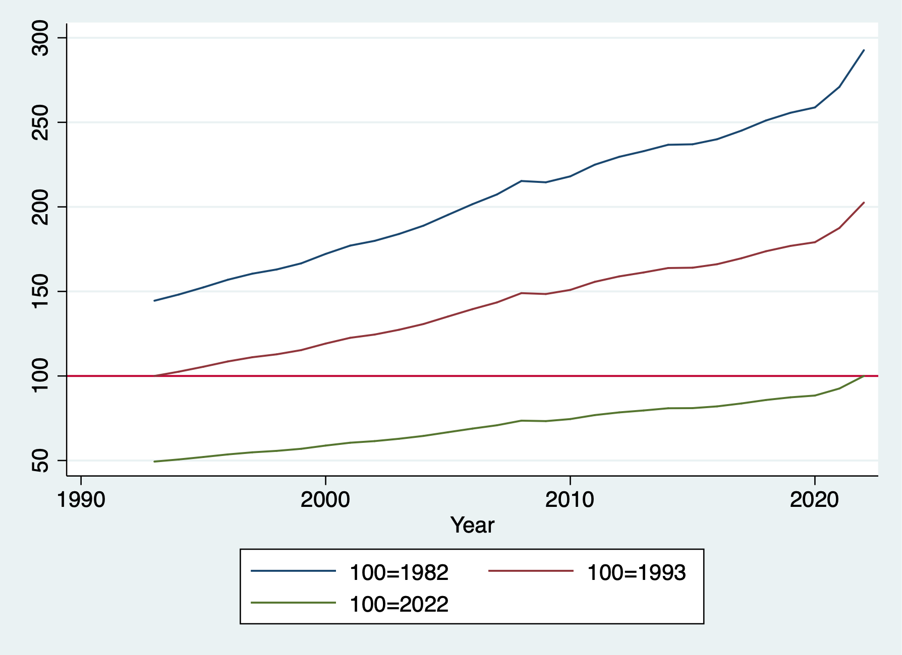

# Processing observations across subgroups

One thing Stata easily provides are commands and options for subgroup
analysis. We can use the by prefix command to create and analyze subgroups
or cross-sectional units in a panel data set.

## Obtaining separate results for subgroups

*Tabulate* is a very helpful command to analyze categorical variables, or occassionally look through continuous variables (as long as there aren't too many values). 

The *tabulate* command has an option to summarize a continuous variable when tabulating categorical variables.

```{stata sub1}
cd "/Users/Sam/Desktop/Econ 645/Data/Mitchell"
use wws2, clear
tabulate married, summarize(wage)
```

Another option is using the bysort prefix command.
```{stata sub2, eval=FALSE}
bysort married: summarize wage
```

```{stata sub2_1, echo=FALSE}
quietly {
cd "/Users/Sam/Desktop/Econ 645/Data/Mitchell"
use wws2, clear
}
bysort married: summarize wage
```

We can also correlate data within groups instead of using qualifiers and additional statements.

With qualifiers
```{stata sub3, eval=FALSE}
correlate wage age if married == 0
correlate wage age if married == 1
```

```{stata sub3_1, echo=FALSE}
quietly {
cd "/Users/Sam/Desktop/Econ 645/Data/Mitchell"
use wws2, clear
}
correlate wage age if married == 0
correlate wage age if married == 1
```

Using bysort accomplishes this in one command
```{stata sub4, eval=FALSE}
bysort married: correlate wage age
```

```{stata sub4_1, echo=FALSE}
quietly {
cd "/Users/Sam/Desktop/Econ 645/Data/Mitchell"
use wws2, clear
}
bysort married: correlate wage age
```

Using bysort accomplishes even faster if we have a categorical variable with many categories
```{stata sub5, eval=FALSE}
bysort race: correlate wage age
```

```{stata sub5_1, echo=FALSE}
quietly {
cd "/Users/Sam/Desktop/Econ 645/Data/Mitchell"
use wws2, clear
}
bysort race: correlate wage age
```

## Computing values separately by subgroups

The by prefix command and the *egen* command is a powerful combination that
makes aggregating group statistics much easier than other statistical 
software packages

*Bysort* and *egen* makes aggregating by groups much easier than other software. R has aggregate which is flexible and powerful, but requires more coding compared to *egen*.

I'm not the biggest fan of Mitchell's examples with *bysort var: egen*, but they get the job done. I would like us to use some CPS examples with *bysort* and *egen*.

With bysort var: egen we can calculate subgroup statistics, counts, summations
with one easy line of code
```{stata sub6}
cd "/Users/Sam/Desktop/Econ 645/Data/Mitchell"
use tv1, clear
list, sepby(kidid)
```

If we want to calculate the average tv time for each kid we first sort by
the child id and then use egen. We may have multiple levels and we can use 
bysort to find the multiple level identifiers such as id, year, and month of year.

```{stata sub7, eval=FALSE}
bysort kidid: egen avgtv = mean(tv)
sort kidid
list kidid tv avgtv, sepby(kidid)
```

```{stata sub7_1, echo=FALSE}
quietly {
cd "/Users/Sam/Desktop/Econ 645/Data/Mitchell"
use tv1, clear
}
bysort kidid: egen avgtv = mean(tv)
sort kidid
list kidid tv avgtv, sepby(kidid)
```

If we want the standard deviation of the child's tv watching.Let's generate some z-scores and look at the statistics.
```{stata sub8, eval=FALSE}
bysort kidid: egen sdtv = sd(tv)
generate ztv = (tv-avgtv)/sdtv
list 
```

```{stata sub8_1, echo=FALSE}
quietly {
cd "/Users/Sam/Desktop/Econ 645/Data/Mitchell"
use tv1, clear
bysort kidid: egen avgtv = mean(tv)
}
bysort kidid: egen sdtv = sd(tv)
generate ztv = (tv-avgtv)/sdtv
list 
```

Let's generate some subgroup statistics for a binary variable vac.
Where vac=0 if the kid was not on vacation and vac=1 if the kid was on vacation.
```{stata sub9, eval=FALSE}
bysort kidid: egen vac_total = total(vac)
bysort kidid: egen vac_sd = sd(vac)
bysort kidid: egen vac_min = min(vac)
bysort kidid: egen vac_max = max(vac)
list kidid vac*, sepby(kidid) abb(10)
```

```{stata sub9_1, echo=FALSE}
quietly {
cd "/Users/Sam/Desktop/Econ 645/Data/Mitchell"
use tv1, clear
bysort kidid: egen avgtv = mean(tv)
bysort kidid: egen sdtv = sd(tv)
generate ztv = (tv-avgtv)/sdtv
}
bysort kidid: egen vac_total = total(vac)
bysort kidid: egen vac_sd = sd(vac)
bysort kidid: egen vac_min = min(vac)
bysort kidid: egen vac_max = max(vac)
list kidid vac*, sepby(kidid) abb(10)
```

Let's see if some kids watch less than 4 hours of tv per day.
We'll generate a binary/dummy variable to be 1 if equal to or less than 4 hours
a day and 0 if it is greater than 4 hours a day.
```{stata sub10, eval=FALSE}
generate tvlo = (tv < 4) if !missing(tv)
```

We can generate individual level subgroup analysis with bysort and egen on
binary variables
```{stata sub11, eval=FALSE}
bysort kidid: egen tvlocnt = count(tvlo)
bysort kidid: egen tvlototal = total(tvlo)
bysort kidid: egen tvlosum = sum(tvlo)
bysort kidid: gen tvlosum2 = sum(tvlo)
bysort kidid: egen tvlosame = sd(tvlo)
bysort kidid: egen tvloall = min(tvlo)
bysort kidid: egen tvloever = max(tvlo)
list kidid tv tvlo*, sepby(kidid) abb(20)
```

```{stata sub11_1, echo=FALSE}
quietly {
cd "/Users/Sam/Desktop/Econ 645/Data/Mitchell"
use tv1, clear
bysort kidid: egen avgtv = mean(tv)
bysort kidid: egen sdtv = sd(tv)
generate ztv = (tv-avgtv)/sdtv
bysort kidid: egen vac_total = total(vac)
bysort kidid: egen vac_sd = sd(vac)
bysort kidid: egen vac_min = min(vac)
bysort kidid: egen vac_max = max(vac)
generate tvlo = (tv < 4) if !missing(tv)
}
bysort kidid: egen tvlocnt = count(tvlo)
bysort kidid: egen tvlototal = total(tvlo)
bysort kidid: egen tvlosum = sum(tvlo)
bysort kidid: gen tvlosum2 = sum(tvlo)
bysort kidid: egen tvlosame = sd(tvlo)
bysort kidid: egen tvloall = min(tvlo)
bysort kidid: egen tvloever = max(tvlo)
list kidid tv tvlo*, sepby(kidid) abb(20)
```

Notice how *count()* provides the number of observations for each kid, while
*total()* returns a constant for the sum of all values, but so does *egen sum()*.
The problem is that there is a *gen var = sum(var2)* function that returns 
a **running sum** that we see in tvsum2. Use *egen sum* with caution if you want a cumulative sum. If you want a cumulative sum use *egen total()*.

We have our central tendencies functions with 

  1. *mean()*, 
  2. *median()*, 
  3. *mode()*.
  
We can find percentiles with 

  1. *pctile(var), p(#)*.

We have other *egen* functions that may be of help, such as 

  1. Interquartile Range *iqr()*,
  2. Median Absolute Deviation *mad()*, 
  3. Mean Absolute Deviation *mdev()*,
  4. Kurtosis *kurt()*
  5. Skewness *skew()*.
  6. Other functions
```{stata sub12, eval=FALSE}
help egen
```

Mitchell has a good note here:

*Egen mean()* takes an arguement, not a varlist, so if you put 
*bysort idvar: egen meanvars1_5=mean(var1-var5)*, *mean()* will return not the
means of vars 1 through 5, but var1 minus var5.


## Subscripting or Indexing: Computing values within subgroups: 

Unsolicated Opinion Alert:
Subscripting (or I may accidently call it indexing) is a very powerful tool
that I personally think puts Stata as the top paid statistical software 
(I do think that R is more powerful and more flexible, but Stata balances
power, flexibility, and ease of learning). 


Each variable is a vector x1=x[x11, x12, x13,...,x1N] for i=1,...,N observations
We can use a subscript or index to call which part of the vector we want to
return.
```{stata index1}
cd "/Users/Sam/Desktop/Econ 645/Data/Mitchell"
use tv1, clear
list, sepby(kidid)
```

If we want the first observation in our tv vector we can call it with [1]
```{stata index2, eval=FALSE}
display tv[1]
```

```{stata index2_1, echo=FALSE}
quietly {
cd "/Users/Sam/Desktop/Econ 645/Data/Mitchell"
use tv1, clear  
}
display tv[1]
```

We can look at the first kid id and date and time
```{stata index3, eval=FALSE}
display "kid: " kidid[1] ", Date: " dt[1] ", Sex: " female[1] ", TV Hours: " tv[1]
```

```{stata index3_1, echo=FALSE}
quietly {
cd "/Users/Sam/Desktop/Econ 645/Data/Mitchell"
use tv1, clear  
}
display "kid: " kidid[1] ", Date: " dt[1] ", Sex: " female[1] ", TV Hours: " tv[1]
```

We can see the second observation
```{stata index4, eval=FALSE}
display tv[2]
```

```{stata index4_1, echo=FALSE}
quietly {
cd "/Users/Sam/Desktop/Econ 645/Data/Mitchell"
use tv1, clear  
}
display tv[2]
```

We can see the difference between the two observations
```{stata index5, eval=FALSE}
display tv[2]-tv[1]
```

```{stata index5_1, echo=FALSE}
quietly {
cd "/Users/Sam/Desktop/Econ 645/Data/Mitchell"
use tv1, clear  
}
display tv[2]-tv[1]
```

**Note:** we have some very useful system variables of _N and _n 
_N is total number of observations and when used in the subscript/index
it will return the last observation

_n is current number of observations or observation number and when used in
the subscript/index it will return the current observation (almost like i=i+1)
```{stata index6, eval=FALSE}
help system variables
```

Subscripting is very helpful when working Panel Data. You can index within
cross-sectional units over time with ease. The subscript (or index) will 
return the nth observation given

If we want the first observation to be compared to all observations
```{stata index7}
cd "/Users/Sam/Desktop/Econ 645/Data/Mitchell"
use tv1, clear
bysort kidid: gen tv_1ob = tv[1]
list kidid tv tv_1ob, sepby(kidid)
```

If we want to compare the last observation to all observations
```{stata index8, eval=FALSE}
bysort kidid: gen tv_lastob = tv[_N]
list kidid tv tv_lastob, sepby(kidid)
```

```{stata index8_1, echo=FALSE}
quietly {
cd "/Users/Sam/Desktop/Econ 645/Data/Mitchell"
use tv1, clear
}
bysort kidid: gen tv_lastob = tv[_N]
list kidid tv tv_lastob, sepby(kidid)
```

If we want the second to last observation
```{stata index9, eval=FALSE}
bysort kidid: gen tv_2tolastob = tv[_N-1]
list kidid tv tv_2tolastob, sepby(kidid)
```

```{stata index9_1, echo=FALSE}
quietly {
cd "/Users/Sam/Desktop/Econ 645/Data/Mitchell"
use tv1, clear
bysort kidid: gen tv_1ob = tv[1]
bysort kidid: gen tv_lastob = tv[_N]
}

bysort kidid: gen tv_2tolastob = tv[_N-1]
list kidid tv tv_2tolastob, sepby(kidid)
```

If we want the prior observation (lag of 1)
```{stata index10, eval=FALSE}
bysort kidid: gen tv_lagob = tv[_n-1]
list kidid tv tv_lagob, sepby(kidid)
```

```{stata index10_1, echo=FALSE}
quietly {
cd "/Users/Sam/Desktop/Econ 645/Data/Mitchell"
use tv1, clear
bysort kidid: gen tv_1ob = tv[1]
bysort kidid: gen tv_lastob = tv[_N]
bysort kidid: gen tv_2tolastob = tv[_N-1]
}
bysort kidid: gen tv_lagob = tv[_n-1]
list kidid tv tv_lagob, sepby(kidid)
```

If we want the next observation (lead of 1)
```{stata index11, eval=FALSE}
bysort kidid: gen tv_leadob = tv[_n+1]
list kidid tv tv_leadob, sepby(kidid)
```

```{stata index11_1, echo=FALSE}
quietly {
cd "/Users/Sam/Desktop/Econ 645/Data/Mitchell"
use tv1, clear
bysort kidid: gen tv_1ob = tv[1]
bysort kidid: gen tv_lastob = tv[_N]
bysort kidid: gen tv_2tolastob = tv[_N-1]
bysort kidid: gen tv_lagob = tv[_n-1]
}
bysort kidid: gen tv_leadob = tv[_n+1]
list kidid tv tv_leadob, sepby(kidid)
```

You can use *bysort kidid (dt)* to tell Stata to order by kid id and date,
but NOT INCLUDE dt in the grouping.

If we use kidid AND tv <i>bysort kidid tv: egen</i>, then we will look for observation
Within kid id AND the date. Since there is only 1 observation per kid
per date, we will only have 1 observation for each grouping.
If we want the first observation to be compared to all observations
```{stata index12}
cd "/Users/Sam/Desktop/Econ 645/Data/Mitchell"
use tv1, clear
bysort kidid (dt): gen tv_1ob1 = tv[1]
bysort kidid dt: gen tv_1ob2 = tv[1]
list kidid tv tv_1ob*, sepby(kidid)
```

If we want to compare the last observation to all observations
```{stata index13, eval=FALSE}
bysort kidid (dt): gen tv_lastob1 = tv[_N]
bysort kidid dt: gen tv_lastob2 = tv[_N]
list kidid tv tv_lastob*, sepby(kidid)
```

```{stata index13_1, echo=FALSE}
quietly {
cd "/Users/Sam/Desktop/Econ 645/Data/Mitchell"
use tv1, clear
bysort kidid (dt): gen tv_1ob1 = tv[1]
bysort kidid dt: gen tv_1ob2 = tv[1]
}
bysort kidid (dt): gen tv_lastob1 = tv[_N]
bysort kidid dt: gen tv_lastob2 = tv[_N]
list kidid tv tv_lastob*, sepby(kidid)
```

If we want the prior observation (lag of 1)
```{stata index14, eval=FALSE}
bysort kidid (dt): gen tv_lagob1 = tv[_n-1]
bysort kidid dt: gen tv_lagob2 = tv[_n-1]
list kidid tv tv_lagob*, sepby(kidid)
```

```{stata index14_1, ech=FALSE}
quietly {
cd "/Users/Sam/Desktop/Econ 645/Data/Mitchell"
use tv1, clear
bysort kidid (dt): gen tv_1ob1 = tv[1]
bysort kidid dt: gen tv_1ob2 = tv[1]
bysort kidid (dt): gen tv_lastob1 = tv[_N]
bysort kidid dt: gen tv_lastob2 = tv[_N]
}
bysort kidid (dt): gen tv_lagob1 = tv[_n-1]
bysort kidid dt: gen tv_lagob2 = tv[_n-1]
list kidid tv tv_lagob*, sepby(kidid)
```

## Computing values within subgroups: Computations across observations

Another powerful combination with subscripting/indexing is that we can the 
generate command to create new variables that perform mathematical operators 
on different observations WITHIN the vector

Difference in tv time between current period and prior period
```{stata index15}	
cd "/Users/Sam/Desktop/Econ 645/Data/Mitchell"
use tv1, clear
bysort kidid (dt): generate tvdfp = tv - tv[_n-1]
list
```

Difference in tv time between current period and next period 
```{stata index16, eval=FALSE}
bysort kidid (dt): generate tvdfs = tv - tv[_n+1]
```

Difference in tv time between current period and first period
```{stata index17, eval=FALSE}
bysort kidid (dt): generate tvdff = tv - tv[1]
```

Difference in tv time between current period and last period
```{stata index18, eval=FALSE}
bysort kidid (dt): generate tvdfl = tv - tv[_N]
```

Difference between current period and 3-year moving average over time
```{stata index19, eval=FALSE}
bysort kidid (dt): generate tv3avg = (tv[_n-1] + tv[_n] + tv[_n+1])/3
list kidid dt tvd* tv3avg
```

```{stata index19_1, echo=FALSE}
quietly {
cd "/Users/Sam/Desktop/Econ 645/Data/Mitchell"
use tv1, clear
bysort kidid (dt): generate tvdfp = tv - tv[_n-1]
bysort kidid (dt): generate tvdfs = tv - tv[_n+1]
bysort kidid (dt): generate tvdff = tv - tv[1]
bysort kidid (dt): generate tvdfl = tv - tv[_N]
}
bysort kidid (dt): generate tv3avg = (tv[_n-1] + tv[_n] + tv[_n+1])/3
list kidid dt tvd* tv3avg
```

We can also rebase our vector. For example, we can rebase a deflator for the
period dollars we want.
```{stata index20}
cd "/Users/Sam/Desktop/Econ 645/Data/Mitchell"
import excel using "cpi_1993_2023.xlsx", cellrange(A12:P42) firstrow clear
keep Year Annual
```
Rebase in 1993 Dollars
```{stata index21, eval=FALSE}
gen rebase93 = Annual/Annual[1]*100
```
Rebase in 2022 Dollars
```{stata index22, eval=FALSE}
gen rebase22 = Annual/Annual[_N]*100
```
Rebase to 2012
```{stata index23, eval=FALSE}
gen rebase12 = Annual/Annual[_N-10]*100
list
```

```{stata index23_1, echo=FALSE}
quietly {
cd "/Users/Sam/Desktop/Econ 645/Data/Mitchell"
import excel using "cpi_1993_2023.xlsx", cellrange(A12:P42) firstrow clear
keep Year Annual
gen rebase93 = Annual/Annual[1]*100
gen rebase22 = Annual/Annual[_N]*100
}
gen rebase12 = Annual/Annual[_N-10]*100
list
```


```{stata index24, eval=FALSE}
graph twoway line Annual Year || line rebase93 Year || ///
	line rebase22 Year, yline(100) ///
	legend(order(1 "100=1982" 2 "100=1993" 3 "100=2022"))
graph export "/Users/Sam/Desktop/Econ 645/Stata/week8_bls.png", replace
```	



## Computing values within subgroups: Running sums

As we mentioned earlier, when we use *egen sum* vs *gen sum*, we get different 
results. *Egen sum()* is similar to *egen total()*, but it can be confusing.
When we use *gen* with *sum()*, we generate a **RUNNING** sum not a constant of total.

We can generate the tv running sum across all individuals over time
```{stata index25}
cd "/Users/Sam/Desktop/Econ 645/Data/Mitchell"
use tv1, clear
generate tvrunsum = sum(tv)
```

We can generate the tv running sum within an individuals time period
```{stata index26, eval=FALSE}
bysort kidid (dt): generate bytvrunsum=sum(tv)
```

We can generate the total sum with an individuals time period
```{stata index27, eval=FALSE}
bysort kidid (dt): egen bytvsum=total(tv)
```

We can generate the total sum for all individuals over time
```{stata index28, eval=FALSE}
egen tvsum = total(tv)
```
We can also calculate a running average
```{stata index29, eval=FALSE}
bysort kidid (dt): generate bytvrunavg=sum(tv)/_n
```

We can compute the individual's average average
```{stata index30, eval=FALSE}
bysort kidid (dt): egen bytvavg = mean(tv)
list kidid tv tv* by*, sepby(kidid)
```

```{stata index30_1, echo=FALSE}
quietly {
cd "/Users/Sam/Desktop/Econ 645/Data/Mitchell"
use tv1, clear
generate tvrunsum = sum(tv)
bysort kidid (dt): generate bytvrunsum=sum(tv)
bysort kidid (dt): egen bytvsum=total(tv)
egen tvsum = total(tv)
bysort kidid (dt): generate bytvrunavg=sum(tv)/_n
}
bysort kidid (dt): egen bytvavg = mean(tv)
list kidid tv tv* by*, sepby(kidid)
```


## Computing values within subgroups: More examples

There are other useful calculations we can do with subscripting/indexing.
Some do overlap with egen, but it is helpful to know the differences.

### Counting {-}

Count the number of observations: this can be done with subscripting or egen
depending upon what we want
```{stata count1}
cd "/Users/Sam/Desktop/Econ 645/Data/Mitchell"
use tv1, clear

*Generate total observation count per individual missing or not missing:
bysort kidid (dt): generate idcount=_N

*Generate the total observation without missing
bysort kidid (dt): egen idcount_nomiss = count(tv)

*Generate a running count of an observation
bysort kidid (dt): gen idruncount = _n
list, sepby(kidid)
```

### Generate Binaries {-}

We can generate binary variables to find first and last observations or nth
observation. This differences from id counts, we are generating binaries for
when the qualifier is true.

```{stata binary1}
cd "/Users/Sam/Desktop/Econ 645/Data/Mitchell"
use tv1, clear

*Find individuals with only one observation
bysort kidid (dt): generate singleob = (_N==1)

*Find the first observation of an individual
bysort kidid (dt): generate firstob = (_n==1)

*Find the last observation of an individual 
bysort kidid (dt): generate lastob = (_n==_N)
list, sepby(kidid)
```

We can create binaries depending upon leads and lags too.
Look for a change in vac
```{stata lags1}
cd "/Users/Sam/Desktop/Econ 645/Data/Mitchell"
use tv1, clear
bysort kidid (dt): generate vacstart=(vac==1) & (vac[_n-1]==0)
bysort kidid (dt): generate vacend=(vac==1) & (vac[_n+1]==0)
list kidid dt vac*, sepby(kidid)
```

### Fill in Missing {-}
Another useful tool that we should use with caution is filling in missings.
This should only really be applied when we have a constant variable that 
does not change over time.
```{stata missing1}
cd "/Users/Sam/Desktop/Econ 645/Data/Mitchell"
use tv2, clear
sort kidid dt
list, sepby(kidid)
```

We can backfill the observation with the last nonmissing observation.
First generate a copy of the variable with missing values.
```{stata missing2, eval=FALSE}
generate tvimp1 = tv
bysort kidid (dt): replace tvimp1 = tv[_n-1] if missing(tv)
list kidid dt tv tvimp1, sepby(kidid)
```

```{stata missing2_1, echo=FALSE}
quietly {
cd "/Users/Sam/Desktop/Econ 645/Data/Mitchell"
use tv2, clear
sort kidid dt 
}
generate tvimp1 = tv
bysort kidid (dt): replace tvimp1 = tv[_n-1] if missing(tv)
list kidid dt tv tvimp1, sepby(kidid)
```

Notice that we are still missing the 3rd observation for the 3rd kid.
It cannot backfill the 3rd observation from the second observation, since
the second observation is missing. There are a couple of strategies to use
We can generate a new variable like Mitchell.
```{stata missing3, eval=FALSE}
generate tvimp2 = tvimp1
bysort kidid (dt): replace tvimp2 = tvimp2[_n-1] if missing(tvimp2)
list kidid tv tvimp*, sepby(kidid)
```

```{stata missing3_1, echo=FALSE}
quietly {
cd "/Users/Sam/Desktop/Econ 645/Data/Mitchell"
use tv2, clear
sort kidid dt 
generate tvimp1 = tv
bysort kidid (dt): replace tvimp1 = tv[_n-1] if missing(tv)
}
generate tvimp2 = tvimp1
bysort kidid (dt): replace tvimp2 = tvimp2[_n-1] if missing(tvimp2)
list kidid tv tvimp*, sepby(kidid)
```

You can just replace tvimp1 twice instead of generating a new variable, but
that is up to the user. You would use tv[_n-1] for the first replace and 
tvimp1[_n-1] for the second replace.

### Interpolation {-}
We may need to interpolate between 2 known values and assume a linear trend.
```{stata missing4, eval=FALSE}
generate tvimp3=tv
*Interpolate for 1 missing value between two known values
bysort kidid (dt): replace tvimp3 = (tv[_n-1]+tv[_n+1])/2 if missing(tv)
list kidid tv tvimp3, sepby(kidid)
```

```{stata missing4_1, echo=FALSE}
quietly {
cd "/Users/Sam/Desktop/Econ 645/Data/Mitchell"
use tv2, clear
sort kidid dt 
generate tvimp1 = tv
bysort kidid (dt): replace tvimp1 = tv[_n-1] if missing(tv)
generate tvimp2 = tvimp1
bysort kidid (dt): replace tvimp2 = tvimp2[_n-1] if missing(tvimp2)
}
generate tvimp3=tv
bysort kidid (dt): replace tvimp3 = (tv[_n-1]+tv[_n+1])/2 if missing(tv)
list kidid tv tvimp3, sepby(kidid)
```

This is a bit of hard coding, but you can interpolate with more than 1 missing.
```{stata missing5, eval=FALSE}
bysort kidid (dt): replace tvimp3 = ((tvimp3[4]-tvimp3[1])/3)+tvimp3[_n-1] if missing(tvimp3) & kidid==3
list kidid tv tvimp3, sepby(kidid)
```

```{stata missing5_1, echo=FALSE}
quietly {
cd "/Users/Sam/Desktop/Econ 645/Data/Mitchell"
use tv2, clear
sort kidid dt 
generate tvimp1 = tv
bysort kidid (dt): replace tvimp1 = tv[_n-1] if missing(tv)
generate tvimp2 = tvimp1
bysort kidid (dt): replace tvimp2 = tvimp2[_n-1] if missing(tvimp2)
generate tvimp3=tv
bysort kidid (dt): replace tvimp3 = (tv[_n-1]+tv[_n+1])/2 if missing(tv)
}
bysort kidid (dt): replace tvimp3 = ((tvimp3[4]-tvimp3[1])/3)+tvimp3[_n-1] if missing(tvimp3) & kidid==3
list kidid tv tvimp3, sepby(kidid)
```

### Indicators {-}

What is we want to find outliers in time-varying differences? We can generate
indicators variables to find when a variable changes more than a set limit.
For example we want to know if the tv viewing habits drop more than 2 hours 
```{stata ind1}
cd "/Users/Sam/Desktop/Econ 645/Data/Mitchell"
use tv1, clear
bysort kidid (dt): generate tvchange = tv[_n]-tv[_n-1]
bysort kidid (dt): generate tvchangerate = ((tv[_n]-tv[_n-1])/tv[_n-1])
list, sepby(kidid)
```

Generate an indicator variable to see if tvchange is less than -2. This is not
very helpful with small datasets, but it is important with larger datasets such as the CPS.

```{stata ind2, eval=FALSE}
gen tvchangeid=(tvchange <= -2) if !missing(tvchange)
list, sepby(kidid)
```

```{stata ind2_1, echo=FALSE}
quietly {
cd "/Users/Sam/Desktop/Econ 645/Data/Mitchell"
use tv1, clear
bysort kidid (dt): generate tvchange = tv[_n]-tv[_n-1]
bysort kidid (dt): generate tvchangerate = ((tv[_n]-tv[_n-1])/tv[_n-1])
list, sepby(kidid)
}
gen tvchangeid=(tvchange <= -2) if !missing(tvchange)
list, sepby(kidid)
```

## Comparing the by, tsset, xtset commands

Another way to find differences within vectors, we can use the <i>tsset</i> or <i>xtset</i>
command to establish the times series (tsset) or panel data (xtset).
We can use our bysort with subscripting/indexing.
```{stata set1}
cd "/Users/Sam/Desktop/Econ 645/Data/Mitchell"
use tv1, clear
bysort kidid (dt): generate ltv = tv[_n-1]
list, sepby(kidid)
```

### tsset {-}

Instead we can establish a time series with *tsset*

We'll need to specify that our cross-sectional groups is kidid.
We'll need to specify our date variable with dt.
We'll need to use the option, daily, to specify that time period is daily
as opposed to weeks, months, years. Or we can specify delta(1) for one day.

We can use the operator *L.var* to specify that we want to a lag of 1 day
```{stata set2}
cd "/Users/Sam/Desktop/Econ 645/Data/Mitchell"
use tv1, clear
sort kidid dt
tsset kidid dt, daily delta(1)
generate lagtv = L.tv
```

We can use the operator F.var to specify that we want a lead of 1 day
```{stata set3, eval=FALSE}
generate leadtv = F.tv
list, sepby(kidid)
```

```{stata set3_1, echo=FALSE}
quietly {
cd "/Users/Sam/Desktop/Econ 645/Data/Mitchell"
use tv1, clear
sort kidid dt
tsset kidid dt, daily delta(1)
generate lagtv = L.tv
}
generate leadtv = F.tv
list, sepby(kidid)
```


### xtset {-}

We can establish a panel series with *xtset*

We'll need to specify that our cross-sectional group is kidid.
We'll need to specify our time period is dt.
We'll use a delta of 1 to specify that the differnce is 1 day.
Or, we can use *daily*, as well

Generate a lag with the l.var operator and generate a lead with the f.var
```{stata set4}
cd "/Users/Sam/Desktop/Econ 645/Data/Mitchell"
use tv1, clear
sort kidid dt
xtset kidid dt, daily delta(1)
generate lagtv = l.tv
generate leadtv = f.tv
```

What do you notice? You can see that there are some leads and lags missing.
Why? Because there is an unbalance panel and the daily differences cannot be
computed if we are missing days. In this case, we can use the bysort with 
subscripting indexing

```{stata set5, eval=FALSE}
list, sepby(kidid)
bysort kidid (dt): gen bylagtv=tv[_n-1]
bysort kidid (dt): gen byleadtv=tv[_n+1]
list, sepby(kidid)
```

```{stata set5_1, echo=FALSE}
quietly {
cd "/Users/Sam/Desktop/Econ 645/Data/Mitchell"
use tv1, clear
sort kidid dt
xtset kidid dt, daily delta(1)
generate lagtv = l.tv
generate leadtv = f.tv
}
list, sepby(kidid)
bysort kidid (dt): gen bylagtv=tv[_n-1]
bysort kidid (dt): gen byleadtv=tv[_n+1]
list, sepby(kidid)
```

### What is the difference? xtset vs tsset {-}
From Nick Cox:
xtset allows a panel identifier only. tsset allows a time identifier only. 
Where they overlap is when two variables are supplied in which case the first 
is treated as a panel identifier and the second as a time variable. 


## Exercises


Let's grab the CPS and generate subgroup analysis. We will be using unweighted data for simplicity
  1. What are the average wages by sex?
  2. What are average wages by state
  3. What are the median wages by sex
  4. What are the median wages by state
  5. What is the 75th percentile of wages by race?
  6. What is the 25th percentile of wages by marital status?

```{stata exer, eval=FALSE}
use "/Users/Sam/Desktop/Econ 645/Data/CPS/jun23pub.dta",replace
```

Use bysort state: egen totalvar=total(var1)

