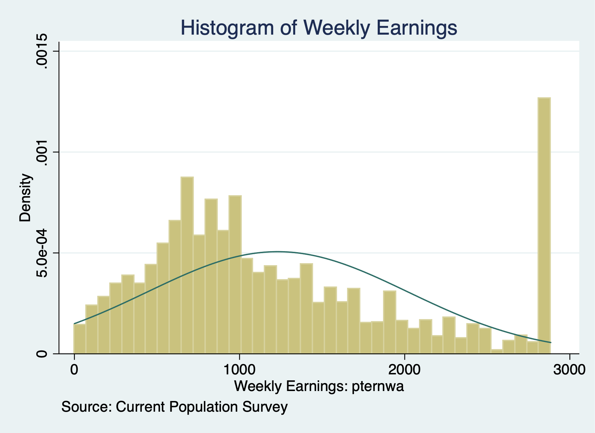
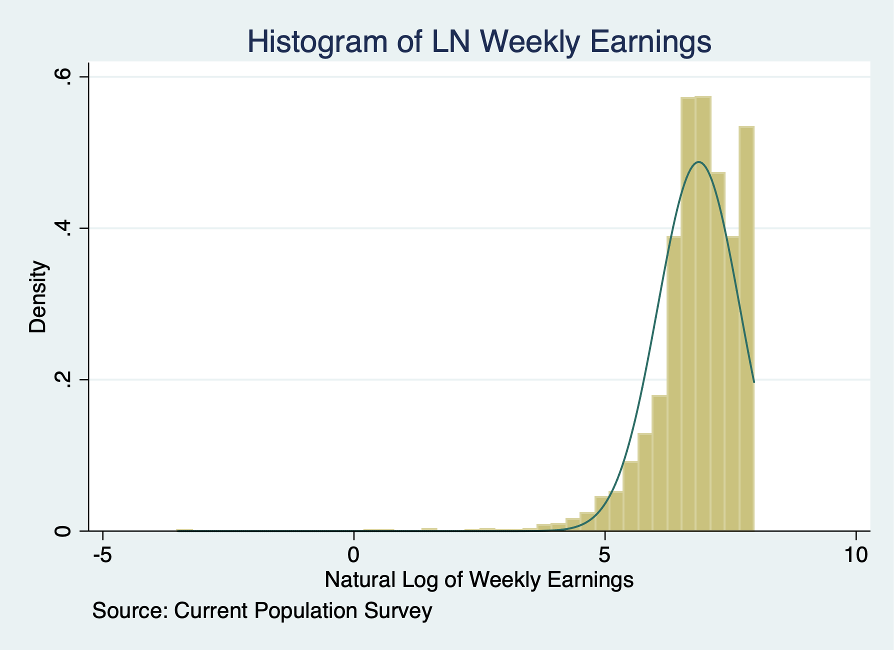
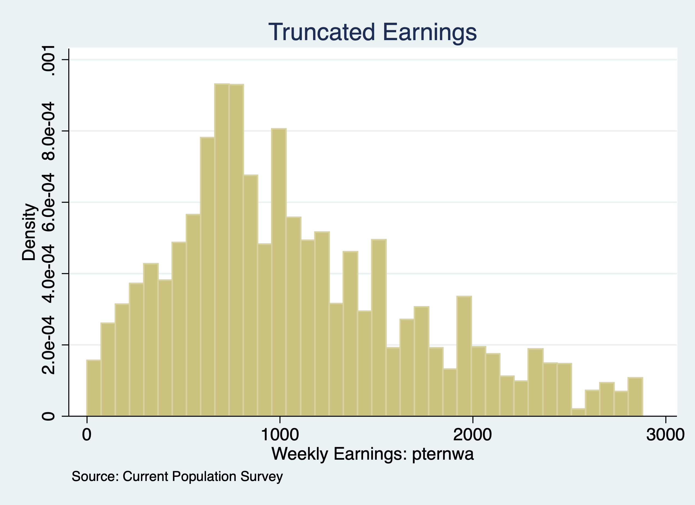

# Censored Models

## Censored Regression Model - Right-Censoring

**Lesson: We can use a Tobit estimator for right-censored model**

We need to summarize the dependent variable to see the right-censored value. We know that weekly earnings in the Current Population Survey are top-coded or right-censored at $2884.61. This may bias our estimate, so we'll compare a OLS model and a Tobit model for right-censored data. Remember a Tobit estimator for a censored model is different from a corner solution.

```{stata earnings_detail}
use "/Users/Sam/Desktop/Econ 645/Data/CPS/jan2024.dta", clear
sum earnings if prerelg==1, detail
histogram earnings if prerelg==1, normal title(Histogram of Weekly Earnings) caption("Source: Current Population Survey")
graph export "/Users/Sam/Desktop/Econ 645/R Markdown/week9_histogram_earnings.png", replace
```




Let us take a look at the natural log of earnings
```{stata lnearnings_detail}
use "/Users/Sam/Desktop/Econ 645/Data/CPS/jan2024.dta", clear
sum lnearnings, detail
histogram lnearnings if prerelg==1, normal title(Histogram of LN Weekly Earnings) caption("Source: Current Population Survey")
graph export "/Users/Sam/Desktop/Econ 645/R Markdown/week9_histogram_lnearnings.png", replace
```

We'll estimate the following Mincer Equation. 
$$ ln(wwages_{i})=\beta_{0} + \beta_{1} edu_{i} + \beta_{2} exp + \beta_{3} exp^2 \beta_{4} marital_{i} + \beta_{5} veteran_{i} + \beta_{6} union_{i} + \beta_{7} female_{i} + \beta_{8} race_{i} + u_{i} $$
We'll need to use the option, *ul(right-censored-value)* with our Tobit estimator.

```{stata, eval=FALSE}
sum lnearnings, detail
return list
local maxval `r(max)'
tobit lnearnings i.edu exp expsq i.marital i.veteran i.union i.female i.race, ul(`maxval')
```

```{stata censored_ols, echo=FALSE}
quietly use "/Users/Sam/Desktop/Econ 645/Data/CPS/jan2024.dta", clear
sum lnearnings, detail
return list
local maxval `r(max)'
tobit lnearnings i.edu exp expsq i.marital i.veteran i.union i.female i.race, ul(`maxval')
```

We will compare OLS to the Censored Regression Model
```{stata censored_ols_1, eval=FALSE}
est clear
eststo OLS: quietly reg lnearnings i.edu exp expsq i.marital i.veteran i.union i.female i.race
eststo Tobit: quietly tobit lnearnings i.edu exp expsq i.marital i.veteran i.union i.female i.race, ul(`maxval')

esttab OLS Tobit, drop(0.* 1.race* 1.mar* 1.edu) mtitle("OLS" "Tobit")
```

```{stata censored_ols_11, echo=FALSE}
quietly {
  use "/Users/Sam/Desktop/Econ 645/Data/CPS/jan2024.dta", clear
  sum lnearnings, detail
  return list
  local maxval `r(max)'
}
est clear
eststo OLS: quietly reg lnearnings i.edu exp expsq i.marital i.veteran i.union i.female i.race
eststo Tobit: quietly tobit lnearnings i.edu exp expsq i.marital i.veteran i.union i.female i.race, ul(`maxval')

esttab OLS Tobit, drop(0.* 1.race* 1.mar* 1.edu) mtitle("OLS" "Tobit")
```
**Interpretation** A very similar interpretation to OLS, but we need normality and homoskedasticity for unbiased estimator. We can use a log-linear interpretation without a scaling factor, so the returns to education would only require \((e^\beta -1)*100\) interpretation.

## Censored Regression Model - Duration analysis

**Lesson: We can look at a censored data for duration analysis similar to Wooldridge's example.** 

This differs from a top-coded data, which we can use a Tobit analysis that we just saw.


We can look at the duration of time in months between an arrests for inmates 
in a North Carolina prison after being released from prison. We want to 
evaluate a work program to see if it is effective in increasing duration 
before recidivism occurs.

<b>Note</b>: 893 inmates have not been arrested during the period they were followed
These observations are censored. The censoring times differed among inmates
ranging from 70 to 81 months.

Our dependent variable duration (time in months) is transformed by natural logarithm. 
We have a bunch of observations that recidivate between 70 and 81 months.
```{stata durat1, eval=FALSE}
use "/Users/Sam/Desktop/Econ 645/Data/Wooldridge/recid.dta", clear
tab durat
```
We have a bunch of observations that are censored after 69 months (but not all)
```{stata durat2}
use "/Users/Sam/Desktop/Econ 645/Data/Wooldridge/recid.dta", clear
tab durat cens
```

We'll use the *stset* command and set failure at cens==0. We'll use the *stset* command to time set survival.
```{stata durat3}
use "/Users/Sam/Desktop/Econ 645/Data/Wooldridge/recid.dta", clear
stset ldurat, failure(cens==0)
```

We'll use the *streg* command and set the distribution

$$ ldurat_i = \alpha + =\delta workprg_i + \beta_2 tserved_i + \beta_3 felon_i + \beta_4 alcohol_i + \beta_5 drugs_i + \beta_6 educ_i + x'_i \gamma + \varepsilon_i$$
Where \( x' \) are demographics of race, marital status, and age.

```{stata durat4,eval=FALSE}
streg workprg priors tserved felon alcohol drugs black married educ age, dist(weibull) nohr
```
```{stata durat5, echo=FALSE}
use "/Users/Sam/Desktop/Econ 645/Data/Wooldridge/recid.dta", clear
*stset is survival time set
stset ldurat, failure(cens==0)
streg workprg priors tserved felon alcohol drugs black married educ age, dist(weibull) nohr
```	

**Interpretation:**
Given the log-linear function form, we can easily determine the estimated percent change in duration before criminal recidivism.
```{stata durat6}
	display (exp(.0780722)-1)*100
```
Being a part of the work program increase the duration of time before recidivism, but it is not statistically significant.
```{stata durat7}
	display (exp(-.287139)-1)*100
```
Being a felon reduces the duration of time before recidivism, where a felon has as 24% decrease in duration of time before recidivism.

# Truncated Regression Models

We will again look at the Janurary 2024 Current Population Survey data. However, we will truncate the data at $2884 per week by dropping all observation at or above this threshold. 

## Truncated Data

We will set the threshold \(c_i \geq 2884 \). Every observation at or above this threshold will be dropped.

```{stata trun1}
use "/Users/Sam/Desktop/Econ 645/Data/CPS/jan2024.dta", clear
sum earnings if prerelg==1, detail
est clear
eststo OLS: quietly reg lnearnings i.edu exp expsq i.marital i.veteran i.union i.female i.race if prerelg==1
drop if earnings >= 2884
sum earnings if prerelg==1, detail
```

Our largest value is now $2880 weekly earnings, which is just below the threshold.

Let's look at a histogram of the truncated weekly earnings.
```{stata trun2, eval=FALSE}
histogram earnings if prerelg, title("Truncated Earnings") note("Source: Current Population Survey")
graph export "/Users/Sam/Desktop/Econ 645/Data/CPS/jan2024_trunc.png", replace
```

We no longer have a spike in density at 2884 like we did with the censored data.

## Truncated Regression Models

Next, we will use the command *truncreg* and set the option *ul()* at 2884.

```{stata trunc4, eval=FALSE}
eststo Truncated: truncreg lnearnings i.edu exp expsq i.marital i.veteran i.union i.female i.race, ul(2884)
```

```{stata trunc4_1, echo=FALSE}
quietly {
  use "/Users/Sam/Desktop/Econ 645/Data/CPS/jan2024.dta", clear
  drop if earnings >= 2884
}
eststo Truncated: truncreg lnearnings i.edu exp expsq i.marital i.veteran i.union i.female i.race if prerelg==1, ul(2884)
```

We can directly compare our OLS and Truncated Regression Model coefficients.

```{stata trunc5, eval=FALSE}
esttab OLS Truncated
```

```{stata trunc5_1, echo=FALSE}
quietly {
  use "/Users/Sam/Desktop/Econ 645/Data/CPS/jan2024.dta", clear
  sum earnings if prerelg==1, detail
  est clear
  eststo OLS: quietly reg lnearnings i.edu exp expsq i.marital i.veteran i.union i.female i.race
  drop if earnings >= 2884
  eststo Truncated: truncreg lnearnings i.edu exp expsq i.marital i.veteran i.union i.female i.race if prerelg==1, ul(2884)

}
esttab OLS Truncated, mtitle("OLS" "TRM")
```

**Interpretation**: Our union wage premium is estimated to be \( ((e^{0.067})-1)*100\% = 6.9\% \) with the OLS estimator, while our union wage premium is estimated to be 
\( ((e^{0.113})-1)*100\% = 12.0\% \).

We can see that our OLS estimates are biased upwards for education and experience, but downward biased for union wage premium.

Source: https://stats.oarc.ucla.edu/stata/output/truncated-regression/

# Sample Selection Correction
**Lesson: Similar to tobit, when we don't account for the truncation of the data, or why certain parts of the population are not sampled, we will commit a type of omitted variable bias without our lambda(zy)-hat. We can use a Heckit method for sample selection correction.**

We want to see if there is sample selection bias due to unobservable wage offers
for non-working women.

1. We need to estimate a logit or probit to test and correct for sample selection bias due to unobserved wage offer for nonworking women. Spousal income, education, experience, age, and number of kids less than 6. 
$$ ln(wages_{i})=\beta_{0}+ \mathbf{x'\beta} + u_{i} $$
Where \(\mathbf{x}\) is a vector that includes education, experience, and experience squared

2. We use the Heckit command to implement a Heckman Method for sample selection correction.

$$ ln(wages_{i})=\beta_{0}+ \mathbf{x'\beta} +\mathbf{z'\delta} + u_{i} $$
Where \( \mathbf{z}\) is a vector that includes spousal income, education, experience, age, and number of kids less than 6.

## OLS

```{stata sample1}
use "/Users/Sam/Desktop/Econ 645/Data/Wooldridge/mroz.dta", clear
reg lwage educ exper expersq 	
```

**Notice:** an assumption is used to exclude spousal income, age, kids less than 6, and kids greater than 6 from our main regression.

```{stata sample1_1, eval=FALSE}
display (exp(_b[educ])-1)*100
```

```{stata sample1_2, echo=FALSE}
quietly {
use "/Users/Sam/Desktop/Econ 645/Data/Wooldridge/mroz.dta", clear
reg lwage educ exper expersq 	
}
display (exp(_b[educ])-1)*100
```

## Heckman Method - Heckit
We will use a subset of all exogenous variable
1. What are the factors correlated with being in the labor force?
2. What is the impact of education and experience on wages 

```{stata sample2}
use "/Users/Sam/Desktop/Econ 645/Data/Wooldridge/mroz.dta", clear
heckman lwage educ exper expersq, select(inlf=nwifeinc educ exper expersq age kidslt6 kidsge6) twostep 
```
```{stata sample3,eval=FALSE}
est clear
eststo OLS: reg lwage educ exper expersq 	
eststo Heckman: heckman lwage educ exper expersq, select(inlf=nwifeinc educ exper expersq age kidslt6 kidsge6) twostep 
esttab, mtitle
```
```{stata sample4,echo=FALSE}
use "/Users/Sam/Desktop/Econ 645/Data/Wooldridge/mroz.dta", clear
est clear
eststo OLS: quietly reg lwage educ exper expersq 	
eststo Heckman: quietly heckman lwage educ exper expersq, select(inlf=nwifeinc educ exper expersq age kidslt6 kidsge6) twostep 
esttab, mtitle
```

There is no real evidence of sample selection bias in the wage offer equation.
Our lambda-hat is not statistically significant and we fail to reject \(H_0: \rho=0\). Also, we notice very little difference between our OLS and Heckman Method.

**Interpretation:** we will have a similar interpretation to our OLS. We have a log-linear model so our interpretation of the return would be \(e^\beta\) or \((e^\beta-1)*100\). Our \(\hat{\lambda}\) would be a potential omitted variable, but our example shows that we fail to reject the null hypothesis and selection bias is does not appear to be problematic.
