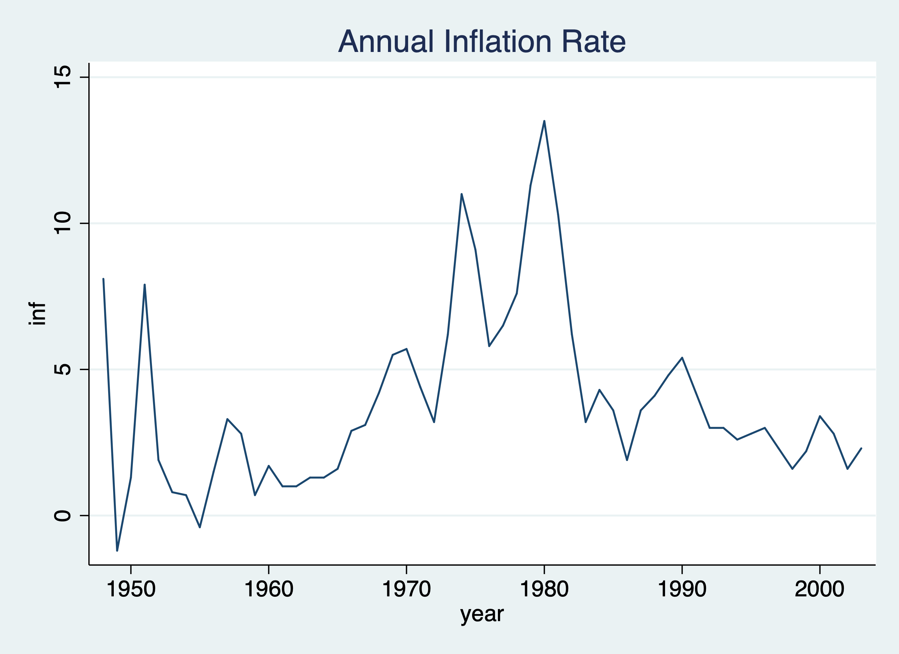
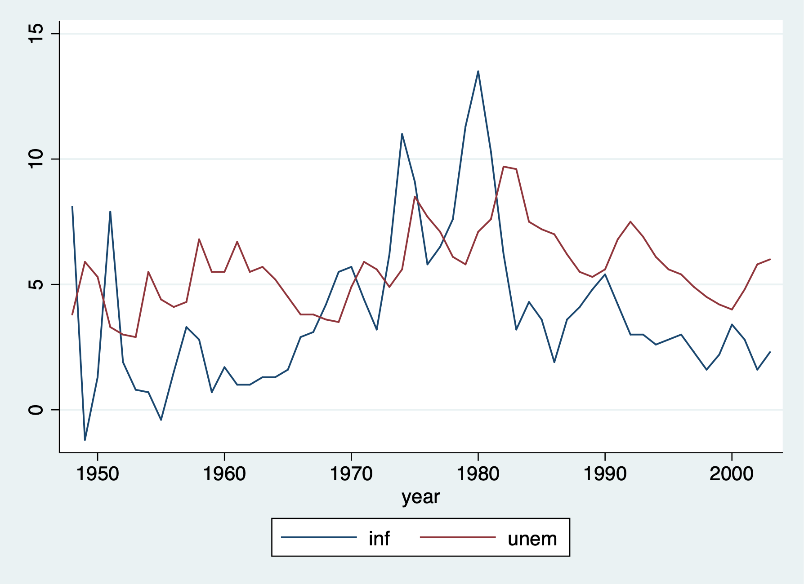
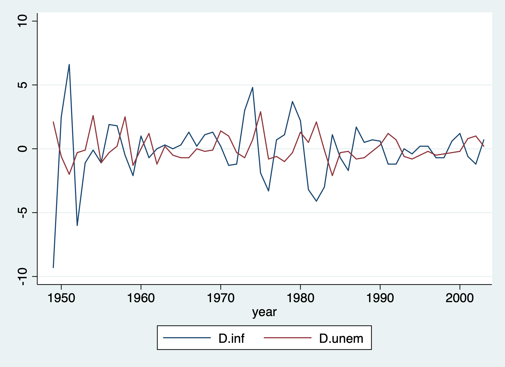
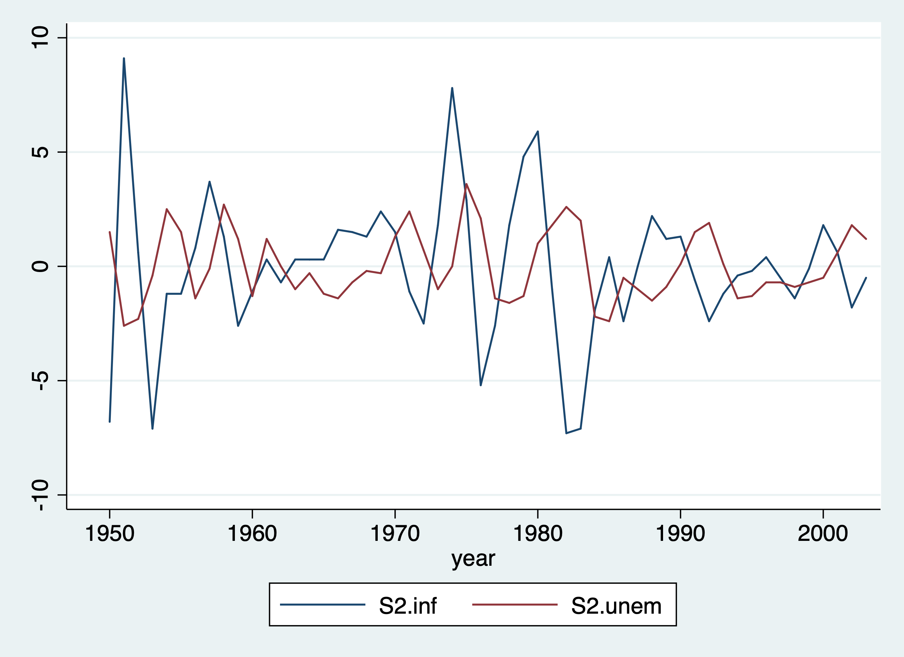
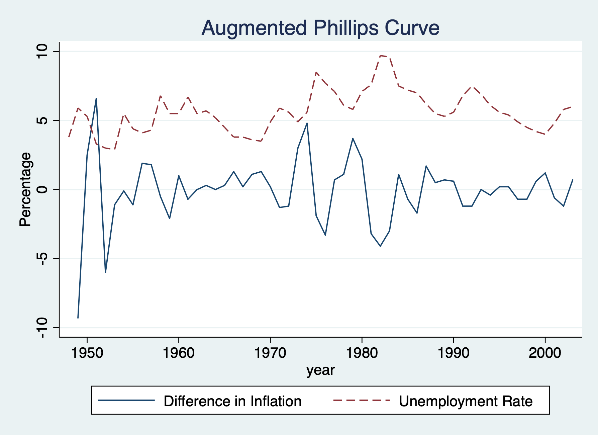

# Static Models


## Static Philips Curve

**Lesson:** Problematic analysis with a static model between inflation and 
unemployment

Set the Time Series
```{stata static1}
cd "/Users/Sam/Desktop/Econ 645/Data/Wooldridge"
use phillips.dta, clear
tsset year, yearly
reg inf unem if year < 1997
```

Our result do not suggest a trade off between inflation and unemployment, and
potentially suggest a positive relationship. This is likely a misspecified 
model and does not best describe the short-run trade-off between inflation
and unemployment. We'll look at an augmented Phillips curve that better 
describes the relationship.

Let's graph our time series
```{stata static2, eval=FALSE}
twoway line inf year, title("Annual Inflation Rate")
graph export "/Users/Sam/Desktop/Econ 645/Stata/week_10_inf_line.png", replace

```

We can use tsline as well.
```{stata static3, eval=FALSE}
tsline inf unem
graph export "/Users/Sam/Desktop/Econ 645/Stata/week_10_ts_infemp.png", replace
```


We can take the difference in the time series as well. Use the *s.* operator instead of *d.*. While *s1* and *d1* will produce similar results, *s2* and *d2* will not produce the same results.
```{stata static4, eval=FALSE}
tsline s.inf s.unem
graph export "/Users/Sam/Desktop/Econ 645/Stata/week_10_ts_Dinfemp.png", replace
```


**Caution**: $$ D2. \neq S2. $$
It is not recommended to use <i>d.</i> beyond the first difference. 
Use the <i>S12.</i> operator If you are interested in $$ x_{t}-x_{t-12} = \Delta x $$ 
*D2* gives the difference in differences (not the research design. Such that the *D2.*operator calculates: $$ D2 = x_{t} - x_{t-1} - (x_{t-1}-x_{t-2}) $$
$$ S2 = x_{t} - x_{t-2} $$

We can take the 12-month difference in the time series as well.
```{stata static5, eval=FALSE}
tsline s2.inf s2.unem
graph export "/Users/Sam/Desktop/Econ 645/Stata/week_10_ts_D12infemp.png", replace
```


## Inflation and Deficits on Interest Rates
**Lesson:** some static models explain time-series better than the prior model 

Looking inflation and deficits on interest rates, our model is:
$$ i3_t = \beta_0 + \beta_1 inflation_t + \beta_2 deficitpct_t + u_t $$
Where

  1. i3: the 3-month T-bill rate
  2. inf: the annual inflation rate from CPI
  3. def: is the federal budget deficit as a percentage of GDP

Set the Time Series
```{stata fdl1}
cd "/Users/Sam/Desktop/Econ 645/Data/Wooldridge"
use intdef.dta, clear
tsset year
reg i3 inf def if year < 2004
```

This static model better explain interest rates based on basic macroeconomics.
Both contemporaneous variables explain current interest rates. A 1 percentage 
point increase in the inflation rate leads to a 0.6 percentage point increase
in the nominal interest rate. A 1 percentage point increase in the deficits as
a percentage of GDP leads to a 0.5 percentage point increase in nominal interest
rates.


## Puerto Rican Employment and Minimum Wage

We'll look at the association between employment and minimum wage in Puerto Rico.
Our model will be:
$$ lprepop_t = \beta_0 + \beta_1 lmincov_t + \beta_2 lusgnp + u_t $$
Where

  1. ln(prepop): the natural log of the employment to population ratio in PR
  2. ln(mincov): natural log of the importance of minimum wage relative to average wages or mincov=average minimum wage/average wages)*average coverage rate or people actually covered by the minimum wage law
  3. lusgnp: natural log of US GNP

Set Time Series
```{stata fdl2}
cd "/Users/Sam/Desktop/Econ 645/Data/Wooldridge"
use prminwge, clear
tsset year
reg lprepop lmincov lusgnp if year < 1988
```

Our results show that there is a tradeoff between the employment ratio and 
the importance of minimum wage. A one percent increase in importance of 
minimum wage the employment-population ratio declines .154 percent.


## Antidumping Filings and Chemical Imports
The barium industry in the U.S. complained to the International Trade Commission
that China was dumping (or selling imports at lower prices to undercut domestic producers).
First, are imports unusually high before the complaint? Second, do imports
change after the dumping complaint?


Our model is the 
$$ lchnimp_t = \beta_0 + \beta_1 lchempi_t + \beta_2 lgas_t + \beta_3 lrtwex_t +\beta_4 befile6_t + \beta_5 affile6_t + \beta_6 afdec6 + u_t $$

Where

  1. lchnimp: natural log of the volume of Chinese imports of barium chloride
  2. lchempi: natural log of domestic chemical production index
  3. lgas: natural log of gasoline production
  4. lrtwex: natural log of the exchange rate index
  5. befile6: binary for 6 months before a complaint filing
  6. affile6: binary for 6 months after a complaint filing
  7. afdec6: binary for 6 months after a positive decision

Set Time Series Monthly
```{stata fdl3}
cd "/Users/Sam/Desktop/Econ 645/Data/Wooldridge"
use barium.dta, clear
tsset t, monthly
reg lchnimp lchempi lgas lrtwex befile6 affile6 afdec6
```

We see that imports are not higher 6 months before a complaint, and imports
are not lower 6 months after a complaint. However, imports are lower 6 months
after a positive decision in a complaint by the ITC. The impact is fairly large
and imports of barium chloride fall about 43.2% after a positive decision.

Also notice that rtwex is positive, and we would expect that a stronger dollar
increase demand for imports, which is about uni-elastic.

```{stata fdl5}
display (exp(-.565)-1)*100
```

# Finite Distributed Lags Models

## Personal Exemption on Fertility Rates

**Lesson:** using lags in the explanatory variables

Our interest the general fertility rate, which is the number of children born
to every 1,000 women of childbearing age. PE is the average real dollar value
of the personal tax exemption and two binary variables for World War II and 
the introduction of the birth control pill in 1963.

Our contemporenous model is:
$$ gfr_t=\beta_0 + \beta_1 pe_t + \beta_2 ww2_t + \beta_3 pill_t + u_t $$

Where

  1. gfr: the fertility rate or births per 1,000 women at time t
  2. pe: the personal tax exemptions at time t
  3. ww2: a binary for World War II 
  4. pill: a binary for birth control pill

Set Time Series
```{stata fdl6}
cd "/Users/Sam/Desktop/Econ 645/Data/Wooldridge"
use fertil3.dta, clear
tsset year, yearly
reg gfr pe i.ww2 i.pill if year < 1985
```

World War II reduced the fertility rate by 24.24 births per 1,000 women of
child bearing age, while the introduction of the birth control pill reduced
the number of birth by 31.59 births per 1,000 women of childbearing age.
The personal tax exemption. A one dollar increase in the average real value of
the personal tax exemption increases 0.083 births per 1,000 women of child
bearing age or a 12 dollar increase in the average real personal
tax exemption increases 1 child per 1,000 women of child bearing ago

Next lets add lags in the average real value of the personal tax exemption.
Our Finite Distributed Lag model is:
$$ gfr_t=\beta_0 + \beta_1 pe_t + \beta_2 pe_{t-1} + \beta_3 pe_{t-2} + \beta_4 ww2_t + \beta_5 pill_t + u_t $$

```{stata fdl7, eval=FALSE}
reg gfr pe pe_1 pe_2 i.ww2 i.pill if year < 1985
```

Our personal exemption variables are no longer statistically significiant, but
let's test the joint significance. We might have multicollinearity that bias
our standard errors for our PE variables.

```{fdl8, eval=FALSE}
test pe pe_1 pe_2
test pe_1 pe_2
```

Our PE variables are jointly significant, but our lags are jointly insignificiant
so we'll use our static model.

For the estimated LRP: $$ .073-.0058+0.034 \approx .101, $$ but we lack a standard error.
We'll need to estimate the standard error.
Let $$ \theta_0=\delta_0+\delta_1+\delta_2 $$ denote the LRP and write $$ \delta_0 $$
in terms of $$ \theta_0 \, , \delta_1 \, and \, \delta_2 \, where \, \delta_0 = \theta_0 - \delta_1 - \delta_2 $$ 
Next substitute for $$ \delta_0 $$ 
$$ gfr_t = \alpha_0 + \delta_0 pe_t + \delta_1 pe_{t-1} + \delta_2 pe_{t-2} + ... $$
to get 
$$ gfr_t = \alpha_0 + (\theta_0 - \delta_1 - \delta_2)pe_t + \delta_1 pe_{t-1} + \delta_2 pe_{t-2} + ... $$
$$ gfr_t = \alpha_0 + \theta_0 pe_t + \delta_1 (pe_{t-1} - pe_t) + \delta_2 (pe_{t-2} - pe_t) + $$

We can estimate $$ \hat{\theta}_{0} $$ and its standard error.
We can regress gfr_t onto pe_t, (pe_(t-1) - pe_t), and (pe_t-2 - pe_t), ww2, and pill

```{stata fdl9, eval=FALSE}
	gen pe_1_1 = pe_1 - pe
	gen pe_2_1 = pe_2 - pe
	reg gfr pe pe_1_1 pe_2_1 i.ww2 i.pill
```

\( \hat{\theta} \approx 0.101 \) and significant, so our LRP has an effect on general fertility rates.

# Time Trends
## Housing Investment and Housing Prices

**Lesson:** Importance of time trends


We look at annual housing investement and a housing price index from 1947 to 1988.

Set Time Series
```{stata tt1}
cd "/Users/Sam/Desktop/Econ 645/Data/Wooldridge"
use hseinv.dta, clear
tsset year, yearly
```

Our model is the natural log of invpc or real per capita housing investment ($1,000)
and price be the housing price index where 1982 = 1 (or 100). We'll assume 
constant elasticity with our log-log model. 

$$ linvpc_t = \beta_0 + \beta_1 lprice_t + u_t $$
```{stata tt2, eval=FALSE}
reg linvpc lprice
```

```{stata tt2_1, echo=FALSE}
quietly {
cd "/Users/Sam/Desktop/Econ 645/Data/Wooldridge"
use hseinv.dta, clear
tsset year, yearly 
}
reg linvpc lprice
```

Our output shows that a 1 percent increase in the pricing index increases
the investment per capita by 1.24 percent (or elastic response).
<b>Note:</b> both investment and price have upward trends that we need to account for.

$$ invpc_t = \beta_0 + \beta_1 lprice_t + \beta_2 t + u_t $$

```{stata tt3, eval=FALSE}
reg linvpc lprice t
```

```{stata tt3_1, echo=FALSE}
quietly {
cd "/Users/Sam/Desktop/Econ 645/Data/Wooldridge"
use hseinv.dta, clear
tsset year, yearly 
}
reg linvpc lprice t
```

After accounting for the upward linear trend for both investment per capita and
the housing price index, an increase in price is coefficient is now negative, but
it is not statistically significant. We probably have serial correlation which
will bias our standard errors.
```{stata tt4, eval=FALSE}
predict u, resid
reg u l.u, noconst
drop u
```

```{stata tt4_1, echo=FALSE}
quietly {
cd "/Users/Sam/Desktop/Econ 645/Data/Wooldridge"
use hseinv.dta, clear
tsset year, yearly 
reg linvpc lprice t
}
predict u, resid
reg u l.u, noconst
drop u
```

## Personal Exemption on Fertility Rates

**Lesson:** Importance of non-linear time trends


We'll look at fertility again, but we'll account for a quadratic time trend.
First, we'll estimate a linear time trend, and then we'll try a quadratic time trend.

Set Time Series
```{stata tt5}
cd "/Users/Sam/Desktop/Econ 645/Data/Wooldridge"
use fertil3.dta, clear
tsset year, yearly
```

Linear Trend
```{stata tt6, eval=FALSE}
reg gfr pe i.ww2 i.pill t if year < 1985
```

```{stata tt6_1, echo=FALSE}
quietly {
cd "/Users/Sam/Desktop/Econ 645/Data/Wooldridge"
use fertil3.dta, clear
tsset year, yearly
}
reg gfr pe i.ww2 i.pill t if year < 1985
```

Quadratic Trend
Fertility is declining but at a decreasing negatively rate (eventually a positive t^2 takes over t)
```{stata tt7, eval=FALSE}
reg gfr pe i.ww2 i.pill c.t##c.t if year < 1985
```

```{stata tt7_1, echo=FALSE}
quietly {
cd "/Users/Sam/Desktop/Econ 645/Data/Wooldridge"
use fertil3.dta, clear
tsset year, yearly
}
reg gfr pe i.ww2 i.pill c.t##c.t if year < 1985
```

The fertility rate exhibits upward and downward trends between 1913 and 1984.
Interestingly, pe remains fairly robust after adding time trends. The linear
time trend shows that general fertility rates are falling by 1.15 childs per 1,000
women of childbearing age for each additional year. However, the quadratic shows
that the trend is negative but decreasing rate and will eventually become positive.

## Puerto Rican Employment
The last linear trend is for employment-population ratio and the importance of minimum wage 
coverage. We'll add a time trend along with mincov and usgnp.

Set the Time Series
```{stata tt8}
cd "/Users/Sam/Desktop/Econ 645/Data/Wooldridge"
use prminwge, clear
tsset year, yearly
```

Add linear trend
```{stata tt9, eval=FALSE}
reg lprepop lmincov lusgnp t
```

```{stata tt9_1, echo=FALSE}
quietly {
cd "/Users/Sam/Desktop/Econ 645/Data/Wooldridge"
use prminwge, clear
tsset year, yearly
}
reg lprepop lmincov lusgnp t
```

The employment-population ratio does not have much of a downward or upward trend, 
but usgnp does. Тhe linear trend of usgnp is about 3% per year, so an estimate
of 1.06 in our model mean that when usgnp increases by 1% above its long-term 
trend, employment-population ratio increases by about 1.06%

# Seasonality
We'll add monthly variables to account for the fact that imports are not
seasonlly adjusted. 

Set Time Series Monthly
```{stata season1}
cd "/Users/Sam/Desktop/Econ 645/Data/Wooldridge"
use barium.dta, clear
tsset t, monthly
reg lchnimp lchempi lgas lrtwex befile6 affile6 afdec6 ///
  feb mar apr may jun jul aug sep oct nov dec
```

We compare all months to January as the base period, but let's test their
joint significance.
```{stata season2, eval=FALSE}
test feb mar apr may jun jul aug sep oct nov dec
```

```{stata season2_1, echo=FALSE}
quietly {
cd "/Users/Sam/Desktop/Econ 645/Data/Wooldridge"
use barium.dta, clear
tsset t, monthly
reg lchnimp lchempi lgas lrtwex befile6 affile6 afdec6 ///
  feb mar apr may jun jul aug sep oct nov dec
}
test feb mar apr may jun jul aug sep oct nov dec
```

We find that they are jointly insignificant and seasonality does not seem
to be an issue with barium chloride imports.

# Weakly Dependent and Stationary Time Series AR(1) Models
## Efficient Market Hypothesis

We'll test the a version of the efficient market hypothesis (EMH) by looking
at weekly stock return from 1976 to 1989.

Set Time Series
```{stata ar1}
cd "/Users/Sam/Desktop/Econ 645/Data/Wooldridge"
use nyse, clear
tsset t, weekly
```

Our dependent variable is the weekly percentage return on the New York Stock Exchange.
A strict form of the EMH states that information observable to the market prior to 
week t should not help to predict the return during week t.
$$ E(y_t|y_{t-1},y_{t-2},...)=E(y_t) $$

We will test EMH by specifying an AR(1) model and our hypothesis states that
beta for y_(t-1) will be equal to 0. We'll assume that stock returns are 
serially uncorrelated, so we can safetly assume that they are weakly dependent.

$$ return_t = \beta_0 + \rho return_{t-1} + e_t $$

```{stata ar2, eval=FALSE}
reg return l.return

*Or
reg return return_1
predict u, resid
reg u l.u, noconst
drop u
```

```{stata ar2_1, echo=FALSE}
quietly {
cd "/Users/Sam/Desktop/Econ 645/Data/Wooldridge"
use nyse, clear
tsset t, weekly
}
reg return l.return

*Or
reg return return_1
predict u, resid
reg u l.u, noconst
drop u
```

We cannot reject the null hypothesis under our model, but we do have some
evidence of positive serial correlation.

## Expected Augmented Phillips Curve
We'll revisit the Phillips curve


Set Time Series
```{stata ar3}
cd "/Users/Sam/Desktop/Econ 645/Data/Wooldridge"	
use phillips.dta, clear
tsset year
```

A linear version of the expections augmented Phillips curve can be written as
$$ inf_t - inf^e_t=\beta_1(unemp_t-\mu_0) + e_t $$

Where \( mu_0 \) is the natural rate of unemployment and inf^e is the expected rate 
of inflation formed in year t-1. 
The difference between actual unemployment and the natural rate is called 
cyclical unemployment, while the difference between inflation and expected 
inflation is called unanticipated inflation
Our e_t is called our supply shock.
If there is a trade-off between inflation and unemployment our \( \hat{\beta_1} \)
will be negative.

An assumption is made about inflationary expectations and unders adaptive expectations,
the expected value of current inflation depends on recently observed inflation.
The expected inflation will be assumed to be equal to last years inflation
$$ inf_t - inf_{t-1}=\beta_0 + \beta_1 unemp_t + e_t $$
$$ \Delta inf_t =\beta_0 + \beta_1 unemp_t + e_t $$

Where
$$ \Delta inf_t=inf_t - inf_{t-1} $$
$$ \beta_0 = -\beta_1 \mu_0 $$
Since beta_1 is expected to be negative and beta_0 is expected to be positive.

Therefore, under adaptive expectations, the augmented Phillips curve relates the
change in inflation to the level of unemployment and a supply shock e_t.
We'll assume assumptions TSC.1-TSC.5 hold.

First Difference in the dependent variable or adaptive expectations of inflation.
```{stata ar4, eval=FALSE}
reg cinf unem if year < 1997

*or
reg d.inf unem if year < 1997
```

```{stata ar4_1, echo=FALSE}
quietly {
cd "/Users/Sam/Desktop/Econ 645/Data/Wooldridge"	
use phillips.dta, clear
tsset year
}
reg cinf unem if year < 1997

*or
reg d.inf unem if year < 1997
```

The trade-off between unanticipated inflation and cyclical unemployment is
seen in \( \hat{beta_1} \). A 1-point increase in unemployment decreases unanticipated
inflation by about .54 points.

We can estimate the natural rate of unemployment by dividing \( \hat{beta_0} \) by
negative of \( \hat{beta_1} \)


$$ \mu_{0} = \hat{\beta}_{0} / - \hat{\beta}_{1} $$

```{stata ar5}
display 3.03/.5425
```

Plot the graph.
```{stata ar6, eval=FALSE}
twoway line cinf year || line unem year, lpattern(dash) ///
	legend(order(1 "Difference in Inflation" 2 "Unemployment Rate")) ///
	title("Augmented Phillips Curve") ytitle(Percentage) xtitle(year)
	
graph export "week_10_augmented_phillips.png", replace
```	
