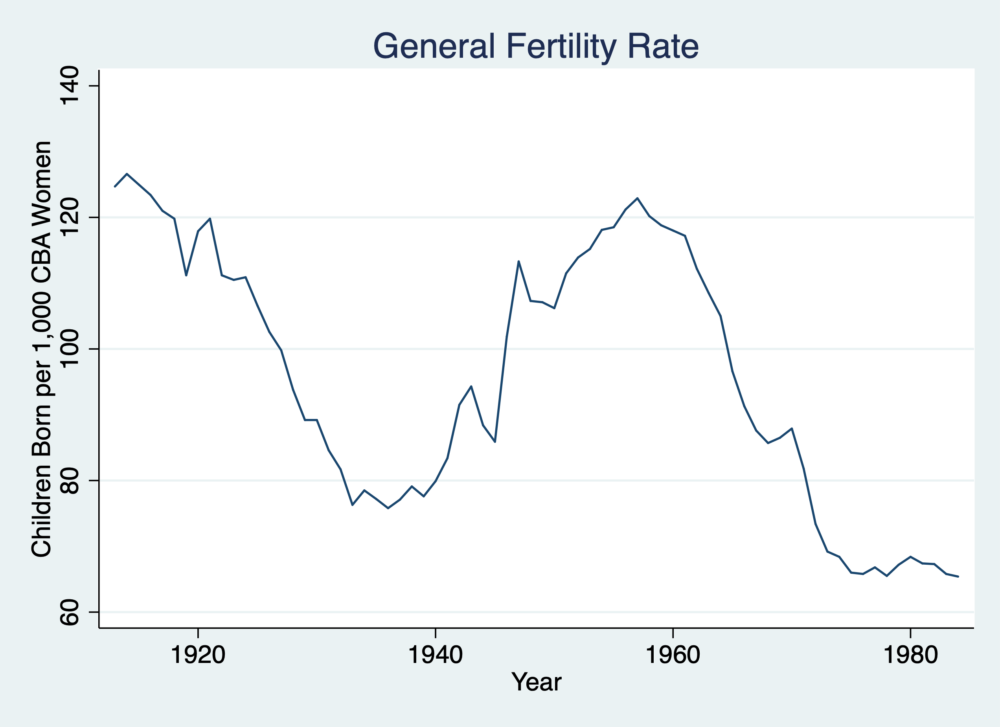
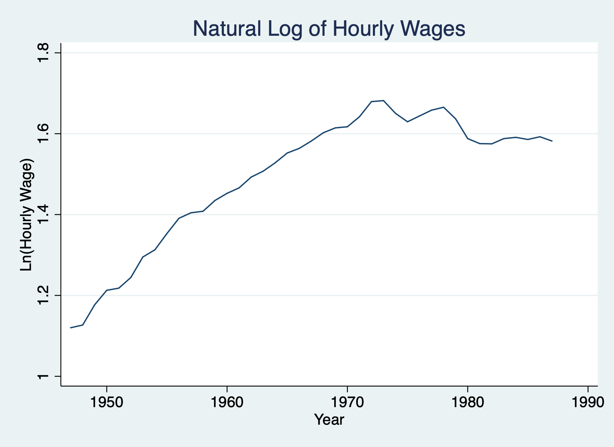
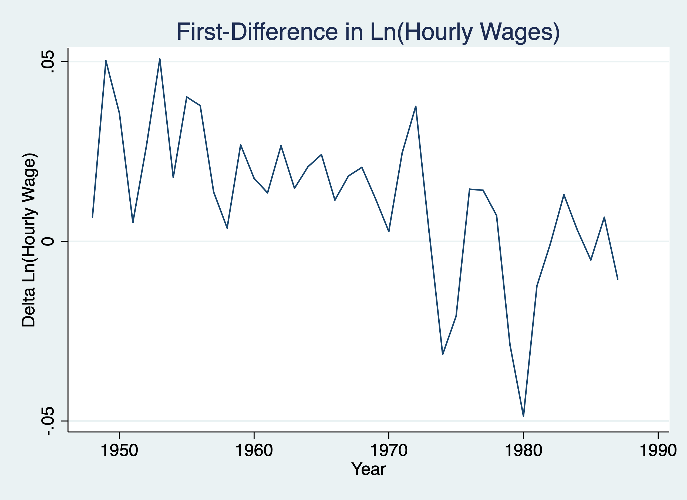

# Unit Roots 

**Lesson:** when we have a unit root process or Time Series integrated of order one \( I(1) \)
we can use a first difference to transform the time series into a weakly dependent
and often stationary process.

## Example: Revisit Fertility

Set the time series
```{stata unit1}
cd "/Users/Sam/Desktop/Econ 645/Data/Wooldridge"
use fertil3.dta, clear
tsset year
```
Plot the Graph
```{stata unit2, eval=FALSE}
twoway line gfr year, title("General Fertility Rate") ytitle("Children Born per 1,000 CBA Women") xtitle("Year")
graph export "/Users/Sam/Desktop/Econ 645/Stata/week_11_i1.png", replace
```


Estimate autocorrelation or estimate \( \hat{\rho} \) 
```{stata unit3, eval=FALSE}
reg gfr l.gfr
```

```{stata unit3_1, echo=FALSE}
quietly {
cd "/Users/Sam/Desktop/Econ 645/Data/Wooldridge"
use fertil3.dta, clear
tsset year
}
reg gfr l.gfr
```


Our result is rho-hat is 0.98, which is indicative of a unit root process.
Under our TS assumptions our t statistics are invalid, but if we use a 
transformation using a first-difference process, we can relax those assumptions
under the TSC assumptions. If our \( I(1) \) becomes \( I(0) \), then our TSC assumptions
are potentially valid.

First Difference both dependent and independent
```{stata unit4, eval=FALSE}
reg d.gfr d.pe if year < 1985
```

```{stata unit4_1, echo=FALSE}
quietly {
cd "/Users/Sam/Desktop/Econ 645/Data/Wooldridge"
use fertil3.dta, clear
tsset year
}
reg d.gfr d.pe if year < 1985
```

Our result is that the real value of the personal exemption is associated with
a 0.043 decrease in fertility or a 23 dollar increase in the real value of the
personal exemption is associated with a 1 child per capita (1,000 CBA Women).
This is a bit unexpected, but still insignificant. Let's add some lags.

First differnce with more than 1 lag
```{stata unit5, eval=FALSE}
reg d.gfr d.pe d.pe_1 d.pe_2 if year < 1985
```

```{stata unit5_1, echo=FALSE}
quietly {
cd "/Users/Sam/Desktop/Econ 645/Data/Wooldridge"
use fertil3.dta, clear
tsset year
}
reg d.gfr d.pe d.pe_1 d.pe_2 if year < 1985
```

Our results show that increases in the current and prior period real value 
personal exemption is not statistically significant. However, a 1 dollar increase
in the real value of personal exemption is associated two period prior is associated
with an increase of .110 child per capita (or $9.1 increase is associated with
an increase of 1 child per capita.


## Wages and Productivity

\( I(1) \) process with the presence of a linear trend

We want to estimate the elasticity of hourly wage with respect to output per hour
(or labor productivity). 

$$ ln(hrwage_t)=\beta_0 + \beta_1 ln(outphr_t) + \beta_2 t + u_t $$

Set Time Series and estimate the contemporaneous model
```{stata wages1}
cd "/Users/Sam/Desktop/Econ 645/Data/Wooldridge"
use earns.dta, clear
tsset year, yearly
reg lhrwage loutphr t
```

We estimate that the elasticity is very large, where a 1% increase in labor
productivity (output per hour) is associated with a 1.64% increase in hourly
wage. Let's test for autocorrelation with accounting for the linear trend.

```{stata wages2, eval=FALSE}
reg lhrwage l.lhrwage t
```

```{stata wages2_1, echo=FALSE}
quietly {
cd "/Users/Sam/Desktop/Econ 645/Data/Wooldridge"
use earns.dta, clear
tsset year, yearly
}
reg lhrwage l.lhrwage t
```


We have some evidence for a unit root process, so we'll use the first-difference
to transform the I(1) process into a I(0) process. We'll no longer need the 
time trend

```{stata wages3, eval=FALSE}
	twoway line lhrwage year, title("Natural Log of Hourly Wages") ytitle("Ln(Hourly Wage)") xtitle("Year")
	graph export "/Users/Sam/Desktop/Econ 645/Stata/week_11_hrwage1.png", replace
```



```{stata wages4, eval=FALSE}
	twoway line d.lhrwage year, title("First-Difference in Ln(Hourly Wages)") ytitle("Delta Ln(Hourly Wage)") xtitle("Year")
	graph export "/Users/Sam/Desktop/Econ 645/Stata/week_11_hrwage2.png", replace
```

	

We'll keep the trend based upon our prior graph
```{stata wages5, eval=FALSE}
reg d.lhrwage d.loutphr t
```

```{stata wages5_1, echo=FALSE}
quietly {
cd "/Users/Sam/Desktop/Econ 645/Data/Wooldridge"
use earns.dta, clear
tsset year, yearly
}
reg d.lhrwage d.loutphr t
```

Our transformed model shows that a 1% increase in output per hour is associated
with a .55% increase in hourly wage.


# Dynamically Complete

**Lesson:** Is our model dynamically complete? Use theory/literature, but test, test, test.</h5>

Set Time Series
```{stata dyn1}
cd "/Users/Sam/Desktop/Econ 645/Data/Wooldridge"
use fertil3.dta
tsset year, yearly
```
We'll estimate a Finite Distributed Lag model for the first difference of 
general fertility onto the first difference of personal exemptions.
If our model is dynamically complete, then no additional lags of gfr or pe
are needed.

Our First-difference model with one lag of pe
```{stata dyn2, eval=FALSE}
reg d.gfr d.pe d.pe_1 if year < 1985
```

```{stata dyn2_1, echo=FALSE}
quietly {
cd "/Users/Sam/Desktop/Econ 645/Data/Wooldridge"
use fertil3.dta
tsset year, yearly
}
reg d.gfr d.pe d.pe_1 if year < 1985
```

Is this dynamically complete? Let's add a second lag of pe
```{stata dyn3, eval=FALSE}
reg d.gfr d.pe d.pe_1 d.pe_2 if year < 1985
```

```{stata dyn3_1, echo=FALSE}
quietly {
cd "/Users/Sam/Desktop/Econ 645/Data/Wooldridge"
use fertil3.dta
tsset year, yearly
}
reg d.gfr d.pe d.pe_1 d.pe_2 if year < 1985
```

Add lag of d.gfr and see it wasn't dynamically complete
```{stata dyn4, eval=FALSE}
reg d.gfr d.gfr_1 d.pe d.pe_1 d.pe_2 if year < 1985
```

```{stata dyn4_1, echo=FALSE}
quietly {
cd "/Users/Sam/Desktop/Econ 645/Data/Wooldridge"
use fertil3.dta
tsset year, yearly
}
reg d.gfr d.gfr_1 d.pe d.pe_1 d.pe_2 if year < 1985
```

# Testing for Serial Correlation

## Example: Revisit Phillip's Curve
**Lesson:** using our t-test, Durban Watson test, Breusch-Godfrey test, and Durban's alternative statistic to test for serial correlation

We'll use our t-test for serial correlation with strictly exogenous regressors
under the assumption that our regressors are exogenous.

Set Time Series
```{stata curve1}
cd "/Users/Sam/Desktop/Econ 645/Data/Wooldridge"
use phillips.dta, clear
tsset year, yearly
```

We estimated a static Phillips Curve and an augmented Phillips Curve last week.
We'll retest the models for serial correlation.

### Static Model {-}
Test for serial correlation in Static Model
Noticeable serial correlation
```{stata curve2, eval=FALSE}
*Static Model
reg inf unem if year < 1997

*Heteroskedastiity Test: Breusch-Godfrey Test
estat bgodfrey

*Serial Correlation Test: Simple AR(1) test
predict u, resid

reg u l.u, noconst
```


```{stata curve2_1, echo=FALSE}
quietly {
cd "/Users/Sam/Desktop/Econ 645/Data/Wooldridge"
use phillips.dta, clear
tsset year, yearly
}
*Static Model
reg inf unem if year < 1997

*Heteroskedastiity Test: Breusch-Godfrey Test
estat bgodfrey

*Serial Correlation Test: Simple AR(1) test
predict u, resid

reg u l.u, noconst
```


### First difference {-}

Test for serial correlation in Augmented
Serial correlation is removed with the first-difference in inflation
```{stata curve4, eval=FALSE }
*First Difference Model
reg d.inf unem if year < 1997
predict u2, resid
*Breusch-Godfrey Test
	estat bgodfrey
```

```{stata curve4_1, echo=FALSE }
quietly {
cd "/Users/Sam/Desktop/Econ 645/Data/Wooldridge"
use phillips.dta, clear
tsset year, yearly 
}
*First Difference Model
reg d.inf unem if year < 1997
predict u2, resid
*Breusch-Godfrey Test
	estat bgodfrey
```

### Test for Serial Correlation: 	Durban-Watson Test {-}
```{stata curve5, eval=FALSE}
	estat dwatson
```

```{stata curve5_1, echo=FALSE}
quietly {
cd "/Users/Sam/Desktop/Econ 645/Data/Wooldridge"
use phillips.dta, clear
tsset year, yearly 
*First Difference Model
reg d.inf unem if year < 1997
}
estat dwatson
```
$$ d_L = 1.503 $$
$$ d_U = 1.585 $$
$$ 1.769648 > 1.585 $$
We fail to reject the null hypothesis.

### Test for Serial Correlation: AR(1) Test {-}
```{stata curve6, eval=FALSE}
	reg u2 l.u2, noconst
```

```{stata curve6_1, echo=FALSE}
quietly {
cd "/Users/Sam/Desktop/Econ 645/Data/Wooldridge"
use phillips.dta, clear
tsset year, yearly 

*First Difference Model
reg d.inf unem if year < 1997
predict u2, resid
}
reg u2 l.u2, noconst
```
Test change in error terms for FD assumption on serial correlation so that
the differences in errors are not correlated.

```{stata curve7, eval=FALSE}
gen u2_1=l.u2
reg d.u2 d.u2_1, noconst
drop u2
```

```{stata curve7_1, echo=FALSE}
quietly {
cd "/Users/Sam/Desktop/Econ 645/Data/Wooldridge"
use phillips.dta, clear
tsset year, yearly 

*First Difference Model
reg d.inf unem if year < 1997
predict u2, resid
}
gen u2_1=l.u2
reg d.u2 d.u2_1, noconst
drop u2
```

We fail to reject the null hypothesis that there is no serial correlation in
the difference in error term.

### FDL Model {-}
Let's add a lag in inflation to change our static model into a FDL model.
We can also use the estat dwatson or dwstat

```{stata curve8, eval=FALSE}
reg inf l.inf unem if year < 1997
estat dwatson
*Or
dwstat
```

```{stata curve8_1, echo=FALSE}
quietly {
cd "/Users/Sam/Desktop/Econ 645/Data/Wooldridge"
use phillips.dta, clear
tsset year, yearly 
}
reg inf l.inf unem if year < 1997
estat dwatson
*Or
dwstat
```

First, let's find our critical values: <br>
<a href="https://www3.nd.edu/~wevans1/econ30331/Durbin_Watson_tables.pdf">
https://www3.nd.edu/~wevans1/econ30331/Durbin_Watson_tables.pdf</a>. <br>
$$ DW(3,48)=1.48 $$ and $$ d_L \approx 1.4 $$ and $$ d_U \approx 1.67 $$
so our DW test is inconclusive. We'll look at Durban-Watson and DW Tables again a bit later.

## Example: Revisit Puerto Rican Employment and Minimum Wage
**Lesson:** We can use Durban's alternative statistic to test for serial correlation
if our regressors are not strictly exogenous.</h5>
Durban's alternative statistic

Set Time Series
```{stata puerto1}
cd "/Users/Sam/Desktop/Econ 645/Data/Wooldridge"
use prminwge, clear
tsset year
```
We'll rerun our static model and regress the natural log of the employment-population
ratio onto the natural log of the importance of minimum wage, the natural log
of Puerto Rican Gross National Product, the natural log of US GNP, and a time trend.

### Durbin-Watson Test {-}
```{stata puerto2, eval=FALSE}
reg lprepop lmincov lprgnp lusgnp t if year < 1988
predict u, resid
```

```{stata puerto2_1, echo=FALSE}
quietly {
cd "/Users/Sam/Desktop/Econ 645/Data/Wooldridge"
use prminwge, clear
tsset year
}
reg lprepop lmincov lprgnp lusgnp t if year < 1988
predict u, resid
```

### Durbin's Alternative Statistics {-}
Test Serial Correlation with Durbin's alternative statistic, which is valid when 
we don't have strictly exogenous regressors.
```{stata puerto3, eval=FALSE}
reg u l.u lmincov lprgnp lusgnp t, noconst 
```

```{stata puerto3_1, echo=FALSE}
quietly {
cd "/Users/Sam/Desktop/Econ 645/Data/Wooldridge"
use prminwge, clear
tsset year
reg lprepop lmincov lprgnp lusgnp t if year < 1988
predict u, resid
}
reg u l.u lmincov lprgnp lusgnp t, noconst 
```

We can see that we reject the null hypothesis, since our \( \hat{rho} = 0.48 \) and
statistically significant.

## Test AR(3) serial correlation
**Lesson:** We can test for serial correlation among prior periods beside AR(1).</h5>

Set Time Series
```{stata barium1}
cd "/Users/Sam/Desktop/Econ 645/Data/Wooldridge"
use barium.dta, clear
tsset t, monthly
```
We'll look at our barium chloride model again to see if ITC complaints affect
behavior of foreign exporters. We may have higher order of serial correlation
since we are using monthly data.

```{stata barium2, eval=FALSE}
reg lchnimp lchempi lgas lrtwex befile6 affile6 afdec6
predict u, resid
```

```{stata barium2_1, echo=FALSE}
quietly {
cd "/Users/Sam/Desktop/Econ 645/Data/Wooldridge"
use barium.dta, clear
tsset t, monthly
}
reg lchnimp lchempi lgas lrtwex befile6 affile6 afdec6
predict u, resid
```

Test for \( H_{0}: p1=p2=p3=0 \) jointly with an F-test.
```{stata barium3, eval=FALSE}
reg u l.u l2.u l3.u lchempi lgas lrtwex befile6 affile6 afdec6, noconst
test l.u l2.u l3.u
```

```{stata barium3_1, echo=FALSE}
quietly {
cd "/Users/Sam/Desktop/Econ 645/Data/Wooldridge"
use barium.dta, clear
tsset t, monthly
reg lchnimp lchempi lgas lrtwex befile6 affile6 afdec6
predict u, resid
}
reg u l.u l2.u l3.u lchempi lgas lrtwex befile6 affile6 afdec6, noconst
test l.u l2.u l3.u
```

Our reject the null hypothesis that all of the lags are equal to zero using an F-test.

However, when we test our last two lags, they are jointly insignificant.
```{stata barium4, eval=FALSE}
test l2.u l3.u
drop u
```

```{stata barium4_1, echo=FALSE}
quietly {
cd "/Users/Sam/Desktop/Econ 645/Data/Wooldridge"
use barium.dta, clear
tsset t, monthly
reg lchnimp lchempi lgas lrtwex befile6 affile6 afdec6
predict u, resid
reg u l.u l2.u l3.u lchempi lgas lrtwex befile6 affile6 afdec6, noconst
}
test l2.u l3.u
drop u
```
We have evidence of at least serial correlation to the order of one.

# Correct for Serial Correlation
## Prais-Winsten Estimation in the Event Study
**Lesson:** We'll account for serial correlation with a FGLS Prais-Winsten model.


Set Time Series
```{stata prais1}
cd "/Users/Sam/Desktop/Econ 645/Data/Wooldridge"
use barium.dta, clear
tsset t, monthly
```

### OLS {-}
```{stata prais2, eval=FALSE}
est clear
eststo OLS: reg lchnimp lchempi lgas lrtwex befile6 affile6 afdec6
estat dwstat
```

```{stata prais2_1, echo=FALSE}
quietly {
cd "/Users/Sam/Desktop/Econ 645/Data/Wooldridge"
use barium.dta, clear
tsset t, monthly
}
est clear
eststo OLS: reg lchnimp lchempi lgas lrtwex befile6 affile6 afdec6
estat dwatson
```

### Prais-Winsten {-}
```{stata prais3, eval=FALSE}
eststo Prais: prais lchnimp lchempi lgas lrtwex befile6 affile6 afdec6
```

```{stata prais3_1, echo=FALSE}
quietly {
cd "/Users/Sam/Desktop/Econ 645/Data/Wooldridge"
use barium.dta, clear
tsset t, monthly
}
eststo Prais: prais lchnimp lchempi lgas lrtwex befile6 affile6 afdec6
```

First, let's find our critical values: <br>
<a href="https://www3.nd.edu/~wevans1/econ30331/Durbin_Watson_tables.pdf">
https://www3.nd.edu/~wevans1/econ30331/Durbin_Watson_tables.pdf</a>. <br><br>
For the OLS Estimator 
$$ DW(6,131) = 1.458414 $$
For the Prasi-Winsten Estimator
$$ DW(6,131) = 2.087181 $$
 and $$ d_L \approx 1.60 $$ and $$ d_U \approx 1.81 $$
We reject the null hypothesis for the OLS estimator, but we fail to reject 
the null hypothesis for the Prais-Winsten Estimator.

Our beta-hats in Prais-Winsten Estimator are similar to our OLS estimates, but our PW
standard errors account for the serial correlation. Our OLS standard errors
usually understate the actual sampling variation in the OLS estimators and 
should be treated with suspicion.
```{stata prais4, eval=FALSE}
	esttab, mtitle se stat(N rho)
```

```{stata prais4_1, echo=FALSE}
quietly {
cd "/Users/Sam/Desktop/Econ 645/Data/Wooldridge"
use barium.dta, clear
tsset t, monthly
est clear
eststo OLS: reg lchnimp lchempi lgas lrtwex befile6 affile6 afdec6
eststo Prais: prais lchnimp lchempi lgas lrtwex befile6 affile6 afdec6
}
esttab, mtitle se stat(N rho)
```

## Inflation and Prais
**Lesson:** our PW estimator might not be unbiased or consistent if our assumptions fail.</h5>

We'll show another example comparing OLS and Prais-Winsten estimators. We'll
look at the static Phillips curve, which we know has serial correlation.


Set the Time Series
```{stata inf1}
cd "/Users/Sam/Desktop/Econ 645/Data/Wooldridge"
use phillips.dta, clear
tsset year
est clear
```

### OLS {-}
```{stata inf2, eval=FALSE}
quietly eststo OLS: reg inf unem if year < 1997
```

### Prais-Winsten {-}
```{stata inf3, eval=FALSE}
quietly eststo PW: prais inf unem if year < 1997
```

### Prais-Winsten with Cochrane-Orcutt Transformation {-}
```{stata inf4, eval=FALSE}
quietly eststo PW_CO: prais inf unem if year < 1997, corc
```

### First Difference {-}
```{stata inf5, eval=FALSE}
quietly eststo FD: reg d.inf d.unem if year < 1997
```
### Compare {-}
```{stata inf6, eval=FALSE}
	esttab, mtitle se stat(N rho)
```

```{stata inf6_1, echo=FALSE}
quietly {
cd "/Users/Sam/Desktop/Econ 645/Data/Wooldridge"
use phillips.dta, clear
tsset year

est clear
quietly eststo OLS: reg inf unem if year < 1997
quietly eststo PW: prais inf unem if year < 1997
quietly eststo PW_CO: prais inf unem if year < 1997, corc
quietly eststo FD: reg d.inf d.unem if year < 1997
}
esttab, mtitle se stat(N rho)
```

The OLS and PW estimators might give very different estimators if our 
assumptions of strict exogeneity and the a \( Cov(x_(t+1)+x_(t-1),u_t)=0 \)
fail.  If that is the case then using OLS with a first-difference might be
a better method.

We can see that the difference is quite notable. With our OLS estimators, the
tradeoff between inflation and employment is non-existent, but with the PW
estimator our estimate of beta 1 is closer to our first-difference estimate
of beta 1.

It is possible that there is no relationship with the static model, but
the change in inflation and the change in unemployment are negatively related.

## Differencing and Serial Correlation

### Inflation and Deficits on Interest Rates
**Lesson:** First-differencing is a potential method to eliminate serial correlation.</h5>

Set the Time Series
```{stata diff1}
cd "/Users/Sam/Desktop/Econ 645/Data/Wooldridge"
use intdef.dta, clear
tsset year
```

We'll look at the relationship between interest rates from the 3-month T-bill rate (i3) 
and inflation rate (inf) and deficits as a percentage of GDP. 

### Static Model {-}
Calculate a static model and test for serial correlation
```{stata diff2, eval=FALSE}
reg i3 inf def if year < 2004
estat dwstat
```

```{stata diff2_1, echo=FALSE}
quietly {
cd "/Users/Sam/Desktop/Econ 645/Data/Wooldridge"
use intdef.dta, clear
tsset year
}
reg i3 inf def if year < 2004
dwstat
```

Critical values \( d(3,56)=.716 \), at the 5% level \( dL = 1.452, dU=1.681 \)
\( dwstat < dL \) so we reject the null hypothesis

```{stata diff3, eval=FALSE}
predict u, resid
reg u l.u, noconst
drop u
```

```{stata diff3_1, echo=FALSE}
quietly {
cd "/Users/Sam/Desktop/Econ 645/Data/Wooldridge"
use intdef.dta, clear
tsset year 
reg i3 inf def if year < 2004
}
predict u, resid
reg u l.u, noconst
drop u
```

We find that we have notable serial correlation in the error term that is statistically
significant. We'll run a first-difference model next.

### First differencing {-}

Run a first-difference and test for serial correlation
```{stata diff4, eval=FALSE}
reg d.i3 d.inf d.def if year < 2004
dwstat
```

```{stata diff4_1, echo=FALSE}
quietly {
cd "/Users/Sam/Desktop/Econ 645/Data/Wooldridge"
use intdef.dta, clear
tsset year 
}
reg d.i3 d.inf d.def if year < 2004
dwstat
```

Critical values \( d(3,56)=1.796 \), at the 5% level \( dL = 1.452, dU=1.681 \)
\( dwstat > dU \) so we fail to reject the null hypothesis
```{stata diff4_5, eval=FALSE}
predict u, resid
reg u l.u, noconst
```

```{stata diff4_51, echo=FALSE}
quietly {
cd "/Users/Sam/Desktop/Econ 645/Data/Wooldridge"
use intdef.dta, clear
tsset year
reg d.i3 d.inf d.def if year < 2004
}
predict u, resid
reg u l.u, noconst
```

The serial correlation is no longer a problem with our first difference model, 
since first differencing can transform a unit root process \( I(1) \) into a \( I(0) \) process.


## Serial Correlation Robust Standard Errors
**Lesson:** We can use the Newey estimator for estimates
with Heteroskedastic and Autocorrelation Consistent (HAC) standard errors.


We'll revisit our Puerto Rican examination of the impact of minimum wage importance
We'll use Heteroskedastic and Autocorrelation Consistent (HAC) standard errors, and 
we'll compare OLS, OLS with HAC standard errors, and Prais-Winsten estimates
We'll allow a maximum lag order of autocorrelation up to 2 with the lag(2) option.

Set Time Series
```{stata rico0}
cd "/Users/Sam/Desktop/Econ 645/Data/Wooldridge"
use prminwge.dta, clear
tsset year, yearly
```
	
### OLS {-}
```{stata rico1, eval=FALSE}
est clear
eststo OLS: quietly reg lprepop lmincov lprgnp lusgnp t if year < 1988
```

### Newey-West Estimator Order of 1 {-}

Newey with lag order 1
```{stata rico2, eval=FALSE}
eststo Newey1: quietly newey lprepop lmincov lprgnp lusgnp t if year < 1988, lag(1)
```

### Newey-West Estimator Order of 2 {-}
```{stata rico3, eval=FALSE}
eststo Newey2: quietly newey lprepop lmincov lprgnp lusgnp t if year < 1988, lag(2)
```

### Prais-Winsten {-}
```{stata rico4, eval=FALSE}
eststo PW: quietly prais lprepop lmincov lprgnp lusgnp t if year < 1988
```

With t-stats below estimated parameters 
```{stata rico5, eval=FALSE}
esttab, mtitle scalars(F N)
```

```{stata rico5_1, echo=FALSE}
quietly {
cd "/Users/Sam/Desktop/Econ 645/Data/Wooldridge"
use prminwge.dta, clear
tsset year, yearly
eststo OLS: quietly reg lprepop lmincov lprgnp lusgnp t if year < 1988
eststo Newey1: quietly newey lprepop lmincov lprgnp lusgnp t if year < 1988, lag(1)
eststo Newey2: quietly newey lprepop lmincov lprgnp lusgnp t if year < 1988, lag(2)
eststo PW: quietly prais lprepop lmincov lprgnp lusgnp t if year < 1988
}
esttab, mtitle scalars(F N)
```

With standard errors below the estimated parameters
```{stata rico6, eval=FALSE}
esttab, mtitle se scalars(F N)
```

```{stata rico6_1, echo=FALSE}
quietly {
cd "/Users/Sam/Desktop/Econ 645/Data/Wooldridge"
use prminwge.dta, clear
tsset year, yearly
eststo OLS: quietly reg lprepop lmincov lprgnp lusgnp t if year < 1988
eststo Newey1: quietly newey lprepop lmincov lprgnp lusgnp t if year < 1988, lag(1)
eststo Newey2: quietly newey lprepop lmincov lprgnp lusgnp t if year < 1988, lag(2)
eststo PW: quietly prais lprepop lmincov lprgnp lusgnp t if year < 1988
}
esttab, mtitle se scalars(F N)
```

Notice how our t-stat have fallen and our standard errors have risen for our
Newey1 and Newey2 compared to OLS. Also, notice how the Prais-Winsten beta-hat
on minimum coverage is closer to 0, then OLS or OLS with HAC standard errors.

## Testing for Heteroskedasticity in Time Series

We'll revisit our test of the Efficient Market Hypothesis with stock return data.
We can test to see if our assumption of homoskedasticity is valid with our
time series. This is a separate test than the test for serial correlation.

Set the time series
```{stata nye1}
cd "/Users/Sam/Desktop/Econ 645/Data/Wooldridge"
use nyse.dta, clear
tsset t, weekly
```

### OLS {-}
We'll test heteroskedasticity with estat hettest
```{stata nye2, eval=FALSE}
reg return l.return
estat hettest
```

```{stata nye2_1, echo=FALSE}
quietly {
cd "/Users/Sam/Desktop/Econ 645/Data/Wooldridge"
use nyse.dta, clear
tsset t, weekly
}
reg return l.return
estat hettest
```

We'll manually calculate the Breusch-Pagan test
```{stata nye3, eval=FALSE}
predict u, residu
gen u2=u^2
reg u2 l.return
```

```{stata nye3_1, echo=FALSE}
quietly {
cd "/Users/Sam/Desktop/Econ 645/Data/Wooldridge"
use nyse.dta, clear
tsset t, weekly
reg return l.return
}
predict u, residu
gen u2=u^2
reg u2 l.return
```

Test for serial correlation
```{stata nye4, eval=FALSE}
reg u l.u, noconst
```

```{stata nye4_1, echo=FALSE}
quietly {
cd "/Users/Sam/Desktop/Econ 645/Data/Wooldridge"
use nyse.dta, clear
tsset t, weekly
reg return l.return
predict u, residu
gen u2=u^2
}
reg u l.u, noconst
```

We can see we reject the null hypothesis that the variance of the error term
is constant, and heteroskedasticity is a problem.

### Newey-West Estimator {-}
We can use robust, or HAC standard errors, but since serial correlation is 
not a problem, then we don't need newey estimator.
```{stata nye5, eval=FALSE}
newey return l.return, lag(1)
```

```{stata nye5_1, echo=FALSE}
quietly {
cd "/Users/Sam/Desktop/Econ 645/Data/Wooldridge"
use nyse.dta, clear
tsset t, weekly
}
newey return l.return, lag(1)
```

Expected value does not depend on past returns, but the variance of the error
term is not constant, and needs to be corrected.
