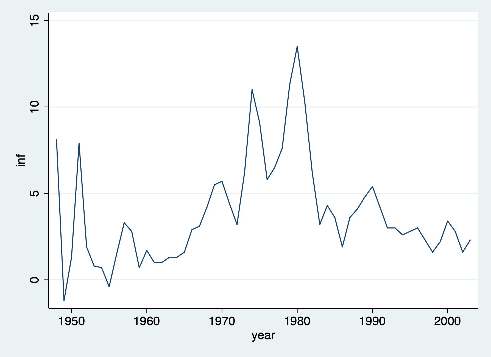
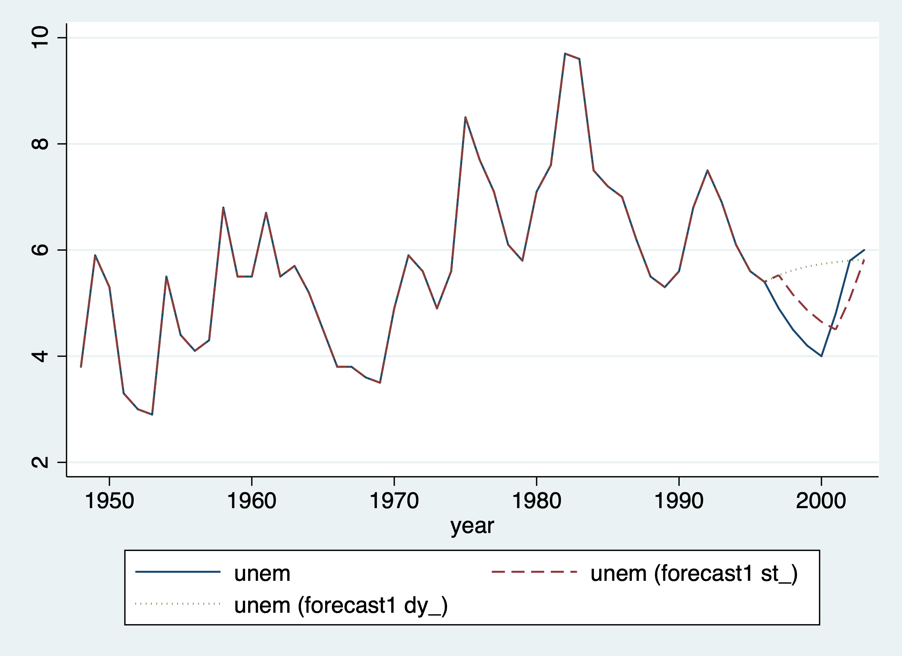
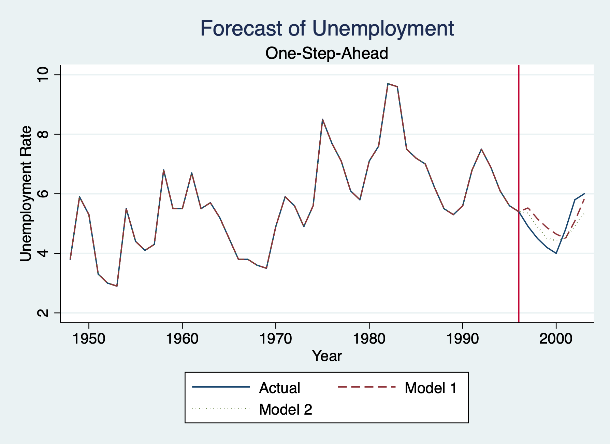

# Prepare for Forecasting

## Graph the Time Series 
We'll use our Phillip's Curve data to forecast unemployment one-step into the future

Set Time Series
```{stata prep1}
cd "/Users/Sam/Desktop/Econ 645/Data/Wooldridge"
use phillips.dta, clear
tsset year
```

Use *tsline* command to graph the time series
```{stata prep2, eval=FALSE}
tsline inf
graph export "/Users/Sam/Desktop/Econ 645/Stata/week_11_inflation.png", replace
```


## Train and Test 
First we need to Generate training and test samples, so we'll use the time 
series sequence until 1996 as our training data, and we'll use 1997 to 2003
as our testing data.
```{stata prep3, eval=FALSE}
gen test = 0
replace test = 1 if year >= 1997
label define test1 0 "training sample" 1 "testing sample"
label values test test1
list year unem inf test
```

```{stata prep3_1, echo=FALSE}
quietly {
cd "/Users/Sam/Desktop/Econ 645/Data/Wooldridge"
use phillips.dta, clear
tsset year
}
gen test = 0
replace test = 1 if year >= 1997
label define test1 0 "training sample" 1 "testing sample"
label values test test1
list year unem inf test
```


## AR(1) and VAR models
We'll use two models to forecast unemployment:

  1. AR(1) model: Just a 1-year lag of unemployment
  2. VAR model: 1-year lag of unemployment and 1-year lag of inflation

Run the regressions using training data

### OLS AR-1 {-}

Run the model with a 1-year lag in unemployment 
```{stata prep4, eval=FALSE}
reg unem l.unem if test == 0
```

```{stata prep4_1, echo=FALSE}
quietly {
cd "/Users/Sam/Desktop/Econ 645/Data/Wooldridge"
use phillips.dta, clear
tsset year
gen test = 0
replace test = 1 if year >= 1997
label define test1 0 "training sample" 1 "testing sample"
label values test test1
}
reg unem l.unem if test == 0
```

### VAR {-}
We will add a 1-year lag in inflation along with our 1-year lag in unemployment
```{stata prep5, eval=FALSE}
reg unem l.unem l.inf if test == 0
```

```{stata prep5_1, echo=FALSE}
quietly {
cd "/Users/Sam/Desktop/Econ 645/Data/Wooldridge"
use phillips.dta, clear
tsset year
gen test = 0
replace test = 1 if year >= 1997
label define test1 0 "training sample" 1 "testing sample"
label values test test1
}
reg unem l.unem l.inf if test == 0
```

# Forecasting

## One-Step Ahead Model vs Dynamic AR(1) Model

One-step ahead we can use predict or forecast for AR(1). We use the *estimates store* command to store our results for our AR(1) model.

### Train the model {-}
```{stata fore1, eval=FALSE}
reg unem l.unem if test == 0
estimates store model1
```

### One-Step Ahead Model {-}
We can get one-step ahead just using predict
```{stata fore2, eval=FALSE}
predict unem_est
```

Forecast - One-step-ahead forecast. We three addition commands:

  1. *forecast create*
  2. *forecast estimates*
  3. *forecast solve*
  
```{stata fore3, eval=FALSE}
forecast create forecast1, replace
forecast estimates model1
```

For a one-step ahead forecast, **static** is our key option otherwise it will not be a one-step ahead forecast.
```{stata fore4, eval=FALSE}
forecast solve, prefix(st_) begin(1997) end(2003) static
list year unem st_unem if year > 1996
```

```{stata fore4_1, echo=FALSE}
quietly {
cd "/Users/Sam/Desktop/Econ 645/Data/Wooldridge"
use phillips.dta, clear
tsset year
gen test = 0
replace test = 1 if year >= 1997
label define test1 0 "training sample" 1 "testing sample"
label values test test1
reg unem l.unem if test == 0
estimates store model1
predict unem_est
forecast create forecast1, replace
forecast estimates model1
}
forecast solve, prefix(st_) begin(1997) end(2003) static
list year unem st_unem if year > 1996
```


### Dynamic Model {-}
Dynamic model - We won't use l.unem but l.dy_unem
```{stata fore5, eval=FALSE}
forecast solve, prefix(dy_) begin(1997) end(2003)
list year unem st_unem dy_unem if year > 1996
```

```{stata fore5_1, echo=FALSE}
quietly {
cd "/Users/Sam/Desktop/Econ 645/Data/Wooldridge"
use phillips.dta, clear
tsset year
gen test = 0
replace test = 1 if year >= 1997
label define test1 0 "training sample" 1 "testing sample"
label values test test1
reg unem l.unem if test == 0
estimates store model1
predict unem_est
forecast create forecast1, replace
forecast estimates model1
forecast solve, prefix(st_) begin(1997) end(2003) static
}

forecast solve, prefix(dy_) begin(1997) end(2003)
list year unem st_unem dy_unem if year > 1996
```

### Graph Model {-}
Graph Actual, One-Step-Ahead Model, and Dynamic Model
```{stata fore6, eval=FALSE}
twoway line unem year || line st_unem year, lpattern(dash) || line dy_unem year, lpattern(dot)
graph export "/Users/Sam/Desktop/Econ 645/Stata/week_11_static_v_dynamic.png", replace
```


### Root Mean Squared Error (RMSE) {-}

Calculate RMSE for AR(1) model

```{stata fore7, eval=FALSE}
gen e = unem - st_unem
gen e2 = e^2
sum e2 if test==1
scalar esum= `r(sum)'/`r(N)'
scalar model1_RMSE= esum^.5
display model1_RMSE
```

```{stata fore7_1, echo=FALSE}
quietly {
cd "/Users/Sam/Desktop/Econ 645/Data/Wooldridge"
use phillips.dta, clear
tsset year
gen test = 0
replace test = 1 if year >= 1997
label define test1 0 "training sample" 1 "testing sample"
label values test test1
reg unem l.unem if test == 0
estimates store model1
predict unem_est
forecast create forecast1, replace
forecast estimates model1
forecast solve, prefix(st_) begin(1997) end(2003) static
}
gen e = unem - st_unem
gen e2 = e^2
sum e2 if test==1
scalar esum= `r(sum)'/`r(N)'
scalar model1_RMSE= esum^.5
display model1_RMSE
```

### Mean Absolute Error  (MAE) {-}

Calculate MAE for AR(1) model

```{stat fore8, eval=FALSE}
gen e_abs = abs(e) if test ==1
sum e_abs if test==1
scalar model1_MAE=`r(mean)'
display model1_MAE
```

```{stata fore8_1, echo=FALSE}
quietly {
cd "/Users/Sam/Desktop/Econ 645/Data/Wooldridge"
use phillips.dta, clear
tsset year
gen test = 0
replace test = 1 if year >= 1997
label define test1 0 "training sample" 1 "testing sample"
label values test test1
reg unem l.unem if test == 0
estimates store model1
predict unem_est
forecast create forecast1, replace
forecast estimates model1
forecast solve, prefix(st_) begin(1997) end(2003) static
gen e = unem - st_unem
}
gen e_abs = abs(e) if test ==1
sum e_abs if test==1
scalar model1_MAE=`r(mean)'
display model1_MAE
```

## One-Step Ahead VAR Model 
One-step ahead we can use predict or forecast for VAR Model (lagged employment and lagged inflation)

### Train the Model {-}
```{stata fore9, eval=FALSE}
quietly reg unem l.unem l.inf if year < 1997
```

Our predict command will produce the same results as *forecast solve, static*
```{stata fore10, eval=FALSE}
predict p2
estimates store model2
```

Forecast for Model 2
```{stata fore11, eval=FALSE}
forecast create forecast2, replace
forecast estimates model2
```	

### One-Step-Ahead Forecast of VAR Model {-}
```{stata fore12, eval=FALSE}
forecast solve, prefix(st2_) begin(1997) end(2003) static
list year unem st_unem if year > 1996
```

```{stata fore12_1, echo=FALSE}
quietly {
cd "/Users/Sam/Desktop/Econ 645/Data/Wooldridge"
use phillips.dta, clear
tsset year
gen test = 0
replace test = 1 if year >= 1997
label define test1 0 "training sample" 1 "testing sample"
label values test test1
reg unem l.unem l.inf if year < 1997
predict p2
estimates store model2
forecast create forecast2, replace
forecast estimates model2
}
forecast solve, prefix(st2_) begin(1997) end(2003) static
list year unem st2_unem if year > 1996
```

### Dynamic Forecast of VAR Model {-}
```{stata fore13, eval=FALSE}
forecast solve, prefix(dy2_) begin(1997) end(2003) 
list year unem st2_unem dy2_unem if year > 1996
```

```{stata fore13_1, echo=FALSE}
quietly {
cd "/Users/Sam/Desktop/Econ 645/Data/Wooldridge"
use phillips.dta, clear
tsset year
gen test = 0
replace test = 1 if year >= 1997
label define test1 0 "training sample" 1 "testing sample"
label values test test1
reg unem l.unem l.inf if year < 1997
predict p2
estimates store model2
forecast create forecast2, replace
forecast estimates model2
forecast solve, prefix(st2_) begin(1997) end(2003) static
}
forecast solve, prefix(dy2_) begin(1997) end(2003) 
list year unem st2_unem dy2_unem if year > 1996
```

### Calculate RMSE and MAE 
Calculate RMSE for the VAR model
```{stata fore14, eval=FALSE}
gen e = unem - st2_unem
gen e2 = e^2
sum e2 if test==1
scalar esum2 = `r(sum)'/`r(N)'
scalar model2_RMSE=esum2^.5
display model2_RMSE
```

```{stata fore14_1, echo=FALSE}
quietly {
cd "/Users/Sam/Desktop/Econ 645/Data/Wooldridge"
use phillips.dta, clear
tsset year
gen test = 0
replace test = 1 if year >= 1997
label define test1 0 "training sample" 1 "testing sample"
label values test test1
reg unem l.unem l.inf if year < 1997
predict p2
estimates store model2
forecast create forecast2, replace
forecast estimates model2
forecast solve, prefix(st2_) begin(1997) end(2003) static
}
gen e = unem - st2_unem
gen e2 = e^2
sum e2 if test==1
scalar esum2 = `r(sum)'/`r(N)'
scalar model2_RMSE=esum2^.5
display model2_RMSE
```

Calculate MAE for VAR model
```{stata fore15, eval=FALSE}
gen e_abs = abs(e)
sum e_abs if test==1
scalar model2_MAE=`r(mean)'
display model2_MAE
```

```{stata fore15_1, echo=FALSE}
quietly {
cd "/Users/Sam/Desktop/Econ 645/Data/Wooldridge"
use phillips.dta, clear
tsset year
gen test = 0
replace test = 1 if year >= 1997
label define test1 0 "training sample" 1 "testing sample"
label values test test1
reg unem l.unem l.inf if year < 1997
predict p2
estimates store model2
forecast create forecast2, replace
forecast estimates model2
forecast solve, prefix(st2_) begin(1997) end(2003) static
gen e = unem - st2_unem
}
gen e_abs = abs(e)
sum e_abs if test==1
scalar model2_MAE=`r(mean)'
display model2_MAE
```

## Compare AR(1) and VAR models

Which model do we use? The model that minimizes the error. 

### Compare Results with RMSE and MSE {-}
```{stata fore16, eval=FALSE}
display "Model 1: RMSE="model1_RMSE " and MAE="model1_MAE
display "Model 2: RMSE="model2_RMSE " and MAE="model1_MAE
display "Model 2 with lagged unemployment and lagged inflation has lower RMSE and MAE."
```

```{stata fore16_1, echo=FALSE}
quietly {
cd "/Users/Sam/Desktop/Econ 645/Data/Wooldridge"
use phillips.dta, clear
tsset year
gen test = 0
replace test = 1 if year >= 1997
label define test1 0 "training sample" 1 "testing sample"
label values test test1
reg unem l.unem if test == 0
estimates store model1
predict unem_est
forecast create forecast1, replace
forecast estimates model1
forecast solve, prefix(st_) begin(1997) end(2003) static
gen e = unem - st_unem
gen e2 = e^2
sum e2 if test==1
scalar esum= `r(sum)'/`r(N)'
scalar model1_RMSE= esum^.5
display model1_RMSE
gen e_abs = abs(e) if test ==1
sum e_abs if test==1
scalar model1_MAE=`r(mean)'
display model1_MAE
drop e e2 e_abs

cd "/Users/Sam/Desktop/Econ 645/Data/Wooldridge"
use phillips.dta, clear
tsset year
gen test = 0
replace test = 1 if year >= 1997
label define test1 0 "training sample" 1 "testing sample"
label values test test1
reg unem l.unem l.inf if year < 1997
predict p2
estimates store model2
forecast create forecast2, replace
forecast estimates model2
forecast solve, prefix(st2_) begin(1997) end(2003) static
gen e = unem - st2_unem
gen e2 = e^2
sum e2 if test==1
scalar esum2 = `r(sum)'/`r(N)'
scalar model2_RMSE=esum2^.5
display model2_RMSE
gen e_abs = abs(e)
sum e_abs if test==1
scalar model2_MAE=`r(mean)'
}
display "Model 1: RMSE="model1_RMSE " and MAE="model1_MAE
display "Model 2: RMSE="model2_RMSE " and MAE="model2_MAE
display "Model 2 with lagged unemployment and lagged inflation has lower RMSE and MAE."
```
### Graph the Forecasts{-}
Forecasting Line
```{stata fore17, eval=FALSE}
	twoway line unem year || line st_unem year, lpattern(dash) || line st2_unem year, lpattern(dot) ///
	title("Forecast of Unemployment") xtitle("Year") subtitle("One-Step-Ahead") ytitle("Unemployment Rate") xline(1996) ///
	legend(order(1 "Actual" 2 "Model 1" 3 "Model 2"))
	graph export "/Users/Sam/Desktop/Econ 645/Stata/week_11_forecast.png", replace
```

