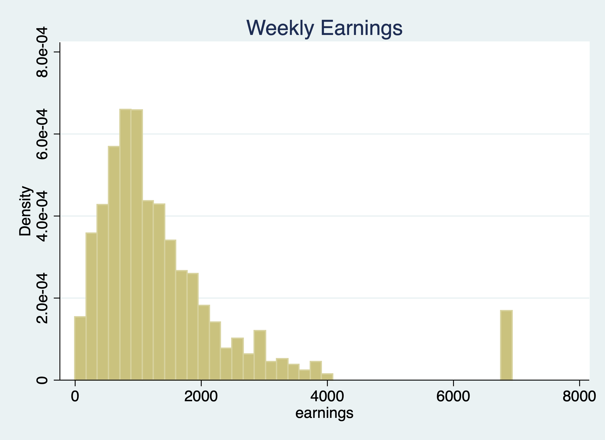

# Creating Variables
**Mitchell Chapter 6**

Overview
  1. Generate and replace commands
  2. Numeric expressions and functions
  3. String expressions and functions
  4. Recoding 
  5. Binary and Categorical variables
  6. Date and Time functions
  7. EGEN commands
  8. Converting Strings to Numerics
  9. Renaming and Reordering commands

The *generate* and replace will be the workhorses of creating and modifying variables
We'll deal with generating binary variables. We'll look into missing data and how to handle it. *Note: Please do not label your missing data, it just is a pain to deal with later*
The *egen* command is also a very practical and useful (I wish other software 
packages had this type of command). We'll deal with strings and converting between numerics and strings. 


## Creating and changing variables

One of the most basic tasks is to create, replace, and modify variables. Stata provides some nice and easy commands to work with variable generation and modification relative to other statistical software packages: *generate* and *replace*. These will be the workhorses for the creation and modification of variables. 

As we go through Mitchell's Chapter 6, we'll see that these are not the only two commands we will utilize. For example, Stata has a very helpful command called *egen*. It can be used to create new variables from old variables, especially when working with groups of observations. *Egen* becomes even more helpful when it is combined with *bysort*. We can sort our group and find the max, min, sum, etc. of a group of observations, which can come in handy when we are working with panel data. Futhermore, using indexes can make our generation commands more useful for creating lags or rebasing our data.

### Generate command

The *generate* or *gen* command is one command that you may alredy have plenty of experience with, but there are some helpful tips when working with generate. What we'll do first is to create a new variable called potential experience and potential experience squared.

Let's look at ages for workers earning weekly wages.
```{stata gen1}
cd "/Users/Sam/Desktop/Data/CPS"
use smalljul25pub, clear
summarize prtage if prerelg==1
generate pot_exp=prtage-16
summarize pot_exp if prerelg==1
```

Look for outliers and generate a histogram for outliers
```{stata gen2, eval=FALSE}
histogram pot_exp if prerelg==1
graph export "jul_25_pot_exp.png", replace
```


Now let's create a new variable for potential experience squared. We have two options:
```{stata gen3, eval=FALSE}
gen pot_exp2 = pot_exp*pot_exp
sum pot_exp2
drop pot_exp2

gen pot_exp2 = pot_exp^2
sum pot_exp2
```

```{stata gen4, echo=FALSE}
quietly {
cd "/Users/Sam/Desktop/Data/CPS"
use smalljul25pub, clear
generate pot_exp=prtage-16
}

gen pot_exp2 = pot_exp*pot_exp
sum pot_exp2
drop pot_exp2

gen pot_exp2 = pot_exp^2
sum pot_exp2
```

**Notice!**  Our age variable, prtage, is missing whent the value is -1. The data dictionary provides us the information that -1 is a holder for missing data. Please note that when missing values are ".", we will see missings in an outlier check! Why? Because missing values are considered **very large values**. This is important because when creating binary or categorical variables through qualifiers, make sure you top code your qualifiers.

For example, if we are creating a binary on part-time vs full-time. We need to top code so we don't count missing hours as full-time workers, 
```{stata gen5, eval=FALSE}
gen fulltime if hours > 35 & hours < 999999,
```
Alternatively, you can use the missing function.
```{stata gen6, eval=FALSE}
gen fulltime if hours > 35 & !missing(hours)
```

Let's generate weekly earnings and plot the data. The CPS data dictionary tells us that pternwa is the weekly earnings, but it needs to be divided by 100 to get two decimal places. 
```{stata gen7, eval=FALSE}
gen earnings=pternwa/100
histogram earnings if prerelg==1, title(Weekly Earnings)
graph export "jul_25_weekly_earnings.png", replace
```


Another helpful trick is the before and after options. It might be helpful to have the newly created variable next to a similar variable, so let's drop our variable and generate it again with the after option
```{stata gen8, eval=FALSE}
drop weekwage
gen hrlyearn = pternwa/pehract1, after(pternwa)
drop hrlyearn
gen hrlyearn = pternwa/pehract1, before(pternwa)
```

### Replace

We use our *replace* command to modify a variable that has already been created. Similar to generate, you probably already have experience with replace, but we'll go over some useful tips.

Qualifiers will be an essential part of your syntax when using the *replace* command. 

Let's generate a variable called marital status and look at married and nevermarried variables. 
```{stata rep1}
quietly cd "/Users/Sam/Desktop/Econ 645/Data/Mitchell"
quietly use wws, clear
tabulate married nevermarried
```

We'll generate a new variable called maritalstatus.
```{stata rep2, eval=FALSE}
gen maritalstatus = .
```

I recommend generating a new categorical variable as missing instead of zero, because this prevents missing variables from being categorized as 0 when applicable.

We generally use qualifers "=, >, <, >=, <=, !" when working with replace. Let's replace the marital status variable with married and nevermarried as qualifiers
```{stata rep3, eval=FALSE}
replace maritalstatus = 1 if married==0 & nevermarried==1
replace maritalstatus = 2 if married==1 & nevermarried==0
replace maritalstatus = 3 if married==0 & nevermarried==0
```

It's always a good idea to double check the varilabes against the variables they were created from to make sure your categories are what they are supposed to be.
```{stata rep4, eval=FALSE}
tabulate maritalstatus
table maritalstatus married nevermarried
```
```{stata rep5, echo=FALSE}
quietly {
quietly cd "/Users/Sam/Desktop/Econ 645/Data/Mitchell"
quietly use wws, clear
gen maritalstatus = .
replace maritalstatus = 1 if married==0 & nevermarried==1
replace maritalstatus = 2 if married==1 & nevermarried==0
replace maritalstatus = 3 if married==0 & nevermarried==0
}
tabulate maritalstatus
table maritalstatus married nevermarried
```

What will be helpful is to label our values, but we'll cover this next week.

We can also use the *replace* command with a continuous variable in the qualifier

Let's create a new varible called over40hours which will be categorized as 1 if it is over 40 hours, and 0 if it is 40 or under.
```{stata rep6, eval=FALSE}
generate over40hours = .
replace over40hours = 0 if hours <= 40
```
We need to make sure we don't include missing values so we need an additional qualifier besides hours > 40. We need to add !missing(hours).
```{stata rep7, eval=FALSE}
replace over40hours = 1 if hours > 40 & !missing(hours)
```
Now let's see the results. 
```{stata rep8, eval=FALSE}
tab over40hours
tab over40hours, sum(hours)
```

```{stata rep9, echo=FALSE}
quietly{
cd "/Users/Sam/Desktop/Econ 645/Data/Mitchell"
use wws, clear
generate over40hours = .
replace over40hours = 0 if hours <= 40
replace over40hours = 1 if hours > 40 & !missing(hours)
}
tab over40hours
tab over40hours, sum(hours)
```

## Numeric expressions and functions

Our standard numeric expressions
  1. addition +, 
  2. subtraction -, 
  3. multiplication *, 
  4. division /, 
  5. exponentiation ^, and 
  6. parantheses () for changing order of operation.

We also have some very useful numeric functions built into Stata:

The *int()* function removes any decimals.

The *round()* function rounds a number to the desired decimal place.Please note that this is different from Excel!!!

The *round(x,y)* rounds the numbers to the specified nearest value. Where x is your numeric and y is the nearest value you wish to round to.

For example:
  1. if y = 1, round(-5.2,1)=-5 and round(4.5)=5
  2. if y=.1, round(10.16,.1)=10.2 and round(34.1345,.1)=34.1
  3. if y=10, round(313.34,10)=310 and round(4.52,10)=0

**Note:** if y is missing, then it will round to the nearest integer round(10.16)=10
                  
The *ln()* function is our natural log function which we use a lot for transforming variables for elasticity estimates.

The *log10()* function is our logarithm base-10 function.

The *sqrt()* function is our square root function

```{stata num1}
	display int(10.65)
	display round(10.65,1)
	display ln(10.65)
	display log10(10.65)
	display sqrt(10.65)
```
Please note int(10.65) returns 10, while round(10.65,1) returns 11. 

### Random Numbers and setting seeds

There are several random number generating functions in Stata. 

*runiform()* is a random uniform distribution number generator has a distribution between 0 and 1.

*rnormal(m,sd)* is a random normal distribution number generator without arguments it will assume mean = 0 and sd = 1. 

*rchi2(df)* is a random chi-squared distribution number generator where df is the degrees of freedom that need to be specified

Let's look at some examples. 

Setting seeds is important if you want someone to replicate your results, since a set seed will generate the same random number each time it is run.
```{stata num2,eval=FALSE}
*Set our seed
set seed 12345

*Random uniform distribution 
gen runiformtest = runiform()
summarize runiformtest

*Random normal distribution
gen rnormaltest = rnormal()
gen rnormaltest2 = rnormal(100,15)
summarize rnormaltest rnormaltest2

*Random chi-squared distribution
gen rchi2test = rchi2(5)
summarize rchi2test
```
```{stata num2_1,echo=FALSE}
quietly{
cd "/Users/Sam/Desktop/Econ 645/Data/Mitchell"
use wws, clear
}
*Set our seed
set seed 12345

*Random uniform distribution 
gen runiformtest = runiform()
summarize runiformtest

*Random normal distribution
gen rnormaltest = rnormal()
gen rnormaltest2 = rnormal(100,15)
summarize rnormaltest rnormaltest2

*Random chi-squared distribution
gen rchi2test = rchi2(5)
summarize rchi2test
```
## String Expressions and functions
Working with string can be a pain, but there are some very helpful  functions that will get your task completed. 
```{stata str1, eval=FALSE}
help string functions
```

Let's get some new data to work with strings and their functions.

We'll format the names with left-justification 17 characters long.
```{stata str2}
quietly cd "/Users/Sam/Desktop/Econ 645/Data/Mitchell"
use "authors.dta", clear	
format name %-17s
list name 
```

Notice white space(s) in front of some names and some names are not in the proper format (lowercase for initial letter instead of upper).

To fix these, we have a three string functions to work with.

The *ustrtitle()* function is the Unicode function to convert strings to title cases, which means that the first letter is always upper and all others are lower case for each word.

The *ustrlower()* is the Unicode function to convert strings to lower case.

The *ustrupper()* is the Unicode function to convert strings to upper case.

Please note that there are string function that do something similar but in ASCII. Our names are not in ASCII currently, so please note that not all string characters come in ASCII, but may come in Unicode: 
  1. *strproper()*
  2. *strlower()*
  3. *strupper()*

We'll generate some names and format our strings to 23 length and left-justified
```{stata str2_1, eval=FALSE}
generate name2 = ustrtitle(name)
generate lowname = ustrlower(name)
generate upname = ustrupper(name)
format name2 lowname upname %-23s
list name2 lowname upname
```
```{stata str3, echo=FALSE}
quietly {
cd "/Users/Sam/Desktop/Econ 645/Data/Mitchell"
use "authors.dta", clear
}
generate name2 = ustrtitle(name)
generate lowname = ustrlower(name)
generate upname = ustrupper(name)
format name2 lowname upname %-23s
list name2 lowname upname
```
We still need to get rid of leading white spaces in front of the name. The *ustrltrim()* will get reid of leading blanks.
```{stata str4, eval=FALSE}
generate name3 = ustrltrim(name2)
format name2 name3 %-17s
list name name2 name3
```
```{stata str5, echo=FALSE}
quietly {
cd "/Users/Sam/Desktop/Econ 645/Data/Mitchell"
use "authors.dta", clear
generate name2 = ustrtitle(name)
generate lowname = ustrlower(name)
generate upname = ustrupper(name)
format name2 lowname upname %-23s
}
generate name3 = ustrltrim(name2)
format name2 name3 %-17s
list name name2 name3
```

Let's work with the initials to identify the initial. In small datasets this is easy enough, but for large datasets we'll need to use some functions.

### substr functions

One of the more practical string functions is the substr functions:

The *usubstr(s,n1,n2)* is our Unicode substring.

The *substr(s,n1,n2)* is our ASCII substring

Where s is the string, n1 is the starting position, n2 is the length 
```{stata str6}
	display substr("abcdef",2,3)
```

Let's find names that start with the initial with substr. We'll start at the 2nd position and move 1 character. Let's use ASCII and compare it to Unicode.
```{stata str7,eval=FALSE}
gen secondchar = substr(name3,2,1)
gen firstinit = (secondchar == " " | secondchar == ".") if !missing(secondchar)
```

We might want to break up a string as well. This is helpful for names, addresses, etc.
We can use the strwordcount function.

The *ustrwordcount(s)* counts the number of words using word-boundary rules of Unicode strings. Where s is the string input.
```{stata str9, eval=FALSE}
generate namecount = ustrwordcount(name3)
list name3 namecount
```
```{stata str10,echo=FALSE}
quietly {
  cd "/Users/Sam/Desktop/Econ 645/Data/Mitchell"
  use "authors.dta", clear
  generate name2 = ustrtitle(name)
  generate lowname = ustrlower(name)
  generate upname = ustrupper(name)
  format name2 lowname upname %-23s
  generate name3 = ustrltrim(name2)
  format name2 name3 %-17s
}
generate namecount = ustrwordcount(name3)
list name3 namecount

```
Notice that there are three authors have a word count of 4 instead of 3 when it should be three.

To extract the words after word count, we can use the *ustrword()* command.
*ustrword(s,n)* returns the word in the string depending upon n. 
**Note:** a positive n returns the nth word from the left, while a -n returns the nth word from the right.

```{stata str11, eval=FALSE}
	generate uname1=ustrword(name3,1)
	generate uname2=ustrword(name3,2)
	generate uname3=ustrword(name3,3)
	generate uname4=ustrword(name3,4)
	list name3 uname1 uname2 uname3 uname4 namecount
```
```{stata str12,echo=FALSE}
quietly {
  cd "/Users/Sam/Desktop/Econ 645/Data/Mitchell"
  use "authors.dta", clear
  generate name2 = ustrtitle(name)
  generate lowname = ustrlower(name)
  generate upname = ustrupper(name)
  format name2 lowname upname %-23s
  generate name3 = ustrltrim(name2)
  format name2 name3 %-17s
  generate namecount = ustrwordcount(name3)
}
generate uname1=ustrword(name3,1)
generate uname2=ustrword(name3,2)
generate uname3=ustrword(name3,3)
generate uname4=ustrword(name3,4)
list name3 uname1 uname2 uname3 uname4 namecount
```

It seems that *ustrwordcount* counts "." as separate words, so let's use another very helpful string function called *subinstr*, which comes in Unicode *usubinstr()* and ASCII *subinstr()*

*usubinstr(s1,s2,s3,n)*  replaces the nth occurance of s2 in s1 with s3.

*subinstr(s1,s2,s3,n)* is the same thing but for ASCII.

Where s1 is our string, s2 is the string we want to replace, s3 is the string we want instead, and n is the nth occurance of s2.

If n is missing or implied, then all occurances of s2 will be replaced.
```{stata str13, eval=FALSE }
generate name4 = usubinstr(name3,".","",.)
replace namecount = ustrwordcount(name4)
list name4 namecount
```
```{stata str14, echo=FALSE}
quietly {
  cd "/Users/Sam/Desktop/Econ 645/Data/Mitchell"
  use "authors.dta", clear
  generate name2 = ustrtitle(name)
  generate lowname = ustrlower(name)
  generate upname = ustrupper(name)
  format name2 lowname upname %-23s
  generate name3 = ustrltrim(name2)
  format name2 name3 %-17s
  generate namecount = ustrwordcount(name3)
}
generate name4 = usubinstr(name3,".","",.)
replace namecount = ustrwordcount(name4)
list name4 namecount
```

Let's split the names. We'll use *ustrword(s,n)* retrieves the *nth* word in string *s*.
```{stata str15, eval=FALSE}
gen fname = ustrword(name4,1)
gen mname = ustrword(name4,2) if namecount==3
gen lname = ustrword(name4,namecount)
format fname mname lname %-15s
list name4 fname mname lname
```
```{stata str16, echo=FALSE}
quietly {
  cd "/Users/Sam/Desktop/Econ 645/Data/Mitchell"
  use "authors.dta", clear
  generate name2 = ustrtitle(name)
  generate lowname = ustrlower(name)
  generate upname = ustrupper(name)
  format name2 lowname upname %-23s
  generate name3 = ustrltrim(name2)
  format name2 name3 %-17s
  generate namecount = ustrwordcount(name3)
  generate name4 = usubinstr(name3,".","",.)
  replace namecount = ustrwordcount(name4)
}
gen fname = ustrword(name4,1)
gen mname = ustrword(name4,2) if namecount==3
gen lname = ustrword(name4,namecount)
format fname mname lname %-15s
list name4 fname mname lname
```

Some names have the middle initial first, so let's rearrange. The middle initial will only have a string length of one, so we need our string length functions. 
*ustrlen(s)* returns the length of the string.

*strlen(s)* is the same as above but for ASCII

Let's add the period back to the middle initial if the string length is 1.
```{stata str17, eval=FALSE}
replace fname=fname + "." if ustrlen(fname)==1
replace mname=mname + "." if ustrlen(mname)==1
list fname mname
```
```{stata str18, echo=FALSE}
quietly {
  cd "/Users/Sam/Desktop/Econ 645/Data/Mitchell"
  use "authors.dta", clear
  generate name2 = ustrtitle(name)
  generate lowname = ustrlower(name)
  generate upname = ustrupper(name)
  format name2 lowname upname %-23s
  generate name3 = ustrltrim(name2)
  format name2 name3 %-17s
  generate namecount = ustrwordcount(name3)
  generate name4 = usubinstr(name3,".","",.)
  replace namecount = ustrwordcount(name4)
  gen fname = ustrword(name4,1)
  gen mname = ustrword(name4,2) if namecount==3
  gen lname = ustrword(name4,namecount)
  format fname mname lname %-15s
}
replace fname=fname + "." if ustrlen(fname)==1
replace mname=mname + "." if ustrlen(mname)==1
list fname mname
```

Let's make a new variable that correctly arranges the parts of the name.
```{stata str19, eval=FALSE}
	gen mlen = ustrlen(mname)
	gen flen = ustrlen(fname)
	gen fullname = fname + " " + lname if namecount == 2
	replace fullname = fname + " " + mname + " " + lname if namecount==3 & mlen > 2
	replace fullname = fname + " " + mname + " " + lname if namecount==3 & mlen==2
	replace fullname = mname + " " + fname + " " + lname if namecount==3 & flen==2
	list fullname fname mname lname
```

```{stata str20, echo=FALSE}
quietly {
  cd "/Users/Sam/Desktop/Econ 645/Data/Mitchell"
  use "authors.dta", clear
  generate name2 = ustrtitle(name)
  generate lowname = ustrlower(name)
  generate upname = ustrupper(name)
  format name2 lowname upname %-23s
  generate name3 = ustrltrim(name2)
  format name2 name3 %-17s
  generate namecount = ustrwordcount(name3)
  generate name4 = usubinstr(name3,".","",.)
  replace namecount = ustrwordcount(name4)
  gen fname = ustrword(name4,1)
  gen mname = ustrword(name4,2) if namecount==3
  gen lname = ustrword(name4,namecount)
  format fname mname lname %-15s
  replace fname=fname + "." if ustrlen(fname)==1
  replace mname=mname + "." if ustrlen(mname)==1
}
gen mlen = ustrlen(mname)
gen flen = ustrlen(fname)
gen fullname = fname + " " + lname if namecount == 2
replace fullname = fname + " " + mname + " " + lname if namecount==3 & mlen > 2
replace fullname = fname + " " + mname + " " + lname if namecount==3 & mlen==2
replace fullname = mname + " " + fname + " " + lname if namecount==3 & flen==2
list fullname fname mname lname
```
If you are brave enough, learning regular express can pay off in the long run. Stata has string functions with regular express, such as finding particular sets of strings with *regexm()*. Regular expressions are a pain to work with, but they are very powerful.

## Recoding

### Recoding with categorical variables 

We can use the *recode* command to modify existing values of a variable. It is particularily helpful when working with categorical variables.

Let's get some data on working women and look at the codebook
```{stata rec1}
cd "/Users/Sam/Desktop/Econ 645/Data/Mitchell/"
use "wws2lab.dta", clear
codebook occupation, tabulate(25)
```
Let's say we want aggregated groups of occupation. We could use a categorical variable strategy to create a with gen and replace with qualifers. We can also use the recode command for faster groupings
 
```{stata rec2, eval=FALSE}
recode occupation (1/3=1) (5/8=2) (4 9/13=3), generate(occ3)
tab occupation occ3
table occupation occ3
```
```{stata rec3, echo=FALSE}
quietly {
  cd "/Users/Sam/Desktop/Econ 645/Data/Mitchell/"
  use "wws2lab.dta", clear
}
recode occupation (1/3=1) (5/8=2) (4 9/13=3), generate(occ3)
tab occupation occ3
table occupation occ3
```
We condense 3 or 4 lines of code down to 1 line using *recode* instead of *replace*. 

We can also label are variables in the recode command. This can add to your consolidation of code. 
```{stata rec4, eval=FALSE}
drop occ3
recode occupation (1/3= 1 "White Collar") (5/8=2 "Blue Collar") (4 9/12=3 "Other"), generate(occ3)
tab occupation occ3, missing
table occupation occ3, missing
```
```{stata rec5, echo=FALSE}
quietly {
cd "/Users/Sam/Desktop/Econ 645/Data/Mitchell/"
use "wws2lab.dta", clear
recode occupation (1/3=1) (5/8=2) (4 9/13=3), generate(occ3)  
}
drop occ3
recode occupation (1/3= 1 "White Collar") (5/8=2 "Blue Collar") (4 9/13=3 "Other"), generate(occ3)
tab occupation occ3, missing
table occupation occ3, missing
```

**Tangent**
Let's look at the syntax. In Stata #n1/#n2 means all values between #n1 and #n2. This is similar to c(#n1:#n2) in R. 
#n1 #n2 means only values #n1 #n2
For example, if we wanted to see the first 10 observations, we can use 1/10
1/10 means 1 2 3 4 5 6 7 8 9 10
```{stata rec6, eval=FALSE}
list hours in 1/10
```
```{stata rec6_1, echo=FALSE}
quietly {
cd "/Users/Sam/Desktop/Econ 645/Data/Mitchell/"
use "wws2lab.dta", clear
}
list hours in 1/10
```
If we wanted to see the last 10 observations, we can use -10/-1
```{stata rec7, eval=FALSE}
list hours in -10/-1
```
```{stata rec7_1, echo=FALSE}
quietly {
cd "/Users/Sam/Desktop/Econ 645/Data/Mitchell/"
use "wws2lab.dta", clear
}
list hours in -10/-1
```
In our syntax above, (4 9/13) means 4 9 10 11 12 13.

In my opinion, this syntax is annoying, since we use a space to delimit 4 and 9 instead of a comma. In R, it would be:
```{r rec8}
c(4,9:13)
```

### Recoding with continuous variables

You can use *recode* with continuous variables to create categorical variables, such as wages, hours, etc. However, I recommend the *replace* command instead. Occupation is a categorical variable, so the *recode* works well when working with categorical variables in the first place.

**Note:** There is *recode()*, *irecode()*, and *autocode()*, but I recommand using gen and replace with qualifiers instead. You don't want overlapping groups and with qualifers you can ensure they don't overlap.

*Egen* is powerful that has many useful command that we will cover in more detail below. A command that is useful for recoding continuous variables is *egen cut*. Let's look at wages.
```{stata rec9, eval=FALSE}
summarize wage, detail
```
```{stata rec10, echo=FALSE}
quietly {
cd "/Users/Sam/Desktop/Econ 645/Data/Mitchell/"
use "wws2lab.dta", clear
}
summarize wage, detail
```
4.26 is our 25th percentile; 6.27 is our median; and 9.66 is our 75th percentile. You can use these breakpoints with at or equal lengths with group. Make sure your first breakpoint is at the minimum so you don't cut off data. E.g.: Our first value needs to be zero for wages, since this is the minimum.
```{stata rec11, eval=FALSE}
egen wage3 = cut(wage), at(0,4,6,9,12)
egen wage4 = cut(wage), group(3)
tabstat wage, by(wage3)
tabstat wage, by(wage4)
```
```{stata rec12, echo=FALSE}
quietly {
cd "/Users/Sam/Desktop/Econ 645/Data/Mitchell/"
use "wws2lab.dta", clear
}
egen wage3 = cut(wage), at(0,4,6,9,12)
egen wage4 = cut(wage), group(3)
tabstat wage, by(wage3)
tabstat wage, by(wage4)
```

I still recommend using gen, replace, and qualifers for generating categorical variables from continuous variables. 

### Recoding values to missing

If you are interested, you can review different ways to code  missing values. I generally just use ".", but when survey data
comes back, there may be different reasons for missing. N/A vs Did not respond may have different meanings and you may
want to account for that.

We will take a brief look at mvdecode() to recode all missing values coded as -1 and -2 to. It can be a bit faster than using replace for every variable of interest.
```{stata rec13}
cd "/Users/Sam/Desktop/Econ 645/Data/Mitchell/"
infile id age pl1-pl5 bp1-bp5 using "cardio2miss.txt", clear
list
```
Recode -1 and -2 as "."
```{stata rec14, eval=FALSE}
mvdecode bp* pl*, mv(-1 -2)
list
```
```{stata rec15, echo=FALSE}
quietly {
cd "/Users/Sam/Desktop/Econ 645/Data/Mitchell/"
infile id age pl1-pl5 bp1-bp5 using "cardio2miss.txt", clear
}
mvdecode bp* pl*, mv(-1 -2)
list
```

The *mvdecode* command can be very helpful with files such as the CPS where missing values are set at -1. Some datasets set their missing as very large numbers, such as 99999.

## *i.* Operator 

Stata has an easy way to incorporate binary/categorical/dummy variables. Factors variables for dummy variables start with an *i.* operator in our regressions. We will see *d.*, *s.*, and *l.* operators when we cover panel data and time series. 

### Creating Binary and Categorical variables

Creation of dummy variables is a common and vital process in econometric analysis. Making mutually exclusive groups is essential for preventing multicollinearity and perfect multicollinearity.

If we don't use an *i.* operator for categorical variables, then we need to generate multiple binary (0/1) variables from our categorical group. If we don't use factor variables or mutually exclusive binary variables from our categorical, then Stata will think our categorical variable is a continuous variable, which does not have any interpretation.

Let's look at our highest grade completed categorical.
```{stata int1}
cd "/Users/Sam/Desktop/Econ 645/Data/Mitchell"
use "wws2lab.dta", clear
codebook grade4
```

Let's use it in a regression with grade4 as a factor variable. 
```{stata int2, eval=FALSE}
regress wage i.grade4
```
```{stata int3, echo=FALSE}
quietly{
cd "/Users/Sam/Desktop/Econ 645/Data/Mitchell/"
use "wws2lab.dta", clear
}
regress wage i.grade4
```
Stata knows to create 4 groups "NHS" "HS" "SC" and "CD", and by default. Stata excludes the first category to prevent perfect multicollinearity. So, there will always be $ k-1 $ groups in the regress and the kth group is in the intercept.

A nice feature with factor variables is that we can change the base group, which is 1 by default. ib2.var means to use the variable as a factor variable and use the 2nd category as the base group. 
```{stata int4, eval=FALSE}
regress wage ib2.grade4
```
```{stata int5, echo=FALSE}
quietly {
cd "/Users/Sam/Desktop/Econ 645/Data/Mitchell/"
use "wws2lab.dta", clear
}
regress wage ib2.grade4
```
We can use list to see how Stata treats i.grade4 vs grade4. We can see how Stata automatically creates binary variables for each values of grade4.
```{stata int5_1, eval=FALSE}
list wage grade4 i.grade4 in 1/10, nolabel
```
```{stata int5_2, echo=FALSE}
quietly {
cd "/Users/Sam/Desktop/Econ 645/Data/Mitchell/"
use "wws2lab.dta", clear
}
list wage grade4 i.grade4 in 1/10, nolabel
```

## Interactions

Interactions are an important part of Stata. Interactions # can interact categoricals-categorical, categorical-continuous, or continuous-continuous.

### Categorical-Categorical Interaction - Changes Intercepts
We can interact two categorical variables to get different intercepts for each group.

Let's interact married and high grade completed.
```{stata int6, eval=FALSE}
reg wage i.grade4##i.married
```
```{stata int7, echo=FALSE}
quietly {
cd "/Users/Sam/Desktop/Econ 645/Data/Mitchell/"
use "wws2lab.dta", clear
}
reg wage i.grade4##i.married
```
This i.grade4##i.married is the same as i.grade4 i.married i.grade4#i.married
```{stata int8, eval=FALSE}
reg wage i.grade4 i.married i.grade4#i.married
```

```{stata int9, echo=FALSE}
quietly {
cd "/Users/Sam/Desktop/Econ 645/Data/Mitchell/"
use "wws2lab.dta", clear
}
reg wage i.grade4 i.married i.grade4#i.married
```

A single # interacts only the two categoricals, while ## between two categorical will create all groups (except the base group). 
No High School and unmarried is the base group (intercept)
All grade4 coefficients are returns to education for unmarried relative to the base reference group.
All grade4#married coefficients are returns to education for married relative to the base reference group.
**Remember:** This changes the intercepts for all groups and the base group is the intercept.

### Categorical-continuous - changes intercepts and slopes
We use the *c.* operator to define continuous variables in an internaction. Interacting categorical and continuous variables allows for different slopes and different intercepts. We define a continuous variable as "c.var" and a categorical as "i.var"

```{stata int10, eval=FALSE}
reg wage i.grade4##c.age
```
```{stata int11, echo=FALSE}
quietly {
cd "/Users/Sam/Desktop/Econ 645/Data/Mitchell/"
use "wws2lab.dta", clear
}
reg wage i.grade4##c.age
```

We can see different intercepts for education:

Don't forget the intercept is the intercept for the base group (No High School)

We can see the basegroup slope:

The coefficient for age is the slope of the base group (No High School)

We can see the different slopes for the different groups

There are three different slopes for our three comparison groups

### Continuous-Continuous Interaction - add n polynomials
Polynominal to the order of 2
```{stata int12, eval=FALSE}
reg wage c.age##c.age
```
```{stata int13, echo=FALSE}
quietly {
cd "/Users/Sam/Desktop/Econ 645/Data/Mitchell/"
use "wws2lab.dta", clear
}
reg wage c.age##c.age
```

Polynominal to the order of 3
```{stata int14, eval=FALSE}
reg wage c.age##c.age##c.age
```

```{stata int15, echo=FALSE}
quietly {
cd "/Users/Sam/Desktop/Econ 645/Data/Mitchell/"
use "wws2lab.dta", clear
}
reg wage c.age##c.age##c.age
```

Polynominal to the order of 4
```{stata int16, eval=FALSE}
reg wage c.age##c.age##c.age##c.age
```

```{stata int17, echo=FALSE}
quietly {
cd "/Users/Sam/Desktop/Econ 645/Data/Mitchell/"
use "wws2lab.dta", clear
}
reg wage c.age##c.age##c.age##c.age
```

## Date Variables

Dates can be a pain to work with, but Mitchell's and UCLA's OARC STATA resources (https://stats.oarc.ucla.edu/stata/modules/using-dates-in-stata/) can be very helpful.

Dates and times can be very helpful when working with time series data or panel data.

Sometimes dates are separated in columns and we need to append them and set the date format
```{stata date1}
cd "/Users/Sam/Desktop/Econ 645/Data/Mitchell/"
type momkid1.csv
import delimited using "momkid1.csv", clear
list
```

### Create Dates from numerical variables
Using the function *mdy()*, we can create the mother's birthday with the numerical values for day, month, and year.
```{stata data2, eval=FALSE}
generate mombdate=mdy(momm, momd, momy), after(momy)
list mombdate momm momd momy 
```

```{stata date3, echo=FALSE}
quietly {
cd "/Users/Sam/Desktop/Econ 645/Data/Mitchell/"
import delimited using "momkid1.csv", clear
}
generate mombdate=mdy(momm, momd, momy), after(momy)
list mombdate momm momd momy 

```

### Create Dates from string variables

Using the function *date()*, we can create kid's birthday from string values.
```{stata date4, eval=FALSE}
generate kidbdate=date(kidbday,"MDY")
list kiddbay kidbate 
```
```{stata date5, echo=FALSE}
quietly {
cd "/Users/Sam/Desktop/Econ 645/Data/Mitchell/"
import delimited using "momkid1.csv", clear
generate mombdate=mdy(momm, momd, momy), after(momy)
}
generate kidbdate=date(kidbday,"MDY")
list kidbdate kidbday 
```

Notice that the dates are not in a format that we can work with easily. These values represent the days from Jan 1, 1960. You can see the Mom's birthday on Jan 5, 1960 is 4. We can difference the dates, so Jan 5, 1960 is 4 and Jan 1, 1960 is 0.

We saw this a couple week ago, but our format %td is what we need and remember that are a lot of variations on %td, but ultimately Stata still sees Jan 5, 1960 is 4 and Jan 1, 1960 is 0, etc.
```{stata date6, eval=FALSE}
format mombdate kidbdate %td
list
```
```{stata date7, echo=FALSE}
quietly {
cd "/Users/Sam/Desktop/Econ 645/Data/Mitchell/"
import delimited using "momkid1.csv", clear
generate mombdate=mdy(momm, momd, momy), after(momy)
generate kidbdate=date(kidbday,"MDY")
}
format mombdate kidbdate %td
list
```

For a MM/DD/YYYY format add NN/DD/ccYY at after %td
```{stata date8, eval=FALSE}
format mombdate kidbdate %tdNN/DD/ccYY
list
```
```{stata date9, echo=FALSE}
quietly {
cd "/Users/Sam/Desktop/Econ 645/Data/Mitchell/"
import delimited using "momkid1.csv", clear
generate mombdate=mdy(momm, momd, momy), after(momy)
generate kidbdate=date(kidbday,"MDY")
}
format mombdate kidbdate %tdNN/DD/ccYY
list
```
  1. nn is for 1-12 months; NN is for 01-12 months.
  2. dd is for 1-31 days; DD is for 01-31 days.
  3. YY is  for 2-digit year (regardless of first two digits).
  4. cc is for first 2-digits of year.
  5. ccYY is for 4-digit year.
  6. Dayname will return Sunday-Saturday.
  7. Mon will return month name.

We can use ",", "-", "/" and "_" where "_" is for a blank space
```{stata date10, eval=FALSE}
format mombdate kidbdate %tdDayname_Mon_DD,_ccYY
list kidbday kidbdate
```
```{stata date11, echo=FALSE}
quietly {
cd "/Users/Sam/Desktop/Econ 645/Data/Mitchell/"
import delimited using "momkid1.csv", clear
generate mombdate=mdy(momm, momd, momy), after(momy)
generate kidbdate=date(kidbday,"MDY")
}
format mombdate kidbdate %tdDayname_Mon_DD,_ccYY
list kidbday kidbdate
```

### Calculate differences between dates

Remember that we can difference between dates as mentioned above, since Stata keeps dates as numerical days from Jan 1, 1960.
```{stata date12, eval=FALSE}
generate momagediff=kidbdate-mombdate
list mombdate kidbdate momagediff
```
```{stata date12_1, echo=FALSE}
quietly {
cd "/Users/Sam/Desktop/Econ 645/Data/Mitchell/"
import delimited using "momkid1.csv", clear
generate mombdate=mdy(momm, momd, momy), after(momy)
generate kidbdate=date(kidbday,"MDY")
format mombdate kidbdate %tdDayname_Mon_DD,_ccYY
}
generate momagediff=kidbdate-mombdate
list mombdate kidbdate momagediff
```

We can find years by dividing by 365.25.
```{stata date13, eval=FALSE}
generate momagediffyr = (kidbdate-mombdate)/365.25
list mombdate kidbdate momagediffyr
```
```{stata date14, echo=FALSE}
quietly {
cd "/Users/Sam/Desktop/Econ 645/Data/Mitchell/"
import delimited using "momkid1.csv", clear
generate mombdate=mdy(momm, momd, momy), after(momy)
generate kidbdate=date(kidbday,"MDY")
format mombdate kidbdate %tdDayname_Mon_DD,_ccYY
generate momagediff=kidbdate-mombdate
}
generate momagediffyr = (kidbdate-mombdate)/365.25
list mombdate kidbdate momagediffyr
```

### Return day, month, or year from a date variable

You can always insert a static date in the <i>mdy()</i> function or <i>date()</i> function
```{stata date15}
display (mdy(4,5,2005)-mdy(5,6,2000))/365.25
```
We can always use a qualifier to find people born before, after, not on, or on a certain date. 
```{stata date16, eval=FALSE}
list momid mombdate if (mombdate >= mdy(1,20,1970)) & !missing(mombdate)
```
```{stata date17, echo=FALSE}
quietly {
cd "/Users/Sam/Desktop/Econ 645/Data/Mitchell/"
import delimited using "momkid1.csv", clear
generate mombdate=mdy(momm, momd, momy), after(momy)
generate kidbdate=date(kidbday,"MDY")
format mombdate kidbdate %tdDayname_Mon_DD,_ccYY
generate momagediff=kidbdate-mombdate
generate momagediffyr = (kidbdate-mombdate)/365.25
}
list momid mombdate if (mombdate >= mdy(1,20,1970)) & !missing(mombdate)
```

Let's say we want just the day, month, or year from a date variable. Then we have a few functions:
  1. *day(date)* returns a numeric of the day.
  2. *month(date)* returns a numeric of the month.
  3. *year(date)* returns a numeric of the year.
  4. *week(date)* returns a numeric of the week out of (1-52).
  5. *quarter(date)* returns a numeric of the quarter (1-4).
  6. *dow(date)* returns day of the week as a numeric (0=Sunday,...,6=Saturday).
  7. *doy(date)* returns a numeric of the day of the year (1-365) or (1-366).

This can be helpful when trying to compare time for a panel data set and we don't need day - just month and year -. I use this quite a bit with CPS data, since we have two numeric date variables: hrmonth and hryear4. If we have the month and the year, we can use ym(Y,M) to create a month-year date variable. Then, we can use the *xtset* set command, which we will review during our panel data discussions. Remember, the month-year value will the number of months since Jan 1960.
```{stata date18}
cd "/Users/Sam/Desktop/Data/CPS/"
use "smalljul25pub", clear
gen monyear = ym(hryear4, hrmonth)
list monyear in 1/10, sep(5)
```

We can see that Jul 2025 is 786 months since Jan 1960. We use the *%tm* format for months and year to have the values in a more user friendly format.
```{stata date19, eval=FALSE}
format monyear %tmMon_ccYY
list monyear in 1/10, sep(5)
```
```{stata date20, echo=FALSE}
quietly{
cd "/Users/Sam/Desktop/Data/CPS/"
use "smalljul25pub", clear
gen monyear = ym(hryear4, hrmonth)
}
format monyear %tmMon_ccYY
list monyear in 1/10, sep(5)
```
You can use cut off when there are only 2-digit YY on page 177-179, but you can review this if you like.

Don't forget to look for help on Stata, or on UCLA's OARC Stata resources website.
```{stata date21, eval=FALSE}
help dates and times
```

## Date and Time Variables

Section 6.8 provides helpful information using dates AND times. You may run across time formats, and I'll refer you to pages 179-186 for future reference. For some reason you had birth date and time, you can use the *mdyhms()* function and the format %tc
```{stata date22}
cd "/Users/Sam/Desktop/Econ 645/Data/Mitchell"
import delimited using "momkid1a.csv", clear
gen momdt = mdyhms(momm,momd,momy,momh,mommin,moms)
format momdt %tc
list 
```

## Computations across variables
The *egen* command is something that I miss in other statistical packages since it is so useful. We can do computation across columns or we can do computation across observations with *egen*

For computations across columns/variables, we can look at row means, row mins, row maxs, row missing, row nonmissing, etc. On a personal note, I do not use computations across variables too often. If you have have panel data set, it should be in a long-form format instead of a wide-form format. When you use data in a long-form format, *egen* across variables has limited uses.

Let's find the mean across pl1-pl5 with <i>row mean</i> instead of *gen avgpl=(pl1+...+pl5)/5*

```{stata row1}
cd "/Users/Sam/Desktop/Econ 645/Data/Mitchell/"
use "cardio2miss.dta", clear
egen avgpl=rowmean(pl1-pl5)
list id pl1-pl5 avgpl
```

*rowmeans()* will ignore the missing values. (I wish other statistical packages did this)
```{stata row2, eval=FALSE}
egen avgbp=rowmean(bp1-bp5)
list id bp1-bp5 avgbp
```
```{stata row3, echo=FALSE}
quietly {
cd "/Users/Sam/Desktop/Econ 645/Data/Mitchell/"
use "cardio2miss.dta", clear
egen avgpl=rowmean(pl1-pl5)
}
egen avgbp=rowmean(bp1-bp5)
list id bp1-bp5 avgbp
```

*rowmin()* returns the row minimum, while *rowmax()* returns the row maximum.
```{stata row4, eval=FALSE}
egen maxbp=rowmax(bp1-bp5)
egen minbp=rowmin(bp1-bp5)
list id bp1-bp5 avgbp maxbp minbp
```
```{stata row4_1, echo=FALSE}
quietly {
cd "/Users/Sam/Desktop/Econ 645/Data/Mitchell/"
use "cardio2miss.dta", clear
egen avgpl=rowmean(pl1-pl5)
egen avgbp=rowmean(bp1-bp5)
}
egen maxbp=rowmax(bp1-bp5)
egen minbp=rowmin(bp1-bp5)
list id bp1-bp5 avgbp maxbp minbp
```

We can find missing or not missing with the *rowmiss()* and *rownonmiss()*
```{stata row5, eval=FALSE}
	egen missbp = rowmiss(bp?)
```

**Note**: the *?* operator differs from the wildcard * operator. The *?* operator is a wildcard for 1 character in between so *bp?* will pick up bp1, bp2, bp3, bp4, and bp5, and *bp?* will exlude bpavg, bpmin, bpmax
Examples:
  1. <i>my*var</i> variables starting with my & ending with var with any number of other characters between.
  2. <i>my~var</i> one variable starting with my & ending with var with any number of other characters between.
  3. <i>my?var</i> variables starting with my & ending with var with one other character between.

Recap:
  1. *myvar* is just one variable
  2. *myvar* *thisvar* *thatvar* are three variables
  3. *myvar* are all variables starting with myvar
  4. <i>*var</i> are all variables ending with var
  5. *myvar1*-*myvar6* includes myvar1, myvar2, ..., myvar6
  6. *this*-*that* includes variables *this* through *that*, inclusive

## EGEN Computation across observations

*EGEN* and *bysort* are a powerful combination for working across groups
of observations. This can be very helpful when working with panel 
data or time series by groups.  We will sort by id and then time and
perform our egen commands
We have our egen *sum, egen total, egen max, egen min, egen mean* which will be the main egen commands.


Let's use *egen* to find the average for groups. *Egen* without a bysort will return the mean for the entire column, which may or may not be helpful. If we want a mean within a group (or an individual's panel data), we want to sort by groups (or individuals) first and then perform the egen mean.

```{stata col1}
cd "/Users/Sam/Desktop/Econ 645/Data/Mitchell/"
use "gasctrysmall.dta", clear
egen avggas = mean(gas)
bysort ctry: egen avggas_ctry = mean(gas)
list ctry year gas avggas avggas_ctry, sepby(ctry)
```

Let's get the *max* and *min* for each country. 
```{stata col2, eval=FALSE}
bysort ctry: egen mingas_ctry = min(gas)
bysort ctry: egen maxgas_ctry = max(gas)
```
```{stata col3, echo=FALSE}
quietly {
cd "/Users/Sam/Desktop/Econ 645/Data/Mitchell/"
use "gasctrysmall.dta", clear
egen avggas = mean(gas)
bysort ctry: egen avggas_ctry = mean(gas)
}
bysort ctry: egen mingas_ctry = min(gas)
bysort ctry: egen maxgas_ctry = max(gas)
```

We can count our observations. 
```{stata col4, eval=FALSE}
bysort ctry: egen count_ctry=count(gas)
list, sepby(ctry)
```
```{stata col5, echo=FALSE}
quietly {
cd "/Users/Sam/Desktop/Econ 645/Data/Mitchell/"
use "gasctrysmall.dta", clear
egen avggas = mean(gas)
bysort ctry: egen avggas_ctry = mean(gas)
bysort ctry: egen mingas_ctry = min(gas)
bysort ctry: egen maxgas_ctry = max(gas)
}
bysort ctry: egen count_ctry=count(gas)
list, sepby(ctry)
```

We also have *egen count()*, *egen iqr()*, *egen median()*, and *egen pctile(#,p(#))*
See more egen commands:
```{stata col6}
help egen
```

### Subscripting 
*(Head start to Mitchell 8.4)*

*Bysort* can be combined with indexes/subscripting to find the first, last, or #
observaration within a group
```{stata sub1,eval=FALSE}
cd "/Users/Sam/Desktop/Econ 645/Data/Mitchell/"
use "gasctrysmall.dta", clear
```

Find first year and last year
```{stata sub2,eval=FALSE}
bysort ctry: gen firstyr = year[1]
bysort ctry: gen lastyr = year[_N]
```
```{stata sub3, echo=FALSE}
quietly{
cd "/Users/Sam/Desktop/Econ 645/Data/Mitchell/"
use "gasctrysmall.dta", clear
}
bysort ctry: gen firstyr = year[1]
bysort ctry: gen lastyr = year[_N]
list, sepby(ctry)
```
Take a difference between periods (same as l.var)
```{stata sub4, eval=FALSE}
bysort ctry: gen diffgas = gas-gas[_n-1]
```
```{stata sub5, echo=FALSE}
quietly{
cd "/Users/Sam/Desktop/Econ 645/Data/Mitchell/"
use "gasctrysmall.dta", clear
bysort ctry: gen firstyr = year[1]
bysort ctry: gen lastyr = year[_N]
}
bysort ctry: gen diffgas = gas-gas[_n-1]
list, sepby(ctry)
```
Create Indexes for Rate of change to base year
```{stata sub6, eval=FALSE}
bysort ctry: gen gasindex = gas/gas[1]*100
```
```{stata sub7, echo=FALSE}
quietly{
cd "/Users/Sam/Desktop/Econ 645/Data/Mitchell/"
use "gasctrysmall.dta", clear
bysort ctry: gen firstyr = year[1]
bysort ctry: gen lastyr = year[_N]
bysort ctry: gen diffgas = gas-gas[_n-1]
}
bysort ctry: gen gasindex = gas/gas[1]*100
list, sepby(ctry)
```
### More Egen

This section has more interesting egen commands that you can review if you would like. The workhorse egen commands are above.


## Converting Strings to numerics

These next two section have a lot of practical implications that you find when working with survey and especially administrative data. First we will cover converting numerical characters in strings to numerical data to analyze.


Let's summarize our data, but it comes back blank.
```{stata con1}
cd "/Users/Sam/Desktop/Econ 645/Data/Mitchell"
use "cardio1str.dta", clear
sum wt bp1 bp2 bp3
```

All of our numerical data are in string formats.
```{stata con2, eval=FALSE}
describe
```
```{stata con3, echo=FALSE}
quietly {
cd "/Users/Sam/Desktop/Econ 645/Data/Mitchell"
use "cardio1str.dta", clear
}
describe
```

### Destring

The *destring* command is our main command to convert numerical characters to numerics. With *destring*, we have to choose an option of generating a new variable or replace the current variable
```{stata con4, eval=FALSE}
destring age, gen(agen)
sum age agen
drop agen
```
```{stata con5, echo=FALSE}
quietly {
cd "/Users/Sam/Desktop/Econ 645/Data/Mitchell"
use "cardio1str.dta", clear
}
destring age, gen(agen)
sum age agen
drop agen
```

We can destring all of our numerics.
```{stata con6, eval=FALSE}
destring id-income, replace
```
```{stata con7, eval=FALSE}
quietly {
cd "/Users/Sam/Desktop/Econ 645/Data/Mitchell"
use "cardio1str.dta", clear
}
destring id-income, replace
```

Notice that the replace failed for income and pl3. This is becuase pl3 has a letter, so all of the data are not all digits. Income has $ and , so it can not convert the data.

We can use the force option with pl3 to convert the X to missing.
```{stata con8, eval=FALSE}
list pl3
destring pl3, replace force
list pl3
```
```{stata con9, echo=FALSE}
quietly {
cd "/Users/Sam/Desktop/Econ 645/Data/Mitchell"
use "cardio1str.dta", clear
destring id-income, replace
}
list pl3
destring pl3, replace force
list pl3
```

We cannot use the force option with income, since it contains important information. We need to get rid of the two non-numerical characters of $ and ,

We have two options: eliminate the "$" and "," or use the ignore option in destring. The latter option is easier.
```{stata con10, eval=FALSE}
list income
destring income, replace ignore("$,")
list income
```

```{stata con11, echo=FALSE}
quietly {
cd "/Users/Sam/Desktop/Econ 645/Data/Mitchell"
use "cardio1str.dta", clear
destring id-income, replace
destring pl3, replace force
}
list income
destring income, replace ignore("$,")
list income
```

### Encode

Sometimes we have categorical variables or ID variables that come in as strings. We need to code them as categorical, but strings can be tricky with leading or lagging zeros or misspellings.

One option is to use the *encode* command, which will generate a new variable that codifies the string variable. This can be very helpful when our id variable in panel data are in string format.

Remember: trim any white space around the string just in case, 
  1. *strtrim()* - remove leading and lagging white space
  2. *strrtrim()* - removes lagging white spaces
  3. *strltrim()* - removes leading white spaces
  4. *stritrim()* - removes leading, lagging, and consecutive white spaces

```{stata con12, eval=FALSE}
list id gender
replace gender = stritrim(gender)
encode gender, generate(gendercode)
list gender gendercode
```
```{stata con13, echo=FALSE}
quietly {
cd "/Users/Sam/Desktop/Econ 645/Data/Mitchell"
use "cardio1str.dta", clear
destring id-income, replace
destring pl3, replace force
destring income, replace ignore("$,")
}
list id gender
replace gender = stritrim(gender)
encode gender, generate(gendercode)
list gender gendercode
```
They look the same, but let's use tabulation

```{stata con14, eval=FALSE}
tab gender gendercode, nolabel
```
```{stata con15, echo=FALSE}
quietly {
cd "/Users/Sam/Desktop/Econ 645/Data/Mitchell"
use "cardio1str.dta", clear
destring id-income, replace
destring pl3, replace force
destring income, replace ignore("$,")
replace gender = stritrim(gender)
encode gender, generate(gendercode)
}
tab gender gendercode, nolabel
```
The encode creates label values around the new variable
```{stata con16, eval=FALSE}
codebook gendercode
```
```{stata con17, echo=FALSE}
quietly {
cd "/Users/Sam/Desktop/Econ 645/Data/Mitchell"
use "cardio1str.dta", clear
destring id-income, replace
destring pl3, replace force
destring income, replace ignore("$,")
replace gender = stritrim(gender)
encode gender, generate(gendercode)
}
codebook gendercode
```

### Converting numerics to strings
In my experience, it is more common to *destring*, but there are situtations where you need to convert a numeric to a string. The most common examples from me are zip codes and FIPS codes. We use the *tostring* command for this process.

As a side note, whenever working with or merging with state-level **data, always, always** use FIPS codes and not state names or state abbreviations. The probability of a problematic merge is much higher matching on strings than it is on numerics.

```{stata con18}
cd "/Users/Sam/Desktop/Econ 645/Data/Mitchell/"
use "cardio3.dta", clear
list zipcode
```

This zip code list is a problem and likely will not merge properly, since zipcodes that have a leading 0 will not match.
```{stata con19, eval=FALSE}
tostring zipcode, generate(zips)
replace zips = "0" + zips if strlen(zips) == 4
replace zips = "00" + zips if strlen(zips) == 3
list zipcode zips
```
```{stata con20, echo=FALSE}
quietly {
cd "/Users/Sam/Desktop/Econ 645/Data/Mitchell/"
use "cardio3.dta", clear
}
tostring zipcode, generate(zips)
replace zips = "0" + zips if strlen(zips) == 4
replace zips = "00" + zips if strlen(zips) == 3
list zipcode zips
```
I don't recommend just formatting the data to 5 digits. The data should be formatted exactly for matching and merging between datasets on the key merging variable.

I recommend using *tostring*, but there is decode which is the opposite of *encode*. If we want to use the variable labels instead of the numeric for some reason, the *decode* command can be used.

```{stata con21, eval=FALSE}
decode famhist, gen(famhists)
list famhist famhists, nolabel
codebook famhist famhists
```
```{stata con22, echo=FALSE}
quietly {
cd "/Users/Sam/Desktop/Econ 645/Data/Mitchell/"
use "cardio3.dta", clear
tostring zipcode, generate(zips)
replace zips = "0" + zips if strlen(zips) == 4
replace zips = "00" + zips if strlen(zips) == 3
}
decode famhist, gen(famhists)
list famhist famhists, nolabel
codebook famhist famhists
```

## Renaming and reordering

Reordering and renaming seems straightforward enough, but there are some useful tips that will help consolidate your scripts. For example, you don't need to a new rename command for every single variable to be renamed. We can use group renaming.


### Rename

The rename command is straightfoward, and allows us to rename
our variable(s) of interest.
```{stata ren1}
cd "/Users/Sam/Desktop/Econ 645/Data/Mitchell/"
use "cardio2.dta", clear
describe
rename age age_yrs
describe
```

We also can do bulk renames if the group of variables have common
characters in the variable name. We can rename our pl group to pulse
```{stata ren2, eval=FALSE}
rename pl? pulse? 
describe
```
```{stata ren3, echo=FALSE}
quietly {
cd "/Users/Sam/Desktop/Econ 645/Data/Mitchell/"
use "cardio2.dta", clear
rename age age_yrs
}
rename pl? pulse? 
describe
```
Where ? is an operator for just one character to be different.


An alternate way is to rename by grouping and it prevents any unintended renaming with the ? or * operators.
```{stata ren4, eval=FALSE}
rename (bp1 bp2 bp3 bp4 bp5) (bpress1 bpress2 bpress3 bpress4 bpress5)
describe
```
```{stata ren5, echo=FALSE}
quietly {
cd "/Users/Sam/Desktop/Econ 645/Data/Mitchell/"
use "cardio2.dta", clear
rename age age_yrs
rename pl? pulse? 
}
rename (bp1 bp2 bp3 bp4 bp5) (bpress1 bpress2 bpress3 bpress4 bpress5)
describe
```


### Order

We can move our variables around with the *order* command. This command can be especially helpful with panel data, since we want the unit id and the time period to be next to one another.

Our variables are out of order and pl and bp alternate, but we may want to keep our pl variables and bp variables next to one another.

Reorder blood pressure and pulse

```{stata ren6, eval=FALSE}
order id age_yrs bp* pul*
```  
```{stata ren7, echo-FALSE}
quietly {
cd "/Users/Sam/Desktop/Econ 645/Data/Mitchell/"
use "cardio2.dta", clear
rename age age_yrs
rename pl? pulse? 
rename (bp1 bp2 bp3 bp4 bp5) (bpress1 bpress2 bpress3 bpress4 bpress5)
}
order id age_yrs bp* pul*
```
Or,
```{stata ren8, eval=FALSE}
order pul* bp*, after(age_yrs) 
```
Or,
```{stata ren9, eval=FALSE}
order bp*, before(pulse1)
```

If you generate a new variable, it will default to the end, but we may want it somewhere else. Let's say we want age-squared, but we want age-squared to be next to age. We can use the *after* (or before) option in the *generate* command.
```{stata ren10, eval=FALSE}
gen age2=age_yrs*age_yrs, after(age_yrs)
```
If you wanted to reorder the whole dataset alphabetically, then
```{stata ren11, eval=FALSE}
order _all, alphabetic
describe
```
```{stata ren12, echo=FALSE}
quietly{
cd "/Users/Sam/Desktop/Econ 645/Data/Mitchell/"
use "cardio2.dta", clear
rename age age_yrs
rename pl? pulse? 
rename (bp1 bp2 bp3 bp4 bp5) (bpress1 bpress2 bpress3 bpress4 bpress5)
gen age2=age_yrs*age_yrs, after(age_yrs)  
}
order _all, alphabetic
describe
```
There is a sequential option as well if your var1, ..., vark are out of order
```{stata ren13, eval=FALSE}
order bpress5 bpress1-bpress4, after(age2)
describe
order bp*, sequential
describe
```
```{stata ren13_1, echo=FALSE}
quietly {
cd "/Users/Sam/Desktop/Econ 645/Data/Mitchell/"
use "cardio2.dta", clear
rename age age_yrs
rename pl? pulse? 
rename (bp1 bp2 bp3 bp4 bp5) (bpress1 bpress2 bpress3 bpress4 bpress5)
gen age2=age_yrs*age_yrs, after(age_yrs)
order id age_yrs bp* pul*
}
order bpress5 bpress1-bpress4, after(age2)
describe
order bp*, sequential
describe
```