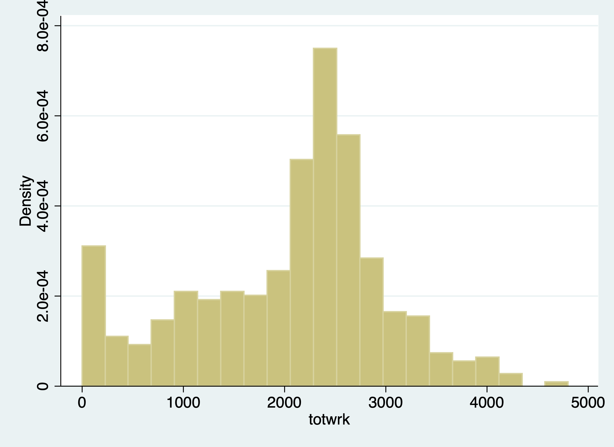
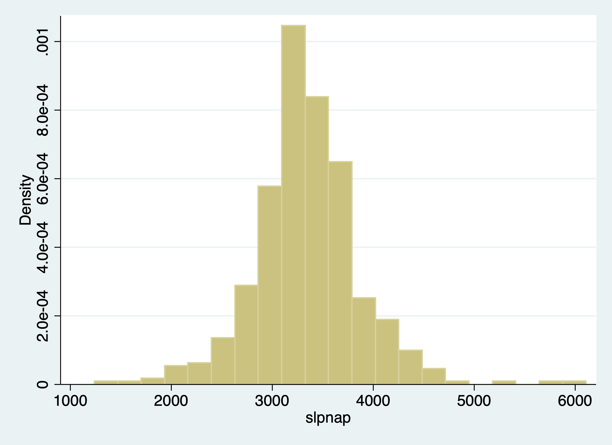
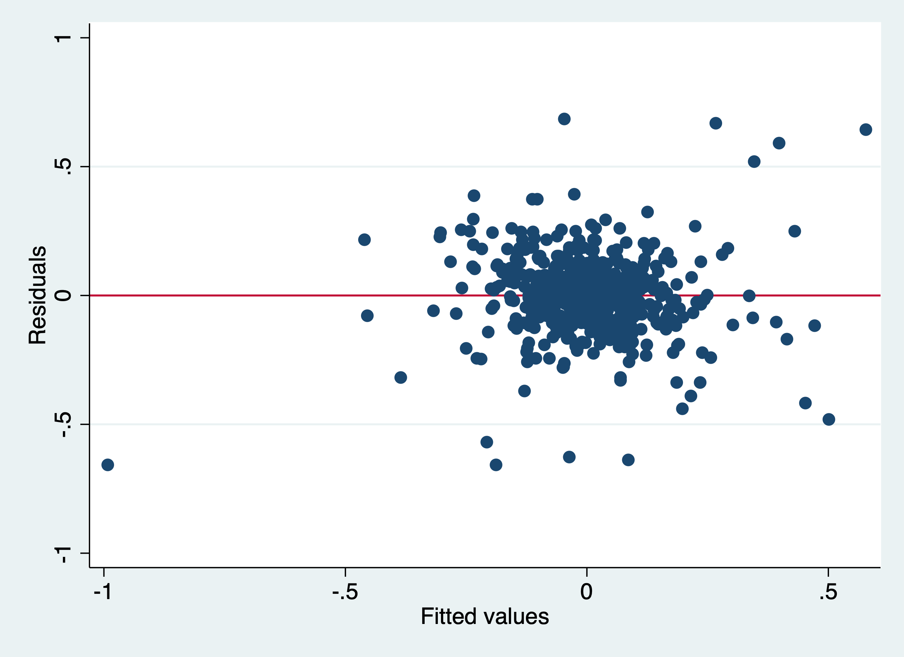

# Panel Data Part 1 - Pooled Data and First Difference

We will cover the implementation of two estimators today: 
  1. Pooled OLS Estimator
  2. First Difference Estimator

## Pooled OLS Estimator

We can account for \( a_t \) with our Pooled OLS estimator. 

### Fertility over time

**Lesson:** Time binaries can capture secular trends over time or trends that
affect all people during the time period.

Sander (1992) uses the National Opinion Research Center's General Social Survey for the veven users from 1972 to 1984. We'll use these data to explain the total number of kids born to a women. Let's get our data.
```{stata fert1,eval=FALSE}
cd "/Users/Sam/Desktop/Econ 645/Data/Wooldridge"
use "fertil1.dta", clear
```

One question of interest:
What happens to ferlity rates over time after controlling for observable factors?
We'll control for education, age, race, region at 16 years old, and living environment at 16.

We'll use 1972 as our base year (which we will exclude and be captured in the
intercept).

$$ \begin{aligned} kids_{i,t} = \beta_0 + \beta_1 educ_{i,t} + \beta_2 age_{i,t} + \beta_3 age^2_{i,t} + \beta_4 Black_{i} + \beta_5 East_{i,t} + \beta_6 NorthCentral_{i,t} \\ + \beta_7 West_{i,t} + \beta_8 Farm_{i,t} + \beta_9 OtherRural_{i,t} + \beta_{10} Town_{i,t} + \beta_{11} SmallCity_{i,t} + a_{t} \end{aligned} $$

First, we'll estimate the regression without Time Trends
```{stata fert2, eval=FALSE}
est clear
eststo OLS: reg kids educ c.age##c.age i.black i.east i.northcen i.west i.farm i.othrural i.town i.smcity 
```
```{stata fert2_1,echo=FALSE}
quietly {
cd "/Users/Sam/Desktop/Econ 645/Data/Wooldridge"
use "fertil1.dta", clear
}
est clear
eststo OLS: reg kids educ c.age##c.age i.black i.east i.northcen i.west i.farm i.othrural i.town i.smcity 

```	
Next, we account for time trends by including Time Fixed Effects
```{stata fert3, eval=FALSE}
eststo Pooled_OLS: reg kids educ c.age##c.age i.black i.east i.northcen i.west i.farm i.othrural i.town i.smcity i.y74 i.y76 i.y78 i.y80 i.y82 i.y84
```
```{stata fert3_1, echo=FALSE}
quietly {
cd "/Users/Sam/Desktop/Econ 645/Data/Wooldridge"
use "fertil1.dta", clear
est clear
eststo OLS: reg kids educ c.age##c.age i.black i.east i.northcen i.west i.farm i.othrural i.town i.smcity 
}
eststo Pooled_OLS: reg kids educ c.age##c.age i.black i.east i.northcen i.west i.farm i.othrural i.town i.smcity i.y74 i.y76 i.y78 i.y80 i.y82 i.y84

```

Exclusion Restriction Test
```{stata fert4, eval=FALSE}
test 1.y74 1.y76 1.y78 1.y80 1.y82 1.y84
```
```{stata fert4_1, echo=FALSE}
quietly {
cd "/Users/Sam/Desktop/Econ 645/Data/Wooldridge"
use "fertil1.dta", clear
est clear
eststo OLS: reg kids educ c.age##c.age i.black i.east i.northcen i.west i.farm i.othrural i.town i.smcity 
eststo Pooled_OLS: reg kids educ c.age##c.age i.black i.east i.northcen i.west i.farm i.othrural i.town i.smcity i.y74 i.y76 i.y78 i.y80 i.y82 i.y84
}
test 1.y74 1.y76 1.y78 1.y80 1.y82 1.y84
```

We reject the null hypothesis that our combined time binaries are 0 with an F-stat (1,111 degrees of freedom) equal to 5.87.

Display
```{stata fert5, eval=FALSE}
esttab OLS Pooled_OLS, mtitles se scalars(F r2) drop(0.black 0.east 0.northcen 0.west 0.farm 0.othrural 0.town 0.smcity 0.y74 0.y76 0.y78 0.y80 0.y82 0.y84) 
```
```{stata fert5_1, echo=FALSE}
quietly {
cd "/Users/Sam/Desktop/Econ 645/Data/Wooldridge"
use "fertil1.dta", clear
est clear
eststo OLS: reg kids educ c.age##c.age i.black i.east i.northcen i.west i.farm i.othrural i.town i.smcity 
eststo Pooled_OLS: reg kids educ c.age##c.age i.black i.east i.northcen i.west i.farm i.othrural i.town i.smcity i.y74 i.y76 i.y78 i.y80 i.y82 i.y84
}
esttab OLS Pooled_OLS, mtitles se scalars(F r2) drop(0.black 0.east 0.northcen 0.west 0.farm 0.othrural 0.town 0.smcity 0.y74 0.y76 0.y78 0.y80 0.y82 0.y84) 
```

We can see most our time coefficient are not statistically significant but we do reject the null hypothesis that they are all equal to 0. If we compare 1982 and 1984 to 1972, women estimated to have about 0.52 fewer and 0.55 fewer children, respectively. This means that in 1982 100 women are
expected to have 52 fewer children than 100 women in 1972.

**Note:** Since we are controlling for education, this decline in fertility cannot be attributed to increases in education. The difference is a secular trend or a general trend that transcends across all women.

**Note:** We have age and age-squared, which means that the number of children increases with age, but at a diminishing rate. At one point age will become 0.
```{stata fert6, eval=FALSE}
estat hettest
```
```{stata fert6_1, echo=FALSE}
quietly {
cd "/Users/Sam/Desktop/Econ 645/Data/Wooldridge"
use "fertil1.dta", clear
est clear
eststo OLS: reg kids educ c.age##c.age i.black i.east i.northcen i.west i.farm i.othrural i.town i.smcity 
eststo Pooled_OLS: reg kids educ c.age##c.age i.black i.east i.northcen i.west i.farm i.othrural i.town i.smcity i.y74 i.y76 i.y78 i.y80 i.y82 i.y84
}
estat hettest
```

Note that we reject the null hypothesis of homoskedasticity with a Breusch-Pagan Test, so we should use our heteroskedastic-robust standard errors
```{stata fert7, eval=FALSE}
est clear
eststo Without_Robust: quietly reg kids educ c.age##c.age i.black i.east i.northcen i.west i.farm i.othrural i.town i.smcity i.y74 i.y76 i.y78 i.y80 i.y82 i.y84
eststo With_Robust: quietly reg kids educ c.age##c.age i.black i.east i.northcen i.west i.farm i.othrural i.town i.smcity i.y74 i.y76 i.y78 i.y80 i.y82 i.y84, robust
esttab Without_Robust With_Robust, mtitles se scalars(F r2) drop(0.black 0.east 0.northcen 0.west 0.farm 0.othrural 0.town 0.smcity 0.y74 0.y76 0.y78 0.y80 0.y82 0.y84) 
```

```{stata fert7_1, echo=FALSE}
quietly {
cd "/Users/Sam/Desktop/Econ 645/Data/Wooldridge"
use "fertil1.dta", clear
}
est clear
eststo Without_Robust: quietly reg kids educ c.age##c.age i.black i.east i.northcen i.west i.farm i.othrural i.town i.smcity i.y74 i.y76 i.y78 i.y80 i.y82 i.y84
eststo With_Robust: quietly reg kids educ c.age##c.age i.black i.east i.northcen i.west i.farm i.othrural i.town i.smcity i.y74 i.y76 i.y78 i.y80 i.y82 i.y84, robust
esttab Without_Robust With_Robust, mtitles se scalars(F r2) drop(0.black 0.east 0.northcen 0.west 0.farm 0.othrural 0.town 0.smcity 0.y74 0.y76 0.y78 0.y80 0.y82 0.y84) 
```
Question: do you think the number of kids is distributed normally? 

### Changes in the Returns to Education and the Sex Wage Gap

**Lesson:** Interactions matter. We can manually create interactions, but that can be cumbersome. Using the # operator, we can generate interactions within our regression command.

Stata interactions: *i.var1##i.var2*, *i.var1##c.var3*, *c.var3##c.var4*

We can estimate to see how the wage gap and returns to schooling have compared for women. We pool data from 1978 and 1985 from the Current Population Survey.
```{stata ret1, eval=FALSE}
cd "/Users/Sam/Desktop/Econ 645/Data/Wooldridge"
use "cps78_85.dta", clear
```
What we will do to estimate the wage gap and the returns to education between 1978 and 1985. We can do this by interacting our binary variable y85 with our continuous variable of education. Our coefficient on edu will be the returns to education in 1978 and the return to education in 1985 will be captured in the coefficient for edu#1.y85 plus the coefficient for edu in 1978. 
The coefficient for edu#1.y85 will be relative to the coefficient on edu, so we can add the two coefficients to find the returns to education in 1985.

We also interact our binary variable y85 with another binary variable female to see the wage gap in 1978 and 1985. 1.female will be the wage gap in 1978 and 1.female#1.y85 plus the 1.female 
will be our wage gap for females in 1985.

Wages will have changed between 1978 and 1985 due to inflation, since wages in the CPS are in nominal dollars. We can deflate our wages with a price deflator, or we can use natural log of wages with time binaries to capture inflation that is associated with the year binaries.

Natural Log and accounting for inflation with time variables. Let's say our deflator for 1985 is 1.65, so we need to divide wages by the deflator to get real wages in 1978 dollars. But if we take the natural log transformed wages using real or nominal wages does not matter since the inflation factor will be absorbed in the time binary y1985:

$$ ln(wage_i/P85)=ln(wages_i)-ln(p85) $$

While wages may differ across individuals in 1985, all individuals in 1985 are affected by the secular trend of inflation relevant to 1985.  (Note: if the price trends varied by region, then we would need to account for this since prices would not be a secular trend affecting all people).

We need both ln(wages) and time binaries, otherwise our estimates would be biased. 

Note: that this remains true whether the nominal value is in the dependentor independent variables as long as it is natural log transformed and has time binaries.

$$ ln(wage_{i,t}) = \beta_0 + \beta_1 edu_{i,t} + \beta_2 exp_{i,t} + \beta_3 exp^2_{i,t} + \beta_4 union_{i,t} + \beta_5 female_{i} + \\ \beta_6 edu_{i,t}*Y85_t + \beta_7 female_i*Y85_{t} +\beta_8 Y85_{t} + \varepsilon_{i,t} $$

```{stata ret2, eval=FALSE}
reg lwage i.y85##c.edu c.exper##c.exper i.union i.female##i.y85
```
```{stata ret2_1, echo=FALSE}
quietly {
cd "/Users/Sam/Desktop/Econ 645/Data/Wooldridge"
use "cps78_85.dta", clear
}
reg lwage i.y85##c.edu c.exper##c.exper i.union i.female##i.y85
```
Our results:

Wage gap in 1978 is \( e^{(-.317)}-1*100 = -27.2 \% \)

Wage gap in 1985 is \( e^{(-.317+.085)}-1*100 = -20.7 \% \)

```{stata ret3}
display (exp(-.317)-1)*100
display (exp(-.317+0.085)-1)*100
```

Difference in returns to education
```{stata ret4}
display (exp(0.0747)-1)*100
display (exp(0.0747+0.0185)-1)*100
```

Declines in wage gap since 1978
```{stata ret5}
display (exp(0.085)-1)*100
```
Increases in returns to education since 1978
```{stata ret6}
display (exp(0.0185)-1)*100
```

Chow Test/F-Test for structural changes across time (nested-model). We will test whether or not to include time binaries.
```{stata ret7, eval=FALSE}
test 1.y85 0.y85 1.y85#edu 1.y85#1.female
```

```{stata ret7_1, echo=FALSE}
quietly {
cd "/Users/Sam/Desktop/Econ 645/Data/Wooldridge"
use "cps78_85.dta", clear
reg lwage i.y85##c.edu c.exper##c.exper i.union i.female##i.y85
}
test 1.y85 0.y85 1.y85#edu 1.y85#1.female
```

Test slopes
```{stata ret8, eval=FALSE}
test 1.y85#edu 1.y85#1.female
```

```{stata ret8_1, echo=FALSE}
quietly {
cd "/Users/Sam/Desktop/Econ 645/Data/Wooldridge"
use "cps78_85.dta", clear
reg lwage i.y85##c.edu c.exper##c.exper i.union i.female##i.y85
}
test 1.y85#edu 1.y85#1.female
```

Test intercepts
```{stata ret9, eval=FALSE}
test 1.y85 0.y85
```

```{stata ret9_1, echo=FALSE}
quietly {
cd "/Users/Sam/Desktop/Econ 645/Data/Wooldridge"
use "cps78_85.dta", clear
reg lwage i.y85##c.edu c.exper##c.exper i.union i.female##i.y85
}
test 1.y85 0.y85
```

Should we keep our time binaries? Our F-tests show that we should and we'll need them for to account for inflation.

## First Difference Estimator
 
We can account for \( a_t \) and \( a_i \) with our First Difference estimator.

### Sleep vs Working
**Lesson:** The way you set up panel data matters. We need to use the long-format.

I think this is a good example of a poorly set up panel data. We'll use the file called slp75_81.dta to took at a two year panel data from Biddle and Hamermesh (1990) to estimate the tradeoff between sleeping and working. We have data for 239 people between 1975 and 1981 for the same person in both periods.

We'll get to reshape in Mitchell soon, but here is a preview. We will reshape the data so that each cross-sectional unit of observation has 2 rows: one for 1975 and one for 1985.

Reshape
```{stata sleep1}
cd "/Users/Sam/Desktop/Econ 645/Data/Wooldridge"
use "slp75_81.dta", clear
gen id=_n
gen age81=age75+6
reshape long age educ gdhlth marr slpnap totwrk yngkid, i(id) j(year)
replace year=year+1900
```

We'll generate our time binaries
```{stata sleep2, eval=FALSE}
gen d75 = .
replace d75=0 if year==1981
replace d75=1 if year==1975

gen d81=.
replace d81=0 if year==1975
replace d81=1 if year==1981
```

```{stata sleep2_1, echo=FALSE}
quietly {
cd "/Users/Sam/Desktop/Econ 645/Data/Wooldridge"
use "slp75_81.dta", clear
gen id=_n
gen age81=age75+6
reshape long age educ gdhlth marr slpnap totwrk yngkid, i(id) j(year)
replace year=year+1900
}
gen d75 = .
replace d75=0 if year==1981
replace d75=1 if year==1975

gen d81=.
replace d81=0 if year==1975
replace d81=1 if year==1981
```
And we'll want to check that we don't have any overlapping periods
Check
```{stata sleep3, eval=FALSE}
tab year d75
tab year d81
tab d81 d75
```

```{stata sleep3_1, echo=FALSE}
quietly {
cd "/Users/Sam/Desktop/Econ 645/Data/Wooldridge"
use "slp75_81.dta", clear
gen id=_n
gen age81=age75+6
reshape long age educ gdhlth marr slpnap totwrk yngkid, i(id) j(year)
replace year=year+1900
gen d75 = .
replace d75=0 if year==1981
replace d75=1 if year==1975
gen d81=.
replace d81=0 if year==1975
replace d81=1 if year==1981
}
tab year d75
tab year d81
tab d81 d75
```

Now we can work with the panel. Let *xtset* know that there is a 6 year gap in the data. If not, it will try to take a 1 year change and 1976 does not exist.
```{stata sleep4, eval=FALSE}
xtset id year, delta(6)
```

```{stata sleep4_1, echo=FALSE}
quietly {
cd "/Users/Sam/Desktop/Econ 645/Data/Wooldridge"
use "slp75_81.dta", clear
gen id=_n
gen age81=age75+6
reshape long age educ gdhlth marr slpnap totwrk yngkid, i(id) j(year)
replace year=year+1900
gen d75 = .
replace d75=0 if year==1981
replace d75=1 if year==1975
gen d81=.
replace d81=0 if year==1975
replace d81=1 if year==1981
}
xtset id year, delta(6)
```

$$ slpnap_{i,t}=\beta_0+\beta_1 totwrk_{i,t} + \beta_3 educ_{i,t} + \beta_4 marr_{i,t} + \beta_5 yngkid_{i,t} + \beta_6 gdhlth_{i,t} + a_i + a_t $$

  1. slpnap - total minutes of sleep per week
  2. totwrk - total hours of work per year
  3. educ - total years of education
  4. marr - married dummy variable
  5. yngkid - presence of a young child dummy variable
  6. gdhlth - "good health" dummy variable

After we set up our panel, we can control for the unobserved cross-sectional unit effect \( a_i \), or unobserved individual effect that do not vary over time. This is all characteristics of the cross-sectional unit of observation that is constant over time or time-invariant.

We are interested in the tradeoff between work and sleep. Our dependent variable of interest is total minutes sleeping per week. Our explanatory variable of interest is the total working hours during the year.
```{stata sleep5, eval=FALSE}
histogram totwrk
graph export "/Users/Sam/Desktop/Econ 645/Stata/totwrk.png", replace
```


```{stata sleep6, eval=FALSE}
histogram slpnap
graph export "/Users/Sam/Desktop/Econ 645/Stata/slpnap.png", replace
```


When we run OLS, we do not control for unobserved individual time-invariant effects.

Pooled OLS
```{stata sleep7, eval=FALSE}
est clear
eststo OLS: reg slpnap i.d81 totwrk educ marr yngkid gdhlth 
```

```{stata sleep7_1, echo=FALSE}
quietly {
cd "/Users/Sam/Desktop/Econ 645/Data/Wooldridge"
use "slp75_81.dta", clear
gen id=_n
gen age81=age75+6
reshape long age educ gdhlth marr slpnap totwrk yngkid, i(id) j(year)
replace year=year+1900
gen d75 = .
replace d75=0 if year==1981
replace d75=1 if year==1975
gen d81=.
replace d81=0 if year==1975
replace d81=1 if year==1981
xtset id year, delta(6)
}
est clear
eststo OLS: reg slpnap i.d81 totwrk educ marr yngkid gdhlth 
```

FD Model
```{stata sleep8, eval=FALSE}
eststo FD: reg d.slpnap d.totwrk d.educ d.marr d.yngkid d.gdhlth
```

```{stata sleep8_1, echo=FALSE}
quietly {
cd "/Users/Sam/Desktop/Econ 645/Data/Wooldridge"
use "slp75_81.dta", clear
gen id=_n
gen age81=age75+6
reshape long age educ gdhlth marr slpnap totwrk yngkid, i(id) j(year)
replace year=year+1900
gen d75 = .
replace d75=0 if year==1981
replace d75=1 if year==1975
gen d81=.
replace d81=0 if year==1975
replace d81=1 if year==1981
xtset id year, delta(6)
est clear
eststo OLS: reg slpnap i.d81 totwrk educ marr yngkid gdhlth 
}
eststo FD: reg d.slpnap d.totwrk d.educ d.marr d.yngkid d.gdhlth
```

Our Pooled OLS model shows one additional hour worked per year is associated with a 0.15 fewer minutes per week of sleep, while our FD model one additional hour worked per year is associated with a 0.23 fewer minutes of sleep per week.

Similar except time dummy and base intercepts look at the difference between educ in Pooled and FE models. There is likely a confounder between ability sleep and education.

```{stata sleep9, eval=FALSE}
esttab OLS FD, mtitles se scalars(F r2) drop(0.d81)
```

```{stata sleep9_1, echo=FALSE}
quietly {
cd "/Users/Sam/Desktop/Econ 645/Data/Wooldridge"
use "slp75_81.dta", clear
gen id=_n
gen age81=age75+6
reshape long age educ gdhlth marr slpnap totwrk yngkid, i(id) j(year)
replace year=year+1900
gen d75 = .
replace d75=0 if year==1981
replace d75=1 if year==1975
gen d81=.
replace d81=0 if year==1975
replace d81=1 if year==1981
xtset id year, delta(6)
est clear
eststo OLS: reg slpnap i.d81 totwrk educ marr yngkid gdhlth 
eststo FD: reg d.slpnap d.totwrk d.educ d.marr d.yngkid d.gdhlth
}
esttab OLS FD, mtitles se scalars(F r2) drop(0.d81)
```

Let's look at elasticities
```{stata sleep10, eval=FALSE}
gen lnslpnap=ln(slpnap)
gen lntotwrk=ln(totwrk)
gen lneduc=ln(educ)
```

FD Model
```{stata sleep11, eval=FALSE}
reg d.lnslpnap d.lntotwrk d.lneduc d.marr d.yngkid d.gdhlth
```

```{stata sleep11_1, echo=FALSE}
quietly {
cd "/Users/Sam/Desktop/Econ 645/Data/Wooldridge"
use "slp75_81.dta", clear
gen id=_n
gen age81=age75+6
reshape long age educ gdhlth marr slpnap totwrk yngkid, i(id) j(year)
replace year=year+1900
gen d75 = .
replace d75=0 if year==1981
replace d75=1 if year==1975
gen d81=.
replace d81=0 if year==1975
replace d81=1 if year==1981
xtset id year, delta(6)
gen lnslpnap=ln(slpnap)
gen lntotwrk=ln(totwrk)
gen lneduc=ln(educ)
}
reg d.lnslpnap d.lntotwrk d.lneduc d.marr d.yngkid d.gdhlth
```

A 1% increase in hours worked per year is associated with a 0.08% decrease in sleep per week.

### Distributed Lag of Crime Rates on Clear-up Rate

**Lesson:** Lagged variables can be important explanatory variables
*Note:* We'll get into this a bit more in Wooldridge Chapter 10-12.

We will get into time series later in the course, but we will have a preview. With panel data, we are able to see the same observation over time. Given this, we can see if lagged values affect current values for the cross-sectional unit of observation.

Eide(1994) wants to assess if prior clear-up rates for crime have a relationship with crime rates in the current time period. The dependent variable of interest is the current period crime rate. The variable of interest is the clear-up percentage which is the rate of crimes that have lead to conviction.

We will use a log-log model and use a first-difference.

$$ \Delta ln(crime_{i,t}= \delta_0 + \beta_1 \Delta ln(clearup_{i,t-1}) + \beta_2 \Delta ln(clearup_{i,t-2}) + \Delta \varepsilon_{i,t} $$

```{stata fdl1}
cd "/Users/Sam/Desktop/Econ 645/Data/Wooldridge"
use crime3.dta, clear
reg clcrime cclrprc1 cclrprc2
```

Our model tells us that 1 percent increase in getting crimes to conviction leads to a reduction in the current period crime rate of about 1.32 percent. Assuming this model is specified well, crime rates are sensitive to clear-up rates from the prior 2 years.

### Enterprise Zones and Unemployment

**Lesson:** We need to be aware of heteroskedasticity and serial correlation

We should test for heteroskedasticity and serial correlation when running our First-Difference Estimator.

Serial correlation means that the differences in the idiosyncractic errors between time periods are correlated, which is a violation of our assumption that there is no serial correlation for our first-difference estimator. 

We'll use data from Papke (1994) who studied the effect of Indiana's enterprise zone program on unemployment claims. Do enterprise zones increase employment and reduce unemployment claims?

She analyzes 22 cities in Indiana from 1980 to 1988, since 6 enterprise zones were established in 1984. Twelve cities did not receive the enterprise zones, while 10 cities did get enterprise zones.

We'll use a simple analysis that the change in natural log of unemployment
claims is a function of time period binaries, change in enterprise zones, and
the idiosyncractic error.

One way to do it is to use the data already created.

$$ ln(UnempClaims_{i,t}) = \beta_0 + \beta_1 EnterpriseZone_{i,t} + a_t + a_i + \varepsilon_{i,t} $$

Pooled OLS
```{stata zone1}
cd "/Users/Sam/Desktop/Econ 645/Data/Wooldridge"
use "ezunem.dta", clear
reg luclms i.d82 i.d83 i.d84 i.d85 i.d86 i.d87 i.d88 cez
```

Let's say we didn't have the data already created. What we'll need to do
is to set the panel data with xtset unit timeperiod
Set the Panel Data
```{stata zone2, eval=FALSE}
xtset city year
```

```{stata zone2_1, echo=FALSE}
quietly {
cd "/Users/Sam/Desktop/Econ 645/Data/Wooldridge"
use "ezunem.dta", clear
}
xtset city year
```

We can use the *d.* operator to use a first difference 
First Difference
```{stata zone3, eval=FALSE}
reg d.luclms i.d82 i.d83 i.d84 i.d85 i.d86 i.d87 i.d88 d.ez
```

```{stata zone3_1, echo=FALSE}
quietly {
cd "/Users/Sam/Desktop/Econ 645/Data/Wooldridge"
use "ezunem.dta", clear
xtset city year
}
reg d.luclms i.d82 i.d83 i.d84 i.d85 i.d86 i.d87 i.d88 d.ez
```

Test for Heteroskedasticity: 

Bruesch-Pagan/Cameron-Trivedi Test using *estat* post-estimation command 
```{stata zone4, eval=FALSE}
estat imtest
```

```{stata zone4_1, echo=FALSE}
quietly {
cd "/Users/Sam/Desktop/Econ 645/Data/Wooldridge"
use "ezunem.dta", clear
xtset city year
reg d.luclms i.d82 i.d83 i.d84 i.d85 i.d86 i.d87 i.d88 d.ez
}
estat imtest
```

White Test using *estat* postestimation command
```{stata zone5, eval=FALSE}
estat imtest, white
```

```{stata zone5_1, echo=FALSE}
quietly {
cd "/Users/Sam/Desktop/Econ 645/Data/Wooldridge"
use "ezunem.dta", clear
xtset city year
reg d.luclms i.d82 i.d83 i.d84 i.d85 i.d86 i.d87 i.d88 d.ez
}
estat imtest, white
```

We fail to reject the null hypothesis of homoskedastic standard errors.

Test for autocorrelation
We can use the command xtserial to test for serial correlation, since we already
set up our panel above.
```{stata zone6, eval=FALSE}
	help xtserial
```
```{stata zone7, eval=FALSE}
xtserial luclms d83 d84 d85 d86 d87 d88 cez, output
```

```{stata zone7_1, echo=FALSE}
quietly {
cd "/Users/Sam/Desktop/Econ 645/Data/Wooldridge"
use "ezunem.dta", clear
xtset city year
reg d.luclms i.d82 i.d83 i.d84 i.d85 i.d86 i.d87 i.d88 d.ez
}
xtserial luclms d83 d84 d85 d86 d87 d88 cez, output
```
We reject the null hypothesis that the differences in idiosyncratic errors is 0.

What can we do for this serial correlation? We can cluster our standard errors to account for the serial correlation within units.

Robust for serial correlation within unit of analysis clusters
```{stata zone8, eval=FALSE}
reg d.luclms i.d82 i.d83 i.d84 i.d85 i.d86 i.d87 i.d88 d.cez, robust cluster(city)
```

```{stata zone8_1, echo=FALSE}
quietly {
cd "/Users/Sam/Desktop/Econ 645/Data/Wooldridge"
use "ezunem.dta", clear
xtset city year
}
reg d.luclms i.d82 i.d83 i.d84 i.d85 i.d86 i.d87 i.d88 d.cez, robust cluster(city)
```

Once we account for the serial correlation in the idiosyncratic error, our coefficient on the change in enterprise zone becomes statistically insignificant.

Testing for serial correlation, and Clustering your standard error at the treatment level is an important test and step with FD estimators.

When we get to Fixed Effects (Within) estimator, the assumption is slightly different. For First-Difference Estimator, the DIFFERENCE in idiosyncratic errors cannot be correlated, but for Fixed-Effects (Within) Estimator the assumption states that only the idiosyncratic errors cannot be correlated.

### County Crimes in North Carolina

**Lesson:** First-Difference Estimator (and Fixed Effects Estimator) cannot fix simultaneity bias. We need an valid instrument to deal with simultaneity bias.

Cornwell and Trumbull (1994) analyzed data on 90 counties in North Carolina from 1981 to 1987 to using panel data to account for time-invariant effects. Their cross-sectional unit of observation is the county (not individuals within a county). They want to know what the is the effect of police per capita on crime rates.

For our model the dependent variable is the change in the natural log of crimes per person (lcrimrte). They are interested in estimating the sensitivity of police per capita (polpc) on crime rate, so they use the difference in natural log of police per capita. This will get you elasticities, which provide useful interpretations of percentage increases.

They also control for the difference in natural log of probability of arrest (prbarr), the probability of conviction (prbconv), the probability of serving time in prison given a conviction (prbpris), and the average sentence length.

$$ ln(crimerate_{i,t}) = \beta_0 + \beta_1 ln(prbcon_{i,t}) + \beta_2 ln(prbpris_{i,t}) + \beta_3 ln(avgsen_{i,t}) + \beta_4 ln(polpc_{i,t}) + a_t + a_i + \varepsilon_{i,t} $$
Pooled OLS
```{stata crime1}
cd "/Users/Sam/Desktop/Econ 645/Data/Wooldridge"
use "crime4.dta", clear
reg lcrmrte i.d82 i.d83 i.d84 i.d85 i.d86 i.d87 lprbarr lprbconv lprbpris lavgsen lpolpc
```
First Difference
```{stata crime2, eval=FALSE}
xtset county year
```

```{stata crime2_1, echo=FALSE}
quietly{
cd "/Users/Sam/Desktop/Econ 645/Data/Wooldridge"
use "crime4.dta", clear
}
xtset county year
```

With xtset, we can use the d. for our explanatory variables.

First-Difference 
```{stata crime3, eval=FALSE}
reg d.lcrmrte i.d83 i.d84 i.d85 i.d86 i.d87 d.lprbarr d.lprbconv d.lprbpris d.lavgsen d.lpolpc
```

```{stata crime3_1, echo=FALSE}
quietly{
cd "/Users/Sam/Desktop/Econ 645/Data/Wooldridge"
use "crime4.dta", clear
xtset county year
}
reg d.lcrmrte i.d83 i.d84 i.d85 i.d86 i.d87 d.lprbarr d.lprbconv d.lprbpris d.lavgsen d.lpolpc
```

So our model is estimating that a 1% increase in police per capita increases the crime rate by about 0.4%. We would expect that increases in police per capita would reduce crime rates. This is likely shows that there are problems in our model. 

What is happening? Likely simultaneity bias is occurring. Areas with high crime rates have more police per capita, which more police per capita is associated with higher crime rates. It's a circular/endogenous reference, so we will need an valid instrument to deal with this simultaneity bias/endogeneity.

We can test for heteroskedasticity and serial correlation, but this only affects our standard errors, not our coefficients.

Test for autocorrelation with one lag AR(1). We can see that serial correlation is a problem, which means we should cluster our standard errors at the county level.
```{stata crime4, eval=FALSE}
predict r, residual
gen lag_r =l.r
reg r lag_r i.d83 i.d84 i.d85 i.d86 i.d87 d.lprbarr d.lprbconv d.lprbpris d.lavgsen d.lpolpc
```

```{stata crime4_1, echo=FALSE}
quietly{
cd "/Users/Sam/Desktop/Econ 645/Data/Wooldridge"
use "crime4.dta", clear
xtset county year
reg d.lcrmrte i.d83 i.d84 i.d85 i.d86 i.d87 d.lprbarr d.lprbconv d.lprbpris d.lavgsen d.lpolpc
}
predict r, residual
gen lag_r =l.r
reg r lag_r i.d83 i.d84 i.d85 i.d86 i.d87 d.lprbarr d.lprbconv d.lprbpris d.lavgsen d.lpolpc
```


We can always use our xtserial command to test for AR(1) serial correlation.
```{stata crime5, eval=FALSE}
reg d.lcrmrte i.d83 i.d84 i.d85 i.d86 i.d87 d.lprbarr d.lprbconv d.lprbpris d.lavgsen d.lpolpc
xtserial lcrmrte d83 d84 d85 d86 d87 lprbarr lprbconv lprbpris lavgsen lpolpc, output
```

```{stata crime5_1, echo=FALSE}
quietly{
cd "/Users/Sam/Desktop/Econ 645/Data/Wooldridge"
use "crime4.dta", clear
xtset county year
}
reg d.lcrmrte i.d83 i.d84 i.d85 i.d86 i.d87 d.lprbarr d.lprbconv d.lprbpris d.lavgsen d.lpolpc
xtserial lcrmrte d83 d84 d85 d86 d87 lprbarr lprbconv lprbpris lavgsen lpolpc, output
```

We can also test for heteroskedasticity
```{stata crime6, eval=FALSE}
quietly reg d.lcrmrte i.d83 i.d84 i.d85 i.d86 i.d87 d.lprbarr d.lprbconv d.lprbpris d.lavgsen d.lpolpc
rvfplot,yline(0)
graph export "/Users/Sam/Desktop/Econ 645/Stata/week3_htsk.png", replace
```	


We can use the White Test and Breusch-Pagan, which yield different results
```{stata crime7, eval=FALSE}
estat imtest, white
estat hettest
```

```{stata crime7_1, echo=FALSE}
quietly{
cd "/Users/Sam/Desktop/Econ 645/Data/Wooldridge"
use "crime4.dta", clear
xtset county year
reg d.lcrmrte i.d83 i.d84 i.d85 i.d86 i.d87 d.lprbarr d.lprbconv d.lprbpris d.lavgsen d.lpolpc
}
estat imtest, white
estat hettest
```


Re-estimate with Robust Standard Errors clustered at the county level and cluster by county (deal with error correlations within counties).
```{stata crime8, eval=FALSE}
reg d.lcrmrte i.d83 i.d84 i.d85 i.d86 i.d87 d.lprbarr d.lprbconv d.lprbpris d.lavgsen d.lpolpc, robust cluster(county)
```			  

```{stata crime8_1, echo=FALSE}
quietly{
cd "/Users/Sam/Desktop/Econ 645/Data/Wooldridge"
use "crime4.dta", clear
xtset county year
}
reg d.lcrmrte i.d83 i.d84 i.d85 i.d86 i.d87 d.lprbarr d.lprbconv d.lprbpris d.lavgsen d.lpolpc, robust cluster(county)
```			  

Even accounting for heteroskedasticity and serial correlation, our model is likely biased by simultaneity bias.