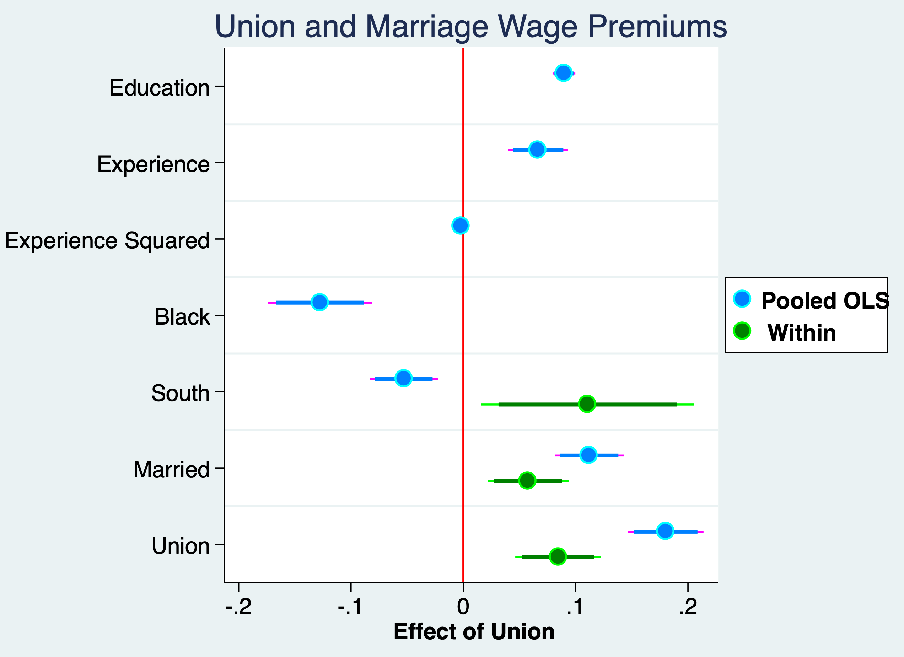
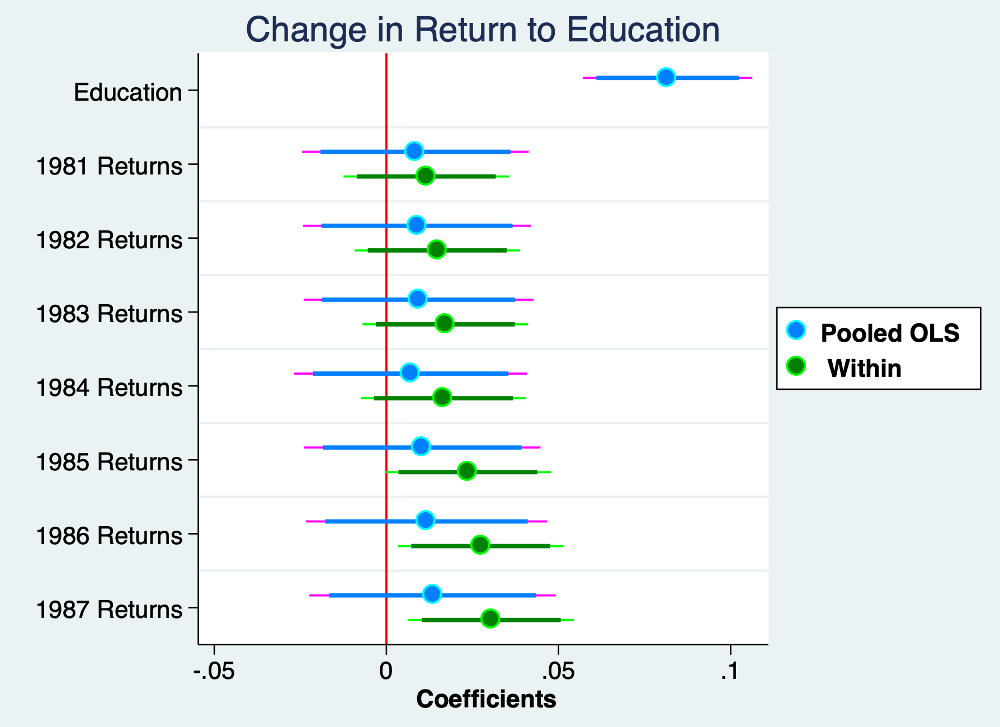
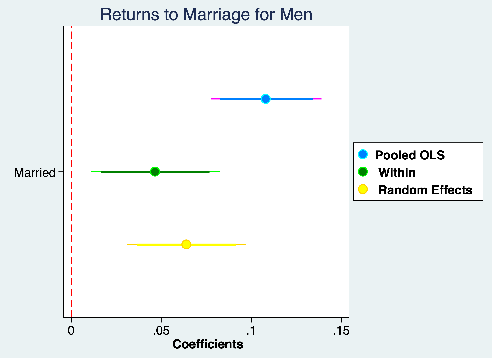

# Fixed Effects (Within) Estimator 

We will implement the fixed effects (within) estimator. We will need to use the *xtset* command to establish our unit of analysis dimension and our time dimension in our panel data. Our main stata command to implement a FD is *xtreg* with the option *fe*. It is important to include the option *fe*. If you forget, your model will be a random effects model.

## Union Premium

**Lesson:** we can control for ability and preference for unionization to control for unobserved time-invariant confounders.

We want to estimate the union premium, and we will use a fixed effects (within) estimator to control for time-invariant heterogeneity, such as ability and performance.

$$ ln(wage_{i,t}) = \beta_0 + \beta_1 edu_{i,t} + \beta_2 exp_{i,t} + \beta_3 exp^2_{i,t} + \beta_4 Black_{i} + \beta_7 South_{i,t} \\ + \beta_8 married_{i,t} + union_{i,t} + a_t + a_i + \varepsilon_{i,t} $$
```{stata wage1, eval=FALSE}
cd "/Users/Sam/Desktop/Econ 645/Data/Wooldridge"
use "wagepan.dta", clear
```

Set the Panel and estimate the Pooled OLS model
```{stata wage2, eval=FALSE}
xtset nr year
eststo OLS: reg lwage c.edu exper expersq i.black i.south i.married i.union i.d8*
```

```{stata wage2_1, echo=FALSE}
quietly {
cd "/Users/Sam/Desktop/Econ 645/Data/Wooldridge"
use "wagepan.dta", clear
}
xtset nr year
eststo OLS: reg lwage c.edu exper expersq i.black i.south i.married i.union i.d8*
```

If we use FE or FD, we cannot assess race, education, or experience since they remain constant.

FE Within.
```{stata wage3, eval=FALSE}
eststo Within: xtreg lwage c.edu exper expersq i.black i.south i.married i.union i.d8*, fe
```

```{stata wage3_1, echo=FALSE}
quietly {
cd "/Users/Sam/Desktop/Econ 645/Data/Wooldridge"
use "wagepan.dta", clear
xtset nr year
}
eststo Within: xtreg lwage c.edu exper expersq i.black i.south i.married i.union i.d8*, fe
```

Compare with *esttab*
```{stata wage4, eval=FALSE}
esttab OLS Within, mtitles se scalars(F r2) drop(0.d* 0.union 0.married)
```

```{stata wage4_1, echo=FALSE}
quietly {
cd "/Users/Sam/Desktop/Econ 645/Data/Wooldridge"
use "wagepan.dta", clear
xtset nr year
eststo OLS: reg lwage c.edu exper expersq i.black i.south i.married i.union i.d8*
eststo Within: xtreg lwage c.edu exper expersq i.black i.south i.married i.union i.d8*, fe
}
esttab OLS Within, mtitles se scalars(F r2) drop(0.d* 0.union 0.married)
```

After controlling for time-invariant individual fixed effects the Pooled OLS is seen to be upward biased. The union wage premium is about 19.7% with the Pooled OLS model, while the union wage premium is estimated to be 8.4% after accounting for individual fixed effects.

Pooled OLS Wage Premium Estimate
```{stata wage5, eval=FALSE}
display (exp(_b[1.union])-1)*100
```

```{stata wage5_1, echo=FALSE}
quietly {
cd "/Users/Sam/Desktop/Econ 645/Data/Wooldridge"
use "wagepan.dta", clear
xtset nr year
eststo OLS: reg lwage c.edu exper expersq i.black i.south i.married i.union i.d8*
}
display (exp(_b[1.union])-1)*100
```

FE Within Wage Premium Estimate
```{stata wage6, eval=FALSE}
display (exp(_b[1.union])-1)*100
```

```{stata wage6_1, echo=FALSE}
quietly {
cd "/Users/Sam/Desktop/Econ 645/Data/Wooldridge"
use "wagepan.dta", clear
xtset nr year
eststo Within: xtreg lwage c.edu exper expersq i.black i.south i.married i.union i.d8*, fe
}
display (exp(_b[1.union])-1)*100
```

Plot the Coefficients of Interest
*Credit:* John Kane: <a href="https://medium.com/the-stata-gallery/making-regression-coefficient-plots-in-stata-7b100feac0cb">Making Regression Coefficients Plots in Stata</a>

```{stata wage7, eval=FALSE}
quietly reg lwage c.edu exper expersq i.black i.south i.married i.union i.d8*
estimates store pooled
quietly xtreg lwage c.edu i.black i.south i.married i.union i.d8*, fe
estimates store fe
coefplot (pooled, label("{bf:Pooled OLS}") mcolor(midblue) mlcolor(cyan) ///
	  ciopts(lcolor(magenta midblue))) /// options for first group
	  (fe, label("{bf: Within}") mcolor(green) mlcolor(lime) ///
	  ciopts(lcolor(lime green))), /// options for second group
	  title(Union and Marriage Wage Premiums) ///
	  drop(_cons 1.d* 0.black 0.south) ///
	  xline(0, lcolor(red) lwidth(medium)) scheme(jet_white) ///
	  xtitle("{bf: Effect of Union}") ///
	  graphregion(margin(small)) ///
	  coeflabels(educ="Education" exper="Experience" expersq="Experience Squared" ///
	  1.black="Black" 1.south="South" 1.married="Married" ///
	  1.union="Union") ///
	  msize(large) mcolor(%85) mlwidth(medium) msymbol(circle) /// marker options
	  levels(95 90) ciopts(lwidth(medthick thick) recast(rspike rcap)) ///ci options for all groups
	  legend(ring(1) col(1) pos(3) size(medsmall))
	  graph export "/Users/Sam/Desktop/Econ 645/Stata/week4_union_wage_premium.png", replace
```



## Has returns to education changed over time
**Lesson:** We can interact time binaries with continuous time-invariant data to see if returns to education have changed over time<

With fixed effects or first differencing, we cannot assess time-invariant variables. Variables that do not vary over time, such as sex, race, or education (assuming) education is static. But, if we interact education with time binaries, we can assess whether returns to education have increased 
over time.

We can test to see if returns to education are constant over time.

Vella and Verbeek (1998) estimate to see if the returns to education have change over time. We have some variables that are not time-invariant, such as union status and marital status. Experience does growth but it grows at a constant rate. We have a few variable that do not (or we would expect
not to change), such as race and education (for older workers).

We use the natural log of wages, which has nice properties, such as being are more normally distributed and providing elasticities. It also can take care of inflation when we add time period binaries.


Set up the Panel
```{stata edu1, eval=FALSE}
cd "/Users/Sam/Desktop/Econ 645/Data/Wooldridge"
use "wagepan.dta", clear
xtset nr year
```

Pooled OLS
```{stata edu2, eval=FALSE}
eststo OLS: reg lwage c.edu##i.d8* exper expersq i.married i.union
```

```{stata edu2_1, echo=FALSE}
quietly {
cd "/Users/Sam/Desktop/Econ 645/Data/Wooldridge"
use "wagepan.dta", clear
xtset nr year
}
eststo OLS: reg lwage c.edu##i.d8* exper expersq i.married i.union
```

Fixed Effects (Within)
```{stata edu3, eval=FALSE}
eststo Within: xtreg lwage c.edu##i.d8* i.married i.union, fe
```

```{stata edu3_1, echo=FALSE}
quietly {
cd "/Users/Sam/Desktop/Econ 645/Data/Wooldridge"
use "wagepan.dta", clear
xtset nr year
}
eststo Within: xtreg lwage c.edu##i.d8* i.married i.union, fe
```

If we use FE or FD, we cannot assess race, education, or experience since they remain constant, but we can include dummy interactions.

These are changes in the returns to education compared to the base year of 1980
And only \( 1987 * education \) and \( 1986 * education\) appear to be insignificant

Compare
```{stata edu4, eval=FALSE}
esttab OLS Within, mtitles se scalars(F r2) drop(0.d* 0.union 0.married)
```

```{stata edu4_1, echo=FALSE}
quietly {
cd "/Users/Sam/Desktop/Econ 645/Data/Wooldridge"
use "wagepan.dta", clear
xtset nr year
eststo OLS: reg lwage c.edu##i.d8* exper expersq i.married i.union
eststo Within: xtreg lwage c.edu##i.d8* i.married i.union, fe
}
esttab OLS Within, mtitles se scalars(F r2) drop(0.d* 0.union 0.married)
```

Returns to education have increased by about 3.1% between 1987 and 1980.
```{stata edu5}
display (exp(0.0304)-1)*100
```

Plot the Coefficients
```{stata edu6, eval=FALSE}
quietly reg lwage c.edu##i.d8* exper expersq i.married i.union
estimates store pooled
quietly xtreg lwage c.edu##i.d8* i.married i.union, fe
estimates store fe
coefplot ///
	  (pooled, label("{bf:Pooled OLS}") mcolor(midblue) mlcolor(cyan) ///
	    ciopts(lcolor(magenta midblue))) /// options for first group
	  (fe, label("{bf: Within}") mcolor(green) mlcolor(lime) ///
	    ciopts(lcolor(lime green))), /// options for second gropu
	  title("Change in Return to Education") ///
	  keep(educ 1.d81#c.educ 1.d82#c.educ 1.d83#c.educ 1.d84#c.educ ///
	    1.d85#c.educ 1.d86#c.educ 1.d87#c.educ) ///
	  xline(0, lcolor(red) lwidth(medium)) scheme(jet_white) ///
	  xtitle("{bf: Coefficients}") ///
	  graphregion(margin(small)) ///
	  coeflabels(educ="Education" 1.d81#c.educ="1981 Returns" ///
	    1.d82#c.educ="1982 Returns" 1.d83#c.educ="1983 Returns" ///
	    1.d84#c.educ="1984 Returns" 1.d85#c.educ="1985 Returns" ///
	    1.d86#c.educ="1986 Returns" 1.d87#c.educ="1987 Returns") ///
	  msize(large) mcolor(%85) mlwidth(medium) msymbol(circle) /// marker options
	  levels(95 90) ciopts(lwidth(medthick thick) recast(rspike rcap)) ///ci options for all groups
	  legend(ring(1) col(1) pos(3) size(medsmall))
	graph export "/Users/Sam/Desktop/Econ 645/Stata/week4_edu_returns.png", replace
```



#### Test for Serial Correlation {-}

Test for Serial Correlation. Use the option *residuals* or *resid* to get post-estimation residuals. If you don't specify *resid*, Stata will return (\ hat_{y} \) instead of (\ hat_{u} \)

Our null hypothesis is that there is no serial correlation or the coefficient on our lagged residuals is zero. We'll regress u on lag of u AR(1) model without a constant

```{stata serial1, eval=FALSE}
quietly xtreg lwage c.edu##i.d8* i.married i.union, fe
predict u, resid
reg u l.u, noconst
```

```{stata serial1_1, echo=FALSE}
quietly {
cd "/Users/Sam/Desktop/Econ 645/Data/Wooldridge"
use "wagepan.dta", clear
xtset nr year
}
quietly xtreg lwage c.edu##i.d8* i.married i.union, fe
predict u, resid
reg u l.u, noconst
```

We can see that we have positive serial correlation since the coefficient on our lagged residual is positive and statistically significant. We will need to cluster our standard errors to account for the positive serial correlation.


## Rental Prices 
Exercise 1: Compare Pooled OLS, First Difference, and Fixed Effects Within

```{stata exercise,eval=FALSE}
cd "/Users/Sam/Desktop/Econ 645/Data/Wooldridge"
use "rental.dta", clear
```

Get the data here: <a href="./rental.dta">rental.dta</a>

The data on rental prices and other variables in college towns from 1980 to 1990. Do more students affect the prices? The general model with unobserved fixed effects is 
$$ ln(rent_{i,t}) = \beta_0 + \delta_0 y90_t + \beta_1 ln(pop_{i,t})+\beta_2 ln(avginc_{i,t})+\beta_4 pctstu_{i,t} + a_t + a_i + \varepsilon_{i,t} $$
Where *pop* is city population, *avginc* is average income, *pctstu* is the student percent of the population, and *rent* is the nominal rental prices

  1. Estimate a Pooled OLS. What does the estimate on y90 tell you?
  2. Are there concerns with the standard errors in the Pooled OLS?
  3. Use a First difference model. Does the coefficient on b3 change?
  4. Use a FE Within model. Are the results the same as the FD model?


Set the Panel
```{stata exercise2, eval=FALSE}
xtset city year, delta(10)
```

```{stata exercise2_1, echo=FALSE}
quietly {
cd "/Users/Sam/Desktop/Econ 645/Data/Wooldridge"
use "rental.dta", clear
}
xtset city year, delta(10)
```

Pooled OLS
```{stata exercise3, eval=FALSE}
reg lrent i.y90 lpop lavginc pctstu, robust
```

```{stata exercise3_1, echo=FALSE}
quietly {
cd "/Users/Sam/Desktop/Econ 645/Data/Wooldridge"
use "rental.dta", clear
xtset city year, delta(10)
}
reg lrent i.y90 lpop lavginc pctstu, robust
```

First Difference
```{stata exercise4, eval=FALSE}
reg d.lrent i.y90 d.lpop d.lavginc d.pctstu
```

```{stata exercise4_1, echo=FALSE}
quietly {
cd "/Users/Sam/Desktop/Econ 645/Data/Wooldridge"
use "rental.dta", clear
xtset city year, delta(10)
}
reg d.lrent i.y90 d.lpop d.lavginc d.pctstu
```

Fixed Effects
```{stata exercise5, eval=FALSE}
xtreg lrent i.y90 lpop lavginc pctstu, fe
```

```{stata exercise5_1, echo=FALSE}
quietly {
cd "/Users/Sam/Desktop/Econ 645/Data/Wooldridge"
use "rental.dta", clear
xtset city year, delta(10)
}
xtreg lrent i.y90 lpop lavginc pctstu, fe
```


# Random Effects

We will implement our Random Effects estimator in Stata. It is similar to fixed effects. We use *xtreg*, but we use the *re* option.

Remember that we need to test our main random effects assumption to see if an random effects estiamte is appropriate:

$$ Cov(x_{i,j},a_i)=0 $$

## Returns to Marriage for Men
*Lesson*: We can test to see if random effects is an appropriate assumption.

We'll use three methods to estimate the returns to marriage for men: Pooled OLS, Fixed Effects (Within), and Random Effects. We cannot estimate the coefficients for Black and Latinos. 

We can use the wagepan data again to estimate the returns to marriage for men. We will compare the Pooled OLS, FE (Within), and Random Effects estimates

Set Panel
```{stata mar1}
cd "/Users/Sam/Desktop/Econ 645/Data/Wooldridge"
use "wagepan.dta", clear
xtset nr year
```

Pooled OLS
```{stata mar2, eval=FALSE}
reg lwage educ i.black i.hisp exper expersq married union i.d8*
eststo m1: quietly reg lwage educ i.black i.hisp exper expersq married union i.d8*
```

```{stata mar2_1, echo=FALSE}
quietly {
cd "/Users/Sam/Desktop/Econ 645/Data/Wooldridge"
use "wagepan.dta", clear
xtset nr year
}
reg lwage educ i.black i.hisp exper expersq married union i.d8*
eststo m1: quietly reg lwage educ i.black i.hisp exper expersq married union i.d8*
display "Pooled OLS shows a marriage premium of:" 
display (exp(_b[married])-1)*100
```

The Pooled OLS data are likley upward biased - self-selection into marriage and we will have positive serial correlation so we really should cluster our standard errors by the group id. 

Fixed Effects (Within)
```{stata mar3, eval=FALSE}
xtreg lwage educ i.black i.hisp exper expersq married union i.d8*, fe
```

```{stata mar3_1, echo=FALSE}
quietly {
cd "/Users/Sam/Desktop/Econ 645/Data/Wooldridge"
use "wagepan.dta", clear
xtset nr year
}
xtreg lwage educ i.black i.hisp exper expersq married union i.d8*, fe
display "Fixed Effects model shows a marriage premium of:" 
display (exp(_b[married])-1)*100
```

We use estimates store to store our FE (Within) estimates to compare
```{stata mar4, eval=FALSE}
estimates store femodel
eststo m2: quietly xtreg lwage educ i.black i.hisp exper expersq married union i.d8*, fe
```

```{stata mar4_1, echo=FALSE}
quietly {
cd "/Users/Sam/Desktop/Econ 645/Data/Wooldridge"
use "wagepan.dta", clear
xtset nr year
xtreg lwage educ i.black i.hisp exper expersq married union i.d8*, fe
}
estimates store femodel
eststo m2: quietly xtreg lwage educ i.black i.hisp exper expersq married union i.d8*, fe
```

Random Effects

We can use the theta option to find the lambda-hat GLS transformaton
https://www.stata.com/manuals/xtxtreg.pdf
```{stata mar5, eval=FALSE}
xtreg lwage educ i.black i.hisp exper expersq married union i.d8*, re theta
eststo m3: quietly xtreg lwage educ i.black i.hisp exper expersq married union i.d8*, re
```

```{stata mar5_1, echo=FALSE}
quietly {
cd "/Users/Sam/Desktop/Econ 645/Data/Wooldridge"
use "wagepan.dta", clear
xtset nr year
}
xtreg lwage educ i.black i.hisp exper expersq married union i.d8*, re theta
eststo m3: quietly xtreg lwage educ i.black i.hisp exper expersq married union i.d8*, re
display "The Random Effects model shows a marriage premium of:"
display (exp(_b[married])-1)*100
```

Our lambda-hat is 0.643, which means it is closer to the FE estimator than the Pooled OLS estimator. 

### Hausman Test {-}

We will use the *hausman* command to test the main random effects assumption \( Cov(x_{i,j},a_i)=0 \). First we specify the command *hausman*, then we input the two models. We stored our fixed effects model estimates into **femodel**. We will get our latest estimates from the random effects model with ".". We will also use the option *sigmamore*.

```{stata mar6, eval=FALSE}
hausman femodel ., sigmamore
```

```{stata mar6_1, echo=FALSE}
quietly {
cd "/Users/Sam/Desktop/Econ 645/Data/Wooldridge"
use "wagepan.dta", clear
xtset nr year
xtreg lwage educ i.black i.hisp exper expersq married union i.d8*, fe
estimates store femodel
xtreg lwage educ i.black i.hisp exper expersq married union i.d8*, re
}
hausman femodel ., sigmamore
```

We reject the null hypothesis and \( a_i \)  is correlated with the explanatory variables, so the random effects model is likely not appropriate.

```{stata mar7, eval=FALSE}
esttab m1 m2 m3, drop(0.black 0.hisp 0.d8*) mtitles("Pooled OLS" "Within Model" "RE Model")

display (exp(.108)-1)*100
display (exp(.0467)-1)*100
display (exp(.064)-1)*100
```

```{stata mar7_1, echo=FALSE}
quietly {
cd "/Users/Sam/Desktop/Econ 645/Data/Wooldridge"
use "wagepan.dta", clear
xtset nr year
eststo m1: reg lwage educ i.black i.hisp exper expersq married union i.d8*
eststo m2: xtreg lwage educ i.black i.hisp exper expersq married union i.d8*, fe
eststo m3: xtreg lwage educ i.black i.hisp exper expersq married union i.d8*, re
}
esttab m1 m2 m3, drop(0.black 0.hisp 0.d8*) mtitles("Pooled OLS" "Within Model" "RE Model")

display (exp(.108)-1)*100
display (exp(.0467)-1)*100
display (exp(.064)-1)*100
```

We can see that the marriage premium falls from 11.4% in Pooled OLS to 4.8% in Fixed Effects. If we didn't reject our RE model, it would have been 6.6%.

The difference between the 11.4% Pooled OLS and the 4.8% in the Within Model might comes from self-selection in marriage (they would have made more money even if they weren't married), and employers paying married men more if marriage is a sign of stability. But, we cannot distinguish these two hypothesis with this research design.

### Plot the Coefficients {-}
```{stata mar8, eval=FALSE}
quietly reg lwage educ i.black i.hisp exper expersq married union i.d8*
estimates store pooled
quietly xtreg lwage educ i.black i.hisp exper expersq married union i.d8*, fe
estimates store fe
quietly xtreg lwage educ i.black i.hisp exper expersq married union i.d8*, re theta
estimates store re
coefplot ///
	(pooled, label("{bf:Pooled OLS}") mcolor(midblue) mlcolor(cyan) ///
	  ciopts(lcolor(magenta midblue))) /// options for first group
	(fe, label("{bf: Within}") mcolor(green) mlcolor(lime) ///
	  ciopts(lcolor(lime green))) /// options for second group
	(re, label("{bf: Random Effects}") mcolor(yellow) mlcolor(gold) ///
	  ciopts(lcolor(gold yellow))), /// options for third group
	  title("Returns to Marriage for Men") ///
	  keep(married) ///
	  xline(0, lcolor(red) lpattern(dash) lwidth(medium)) scheme(jet_white) ///
	  xtitle("{bf: Coefficients}") ///
	  graphregion(margin(small)) ///
	  coeflabels(married="Married") ///
	  msize(large) mcolor(%85) mlwidth(medium) msymbol(circle) /// marker options
	  levels(95 90) ciopts(lwidth(medthick thick) recast(rspike rcap)) ///ci options for all groups
	  legend(ring(1) col(1) pos(3) size(medsmall))
	graph export "/Users/Sam/Desktop/Econ 645/Stata/week4_married_returns.png", replace
```


## Airline prices and market concentration


We will assess concentration of airline on airfare. Our model:

$$ ln(fare_{i,t})=\beta_0 + \beta_1 concen_{i,t} + \beta_2 ln(dist_{i,t}) + \beta_3 (ln(dist))^2 + a_i + a_t + \varepsilon_{i,t} $$ 

Estimate the Pooled OLS with time binaries
```{stata airline1}
cd "/Users/Sam/Desktop/Econ 645/Data/Wooldridge"
use "airfare.dta", clear
reg lfare concen ldist ldistsq i.y99 i.y00
```	

What is the associated change in airfare with a 10-percentage point increase in market concentration?
```{stata airline2, eval=FALSE}
sum concen
```

```{stata airline2_1, echo=FALSE}
quietly {
cd "/Users/Sam/Desktop/Econ 645/Data/Wooldridge"
use "airfare.dta", clear
}
sum concen
```

What does the quadratic on distance mean? Decreasing at a increasing rate - use quadratic formula for when distance on airfare is 0.

Set Panel
```{stata airline3, eval=FALSE}
xtset id year
```

Set Panel
```{stata airline3_1, echo=FALSE}
quietly {
cd "/Users/Sam/Desktop/Econ 645/Data/Wooldridge"
use "airfare.dta", clear
}
xtset id year
```

Estimate a Pooled OLS
```{stata airline3_5, eval=FALSE}
est clear
eststo m1: reg lfare concen ldist ldistsq i.y99 i.y00
```

```{stata airline3_51, echo=FALSE}
quietly {
cd "/Users/Sam/Desktop/Econ 645/Data/Wooldridge"
use "airfare.dta", clear
xtset id year
}
est clear
eststo m1: reg lfare concen ldist ldistsq i.y99 i.y00
```


Estimate a Random Effects model
```{stata airline4, eval=FALSE}
eststo m2: xtreg lfare concen ldist ldistsq i.y99 i.y00, re theta
```

```{stata airline4_1, echo=FALSE}
quietly {
cd "/Users/Sam/Desktop/Econ 645/Data/Wooldridge"
use "airfare.dta", clear
xtset id year
}
eststo m2: xtreg lfare concen ldist ldistsq i.y99 i.y00, re theta
```

Estimate a FE model
```{stata airline5, eval=FALSE}
eststo m3: xtreg lfare concen ldist ldistsq i.y99 i.y00, fe
```

```{stata airline5_1, echo=FALSE}
quietly {
cd "/Users/Sam/Desktop/Econ 645/Data/Wooldridge"
use "airfare.dta", clear
xtset id year
}
eststo m3: xtreg lfare concen ldist ldistsq i.y99 i.y00, fe
```

Compare
```{stata airline6, eval=FALSE}
esttab m1 m2 m3, mtitle("OLS" "RE" "FE")
```

Compare
```{stata airline6_1, eval=FALSE}
quietly {
cd "/Users/Sam/Desktop/Econ 645/Data/Wooldridge"
use "airfare.dta", clear
xtset id year
eststo m1: reg lfare concen ldist ldistsq i.y99 i.y00
eststo m2: xtreg lfare concen ldist ldistsq i.y99 i.y00, re theta
eststo m3: xtreg lfare concen ldist ldistsq i.y99 i.y00, fe
}
esttab m1 m2 m3, mtitle("OLS" "RE" "FE") drop(0.*)
```