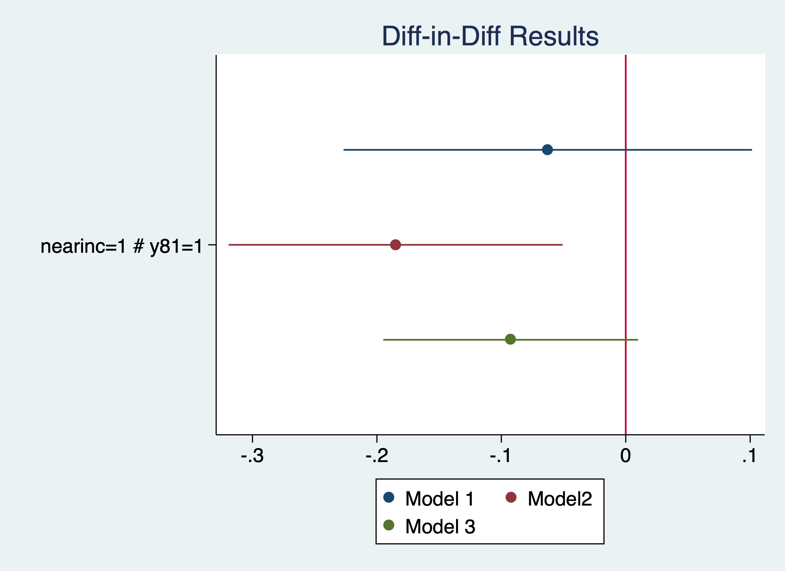

# Difference-in-Differences and Two-Way Fixed Effects 

We will cover two of the most popular policy evaluation tools: difference-in-differences and the related two-way fixed effects (TWFE).

## Diff-in-Diff

We will cover the implementation of the difference-in-difference research design. We only need the *reg* command to implement the design, but we will utilize the interaction operator. You only need pooled data for a difference-in-difference research design.

### Effect of a garbage incinerator's location on housing prices

**Lesson:** The 2-by-2 Difference-in-Difference estimator is simple to implement
when we have our data set up correctly. We can use a sensitivity test to see
if our results are robust.

$$ rprice_{it}=\beta_0 + \beta_1 nearinc_{it} + \beta_2 y81_t + \delta (nearinc*y81)_{i,t} + u_{it} $$

Kiel and McClain (1995) studied the effects of garbage incinerator's location
on housing prices in North Andover, MA. There were rumors of a new incinerator
in 1978 and construction began in 1981, but did not begin operating until 
1985. A house that is within 3 miles of the incinerator is considered close
All housing prices are in 1978 dollars (rprice) or log of nominal price
(lprice)

OLS model only using data from 1981
```{stata garbage1}
cd "/Users/Sam/Desktop/Econ 645/Data/Wooldridge"
use "kielmc.dta", clear
reg rprice nearinc if y81==1
```

For the post period, we see the difference between treatment and comparison as: $$ \bar{Y}_{T,Post} - \bar{Y}_{C,Post} = -30,688.27 $$

OLS model only using data from 1978
```{stata garbage2, eval=FALSE}
reg rprice nearinc if y81==0
```

```{stata garbage2_1, echo=FALSE}
quietly {
cd "/Users/Sam/Desktop/Econ 645/Data/Wooldridge"
use "kielmc.dta", clear
}
reg rprice nearinc if y81==0
```

For the Pre Period, we see the difference between treatment and comparison as: $$ \bar{Y}_{T,Pre} - \bar{Y}_{C,Pre}=-18,824.37 $$

Take the difference of the differences. If we subtract the means from one another: $$ -30688.27 - (-18824.37) \approx \$ -11,863.90 $$

Diff-in-Diff is easy enough to implement if our data are prepared properly
```{stata garbage3, eval=FALSE}
reg rprice i.nearinc##i.y81
```

```{stata garbage3_1, echo=FALSE}
quietly {
cd "/Users/Sam/Desktop/Econ 645/Data/Wooldridge"
use "kielmc.dta", clear 
}
reg rprice i.nearinc##i.y81
```

Our Diff-in-Diff yields a decrease in housing prices of 11.9K

Let add a sensitivity analysis by adding more variables
```{stata garbage4, eval=FALSE}
eststo m1: quietly reg rprice i.nearinc##i.y81
eststo m2: quietly reg rprice i.nearinc##i.y81 age agesq
eststo m3: quietly reg rprice i.nearinc##i.y81 age agesq intst land area rooms baths
```

Our model ranges from a reduction of -11.9K to -21.9K
```{stata garbage5, eval=FALSE}
esttab m1 m2 m3, keep(1.y81 1.nearinc 1.nearinc#1.y81 age agesq intst land area rooms baths)
```

```{stata garbage5_1, echo=FALSE}
quietly {
cd "/Users/Sam/Desktop/Econ 645/Data/Wooldridge"
use "kielmc.dta", clear 
eststo m1: quietly reg rprice i.nearinc##i.y81
eststo m2: quietly reg rprice i.nearinc##i.y81 age agesq
eststo m3: quietly reg rprice i.nearinc##i.y81 age agesq intst land area rooms baths
}
esttab m1 m2 m3, keep(1.y81 1.nearinc 1.nearinc#1.y81 age agesq intst land area rooms baths)
```

Let's use elasticities by usig a log-linear model. We'll use the *estimates store* command for plotting the coefficients.

```{stata garbage6, eval=FALSE}
est clear
eststo m1: quietly reg lprice i.nearinc##i.y81
estimates store mod1
eststo m2: quietly reg lprice i.nearinc##i.y81 age agesq
estimates store mod2
eststo m3: quietly reg lprice i.nearinc##i.y81 age agesq intst land area rooms baths
estimates store mod3
```

Our model ranges from a reduction housing prices between 6.1% and 16.9%
```{stata garbage7, eval=FALSE}
	esttab m1 m2 m3, keep(1.y81 1.nearinc 1.nearinc#1.y81 age agesq intst land area rooms baths)
```

```{stata garbage7_1, echo=FALSE}
quietly {
cd "/Users/Sam/Desktop/Econ 645/Data/Wooldridge"
use "kielmc.dta", clear 
est clear
eststo m1: quietly reg lprice i.nearinc##i.y81
estimates store mod1
eststo m2: quietly reg lprice i.nearinc##i.y81 age agesq
estimates store mod2
eststo m3: quietly reg lprice i.nearinc##i.y81 age agesq intst land area rooms baths
estimates store mod3
}
esttab m1 m2 m3, keep(1.y81 1.nearinc 1.nearinc#1.y81 age agesq intst land area rooms baths)
```
Plot our results
```{stata garbage8, eval=FALSE}
coefplot (mod1, label(Model 1)) (mod2, label(Model2)) (mod3, label(Model 3)), keep(1.nearinc#1.y81) xline(0) title("Diff-in-Diff Results")
graph export "/Users/Sam/Desktop/Econ 645/Stata/week5_housing.png", replace
```


More on coefplot:
https://repec.sowi.unibe.ch/stata/coefplot/getting-started.html

We see that the results are sensitive to the specification. The coefficients range from -6.1% to -16.9%, but their statistical significance varies as well. It would have been helpful to have a larger sample size.

### Effect of Worker Compensation Laws on Weeks out of Work

**Lesson:** We need a comparison group for the parallel trends assumption.
```{stata worker1, eval=FALSE}
cd "/Users/Sam/Desktop/Econ 645/Data/Wooldridge"
use "injury.dta", clear
```

Meyer, Viscusi, and Durbin (1995) studied the length of time that an injured worker receives workers' compensation (in weeks). On July 15, 1980 Kentucky raised the cap on weekly earnings that were covered by workers' compensation. An increase in the cap should affect high-wage workers and not affect low-wage workers, so low-wage workers are our control group and high-wage workers
are our treatment group.

```{stata worker2, eval=FALSE}
tab highearn afchnge
```

```{stata worker2_1, echo=FALSE}
quietly {
cd "/Users/Sam/Desktop/Econ 645/Data/Wooldridge"
use "injury.dta", clear
}
tab highearn afchnge
```

Our diff-in-diff - limited to only KY
The policy increased duration of workers' compensation by 21% to 26%.
```{stata worker3, eval=FALSE}
reg ldurat i.afchnge##i.highearn if ky==1
reg ldurat i.afchnge##i.highearn i.male i.married i.indust i.injtype if ky==1
```

```{stata worker3_1, echo=FALSE}
quietly {
cd "/Users/Sam/Desktop/Econ 645/Data/Wooldridge"
use "injury.dta", clear
}
reg ldurat i.afchnge##i.highearn if ky==1
reg ldurat i.afchnge##i.highearn i.male i.married i.indust i.injtype if ky==1
```

#### Not in Wooldridge: {-}
Is this an appropriate comparison group? I would say no, but high earners vs low earners would be appropriate if we wanted to test a triple difference.

Placebo test: A triple DDD a way to test our DD. We would expect high earners in KY to have an increase in duration but not other states. We want to check to make sure low earners are not affected by the policy change. 

Our DD estimate i.afchgne#i.highearn is about the same but not statistically significant. Furthermore, our high earners in KY after the policy are not affected, so our original DD design might not be rigourous enough. 
```{stata worker4, eval=FALSE}
reg ldurat i.afchnge##i.highearn##i.ky 
reg ldurat i.afchnge##i.highearn##i.ky i.male i.married i.indust i.injtype
```

```{stata worker4_1, echo=FALSE}
quietly {
cd "/Users/Sam/Desktop/Econ 645/Data/Wooldridge"
use "injury.dta", clear
}
reg ldurat i.afchnge##i.highearn##i.ky 
reg ldurat i.afchnge##i.highearn##i.ky i.male i.married i.indust i.injtype
```
**Questions:** Are worker compensation trends similar between low earners and high earners? Why or why not?  Would Michigan make a good comparison group? Can we test this?

## Two-Way Fixed Effects

When we utilize a two-way fixed effects research design, we will need a panel and use *xtset* command to set the panel. We can use the *d.* operator for a first-difference regression or *xtreg* command for a fixed effects regression

### Effect of Grants on scrap rates

**Lesson:** We can look at individual firm fixed effects and time fixed effects or a two-way fixed effects method. This is very similar to our Diff-in-Diff method in certain ways, but we have staggered adoption of the program.

```{stata grant1, eval=FALSE}
cd "/Users/Sam/Desktop/Econ 645/Data/Wooldridge"
use "jtrain.dta", clear
```

Michigan implemented a job training grant program to reduce scrap rates. What is the effect of job training on reducing the scrap rate for \( firm_i \) during time period \( t \) in terms of number of items scraped per 100 due to
defects?  

$$ scrap_{it} = \beta_0 + \delta program_{it} + a_{i} + a_{t} + u_{it} $$

Set the Panel
```{stata grant2, eval=FALSE}
sort fcode year
xtset fcode year
```

```{stata grant2_1, echo=FALSE}
quietly {
cd "/Users/Sam/Desktop/Econ 645/Data/Wooldridge"
use "jtrain.dta", clear  
}
sort fcode year
xtset fcode year
```

We have 3 years of data for each firm. Some firms get the grant in 1988 and some get the grant in 1989. This staggered adoption can lead to problems down the road when we compare treated to already treated.

Use FD or FE to take care of unobserved firm effects

First-Difference Estimator
```{stata grant3, eval=FALSE}
reg d.scrap d.grant if year < 1989
```

```{stata grant3_1, echo=FALSE}
quietly {
cd "/Users/Sam/Desktop/Econ 645/Data/Wooldridge"
use "jtrain.dta", clear  
sort fcode year
xtset fcode year
}
reg d.scrap d.grant if year < 1989
```

Within Estimator
```{stata grant4, eval=FALSE}
xtreg scrap i.grant i.d88 if year < 1989, fe
```

```{stata grant4_1, echo=FALSE}
quietly {
cd "/Users/Sam/Desktop/Econ 645/Data/Wooldridge"
use "jtrain.dta", clear  
sort fcode year
xtset fcode year
}
xtreg scrap i.grant i.d88 if year < 1989, fe
```

The change in grant is basically receiving the grant or not, because grant in 1987 is always zero.

**Question:** 

  1. Who gets the grant and why? 
  2. How were the grants distributed? 

We will likely need to worry about self-selection, so our parallel trends assumptions is critical. Do we know anything about the treatment and comparison group pre-trends or potential placebo test?

### Effect of Drunk Driving Laws on Traffic Fatalities

**Lesson:** We can try to evaluate the effect of drunk driving laws by controlling for unobserved time-invariant effects at the state level by looking at states that changed their laws.

We want to assess open container laws that make it illegal for passengers to have open containers of alcoholic beverages and administrative per se laws that allow courts to suspend licneses after a driver is arrested for drunk driving but before the driver is convicted.

The data contains the number of traffic deathts for all 50 states plus D.C. in 1985 and 1990. Our dependent variable is number of traffic deaths per 100 million miles driven (dthrte). In 1985, 19 states had open container laws, and 22 states had open container laws in 1990. In 1985, 21 states
had per se laws, which grew to 29 states by 1990. Note that some states had both.

We can use a first difference here. We have two options. Subtract across columns, or reshape and set a panel data set.

$$ \Delta deathrate_{i,t} = \delta_0 + \beta_1 \Delta openlaw_{i,t} + \Delta admin_{i,t} + \Delta \varepsilon_{i,t} $$

We can see that 3 states change their open container laws
```{stata traffic1}
cd "/Users/Sam/Desktop/Econ 645/Data/Wooldridge"
use "traffic1.dta", clear
tab copen
tab open85 open90
```

Estimate the First-Difference 
```{stata traffic2, eval=FALSE}
reg cdthrte copen cadmn
```

```{stata traffic2_1, echo=FALSE}
quietly {
cd "/Users/Sam/Desktop/Econ 645/Data/Wooldridge"
use "traffic1.dta", clear 
}
reg cdthrte copen cadmn
```
Open containers laws, assuming the parallel trends assumption holds, reduce deaths per 100 million miles driven by .42

**Questions:**
  1. What is a potential data management issue here?
  2. What is a potential issue with this? 
  3. How can we think that parallel trends assumption is not satisfied?
  4. Are treated groups being compared to previously treated groups? 
  
If treated groups are being compared to previously trated group, then we need to worry about potential bias from heterogeneous treatment effect bias (HTEB). 
(See Goodman-Bacon 2021)

## Exercises

### Exercise 1

We will use the following data set:
```{stata exercise1}
cd "/Users/Sam/Desktop/Econ 645/Data/Wooldridge"
use "kielmc.dta", clear
describe
```

  1. What is a potential problem with using a binary variable (nearinc) from a continuous variable (dist)? 

  2. Estimate \(ln(price_{i,t}) = \alpha + \beta_{1} y81_{t} + \beta_2 nearinc_{i,t} + \delta_0 (y81*nearinc)_{i,t} \)

  3. Do a sensitivity test using additional covariates. Are the results robust, or are they sensitive to the specification?

  4. Plot the coefficients of the model.

### Exercise 2

Let's use the worker injury dataset:
```{stata exercise2, eval=FALSE}
use "injury.dta", clear
```

  1. Estimate \( ln(durat_{i,t})=\alpha + \beta_1 afchnge_{i,t} + \beta_2 highearn_{i,t} + \delta_0 (afchnge*highearn)_{i,t} + \varepsilon_{i,t} \)

  2. Do a sensitivity tests using additional covariates. Are the results robust, or

  3. Are they sensitive to the specification?

  4. Plot the coefficients of the model.

### Exercise 3
```{stata exercise3, eval=FALSE}
use "traffic1_reshaped.dta", clear
```

  1. Set a panel data for the states for 1985 and 1990. Note: You cannot set a panel data set when the unit of analysis is in a string format.
  2. Don't forget the delta option. 
  3. Estimate a fixed effects model \( dthrte_{i,t}= \delta_0 + \beta_1 open_{i,t} + \beta_2  admn_{i,t} + a_i + a_t +  \varepsilon_{i,t} \)
  4. Do you get the same results as above when we used a 
  5. Now try a sensitivity analysis with additional covariates.