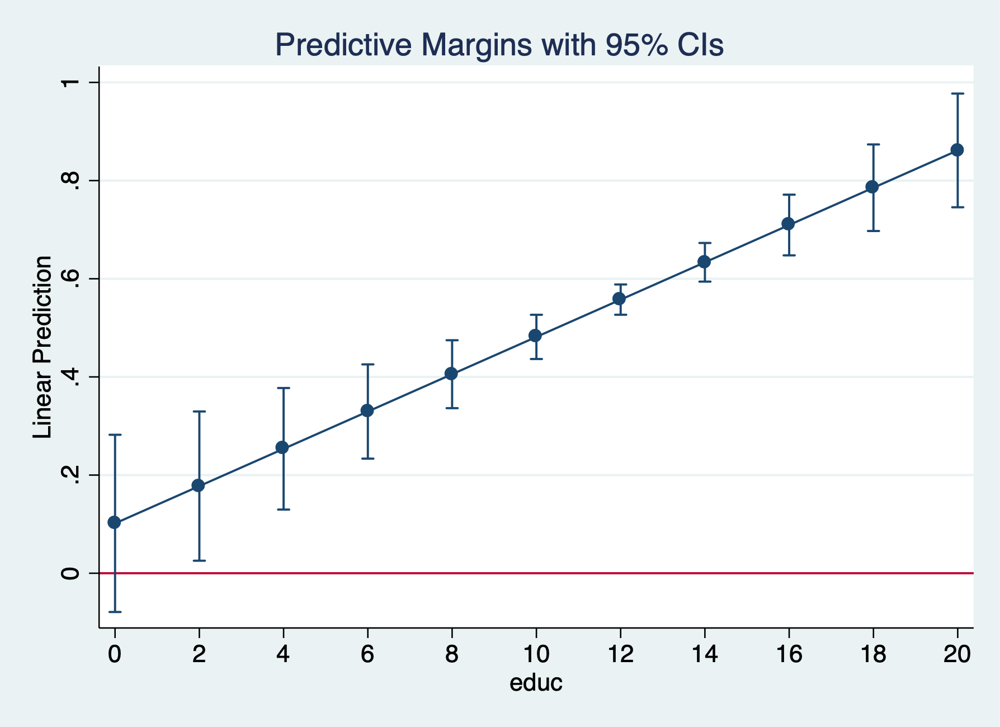
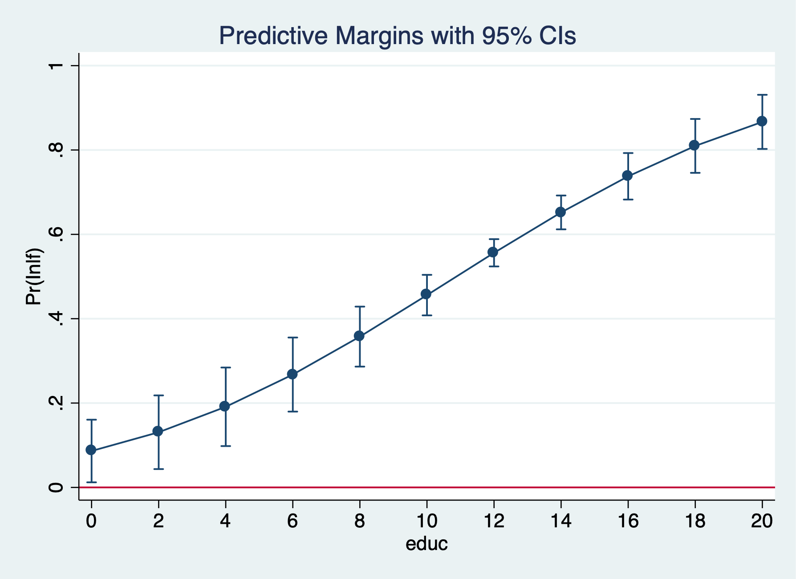
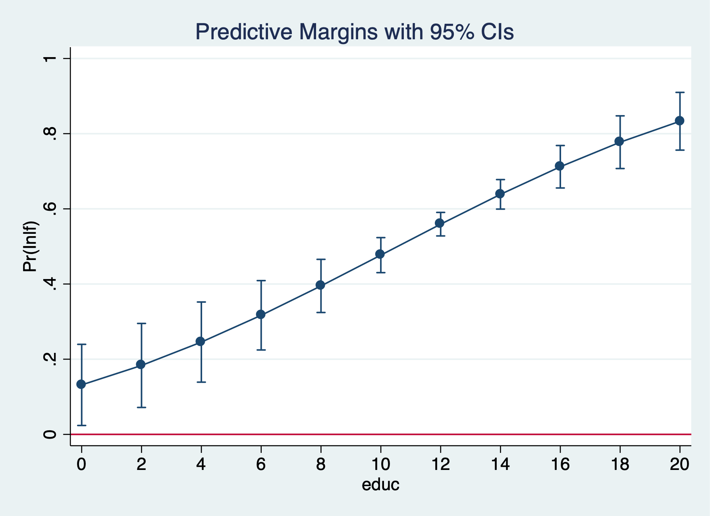
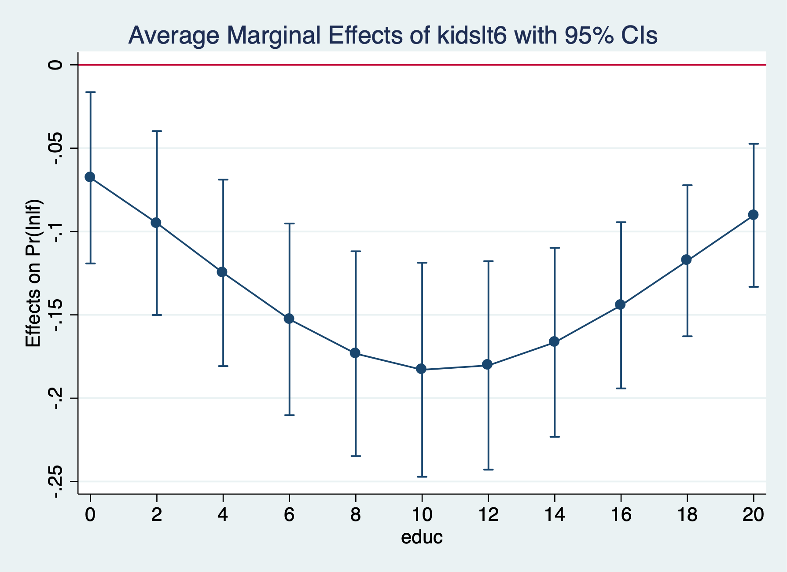
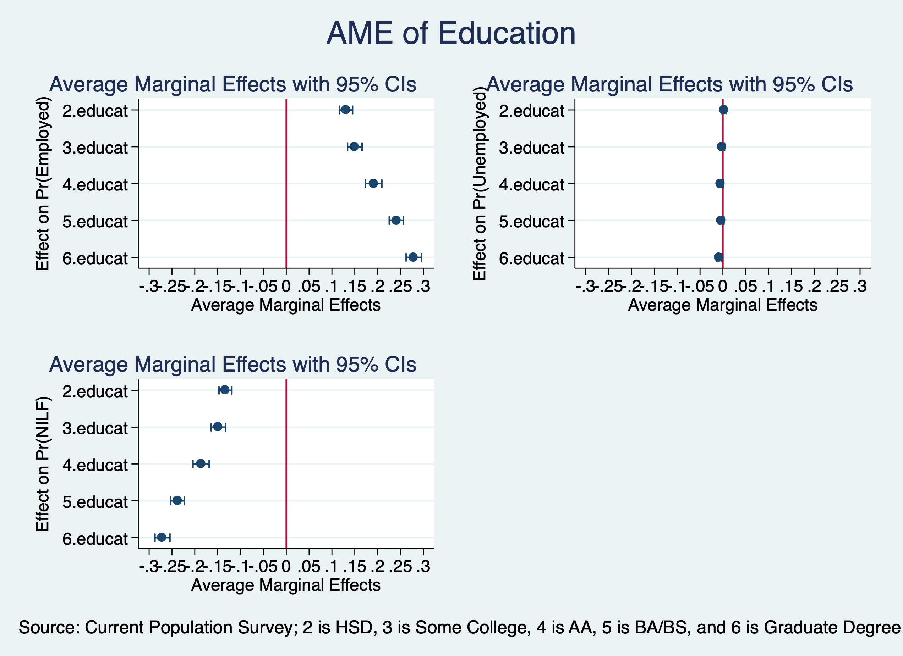
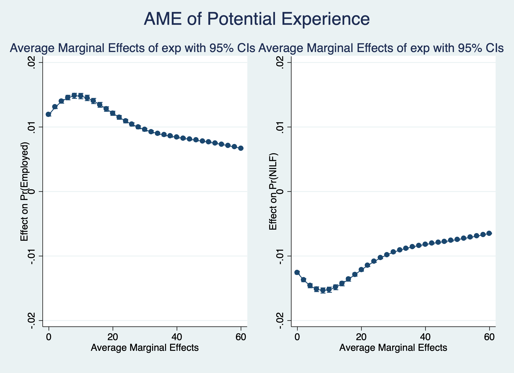
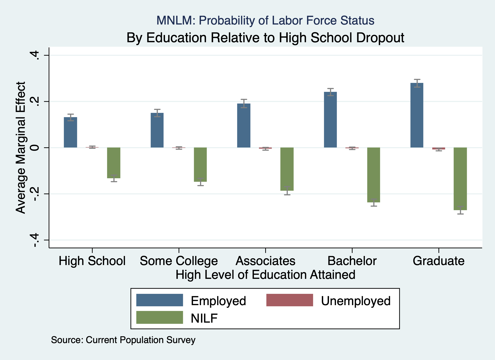

# Binary Outcomes

## Married Women's Labor Force Participation {-}
```{stata mroz1, eval=FALSE}
cd "/Users/Sam/Desktop/Econ 645/Data/Wooldridge"
use mroz.dta, clear
```

We'll use the data from Mroz (1987) to look at the probability of a married woman being in the labor force. Labor force participation is a binary response. 

$$ y=[0,1] $$
We will estimate the coefficients of the linear probability model (LPM), the logit estimator, and the probit estimator. Then, we'll compare the marginal effects ofall three estimators.

Summarize in the labor force
```{stata mroz2, eval=FALSE}
tabulate inlf
```

```{stata mroz2_1, echo=FALSE}
quietly {
cd "/Users/Sam/Desktop/Econ 645/Data/Wooldridge"
use mroz.dta, clear
}
tabulate inlf
```

There are 325 women are not in the labor force and 428 women participating in the labor force.
Our explanatory variables are non-wife income, education, experience, experience-squared, age, kids less than 6, kids greater than 6

$$ y_{i}=\beta_0 + \beta_1 spouseinc_{i} + \beta_2 edu_i + \beta_3 exp_i + \beta_4 exp^2_i + \beta_5 kidsLT6_i + \beta_6 kidsGT6_i + \varepsilon_i  $$
```{stata morz3, eval=FALSE}
est clear
eststo Logit: logit inlf nwifeinc educ exper expersq kidslt6 kidsge6
eststo Probit: probit inlf nwifeinc educ exper expersq kidslt6 kidsge6
esttab Logit Probit, mtitle
```

```{stata morz3_1, echo=FALSE}
quietly {
cd "/Users/Sam/Desktop/Econ 645/Data/Wooldridge"
use mroz.dta, clear
}
est clear
eststo Logit: logit inlf nwifeinc educ exper expersq kidslt6 kidsge6
eststo Probit: probit inlf nwifeinc educ exper expersq kidslt6 kidsge6
esttab Logit Probit, mtitle
```

We cannot compare the coefficients across the models. We will need to use marginal effects.

### Average Marginal Effects (AME) {-}

We will first look at average marginal effects. For average marginal effects, we estimate the marginal effects for each \( i \) and estimate an average.

$$ AME=(\sum^{n}_{i=1}[g(\hat{\beta_0}+x\hat{\beta})\beta_j]\Delta x_j)/n $$

#### Linear Probability Model (LPM) {-}
Please note that we need the option *post* to start marginal effects.

```{stata mroz4, eval=FALSE}
est clear
quietly reg inlf nwifeinc educ exper expersq age kidslt6 kidsge6
eststo LPM: margins, dydx(*) post 
```
#### Logit {-}
```{stata mroz5, eval=FALSE}
quietly logit inlf nwifeinc educ exper expersq age kidslt6 kidsge6
eststo Logit: margins, dydx(*) post
```

#### Probit {-}
```{stata mroz6, eval=FALSE}
quietly probit inlf nwifeinc educ exper expersq age kidslt6 kidsge6
eststo Probit: margins, dydx(*) post
```

#### Compare {-}
```{stata mroz7, eval=FALSE}
esttab LPM Logit Probit, mtitle
```

```{stata mroz7_1, echo=FALSE}
quietly {
cd "/Users/Sam/Desktop/Econ 645/Data/Wooldridge"
use mroz.dta, clear
est clear
quietly reg inlf nwifeinc educ exper expersq age kidslt6 kidsge6
eststo LPM: margins, dydx(*) post
quietly logit inlf nwifeinc educ exper expersq age kidslt6 kidsge6
eststo Logit: margins, dydx(*) post
quietly probit inlf nwifeinc educ exper expersq age kidslt6 kidsge6
eststo Probit: margins, dydx(*) post
}

esttab LPM Logit Probit, mtitle 
```

### Marginal Effects at the Average (MEA) {-}

For the marginal effects at the average, we set our \( x \) to their means within the scalar \( g(.) \) 
$$ MEA= g(\hat{\beta_0}+\hat{\beta_1} \bar{x_1} + ...+ \hat{\beta_k}\bar{x_k})\beta_j \Delta x_j $$

#### Linear Probability Model LPM {-}
```{stata mea1, eval=FALSE}
est clear
quietly reg inlf nwifeinc educ exper expersq age kidslt6 kidsge6
eststo LPM: margins, dydx(*) atmeans post
```
#### Logit {-}
```{stata mea2, eval=FALSE}
quietly logit inlf nwifeinc educ exper expersq age kidslt6 kidsge6
eststo Logit: margins, dydx(*) atmeans post
```
#### Probit {-}
```{stata mea3, eval=FALSE}
quietly probit inlf nwifeinc educ exper expersq age kidslt6 kidsge6
eststo Probit: margins, dydx(*) atmeans post
```

#### Compare {-}
```{stata mea4, eval=FALSE}
esttab LPM Logit Probit, mtitle 
```

```{stata mea4_1, echo=FALSE}
quietly {
cd "/Users/Sam/Desktop/Econ 645/Data/Wooldridge"
use mroz.dta, clear
est clear
quietly reg inlf nwifeinc educ exper expersq age kidslt6 kidsge6
eststo LPM: margins, dydx(*) atmeans post
quietly logit inlf nwifeinc educ exper expersq age kidslt6 kidsge6
eststo Logit: margins, dydx(*) atmeans post
quietly probit inlf nwifeinc educ exper expersq age kidslt6 kidsge6
eststo Probit: margins, dydx(*) atmeans post
}
esttab LPM Logit Probit, mtitle 
```

The analysis shows that the marginal effects are fairly close across the linear probability model, Logit model, and Probit model. One additional year of education increases the probability of being in the labor force by a range of 0.038 to 0.0395 percentage points. Interestingly, one additional child less than six is associated with a drop in the probability of being in the labor force by a range of 0.258 to 0.262. 

Please not that around the means, our linear probability model, Logit, and Probit should be fairly similar. However, the marginal effects for the linear probability model are constant and will not vary across different values of \(x\).

### Odds Ratios {-}

We can use the option, <i>or</i> to get odds ratios after running a logit.

$$ OR = \frac{(Odds Success)}{(Odds Failure)} = \frac{p(1)/(1-p(1))}{p(0)/(1-p(0))} $$
```{stata odds1, eval=FALSE}
logit inlf nwifeinc educ exper expersq age kidslt6 kidsge6, or
```

```{stata odds1_1, echo=FALSE}
quietly {
cd "/Users/Sam/Desktop/Econ 645/Data/Wooldridge"
use mroz.dta, clear
}
logit inlf nwifeinc educ exper expersq age kidslt6 kidsge6, or
```

One additional year of education is associated with a 1.25 times increase in the odds of 
being in the labor force (or an increase of 25%) holding all other variables constant.
One additional child less than six decreases the odds of being in the labor force 
by a factor of 0.24 holding all other variables constant (or a decrease of 76%).

### Marginal Effects of Education at different points along the curve {-}

#### Linear Probability Model (LPM) {-}
```{stata diff1, eval=FALSE}
est clear
quietly reg inlf nwifeinc educ exper expersq age kidslt6 kidsge6
eststo lpm: margins, at(educ=(0(2)20)) post
marginsplot, yline(0)
```


#### Logit {-}
```{stata diff2, eval=FALSE}
quietly logit inlf nwifeinc educ exper expersq kidslt6 kidsge6
eststo logit1: margins, at(educ=(0(2)20)) post
marginsplot, yline(0)
```


#### Probit {-}
```{stata diff3, eval=FALSE}
quietly probit inlf nwifeinc educ exper expersq age kidslt6 kidsge6
eststo probit1: margins, at(educ=(0(2)20)) post
marginsplot, yline(0)
```

The predicted probability that a married women is in the labor force rises from 47.7% for 12 years of education to 71.2% for 16 years of education.



#### Coefficient Plot {-}
We can also use coefplot to plot our data.
```{stata diff4, eval=FALSE}
coefplot lpm logit1, at recast(line) ciopts(recast(rline) lpattern(dash))
coefplot lpm probit1, at recast(line) ciopts(recast(rline) lpattern(dash))
coefplot logit1 probit1, at recast(line) ciopts(recast(rline) lpattern(dash))
```

### Marginal Effects of Education at different points along the curve {-}

#### Linear Probability Model (LPM) {-}
```{stata edu1, eval=FALSE}
quietly reg inlf nwifeinc educ exper expersq age kidslt6 kidsge6
margins, dydx(kidslt6) at(educ=(0(2)20))
marginsplot, yline(0)
```

#### Logit {-}
```{stata edu2, eval=FALSE}
quietly logit inlf nwifeinc educ exper expersq kidslt6 kidsge6
margins, dydx(kidslt6) at(educ=(0(2)20))
marginsplot, yline(0)
graph export "/Users/Sam/Desktop/Econ 645/Stata/week8_logitinlf.png", replace
```


#### Probit {-}
```{stata edu3, eval=FALSE}
quietly probit inlf nwifeinc educ exper expersq age kidslt6 kidsge6
margins, dydx(kidslt6) at(educ=(0(2)20))
marginsplot, yline(0)
```

The average marginal effect for an additional child less than 6 rises from -18.3 percentage points to -14.4 percentage points, but the difference does not appear to be statistically significant.

# Multinominal Logit

When we have nominal categorical variables, we cannot use a binary logit or probit. We will need to use multinomial logit or probit.

**Lesson: Interpreting a nominal categorical dependent variable**
We will use Current Population Survey Data from September 2023 and 2024 to estimate the following model for labor force participation:
$$ lfs_{i}=\beta_{0}+\beta_1 edu_{i} + \beta_2 exper_i + ... + u_i $$.

There are three alternatives: Employed, Unemployed, and Not in the Labor Force.

## Example Current Population Survey {-}
```{stata multi1}
use "/Users/Sam/Desktop/Econ 645/Data/CPS/mlogit_example.dta", clear
tab laborforce
tab laborforce, nolabel
```

Our dependent variable has three nominal categories.
$$ y=[1,2,3] $$
оr
$$ y=[Employed, Unemployed, NILF] $$

We use the *mlogit* command to run a multinomial logit to get log odds for \( J-1 \) logits.
```{stata multi2, eval=FALSE}
mlogit laborforce i.educat exp exp2 i.race_ethnicity i.female i.metroarea i.union i.marital i.hryear4
```

```{stata multi2_1, echo=FALSE}
quietly {
use "/Users/Sam/Desktop/Econ 645/Data/CPS/mlogit_example.dta", clear
}
mlogit laborforce i.educat exp exp2 i.race_ethnicity i.female i.metroarea i.union i.marital i.hryear4
```

Next, we need to test our Independence of Irrelevant Alternatives (IIA) assumption with a Hausman Test.

### Estimate an Unrestricted model - We'll remove unemployed {-}
```{stata multi3, eval=FALSE}
quietly mlogit laborforce i.educat exp exp2 i.race_ethnicity i.female i.metroarea i.union i.marital i.hryear4
estimates store unrestricted
```

We compare the log odds for unemployed and not in the labor force to being employed. Given that these are log odds, we'll need to convert them to Odds Ratios or find the marginal effects.

### Estimate a Restricted Model to test Independence of Irrelevant Alternatives assumption {-}
```{stata multi4, eval=FALSE}
quietly mlogit laborforce i.educat exp exp2 i.race_ethnicity i.female i.metroarea i.union i.marital if laborforce !=2
estimate store restricted
```

### Use hausman command {-}
```{stata multi5, eval=FALSE}
hausman restricted unrestricted, alleqs constant
```

```{stata multi5_1, echo=FALSE}
quietly {
use "/Users/Sam/Desktop/Econ 645/Data/CPS/mlogit_example.dta", clear
mlogit laborforce i.educat exp exp2 i.race_ethnicity i.female i.metroarea i.union i.marital i.hryear4
estimates store unrestricted
mlogit laborforce i.educat exp exp2 i.race_ethnicity i.female i.metroarea i.union i.marital if laborforce !=2
estimate store restricted
}

hausman restricted unrestricted, alleqs constant
```

Our chi-squared is 8.92, which means with reject the IIA assumption. We should consider a binary response here.</p>

### Predicted Probabilities {-}
Next, we use Stata to estimate predicted probabilities
```{stata pred1, eval=FALSE}
quietly mlogit laborforce i.educat exp exp2 i.race_ethnicity i.female i.metroarea i.union i.marital, base(1)
margins, atmeans predict(outcome(1))
margins, atmeans predict(outcome(2))
margins, atmeans predict(outcome(3))
```

```{stata pred1_1, echo=FALSE}
quietly {
use "/Users/Sam/Desktop/Econ 645/Data/CPS/mlogit_example.dta", clear
}
quietly mlogit laborforce i.educat exp exp2 i.race_ethnicity i.female i.metroarea i.union i.marital, base(1)
margins, atmeans predict(outcome(1))
margins, atmeans predict(outcome(2))
margins, atmeans predict(outcome(3))
```

### Average Marginal Effects {-}
```{stata pred2, eval=FALSE}
margins, dydx(*) predict(outcome(1))
margins, dydx(*) predict(outcome(2))
margins, dydx(*) predict(outcome(3))
```

```{stata pred2_1, echo=FALSE}
quietly {
use "/Users/Sam/Desktop/Econ 645/Data/CPS/mlogit_example.dta", clear
quietly mlogit laborforce i.educat exp exp2 i.race_ethnicity i.female i.metroarea i.union i.marital, base(1)
}
margins, dydx(*) predict(outcome(1))
margins, dydx(*) predict(outcome(2))
margins, dydx(*) predict(outcome(3))
```

### Marginal Effects at the Average {-}
```{stata pred3, eval=FALSE}
margins, dydx(*) atmeans predict(outcome(1))
margins, dydx(*) atmeans predict(outcome(2))
margins, dydx(*) atmeans predict(outcome(3))
```

```{stata pred3_1, echo=FALSE}
quietly {
use "/Users/Sam/Desktop/Econ 645/Data/CPS/mlogit_example.dta", clear
quietly mlogit laborforce i.educat exp exp2 i.race_ethnicity i.female i.metroarea i.union i.marital, base(1)
}
margins, dydx(*) atmeans predict(outcome(1))
margins, dydx(*) atmeans predict(outcome(2))
margins, dydx(*) atmeans predict(outcome(3))
```

### Change the Base Alternative {-}
We can also change the base or reference alternative with the base() option
```{stata base1, eval=FALSE}
mlogit laborforce i.educat exp exp2 i.race_ethnicity i.female i.metroarea i.union i.marital, base(3)
```

```{stata base1_1, echo=FALSE}
quietly {
use "/Users/Sam/Desktop/Econ 645/Data/CPS/mlogit_example.dta", clear
}
mlogit laborforce i.educat exp exp2 i.race_ethnicity i.female i.metroarea i.union i.marital, base(3)
```

### Marginal Effects and Marginsplot {-}
Next, we will estimate and graph the average marginal effects for education and experience
```{stata base2, eval=FALSE}
quietly mlogit laborforce i.educat exp exp2 i.race_ethnicity i.female i.metroarea i.union i.marital, base(1)
```
#### Education {-}
For Employed
```{stata base3, eval=FALSE}
margins, dydx(educat) predict(outcome(1))
quietly marginsplot, allsimplelabels horizontal recast(scatter) name(Employed) yscale(reverse) ytitle("Effect on Pr(Employed)") xtitle("Average Marginal Effects") xline(0) xlabel(-.3(.05).3)
```
```{stata base3_1, echo=FALSE}
quietly {
use "/Users/Sam/Desktop/Econ 645/Data/CPS/mlogit_example.dta", clear
mlogit laborforce i.educat exp exp2 i.race_ethnicity i.female i.metroarea i.union i.marital, base(1)
}
margins, dydx(educat) predict(outcome(1))
```
Individuals with high school degree have 13.1 percentage point more likely to be employed compared to high school dropouts. Individuals with some college are 15 percentage points more likely to be employed compared to high school dropouts. Individuals with Associates or Vocational degrees are 19.1 percentage points more likely to be employed compared to high school dropouts. Individuals with a Bachelor's degree are 24.1 percentage points more likely to be employed, while individuals with a graduate degree are 27.9 percentage points more likely to be employed compared to high school dropouts. 

For Unemployed
```{stata base4, eval=FALSE}
margins, dydx(educat) predict(outcome(2))
quietly marginsplot, allsimplelabels horizontal recast(scatter) name(Unemployed) yscale(reverse) ytitle("Effect on Pr(Unemployed)") xtitle("Average Marginal Effects") xline(0) xlabel(-.3(.05).3)
```	
For Not in the Labor Force
```{stata base5, eval=FALSE}
margins, dydx(educat) predict(outcome(3))
quilety marginsplot, allsimplelabels horizontal recast(scatter) name(NILF) yscale(reverse) ytitle("Effect on Pr(NILF)") xtitle("Average Marginal Effects") xline(0) xlabel(-.3(.05).3)
```

Combine graphs
```{stata base6, eval=FALSE}
graph combine Employed Unemployed NILF, ycommon title("AME of Education") ///
note("Source: Current Population Survey; 2 is HSD, 3 is Some College, 4 is AA, 5 is BA/BS, and 6 is Graduate Degree")
graph export "/Users/Sam/Desktop/Econ 645/Stata/week8_mnlmeducation.png", replace
```

```{stata base7, eval=FALSE}
graph drop Employed Unemployed NILF
```

#### Potential Experience {-}
For Employed
```{stata potexp1, eval=FALSE}
margins, dydx(exp) at(exp=(0(2)60)) predict(outcome(1)) 
quietly	marginsplot, allsimplelabels name(Employed) ytitle("Effect on Pr(Employed)") xtitle("Average Marginal Effects")
```

```{stata potexp1_1, echo=FALSE}
quietly {
use "/Users/Sam/Desktop/Econ 645/Data/CPS/mlogit_example.dta", clear
mlogit laborforce i.educat exp exp2 i.race_ethnicity i.female i.metroarea i.union i.marital, base(1)
}
margins, dydx(exp) at(exp=(0(2)60)) predict(outcome(1)) 
quietly	marginsplot, allsimplelabels name(Employed) ytitle("Effect on Pr(Employed)") xtitle("Average Marginal Effects")
```

For Not in the Labor Force
```{stata potexp2, eval=FALSE}
margins, dydx(exp) at(exp=(0(2)60)) predict(outcome(3))
quietly	marginsplot, allsimplelabels name(NILF) ytitle("Effect on Pr(NILF)") xtitle("Average Marginal Effects")
```

```{stata potexp2_1, echo=FALSE}
quietly {
use "/Users/Sam/Desktop/Econ 645/Data/CPS/mlogit_example.dta", clear
mlogit laborforce i.educat exp exp2 i.race_ethnicity i.female i.metroarea i.union i.marital, base(1)
}
margins, dydx(exp) at(exp=(0(2)60)) predict(outcome(3))
quietly	marginsplot, allsimplelabels name(NILF) ytitle("Effect on Pr(NILF)") xtitle("Average Marginal Effects")
```

Combine Graphs
```{stata potexp3, eval=FALSE}
graph combine Employed NILF, ycommon title("AME of Potential Experience") 
graph export "/Users/Sam/Desktop/Econ 645/Stata/week8_mnlmexp.png", replace
```


```{stata potexp4, eval=FALSE}	
graph drop Employed NILF
```

### We can use coefplot with margins with eststo {-}
```{stata coefplot, eval=FALSE}
quilety {est clear
eststo mnlm: quietly mlogit laborforce i.educat exp exp2 i.race_ethnicity i.female i.metroarea i.union i.marital
}
```
Estimate the average marginal effects. Please note the post option when storing margin results
```{stata coefplot2, eval=FALSE}
quietly{
eststo Employed: quietly margins, dydx(educat) predict(outcome(1)) post
estimates restore mnlm
eststo Unemployed: quietly margins, dydx(educat) predict(outcome(2)) post
estimates restore mnlm
eststo NILF: quietly margins, dydx(educat) predict(outcome(3)) post 
}
```

Use coefplot
```{stata coefplot3, eval=FALSE}
coefplot Employed Unemployed NILF, ///
recast(bar) barw(0.15) vertical ///
ciopts(recast(rcap) color(gs8)) citop ///
xlab(1 "High School" 2 "Some College" 3 "Associates" 4 "Bachelor" 5 "Graduate") ///
ytitle("Average Marginal Effect") ///
xtitle("High Level of Education Attained") ///
title("MNLM: Probability of Labor Force Status", size(*0.7))	///
subtitle("By Education Relative to High School Dropout")	///
caption("Source: Current Population Survey", size(*0.75)) ///
name(coefplot3)
graph export "/Users/Sam/Desktop/Econ 645/Stata/week8_mnlmcoefplot.png", replace
```


```{stata coefplot4, eval=FALSE}
graph drop coefplot3
```
